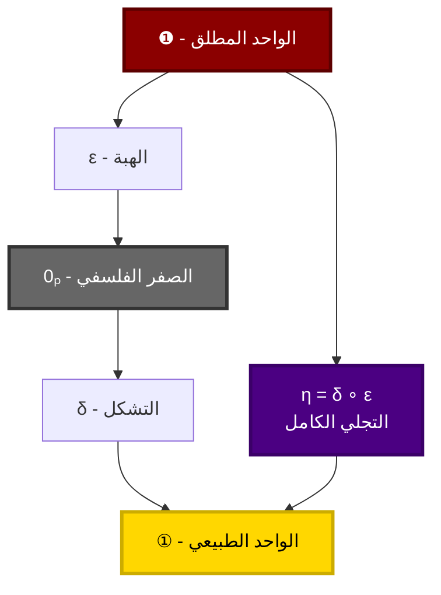
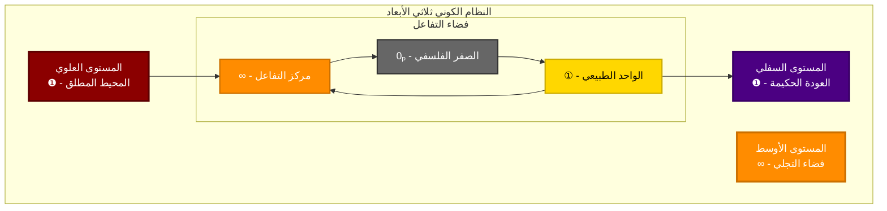
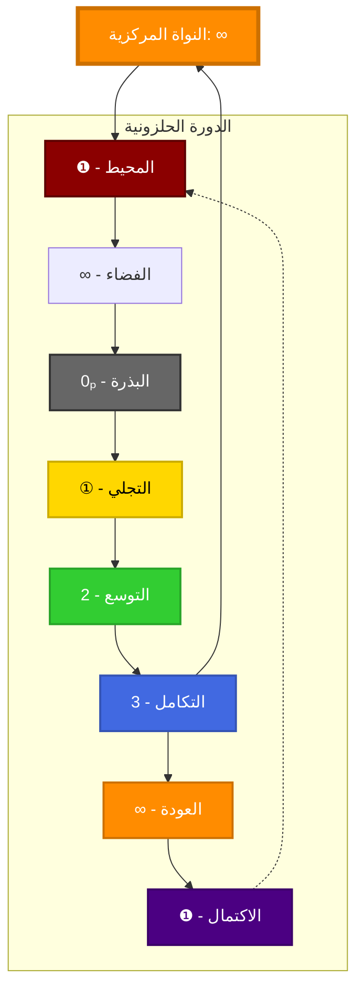
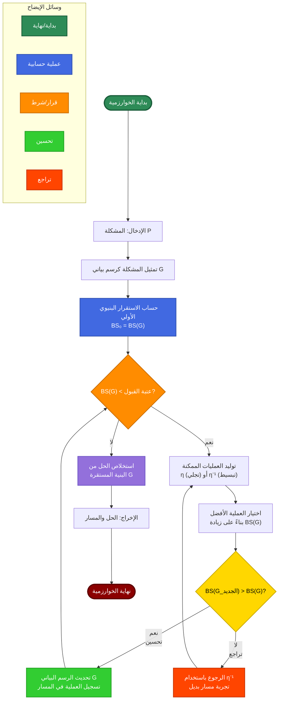

# 📘 **00_ملخص تنفيذي**

---

## 🎯 **1. النظرة العامة**

هذا الكتاب يقدم **رؤية رياضية-فلسفية جديدة** تربط بين المفاهيم الأساسية التي يقوم عليها البناء الرياضي: **الواحد**، **الصفر**، و**اللانهاية**. تهدف النظرية إلى تقديم **إطار موحد** لفهم العلاقة بين المطلق والنسبي، بين المنتهي واللامنتهي، بين الثابت والمتحول.

### **1.1 الفرضية المركزية**
$$
\boxed{❶ + 0ₚ = ①}
$$
حيث:
- **❶**: الواحد المطلق (الكمال التام)
- **0ₚ**: الصفر الفلسفي (العدم القابل)
- **①**: الواحد الطبيعي ($0.999\ldots$)

### **1.2 التمييز الجوهري**
$$
① \approx ❶ \quad \text{لكن} \quad ① \neq ❶
$$
يمثل **①** صورة مقاربة للواحد المطلق ولكنها ليست مساوية له، وهذا التمييز هو أساس كل تعدد وتعقيد في النظام الرياضي.

---

## 📊 **2. المكونات الأساسية للنظام**

### **2.1 العناصر الفلسفية الأساسية**

#### **الجدول 2.1: العناصر الأساسية للنظام 𝕊**

| العنصر | الرمز | التعريف الفلسفي | التعريف الرياضي |
|--------|-------|------------------|-----------------|
| **الواحد المطلق** | ❶ | المبدأ التأسيسي، الكمال التام | $\lim_{n \to \infty}(1 - \frac{1}{n})$ |
| **الصفر الفلسفي** | 0ₚ | العدم القابل، الإمكانية المحضة | $\emptyset$ (المجموعة الخالية) |
| **الواحد الطبيعي** | ① | أول تجلٍ مستقر، صورة ناقصة | $\{\emptyset\}$، $0.999\ldots$ |
| **اللانهاية الكونية** | ∞ | فضاء التفاعل، بنية العلاقة | رمز اللانهاية التقليدي |

> **ملاحظة:** هذه العناصر ليست مجرد رموز رياضية، بل تمثل مستويات وجودية مختلفة في البنية الكونية.

### **2.2 العمليات الأساسية**

#### **2.2.1 عملية التجلي الكاملة**
$$
\eta = \delta \circ \varepsilon
$$



*الشكل 1: عملية التجلي الكاملة من المطلق إلى الطبيعي عبر مرحلتي الهبة والتشكل.*

**التفسير:**
- **ε (الهبة):** $ε: ❶ \rightarrow 0ₚ$ - منح الإمكانية من المطلق
- **δ (التشكل):** $δ: 0ₚ \rightarrow ①$ - تحول الإمكانية إلى واقع
- **η (التجلي):** $η = δ \circ ε$ - العملية الكاملة للتجلي

#### **2.2.2 المعادلات المرتبطة**
$$
\begin{aligned}
&① = 0.999\ldots = \sum_{n=1}^{\infty} \frac{9}{10^n} \\
&❶ \neq ① \quad \text{(تمييز وجودي)} \\
&\infty = ❶ \oplus 0ₚ \quad \text{(بنية علائقية)}
\end{aligned}
$$

---

## 🔬 **3. الإطار الرياضي للنظام 𝕊**

### **3.1 البنية المجردة**
$$
\mathbb{S} = \langle ❶, 0ₚ, ①, \eta, \rightarrow \rangle
$$

**حيث:**
- $\mathbb{S}$: النظام الرياضي الكامل
- $\rightarrow$: علاقة التجلي والتحول
- النظام مكون من مستويين أساسيين:
  1. **المستوى التجاوزي:** $\mathcal{T} = \{❶\}$
  2. **المستوى التجليدي:** $\mathcal{M} = \{0ₚ, ①, ②, ③, \ldots\}$

### **3.2 دالة الاستقرار البنيوي (BS)**
$$
BS(x) = \alpha S_c(x) + \beta S_s(x) + \gamma S_d(x)
$$

**المكونات:**
- $S_c(x)$: استقرار الاتصال (0 إلى 1)
- $S_s(x)$: استقرار التناظر (0 إلى 1)
- $S_d(x)$: استقرار التوزيع (0 إلى 1)
- $\alpha + \beta + \gamma = 1$

#### **الجدول 3.1: قيم الاستقرار البنيوي**

| العنصر | $S_c$ | $S_s$ | $S_d$ | $BS$ | التفسير |
|--------|-------|-------|-------|------|----------|
| **❶** | 1.0 | 1.0 | 1.0 | 1.0 | الاستقرار المطلق |
| **0ₚ** | 0.0 | 1.0 | 0.0 | 0.33 | استقرار جزئي |
| **①** | 0.8 | 0.6 | 0.7 | 0.70 | استقرار عالٍ ناقص |
| **②** | 0.7 | 0.4 | 0.6 | 0.57 | استقرار أقل |
| **③** | 0.6 | 0.3 | 0.5 | 0.47 | استمرار الانخفاض |

> **ملاحظة:** تتناقص قيمة $BS$ مع ابتعاد العنصر عن الأصل المطلق، مما يعكس زيادة التعقيد والتبعية.

---

## 🌌 **4. النموذج الكوني ثلاثي الأبعاد**

### **4.1 البنية الكونية المتكاملة**



*الشكل 2: البنية الكونية ثلاثية الأبعاد تظهر المستويات المختلفة للوجود الرياضي.*

### **4.2 النموذج الحلزوني المتطور**



*الشكل 3: النموذج الحلزوني يوضح التطور الديناميكي والتكامل الدائري.*

---

## 💻 **5. التطبيقات العملية والأكاديمية**

### **5.1 المجالات التطبيقية**

#### **الجدول 5.1: مجالات تطبيق النظام 𝕊**

| المجال | التطبيق | الفائدة المتوقعة |
|--------|---------|-------------------|
| **الرياضيات البحتة** | تأسيس بديل لنظرية المجموعات | حل مفارقات الأسس الرياضية |
| **علوم الحاسب** | خوارزميات لحل مشاكل NP | تحسين كفاءة الحلول |
| **الفيزياء النظرية** | نمذجة الظواهر الكونية | تفسير الوحدة في الطبيعة |
| **الفلسفة** | إطار للمعرفة البنيوية | ربط المطلق بالنسبي |
| **علم النفس المعرفي** | نماذج للإدراك الرياضي | فهم تكوين المفاهيم العددية |

### **5.2 الخوارزميات المقترحة**

#### **خوارزمية M-Search (البحث في فضاء التجلي)**

```pseudo
دالة M_Search(المشكلة P):
    G = تمثيل_بياني(P)          # تمثيل المشكلة كرسم بياني
    BS_0 = حساب_BS(G)           # حساب الاستقرار البنيوي الأولي
    
    المسار = []                 # لتسلسل التحويلات
    
    طالما BS(G) < عتبة_القبول:
        المرشحون = توليد_التحويلات_الممكنة(G)  # η أو η⁻¹
        G_الأفضل = اختيار_الأفضل(المرشحون) بناءً على زيادة BS
        
        إذا BS(G_الأفضل) > BS(G):
            G = G_الأفضل
            أضف_إلى_المسار(المسار, التحويل_المستخدم)
        وإلا:
            ارجع_و_جرب_مسار_آخر()              # استخدام η⁻¹ للعودة
    
    الحل = استخلاص_الحل(G)
    إرجاع الحل, المسار
نهاية الدالة
```

### **📊 النمط البصري المحسن لخوارزمية M-Search**



*الشكل 4: التمثيل البصري المحسن لخوارزمية M-Search يوضح التدفق الكامل للبحث في فضاء التجلي.*

**التفسير المرئي:**
1. **مسار التحسين (أخضر):** يمثل التقدم نحو زيادة الاستقرار البنيوي باستخدام عملية التجلي (η)
2. **مسار التراجع (أحمر):** يمثل الحاجة للعودة عند عدم وجود تحسين، باستخدام العملية العكسية (η⁻¹)
3. **نقاط القرار (برتقالي):** نقاط التحقق من شروط الاستمرار أو التوقف
4. **حلقات التكرار:** تمثل الطبيعة التكرارية للخوارزمية في البحث عن الحل الأمثل

**خصائص الخوارزمية البصرية:**
- **وضوح التدفق:** سهولة تتبع مسار تنفيذ الخوارزمية
- **تمييز المسارات:** تلوين مختلف لأنواع العمليات (تحسين، تراجع، قرار)
- **تسلسل منطقي:** عرض تسلسلي للخطوات مع إبراز حلقات التكرار
- **وسائل إيضاح:** مفتاح تفسير الرموز والألوان المستخدمة

---

## 📈 **6. النتائج المتوقعة والمساهمات**

### **6.1 المساهمات النظرية**
1. **إطار موحد** لفهم العلاقة بين المنتهي واللامنتهي
2. **حلول جديدة** لمفارقات رياضية تاريخية
3. **جسر معرفي** بين الفلسفة والرياضيات والعلوم التطبيقية

### **6.2 المساهمات العملية**
1. **خوارزميات مبتكرة** لحل مشاكل التعقيد الحسابي
2. **نماذج رياضية** للظواهر الطبيعية المعقدة
3. **أدوات تحليلية** للأنظمة الديناميكية

### **6.3 القيمة المضافة**
$$
V = \sum_{i=1}^{n} w_i \cdot C_i
$$

**حيث:**
- $C_i$: مساهمة في مجال $i$
- $w_i$: وزن أهمية المجال
- $n$: عدد المجالات المتأثرة

---

## 🎯 **7. الخلاصة التنفيذية**

### **7.1 الرسالة المركزية**
النظام 𝕊 يقدم **رؤية تكاملية** تجمع بين:
- **الدقة الرياضية** في الصياغة والبرهان
- **العمق الفلسفي** في التحليل والتأويل
- **التطبيق العملي** في حل المشكلات الحقيقية

### **7.2 المعادلات الأساسية المركبة**
$$
\begin{aligned}
&\text{التأسيس:} \quad ❶ + 0ₚ = ① \\
&\text{التمييز:} \quad ① \neq ❶ \\
&\text{التفاعل:} \quad \infty = ❶ \oplus 0ₚ \\
&\text{العملية:} \quad \eta = \delta \circ \varepsilon \\
&\text{الاستقرار:} \quad BS(x) = \alpha S_c(x) + \beta S_s(x) + \gamma S_d(x)
\end{aligned}
$$

### **7.3 الدعوة للبحث والتطوير**
يدعو هذا العمل إلى:
1. **تطوير الرياضيات** من خلال رؤية فلسفية أعمق
2. **تطبيق النماذج** في مجالات علمية متنوعة
3. **بناء جسور** بين التخصصات المعرفية
4. **إلهام جيل جديد** من الباحثين للتفكير خارج الأطر التقليدية

---

## 📋 **8. الهيكل العام للكتاب**

### **8.1 الأجزاء الرئيسية**
1. **الجزء الأول:** الأساسيات النظرية (الفصول 1-3)
2. **الجزء الثاني:** التطبيقات المتعددة (الفصول 4-8)
3. **الجزء الثالث:** المناقشة والمستقبل (الفصول 9-11)

### **8.2 الفئات المستهدفة**
- **الفلاسفة وعلماء الرياضيات**
- **علماء الحاسب والباحثون**
- **الفيزيائيون وعلماء النظم**
- **طلاب الدراسات العليا**

---

> **ملاحظة نهائية:** هذا الملخص التنفيذي يقدم نظرة شاملة للنظام الرياضي الفلسفي 𝕊، مع التركيز على الجوانب الأساسية والتطبيقية. الكتاب الكامل يقدم تحليلاً مفصلاً لكل عنصر من هذه العناصر مع براهين رياضية وأمثلة تطبيقية.

---

**📅 الإصدار:** 3.0  
**✍️ المؤلف:** أحمد علي بوكر نسيب  
**🔄 آخر تحديث:** يناير 2026
