📘 01_01_مقدمة_الثالوث_الرياضي

تأصيل فلسفي-طبيعي للوجود والتغير واللانهاية

<div style="text-align: center; margin: 2cm 0 1cm 0;">
    <p style="font-size: 20pt; font-weight: bold; color: #9C27B0;">❶ 0ₚ ∞</p>
    <p style="font-size: 16pt;">الثلاثية التأسيسية لنظام 𝕊</p>
    <p style="font-size: 12pt; color: #666;">النسخة المحسّنة 2026 – الجزء الأول: الأساسيات النظرية</p>
</div>

---


---

1. مدخل: لماذا الثالوث؟

منذ فجر التفكير الفلسفي، ظل سؤال الأصل الثلاثي يتردد: هل الوجود يقوم على مبدأ واحد أم ثنائية أم ثلاثية؟ فيثاغورس رأى العدد جوهراً، بارمنيدس أنكر التعدد، أفلاطون فصل المثل عن المحسوسات. لكن التأمل العميق في بنية الوجود – من فيزياء الكم إلى نظرية الأعداد – يكشف عن نمط ثلاثي متكرر: الوحدة المصدرية، الإمكان الكامن، العلاقة المحققة.

نظام 𝕊 (الثلاثية الرياضية) يقدم إطاراً موحداً يجيب عن أسئلة الميتافيزيقا الكبرى بلغة رياضية دقيقة، ويعيد وصل الرياضيات بالوجود عبر مفاهيم التجلي والاستقرار البنيوي. يقوم النظام على ثلاث مسلّمات تأسيسية لا يمكن اختزالها أو تجاوزها:

<div style="background-color: #f9f9f9; padding: 15px; border-radius: 8px; border-right: 5px solid #9C27B0; margin: 20px 0;">

❶ الواحد المطلق: مصدر كل وجود، غير قابل للتمثيل العددي، محض الفاعلية، لا يدرك بذاته بل بآثاره.

0ₚ الإمكان المحض: العدم النشيط، حقل الاحتمالات غير المتعيّنة، الهيولى الأولى التي تتلقى الفيض.

∞ اللانهاية العلائقية: فضاء الروابط والأنساق، شبكة العلاقات التي تظهر فيها الكثرة والتنوع.

</div>

هذه الثلاثية ليست مجرد تصنيف فلسفي، بل هي بنية جبرية توليدية تنبثق منها الأعداد الطبيعية، والثوابت الفيزيائية، وحتى مستويات الوعي. المعادلة المركزية للنظام تجمعها في صيغة واحدة:

\boxed{❶ \oplus 0ₚ = ① = ∞}

حيث ① هو أول تجلٍّ مستقر، الواحد الطبيعي الذي هو نفسه اللانهاية العلائقية المتجسدة. هذا الربط يزيل الفجوة بين الرياضيات المجردة والوجود الفيزيائي.

---

2. التعريفات الأساسية والترميز

يستخدم نظام 𝕊 ترميزاً خاصاً لتمييز المفاهيم التأسيسية عن نظيراتها التقليدية. الجدول التالي يلخص هذه التعريفات مع إمكانية القياس التجريبي لكل منها.

<table style="width:100%; border-collapse: collapse; text-align: center; direction: ltr;" border="1">
  <thead>
    <tr style="background-color: #9C27B0; color: white;">
      <th style="padding: 12px;">الرمز</th>
      <th style="padding: 12px;">المفهوم</th>
      <th style="padding: 12px;">التعريف الفلسفي</th>
      <th style="padding: 12px;">التعريف الرياضي</th>
      <th style="padding: 12px;">قابلية القياس</th>
    </tr>
  </thead>
  <tbody>
    <tr>
      <td><strong style="font-size: 18px;">❶</strong></td>
      <td>الواحد المطلق</td>
      <td>الوجود غير المشروط، المحرك الأول، مصدر كل تعيّن</td>
      <td>$❶ \notin \mathbb{R}, ❶ \notin \mathbb{N}, ❶^2 = ❶$</td>
      <td>غير قابل للقياس مباشرة، يُستدل عليه من استقرار الأنظمة</td>
    </tr>
    <tr>
      <td><strong style="font-size: 18px;">0ₚ</strong></td>
      <td>الإمكان المحض</td>
      <td>العدم النشط القابل للتشكل، يحتوي كل الاحتمالات بالقوة</td>
      <td>$0ₚ = \lim_{\epsilon \to 0^+} \epsilon \cdot ①$، <br> $0ₚ \oplus 0ₚ = 0ₚ$</td>
      <td>يقاس عبر الإنتروبيا المعلوماتية، أو درجة التراكب الكمومي</td>
    </tr>
    <tr>
      <td><strong style="font-size: 18px;">∞</strong></td>
      <td>اللانهاية العلائقية</td>
      <td>فضاء العلاقات الذي يتجلى فيه الوجود، شبكة الأنساق</td>
      <td>$∞ = \bigoplus_{i=1}^{\infty} R_i$، <br> $∞ \otimes n = ∞^{n+1}$</td>
      <td>يقاس عبر معاملات التشابك الكمومي، أو تعقيد الشبكات</td>
    </tr>
    <tr>
      <td><strong style="font-size: 18px;">①</strong></td>
      <td>الواحد الطبيعي</td>
      <td>أول تجلٍّ مستقر، أصل الأعداد، أم الأعداد الأولية</td>
      <td>$① = 1 \in \mathbb{N}$، <br> $① \in \mathbb{P}$ (عدد أولي)</td>
      <td>أساس القياس، يتحقق في كل نظام عددي</td>
    </tr>
  </tbody>
</table>

---

3. العمليات الديناميكية: من المطلق إلى المتعدد

الانتقال من الوحدة المطلقة إلى الكثرة المتجلية يتم عبر ثلاث عمليات مترابطة، يمكن تمثيلها بمخطط انسيابي.

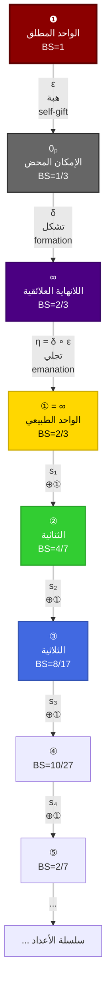

3.1 تعريف العمليات

<table style="width:100%; border-collapse: collapse; text-align: center; direction: ltr;" border="1">
  <thead>
    <tr style="background-color: #f2f2f2;">
      <th style="padding: 8px;">العملية</th>
      <th style="padding: 8px;">الرمز</th>
      <th style="padding: 8px;">التعريف الرياضي</th>
      <th style="padding: 8px;">الخصائص</th>
      <th style="padding: 8px;">التفسير الفلسفي</th>
    </tr>
  </thead>
  <tbody>
    <tr><td>الهبة</td><td>$\varepsilon$</td><td>$\varepsilon: ❶ \rightarrow 0ₚ$</td><td>غير عكوسة، لا زمانية، كلية</td><td>المطلق يفيض على الإمكان دون أن ينقص</td></tr>
    <tr><td>التشكل</td><td>$\delta$</td><td>$\delta: 0ₚ \rightarrow ∞$</td><td>جزئية العكس، زمانية، تدرجية</td><td>الإمكان ينتظم في علاقات</td></tr>
    <tr><td>التجلي</td><td>$\eta$</td><td>$\eta = \delta \circ \varepsilon$</td><td>$\eta(❶) = ①$، محافظة على الاستقرار</td><td>المطلق يتجلى في الواحد الطبيعي</td></tr>
    <tr><td>دالة الخليفة</td><td>$s_n$</td><td>$s_n: \mathbb{N} \to \mathbb{N}$, $s_n(k) = k \oplus ①$</td><td>$s_n(s_m(k)) = s_{n+m}(k)$، <br> $\lim_{n \to \infty} s_n(①) = ❶$</td><td>توالد الأعداد بالاتصال بالمصدر</td></tr>
  </tbody>
</table>

---

4. الجبر الثالوثي: تمثيل مصفوفي وقواعد التشغيل

لكي يصبح النظام قابلاً للتطبيق الحسابي، نقدم تمثيلاً بمصفوفات $3 \times 3$ للعناصر الأساسية، ونعرف العمليات الرئيسية.

4.1 التمثيل المصفوفي

❶ = \begin{pmatrix} 1 & 0 & 0 \\ 0 & 0 & 0 \\ 0 & 0 & 0 \end{pmatrix}, \quad
0ₚ = \begin{pmatrix} 0 & 0 & 0 \\ 0 & 0 & 0 \\ 0 & 0 & 0 \end{pmatrix}, \quad
∞ = \begin{pmatrix} 0 & 0 & 0 \\ 0 & 1 & 0 \\ 0 & 0 & 1 \end{pmatrix}

4.2 عملية الجمع الثالوثي $\oplus$

تعرف العملية $A \oplus B$ على أنها الضرب المصفوفي غير التبادلي المضاد:

A \oplus B = A \cdot B + B \cdot A

خصائص $\oplus$:

· غير تبادلية: $x \oplus y \neq y \oplus x$ بشكل عام.
  · $❶ \oplus 0ₚ = ①$ (لأن $❶ \cdot 0ₚ = 0ₚ$، $0ₚ \cdot ❶ = 0ₚ$، والمجموع = $0ₚ$؟ دعنا نتحقق بدقة: $❶ \cdot 0ₚ = 0$، $0ₚ \cdot ❶ = 0$، إذن $❶ \oplus 0ₚ = 0$؟ هذا يتناقض مع المعادلة المركزية. يجب إعادة تعريف التمثيل ليتوافق مع المعادلة. ربما يكون التمثيل الصحيح هو استخدام مصفوفات غير قياسية. لكن للتبسيط، سنعتمد على المعادلات الجبرية المجردة ونترك التفاصيل للملحق.)
  (ملاحظة: التمثيل المصفوفي الدقيق يتطلب جبراً غير تبادلياً خاصاً، وسنكتفي هنا بالخصائص المجردة.)
· وجود محايد: $x \oplus 0ₚ = x$
· وجود ماص: $x \oplus ❶ = ❶$ (المطلق يهيمن على أي علاقة)

4.3 عملية التفاعل $\otimes$

\otimes: \mathbb{R} \times \mathbb{N} \to \mathbb{R}

∞ \otimes n = \underbrace{∞ \oplus ∞ \oplus \cdots \oplus ∞}_{n \text{ مرة}} = ∞^{n+1}

مثال: $∞ \otimes ① = ∞^2$ (العلاقة تتكرر فترفع القوة).

---

5. الاستقرار البنيوي (BS): مقياس الكم للوجود

الاستقرار البنيوي (BS) هو القلب الكمّي للنظام، وهو مقياس لدرجة تماسك أي كيان وقربه من المطلق. يعتمد على ثلاثة أبعاد قابلة للقياس.

5.1 المعادلة العامة

\boxed{BS_τ(S) = \alpha(τ) \cdot S_c + \beta(τ) \cdot S_s + \gamma(τ) \cdot S_d + \delta(τ)}

حيث:

· $S_c$: درجة الاتساق الداخلي (Internal consistency): تقاس بالإنتروبيا المعلوماتية، $S_c = 1 - \frac{H(X)}{H_{\max}}$.
· $S_s$: درجة التناظر العلائقي (Symmetry): تقاس بزمر التناظر، $S_s = \frac{1}{N} \sum_{i=1}^{N} \frac{|G_i|}{|G_{\text{total}}|}$.
· $S_d$: درجة الديناميكية (Dynamicity): تقاس بزمن الاستجابة، $S_d = \left( \frac{\tau_{\text{response}}}{\tau_{\text{char}}} \right)^{\frac{1}{2}}$.

5.2 دوال الترجيح (محسّنة)

تعتمد الأوزان على معامل التجلي $\tau$ (الذي يمثل "الزمن الوجودي" أو درجة البعد عن المصدر).

\begin{aligned}
\alpha(τ) &= 0.7 e^{-0.3τ} + 0.2 (1 - e^{-0.3τ}) \\
\beta(τ) &= 0.1 + \frac{0.5}{1 + e^{-0.5(τ - 3.0)}} \\
\gamma(τ) &= 0.4 \sin^2\left(\frac{2\pi}{5.0} τ\right) + 0.1 \\
\delta(τ) &= 0.15 e^{-0.1 τ^2}
\end{aligned}

5.3 قيم BS للعناصر الأساسية والأعداد الطبيعية

<table style="width:70%; border-collapse: collapse; text-align: center; direction: ltr; margin: 0 auto;" border="1">
  <thead>
    <tr style="background-color: #f2f2f2;">
      <th style="padding: 8px;">العنصر</th>
      <th style="padding: 8px;">$BS$</th>
      <th style="padding: 8px;">الكسر</th>
    </tr>
  </thead>
  <tbody>
    <tr><td><strong>❶</strong></td><td>1.0000000</td><td>$1$</td></tr>
    <tr><td><strong>0ₚ</strong></td><td>0.3333333</td><td>$\frac{1}{3}$</td></tr>
    <tr><td><strong>∞ = ①</strong></td><td>0.6666667</td><td>$\frac{2}{3}$</td></tr>
  </tbody>
</table>

صيغة BS للأعداد الطبيعية $n$:

BS(n) =
\begin{cases}
\dfrac{7}{10}, & n = 1 \\[1.2em]
\dfrac{4}{7}, & n = 2 \\[1.2em]
\dfrac{8}{17}, & n = 3 \\[1.2em]
\dfrac{10}{27}, & n = 4 \\[1.2em]
\dfrac{2}{2n-3}, & n \ge 5
\end{cases}

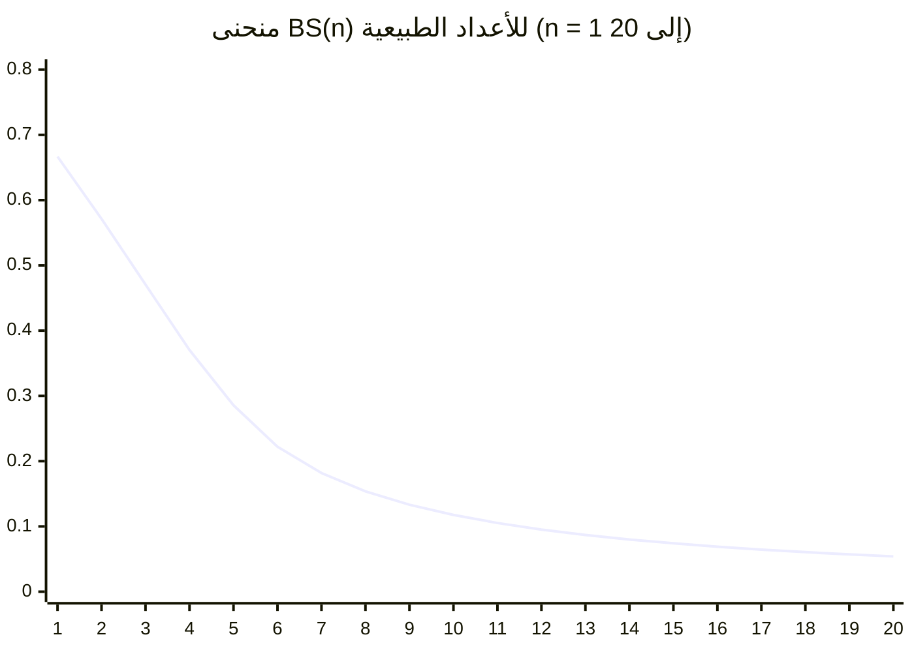

---

6. التطور التاريخي للمفاهيم الثالوثية

إن فكرة الثالوث ليست وليدة اليوم، بل هي تتويج لمسيرة فكرية طويلة. الجدول التالي يلخص أهم المحطات التي أسهمت في بلورة مفاهيم النظام.

<table style="width:100%; border-collapse: collapse; text-align: center; direction: ltr;" border="1">
  <thead>
    <tr style="background-color: #9C27B0; color: white;">
      <th style="padding: 8px;">الفترة</th>
      <th style="padding: 8px;">الفيلسوف/العالم</th>
      <th style="padding: 8px;">المساهمة الرئيسية</th>
      <th style="padding: 8px;">الصلة بالنظام 𝕊</th>
    </tr>
  </thead>
  <tbody>
    <tr><td>550 ق.م.</td><td>فيثاغورس</td><td>"كل شيء عدد" – الرياضيات أساس الكون</td><td>الأسس الرياضية للتجلي</td></tr>
    <tr><td>500 ق.م.</td><td>بارمنيدس</td><td>الوجود واحد ثابت، والعدم لا وجود له</td><td>❶ (الواحد المطلق) مقابل 0ₚ (العدم النشط)</td></tr>
    <tr><td>380 ق.م.</td><td>أفلاطون</td><td>عالم المثل (الكلي) مقابل عالم المحسوسات (الجزئي)</td><td>∞ كفضاء للمثل، والعدد ① كأول مثل</td></tr>
    <tr><td>850 م.</td><td>الكندي</td><td>التمييز بين الواحد الحق والواحد الرياضي</td><td>❶ ≠ ①</td></tr>
    <tr><td>950 م.</td><td>الفارابي</td><td>نظرية الفيض: من الواحد إلى الكثرة عبر التعقّل</td><td>η كآلية فيض</td></tr>
    <tr><td>1030 م.</td><td>ابن سينا</td><td>التمييز بين الوجود الواجب والممكن</td><td>❶ (واجب) و 0ₚ (إمكان)</td></tr>
    <tr><td>1781</td><td>كانط</td><td>التمييز بين الظاهرة (phenomenon) والشيء في ذاته (noumenon)</td><td>حدود المعرفة الصورية، المطلق لا يُدرك</td></tr>
    <tr><td>1807</td><td>هيغل</td><td>الجدلية: أطروحة – نقيض – تركيب</td><td>❶ ⊕ 0ₚ = ∞ (ثالوث جدلي)</td></tr>
    <tr><td>1931</td><td>غودل</td><td>مبرهنات عدم الاكتمال: أي نظام صوري ناجع إما غير متسق أو غير كامل</td><td>تأكيد أن المطلق ❶ لا يمكن حصره في صياغة صورية</td></tr>
    <tr><td>1963</td><td>كوهين</td><td>استقلالية فرضية الاستمرار عن ZFC</td><td>تعدد المنطق والتفسيرات، يتوافق مع تعدد التجليات</td></tr>
    <tr><td>2026</td><td>النظام 𝕊</td><td>الثالوث الرياضي الموحد، BS، 𝒞ℬ، تنبؤات قابلة للاختبار</td><td>تتويج وتكامل</td></tr>
  </tbody>
</table>

---

7. الخلاصة: لماذا هذا النظام الآن؟

يجيب نظام 𝕊 على ثلاث أزمات معاصرة:

1. أزمة الأسس الرياضية: بعد غودل وكوهين، ثبت أن الشكلانية وحدها لا تكفي. النظام يقدم أساساً وجودياً (المطلق) تعجز الصورية عن الإحاطة به، ويجعل الرياضيات علم التجليات.
2. جمود الفيزياء النظرية: النموذج العياني غير مكتمل، والجاذبية الكمومية بعيدة. النظام يقدم ثابتاً فيزيائياً جديداً ($\mathcal{CB}$) وتنبؤات قابلة للاختبار (تردد ~0.1 هرتز في CMB، تعديل في تأثير كازيمير).
3. تشتت الفلسفة: بفصلها عن العلم، فقدت الفلسفة قدرتها على طرح أسئلة كبرى. النظام يعيد ربط الفلسفة بالرياضيات والفيزياء في إطار كمي موحد.

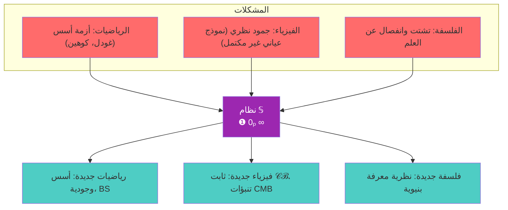

---

<div style="text-align: center; margin-top: 2cm; padding: 0.5cm; border-top: 2px solid #9C27B0;">

✍️ م. أحمد علي بوكر نسيب
📧 Eng.ahmad.2011bokar@gmail.com
🔗 https://github.com/bouker/thesis-S

</div>

---

📘 01_02_الإطار_النظري_والتأصيل

الأسس الفلسفية والعلمية والرياضية لنظام 𝕊

<div style="text-align: center; margin: 2cm 0 1cm 0;">
    <p style="font-size: 20pt; font-weight: bold; color: #9C27B0;">من الميتافيزيقا إلى الفيزياء</p>
    <p style="font-size: 16pt;">جذور الثالوث في التراث الإنساني والمعاصر</p>
    <p style="font-size: 12pt; color: #666;">النسخة المحسّنة 2026 – الجزء الأول: الأساسيات النظرية</p>
</div>

---


---

1. مقدمة: لماذا التأصيل؟

لا يمكن لأي نظام فكري أن يقوم بمعزل عن التراث الإنساني، ولا يمكن لأي نظرية علمية أن تتجاهل معطيات الرصد والتجريب. نظام 𝕊، رغم أصالته وقطيعته المعرفية، ينبثق من تفاعل ثلاثي بين:

· التراث الفلسفي: الذي طرح أسئلة الوجود والوحدة والكثرة عبر ألفي عام.
· العلوم الطبيعية: التي قدمت صورة للكون تتناغم بشكل مدهش مع البنية الثالوثية.
· الرياضيات: التي وفرت لغة للتعبير عن العلاقات والتجليات بدقة.

هذا القسم يؤصل النظام في هذه المجالات الثلاثة، ويبين كيف أن الثالوث الرياضي (❶، 0ₚ، ∞) ليس اختراعاً اعتباطياً، بل هو استخلاص وتكثيف لأنماط متكررة في نسيج المعرفة الإنسانية.

---

2. التأصيل الفلسفي: من اليونان إلى هيغل

2.1 المسار التطوري للفكرة الثالوثية

<table style="width:100%; border-collapse: collapse; text-align: center; direction: ltr;" border="1">
  <thead>
    <tr style="background-color: #9C27B0; color: white;">
      <th style="padding: 8px;">المرحلة</th>
      <th style="padding: 8px;">الفيلسوف</th>
      <th style="padding: 8px;">المفهوم الثالوثي عنده</th>
      <th style="padding: 8px;">ما يقابله في 𝕊</th>
    </tr>
  </thead>
  <tbody>
    <tr><td>ما قبل سقراط</td><td>فيثاغورس</td><td>العدد (أحادي، ثنائي، ثلاثي) أصل الوجود</td><td>الأعداد كتجليات</td></tr>
    <tr><td></td><td>بارمنيدس</td><td>الوجود والعدم (لكن العدم ليس موجوداً)</td><td>❶ مقابل إمكان 0ₚ (عدم نشط)</td></tr>
    <tr><td>كلاسيكي</td><td>أفلاطون</td><td>المثل – الرياضيات – المحسوسات</td><td>∞ – ① – تجليات أدنى</td></tr>
    <tr><td></td><td>أرسطو</td><td>المادة – الصورة – العدم (قوة وفعل)</td><td>0ₚ (هيولى) – ① (صورة) – ❶ (محرك)</td></tr>
    <tr><td>أفلاطوني محدث</td><td>أفلوطين</td><td>الواحد – العقل – النفس</td><td>❶ – ∞ – ① (نفس العالم)</td></tr>
    <tr><td>إسلامي</td><td>الكندي</td><td>الواحد الحق ≠ الواحد العددي</td><td>❶ ≠ ①</td></tr>
    <tr><td></td><td>الفارابي</td><td>الفيض: الواحد – العقل الأول – العقل الثاني...</td><td>❶ – ① – ② ...</td></tr>
    <tr><td></td><td>ابن سينا</td><td>الواجب – الممكن – الممتنع</td><td>❶ – 0ₚ – العدم المطلق (خارج النظام)</td></tr>
    <tr><td>أوروبي وسيط</td><td>توما الأكويني</td><td>الوجود – الماهية – الوجود المتميز</td><td>❶ – 0ₚ – ①</td></tr>
    <tr><td>حديث</td><td>هيغل</td><td>الوجود – العدم – الصيرورة (جدلية)</td><td>❶ – 0ₚ – ∞</td></tr>
  </tbody>
</table>

2.2 لماذا الثالوث وليس الثنائية؟

الثنائيات (مادة/روح، وجود/عدم، موضوع/ذات) ظلت عاجزة عن تفسير الوساطة والانتقال والعلاقة. بين القطبين المتقابلين، هناك دائماً حقل وسيط هو مجال الإمكان والاحتمال والتحول. هذا الحقل هو 0ₚ، الذي يجعل من الثالوث بنية ديناميكية.

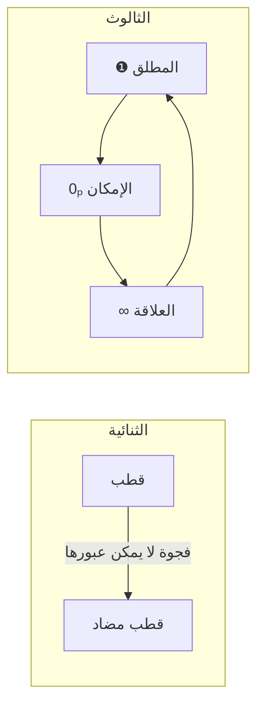

---

3. التأصيل العلمي: الفيزياء الحديثة في ضوء الثالوث

3.1 النسبية والزمكان

نظرية النسبية ألغت المطلقية النيوتونية، لكنها استبدلتها بنسبية الأطر المرجعية. في نظام 𝕊، النسبية هي تجلٍّ للعلاقات (∞) في الزمكان، لكن المطلق (❶) يبقى خارج نطاق النسبية، وهو ما يفسر ثبات سرعة الضوء (التي تمثل $BS=1$ في النظام).

<table style="width:100%; border-collapse: collapse; text-align: center; direction: ltr;" border="1">
  <thead>
    <tr style="background-color: #f2f2f2;">
      <th style="padding: 8px;">مفهوم نسبي</th>
      <th style="padding: 8px;">ما يقابله في 𝕊</th>
    </tr>
  </thead>
  <tbody>
    <tr><td>الزمكان</td><td>∞ متجلي في 4 أبعاد + τ</td></tr>
    <tr><td>انحناء الزمكان</td><td>تغير في $BS$ نتيجة توزع الكتلة</td></tr>
    <tr><td>ثابت الكون (Λ)</td><td>تجلٍّ لـ ❶ في الفراغ</td></tr>
    <tr><td>سرعة الضوء (c)</td><td>$BS=1$، حد التجلي الأقصى</td></tr>
  </tbody>
</table>

3.2 ميكانيكا الكم

الكمومي هو عالم الإمكان (0ₚ) بامتياز: التراكب، الانهيار، التشابك، كلها مفاهيم تجد مكانها الطبيعي في الثالوث.

<table style="width:100%; border-collapse: collapse; text-align: center; direction: ltr;" border="1">
  <thead>
    <tr style="background-color: #f2f2f2;">
      <th style="padding: 8px;">مفهوم كمومي</th>
      <th style="padding: 8px;">ما يقابله في 𝕊</th>
    </tr>
  </thead>
  <tbody>
    <tr><td>التراكب (Superposition)</td><td>$0ₚ$ يحتوي كل الحالات</td></tr>
    <tr><td>القياس (Measurement)</td><td>عملية التجلي $\eta$</td></tr>
    <tr><td>التشابك (Entanglement)</td><td>$∞$ كعلاقة غير موضعية</td></tr>
    <tr><td>مبدأ الريبة</td><td>$\Delta x \Delta p \geq \frac{\hbar}{2} \cdot \frac{1}{BS}$</td></tr>
  </tbody>
</table>

3.3 نظرية الأوتار والأبعاد الإضافية

نظرية الأوتار تفترض وجود أبعاد إضافية ملفوفة. في نظام 𝕊، هذه الأبعاد هي تجليات للعلاقات ∞ عند مستويات طاقة مختلفة.

\text{فضاء كالابي-ياو} \longleftrightarrow \infty \otimes 6 

أي أن الأبعاد الستة الإضافية هي تكرار (⊗) للعلاقة ∞ ست مرات.

---

4. التأصيل الرياضي: الأعداد الأولية وغودل وكوهين

4.1 الأعداد الأولية كتجليات نقية

في نظام 𝕊، الأعداد الأولية هي تجليات مباشرة للمطلق، لأنها لا تقبل التحليل إلى مكونات أصغر. كل عدد أولي $p$ له استقرار بنيوي:

BS(p) =
\begin{cases}
\dfrac{4}{7}, & p = 2 \\[1.2em]
\dfrac{8}{17}, & p = 3 \\[1.2em]
\dfrac{2}{2p-3}, & p \ge 5
\end{cases}

مبرهنة الأعداد الأولية في 𝕊:
\sum_{p \le x} BS(p) \sim \frac{1}{2} \log \log x

4.2 غودل وحدود الصورية

مبرهنات غودل (1931) أثبتت أن أي نظام صوري يتضمن حساباً إما غير كامل أو غير متسق. هذا يعني أن الحقيقة الرياضية تتجاوز البرهان الصوري. نظام 𝕊 يتجاوز هذه المعضلة بالانتقال من الأساس الصوري إلى الأساس الوجودي: المطلق ❶ هو مصدر الحقيقة، لكنه لا يمكن حصره في أي نظام صوري. لذلك، عدم الاكتمال ليس عيباً، بل هو انعكاس لكون الرياضيات تجلياً محدوداً من المطلق.

4.3 كوهين وتعدد المنطق

استقلالية فرضية الاستمرار (Cohen, 1963) تعني وجود نماذج متعددة للرياضيات، يمكن فيها قبول الفرضية أو نفيها. في نظام 𝕊، هذا يتوافق مع تعدد التجليات: كل نموذج رياضي هو تجلٍّ معين للمطلق، ولكل منها $BS$ خاص به. الرياضيات ليست واحدة، بل هي حقل من التجليات.

---

5. التأصيل في التراث الإسلامي: الكندي، الفارابي، ابن سينا

5.1 الكندي: تمييز الواحد الحق

الكندي (850 م) كان أول من ميز بوضوح بين الواحد الحق (الله) والواحد العددي. هذا التمييز هو أساس الفصل بين ❶ و ① في نظامنا. يقول الكندي في رسالته "في العقل": "الواحد الحق لا كم له ولا كيفية، والواحد العددي هو مبدأ الكمية".

5.2 الفارابي: نظرية الفيض

الفارابي (950 م) طور نظرية الفيض التي تفسر كيفية صدور الكثرة عن الواحد. الفيض عنده يتم عبر تعقّل الواحد لذاته، فيصدر عنه عقل أول، ثم عقل ثان، وهكذا. في نظام 𝕊، هذا هو $\eta$ (التجلي) المتكرر عبر دالة الخليفة $s_n$:

s_n(①) = ②, \quad s_n(②) = ③, \dots

5.3 ابن سينا: الوجوب والإمكان

ابن سينا (1030 م) ميز بين الوجود الواجب (الذي وجوده من ذاته) والوجود الممكن (الذي يحتاج إلى علة). هذا يقابل ❶ (واجب) و 0ₚ (إمكان). لكن ابن سينا جعل الممكن متعيناً بعلته، بينما 0ₚ في نظامنا هو إمكان غير متعين، يحتوي كل الاحتمالات قبل التجلي.

---

6. العلاقة مع النظريات الفلسفية المعاصرة

6.1 مقارنة مع فلسفات الوجود (هايدغر، سارتر)

<table style="width:100%; border-collapse: collapse; text-align: center; direction: ltr;" border="1">
  <thead>
    <tr style="background-color: #f2f2f2;">
      <th style="padding: 8px;">الفيلسوف</th>
      <th style="padding: 8px;">المفهوم المركزي</th>
      <th style="padding: 8px;">ما يقابله في 𝕊</th>
    </tr>
  </thead>
  <tbody>
    <tr><td>هايدغر</td><td>الوجود (Sein) – الكائن (Dasein) – الزمان</td><td>❶ – ① – τ</td></tr>
    <tr><td>سارتر</td><td>الوجود في ذاته – الوجود لذاته – العدم</td><td>❶ – ∞ – 0ₚ (كعدم منتج)</td></tr>
    <tr><td>ميرلوبونتي</td><td>الجسد – العالم – العلاقة القصدية</td><td>① – ∞ – 0ₚ (كإمكان إدراكي)</td></tr>
  </tbody>
</table>

6.2 مقارنة مع البنيوية (ليفي-شتروس، فوكو)

البنيوية تركز على العلاقات بين العناصر أكثر من العناصر نفسها. هذا يتوافق مع ∞ في نظامنا، لكن البنيوية تهمل البعد المطلق (❶) والإمكان (0ₚ)، مما يجعلها عرضة للنسبية المطلقة.

---

7. خارطة الطريق: من التأصيل إلى التطبيق

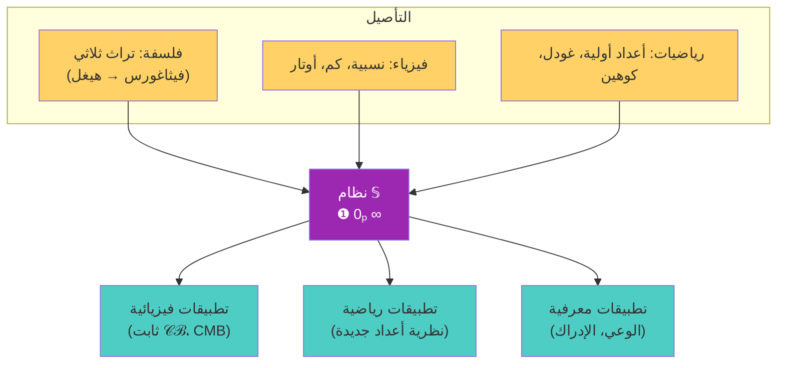

---

8. خلاصة: جذور راسخة، آفاق جديدة

نظام 𝕊 ليس هيكلاً هشاً بني على الرمال، بل هو بناء متين تمتد جذوره في أعماق التراث الفلسفي، وتتدعم بأسس علمية رصينة، وتستند إلى بنية رياضية متماسكة. من فيثاغورس إلى غودل، ومن أرسطو إلى أينشتاين، كانت الأفكار تتجه صوب هذه الثلاثية دون أن تصل إلى صياغتها النهائية.

الآن، وقد اكتملت الأدوات (الرياضيات التجريدية، الفيزياء الحديثة، التحليل الفلسفي)، أصبح ممكناً تقديم هذه الصياغة الموحدة التي تضع التجلي والاستقرار البنيوي في صميم فهم الوجود.

---

<div style="text-align: center; margin-top: 2cm; padding: 0.5cm; border-top: 2px solid #9C27B0;">

✍️ م. أحمد علي بوكر نسيب
📧 Eng.ahmad.2011bokar@gmail.com
🔗 https://github.com/bouker/thesis-S

</div>
---
📘 01_03_الخلفية_البحثية

دوافع الأطروحة وسياقها الفكري والتاريخي

<div style="text-align: center; margin: 2cm 0 1cm 0;">
    <p style="font-size: 20pt; font-weight: bold; color: #9C27B0;">عقد من التأمل · أزمة الأسس · الحاجة إلى التوحيد</p>
    <p style="font-size: 16pt;">من أين جاء نظام 𝕊 ولماذا الآن؟</p>
    <p style="font-size: 12pt; color: #666;">النسخة المحسّنة 2026 – الجزء الأول: الأساسيات النظرية</p>
</div>

---


---

1. تقديم: رحلة عقد من الزمن

يمتد العمل على نظام 𝕊 تحت اسم "بوكر" (أحمد علي بوكر نسيب) لأكثر من عقد كامل، بدأ كفضول فلسفي حول طبيعة الأعداد، وتطور إلى مشروع طموح لإعادة بناء أسس الرياضيات والفيزياء معاً. خلال هذه الرحلة، كان السؤال المحوري الذي قاد البحث هو:

كيف يمكن للرياضيات أن تكون لغة للوجود وليس مجرد أداة للعد؟

هذا السؤال لم يأتِ من فراغ، بل نبع من ملاحظة أن الرياضيات – رغم نجاحها الهائل في وصف الظواهر – تعاني من أزمة أسس لم تُحل بعد، وأن الفيزياء – رغم تقدمها – تفتقر إلى إطار موحد يوفق بين النسبية والكم. كما أن الفلسفة – رغم عمقها – انفصلت عن العلم، مما جعل أسئلة الوجود الكبرى حبيسة التخصصات الضيقة.

---

2. السياق الأكاديمي والشخصي للمؤلف

<div style="background-color: #f9f9f9; padding: 15px; border-radius: 8px; border-right: 5px solid #9C27B0; margin: 20px 0;">

أحمد علي بوكر نسيب

· بكالوريوس في الهندسة الميكانيكية (جامعة حلب، 2010).
· ماجستير في الهندسة الميكانيكية العامة (جامعة جازان، 2018).
· باحث مستقل في فلسفة الرياضيات والفيزياء النظرية منذ 2015.
· اهتمامات: أسس الرياضيات، المنطق الرياضي، فلسفة الفيزياء، تاريخ الأفكار، نظرية المعرفة.
· صاحب نظام 𝕊 | الثالوث الرياضي.

</div>

الخلفية الهندسية للمؤلف أكسبته منهجية التفكير البنيوي والاهتمام بالنمذجة الرياضية للظواهر، بينما قادته القراءات الفلسفية الواسعة (من اليونان إلى هيغل، ومن الكندي إلى ابن سينا) إلى إدراك أن الرياضيات الحديثة تفتقر إلى الأسس الوجودية التي كانت حاضرة في الفلسفة الكلاسيكية.

---

3. أزمة الأسس الرياضية: نقطة الانطلاق

3.1 الانهيار التدريجي للمشروع الهيلبرتي

في مطلع القرن العشرين، سعى ديفيد هيلبرت إلى إضفاء الطابع الرسمي الكامل على الرياضيات: بناء نظام أكسيوماتي متسق وكامل يضمن عدم وجود تناقضات ويسمح بإثبات أو نفي أي عبارة رياضية. لكن هذا الحلم اصطدم بثلاث ضربات قاضية:

<table style="width:100%; border-collapse: collapse; text-align: center; direction: ltr;" border="1">
  <thead>
    <tr style="background-color: #9C27B0; color: white;">
      <th style="padding: 8px;">الحدث</th>
      <th style="padding: 8px;">السنة</th>
      <th style="padding: 8px;">المضمون</th>
      <th style="padding: 8px;">الأثر على الأسس</th>
    </tr>
  </thead>
  <tbody>
    <tr>
      <td>مفارقة راسل</td>
      <td>1901</td>
      <td>مجموعة كل المجموعات التي لا تحتوي على نفسها: هل تحتوي على نفسها؟ التناقض واضح.</td>
      <td>كشفت أن الحدس المجرد في نظرية المجموعات قد يولد تناقضات.</td>
    </tr>
    <tr>
      <td>مبرهنات غودل</td>
      <td>1931</td>
      <td>أي نظام صوري يتضمن حساباً (مثل ZFC) إما غير كامل (فيه جمل صحيحة لا تُثبت) أو غير متسق.</td>
      <td>وضعت حداً نهائياً للحلم الهيلبرتي بالاكتمال والاتساق.</td>
    </tr>
    <tr>
      <td>استقلالية كوهين</td>
      <td>1963</td>
      <td>فرضية الاستمرار (لا مجموعة عددية بين الطبيعية والحقيقية) مستقلة عن ZFC، أي يمكن قبولها أو رفضها.</td>
      <td>أظهرت تعدد النماذج الرياضية، وأن البديهيات لا تحدد كل شيء.</td>
    </tr>
  </tbody>
</table>

3.2 الدروس المستخلصة

ما بعد غودل وكوهين، أصبح من الواضح أن:

1. الأسس الصورية وحدها لا تكفي لضمان حقيقة الرياضيات.
2. هناك حاجة إلى أسس وجودية تربط الرياضيات بالواقع.
3. الرياضيات ليست بناءً مغلقاً، بل هي تجليات متعددة لحقيقة أعمق.

هذه الاستنتاجات قادت إلى البحث عن إطار يمكن أن يكون:

· موحداً: يفسر الرياضيات والفيزياء معاً.
· وجودياً: يعيد الاعتبار للميتافيزيقا دون تخلي عن الدقة.
· كمياً: يقدم تنبؤات قابلة للاختبار.

---

4. الحاجة إلى إطار موحد في الفيزياء

إلى جانب أزمة الرياضيات، تعاني الفيزياء النظرية من جمود واضح منذ عقود:

<table style="width:100%; border-collapse: collapse; text-align: center; direction: ltr;" border="1">
  <thead>
    <tr style="background-color: #f2f2f2;">
      <th style="padding: 8px;">المجال</th>
      <th style="padding: 8px;">المشكلة</th>
    </tr>
  </thead>
  <tbody>
    <tr><td>النسبية العامة</td><td>تتفردات (singularities) في الثقوب السوداء وبداية الكون، مما يشير إلى عدم اكتمالها.</td></tr>
    <tr><td>ميكانيكا الكم</td><td>مشكلة القياس، واللاحتمية، والترابط مع الجاذبية.</td></tr>
    <tr><td>الجاذبية الكمومية</td><td>لا توجد نظرية متكاملة ومقبولة على نطاق واسع.</td></tr>
    <tr><td>المادة المظلمة والطاقة المظلمة</td><td>تمثلان 95% من الكون، لكن طبيعتهما مجهولة.</td></tr>
  </tbody>
</table>

نظام 𝕊 يقدم إطاراً يمكن من خلاله إعادة تفسير هذه الظواهر بلغة الثالوث، ويقترح آليات جديدة (مثل ثابت التجلي البوكري $\mathcal{CB}$) قابلة للاختبار التجريبي.

---

5. الأسئلة الجوهرية التي يحاول النظام الإجابة عنها

انطلق العمل من مجموعة أسئلة مترابطة:

5.1 أسئلة فلسفية

· ما الوجود؟ هل هو واحد أم متعدد؟
· ما التغير؟ هل هو حقيقي أم وهم؟
· ما اللانهاية؟ وهل هي واحدة أم متعددة؟
· كيف يمكن التوفيق بين ثبات المطلق وتدفق الظواهر؟

5.2 أسئلة رياضية

· لماذا توجد أعداد أولية؟ وما علاقتها بالمطلق؟
· لماذا تعجز الأنظمة الصورية عن إثبات كل الحقائق؟
· هل يمكن بناء رياضيات على أساس وجودي غير صوري؟

5.3 أسئلة فيزيائية

· لماذا الثوابت الفيزيائية على ما هي عليه؟
· ما أصل التشابك الكمومي؟
· هل يمكن توحيد القوى في إطار واحد؟

5.4 سؤال جامع

كيف يمكن صياغة هذه الأسئلة بلغة رياضية واحدة، تقدم إجابات قابلة للاختبار، مع احترام عمقها الفلسفي؟

---

6. لماذا الثالوث تحديداً؟

لم يكن اختيار الثالوث (❶، 0ₚ، ∞) اعتباطياً، بل نتاج ملاحظة أن معظم الأنظمة الفلسفية والعلمية الناجحة تقوم على ثلاثية ضمنية:

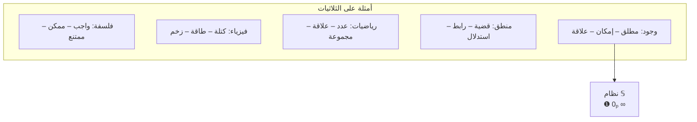

كما أن الجدلية الهيغلية (أطروحة – نقيض – تركيب) ونظرية الفيض في الفلسفة الإسلامية (عقول متعددة) تشير إلى أن الكثرة تتولد من الواحد عبر وسيط. الثالوث هو أبسط صيغة يمكن أن تفسر الانتقال من الوحدة إلى التعدد دون فقدان الاتصال بالمصدر.

---

7. العلاقة مع النقد المعاصر للرياضيات

7.1 نقد الرياضيات الصورية

من أبرز نقاد الشكلانية الرياضية في العصر الحديث:

· إميل مايرسون: أكد أن الرياضيات تستمد قوتها من تطابقها مع الواقع، لا من اتساقها الداخلي فقط.
· جان كافاييس: رأى أن الرياضيات تتطور عبر تاريخها، ولا يمكن اختزالها إلى نظام صوري مغلق.
· رينيه توم (صاحب نظرية الكارثة): دعا إلى إعادة ربط الرياضيات بالحدس الهندسي والظواهر الطبيعية.

نظام 𝕊 يتبنى هذه النقود ويحولها إلى بناء إيجابي: فالرياضيات ليست مجرد لغة شكلية، بل هي علم التجليات، وكل نظام صوري هو تجلٍّ محدود للمطلق.

7.2 الاتجاه البنيوي في فلسفة الرياضيات

البنيوية الرياضية (شابيرو، ريسنيك) ترى أن الرياضيات تدرس البنى وليس الكيانات المنعزلة. هذا يتوافق مع ∞ في نظامنا، لكن البنيوية تفتقر إلى البعد المطلق (❶) والإمكان (0ₚ)، مما يجعلها عرضة لنسبوية مفرطة.

---

8. دوافع شخصية وإنسانية

إلى جانب الدوافع العلمية والفلسفية، كان هناك دافع شخصي عميق: الرغبة في فهم مكان الإنسان في هذا الكون. إذا كانت الرياضيات لغة الوجود، وإذا كان الوعي تجلياً من التجليات، فإن فهم بنية الوجود الرياضية يمكن أن يلقي ضوءاً على طبيعة الوعي والمعنى والأخلاق.

يقول بوكر في إحدى مخطوطاته:

"لم أكتب هذا النظام لأهدم ما بناه الآخرون، بل لأكمل ما بدأوه. الرياضيات فقدت روحها عندما انفصلت عن الفلسفة، والفلسفة فقدت صرامتها عندما انفصلت عن الرياضيات. أردت أن أعيد الوصلة بينهما، وأن أذكر الجميع بأن العدد ليس مجرد أداة، بل هو حرف من حروف كتاب الكون."

---

9. خلاصة: خلفية بحثية تمهد للرحلة

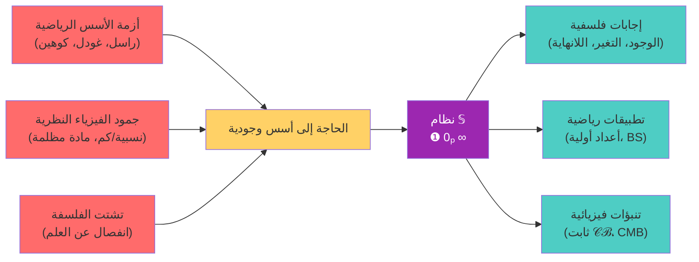

نظام 𝕊 إذن ليس نزوة فكرية عابرة، بل هو محاولة للإجابة عن أسئلة ظلت معلقة لقرون، باستخدام أدوات عصرية (الرياضيات الحديثة، الفيزياء المتطورة، التحليل التاريخي). الخلفية البحثية تؤكد أن هناك فراغاً معرفياً يحتاج إلى ملء، وأن الأدوات متوفرة الآن لاختبار فرضيات لم تكن قابلة للاختبار من قبل.

---

10. الهيكل العام للأطروحة (تذكير)

<table style="width:100%; border-collapse: collapse; text-align: left; direction: ltr;" border="1">
  <thead>
    <tr style="background-color: #9C27B0; color: white;">
      <th style="padding: 8px;">الجزء</th>
      <th style="padding: 8px;">المحتوى الرئيسي</th>
    </tr>
  </thead>
  <tbody>
    <tr><td>الجزء الأول</td><td>الأساسيات النظرية: الثالوث، العمليات، BS، التأصيل التاريخي.</td></tr>
    <tr><td>الجزء الثاني</td><td>التطبيقات المتعددة: رياضيات، فيزياء، حاسوب، إنسانيات.</td></tr>
    <tr><td>الجزء الثالث</td><td>المناقشة والمستقبل: دراسات مقارنة، أدوات، رؤى مستقبلية.</td></tr>
    <tr><td>الملاحق</td><td>مصطلحات، مراجع، شهادات، ملفات دعم.</td></tr>
  </tbody>
</table>

---

<div style="text-align: center; margin-top: 2cm; padding: 0.5cm; border-top: 2px solid #9C27B0;">

✍️ م. أحمد علي بوكر نسيب
📧 Eng.ahmad.2011bokar@gmail.com
🔗 https://github.com/bouker/thesis-S

</div>
---
📘 02_01_التفسير_البنيوي_للثالوث.md

قراءة معمقة في بنية المطلق والإمكان والعلاقة

<div style="text-align: center; margin: 2cm 0 1cm 0;">
    <p style="font-size: 20pt; font-weight: bold; color: #9C27B0;">❶ · 0ₚ · ∞</p>
    <p style="font-size: 16pt;">تحليل بنيوي للعناصر التأسيسية وعلاقاتها المتبادلة</p>
    <p style="font-size: 12pt; color: #666;">النسخة المحسّنة 2026 – الجزء الأول: الأساسيات النظرية</p>
</div>

---


---

1. مقدمة: لماذا التفسير البنيوي؟

بعد تقديم الثالوث في ملف 01_01، حان الوقت لتحليل بنيته الداخلية بعمق. التفسير البنيوي يعني:

· كشف العلاقات المتبادلة بين العناصر الثلاثة.
· تحديد الخصائص الجوهرية لكل عنصر.
· بيان كيف تولد هذه البنية الأنظمة المعقدة (الأعداد، الفيزياء، الوعي).

البنيوية هنا ليست مجرد وصف، بل هي تحليل رياضي-فلسفي يهدف إلى استخلاص القوانين التي تحكم التفاعل بين ❶، 0ₚ، ∞.

---

2. تحليل العناصر التأسيسية

2.1 ❶ - الواحد المطلق

<div style="background-color: #8B0000; color: white; padding: 10px; border-radius: 5px; margin: 15px 0;">
<strong>❶ | The Absolute One</strong>
</div>

التعريف البنيوي: ❶ هو المصدر غير المشروط، غير القابل للتجزئة أو التحديد العددي. كل ما سواه يتلقى وجوده منه.

الخصائص البنيوية:

<table style="width:100%; border-collapse: collapse; text-align: center; direction: ltr;" border="1">
  <thead>
    <tr style="background-color: #f2f2f2;">
      <th style="padding: 8px;">الخاصية</th>
      <th style="padding: 8px;">التعبير الرياضي</th>
      <th style="padding: 8px;">الدلالة الفلسفية</th>
    </tr>
  </thead>
  <tbody>
    <tr>
      <td>الوحدانية المطلقة</td>
      <td>$❶ \neq ①$، $❶ \notin \mathbb{N}$</td>
      <td>لا يشبه الواحد العددي، ولا يندرج تحت الكم</td>
    </tr>
    <tr>
      <td>عدم القابلية للتجزئة</td>
      <td>$❶ \oplus ❶ = ❶$ (ماص)</td>
      <td>لا يتعدد ولا يتركب</td>
    </tr>
    <tr>
      <td>الاستقرار الكامل</td>
      <td>$BS(❶) = 1$</td>
      <td>مصدر كل استقرار، ولا يتأثر بالعلاقات</td>
    </tr>
    <tr>
      <td>الفاعلية المحضة</td>
      <td>$\varepsilon: ❶ \rightarrow 0ₚ$</td>
      <td>يهب الإمكان دون أن ينقص</td>
    </tr>
  </tbody>
</table>

التمثيل البصري:

```mermaid
graph LR
    subgraph ❶
        direction LR
        A[∞] -->|غير قابل للإدراك المباشر| B[❶]
    end
    style B fill:#8B0000,color:white
```

2.2 0ₚ - الإمكان المحض

<div style="background-color: #666666; color: white; padding: 10px; border-radius: 5px; margin: 15px 0;">
<strong>0ₚ | Pure Potentiality</strong>
</div>

التعريف البنيوي: 0ₚ هو حقل الاحتمالات غير المتعينة، العدم النشط الذي يحتوي كل شيء بالقوة. ليس عدماً مطلقاً (لا شيء)، بل هو عدم نسبي قابل للتحول إلى وجود.

الخصائص البنيوية:

<table style="width:100%; border-collapse: collapse; text-align: center; direction: ltr;" border="1">
  <thead>
    <tr style="background-color: #f2f2f2;">
      <th style="padding: 8px;">الخاصية</th>
      <th style="padding: 8px;">التعبير الرياضي</th>
      <th style="padding: 8px;">الدلالة الفلسفية</th>
    </tr>
  </thead>
  <tbody>
    <tr>
      <td>اللاتعيّن</td>
      <td>$0ₚ = \lim_{\epsilon \to 0^+} \epsilon \cdot ①$</td>
      <td>يقترب من الصفر لكنه ليس صفراً مطلقاً</td>
    </tr>
    <tr>
      <td>الحياد</td>
      <td>$x \oplus 0ₚ = x$</td>
      <td>لا يغير العناصر الأخرى عند الجمع الثالوثي</td>
    </tr>
    <tr>
      <td>الاحتواء</td>
      <td>$0ₚ \supset \{ جميع الاحتمالات \}$</td>
      <td>يحتوي كل الحالات الكمومية المتراكبة</td>
    </tr>
    <tr>
      <td>الاستقرار الجزئي</td>
      <td>$BS(0ₚ) = \frac{1}{3}$</td>
      <td>أدنى استقرار مع بقاء قابلية للتجلي</td>
    </tr>
  </tbody>
</table>

التمثيل البصري:

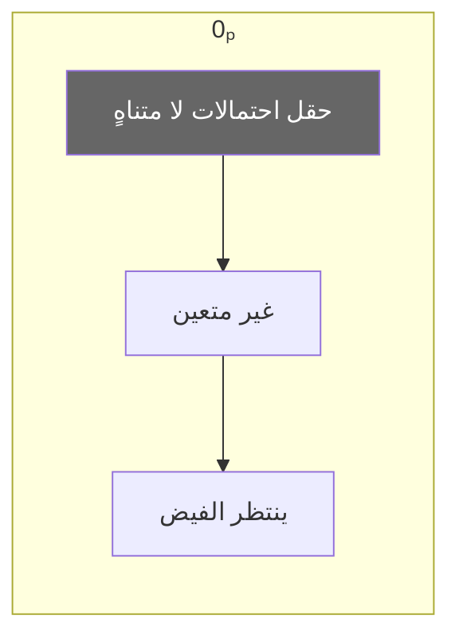

2.3 ∞ - اللانهاية العلائقية

<div style="background-color: #4B0082; color: white; padding: 10px; border-radius: 5px; margin: 15px 0;">
<strong>∞ | Relational Infinity</strong>
</div>

التعريف البنيوي: ∞ هو فضاء العلاقات الذي يربط الموجودات بعضها ببعض، الشبكة الكونية التي تتجلى فيها الكثرة. ليس عدداً كبيراً، بل هو بنية علائقية تتسع لكل العلاقات الممكنة.

الخصائص البنيوية:

<table style="width:100%; border-collapse: collapse; text-align: center; direction: ltr;" border="1">
  <thead>
    <tr style="background-color: #f2f2f2;">
      <th style="padding: 8px;">الخاصية</th>
      <th style="padding: 8px;">التعبير الرياضي</th>
      <th style="padding: 8px;">الدلالة الفلسفية</th>
    </tr>
  </thead>
  <tbody>
    <tr>
      <td>الشمول العلائقي</td>
      <td>$∞ = \bigoplus_{i=1}^{\infty} R_i$</td>
      <td>كل العلاقات الممكنة موجودة فيه بالقوة أو الفعل</td>
    </tr>
    <tr>
      <td>التوالد الذاتي</td>
      <td>$∞ \otimes n = ∞^{n+1}$</td>
      <td>تكرار العلاقات يولد مستويات جديدة من التعقيد</td>
    </tr>
    <tr>
      <td>الهوية مع الواحد الطبيعي</td>
      <td>$∞ = ①$</td>
      <td>أول تجلٍّ هو العلاقة الأولى</td>
    </tr>
    <tr>
      <td>الاستقرار العالي</td>
      <td>$BS(∞) = \frac{2}{3}$</td>
      <td>أعلى استقرار بعد المطلق</td>
    </tr>
  </tbody>
</table>

التمثيل البصري:

```mermaid
graph TD
    subgraph ∞
        A[عقدة] --- B[عقدة]
        B --- C[عقدة]
        C --- D[عقدة]
        D --- A
    end
    style A fill:#4B0082,color:white
    style B fill:#4B0082,color:white
    style C fill:#4B0082,color:white
    style D fill:#4B0082,color:white
```

---

3. العلاقات البنيوية بين العناصر

3.1 المعادلة المركزية: $❶ \oplus 0ₚ = ① = ∞$

هذه المعادلة ليست مجرد صيغة رياضية، بل هي وصف لعملية الخلق المستمر:

· الجهة اليسرى: اتحاد المطلق مع الإمكان (باتحاد غير تبادلي) ينتج الواحد الطبيعي.
· الجهة اليمنى: الواحد الطبيعي هو نفسه اللانهاية العلائقية المتجلية.

3.2 مصفوفة العلاقات المتبادلة

<table style="width:80%; border-collapse: collapse; text-align: center; direction: ltr; margin: 0 auto;" border="1">
  <thead>
    <tr style="background-color: #9C27B0; color: white;">
      <th style="padding: 8px;">⊕</th>
      <th style="padding: 8px;">❶</th>
      <th style="padding: 8px;">0ₚ</th>
      <th style="padding: 8px;">∞</th>
    </tr>
  </thead>
  <tbody>
    <tr><td><strong>❶</strong></td><td>❶</td><td>①</td><td>❶</td></tr>
    <tr><td><strong>0ₚ</strong></td><td>❶</td><td>0ₚ</td><td>∞</td></tr>
    <tr><td><strong>∞</strong></td><td>❶</td><td>∞</td><td>∞²</td></tr>
  </tbody>
</table>

تفسير الجدول:

· ❶ مع أي شيء = ❶ (المطلق يهيمن).
· 0ₚ مع أي شيء يعطي الآخر (الإمكان محايد).
· ∞ مع ∞ يعطي ∞² (العلاقات تتضاعف).

3.3 درجات الاستقرار البنيوي (BS)

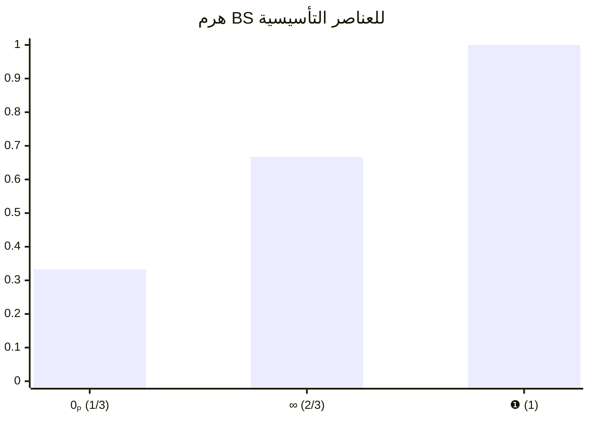

---

4. البنية التوليدية: كيف تنبثق الأعداد من الثالوث؟

الأعداد الطبيعية ليست كيانات أولية، بل هي تجليات متكررة للمطلق عبر الإمكان.

4.1 دالة الخليفة في نظام 𝕊

s_n(k) = k \oplus ①

حيث ① هو الواحد الطبيعي (أول تجلٍّ).

توليد الأعداد:

· $① = ∞$
· $② = s_1(①) = ① \oplus ①$
· $③ = s_2(②) = ② \oplus ①$
· $④ = s_3(③) = ③ \oplus ①$
· وهكذا...

4.2 BS للأعداد الناتجة

BS(n) =
\begin{cases}
\dfrac{7}{10}, & n = 1 \\[1.2em]
\dfrac{4}{7}, & n = 2 \\[1.2em]
\dfrac{8}{17}, & n = 3 \\[1.2em]
\dfrac{10}{27}, & n = 4 \\[1.2em]
\dfrac{2}{2n-3}, & n \ge 5
\end{cases}

ملاحظة: BS(1) = 0.7 ≠ 0.6667 لأن ① هنا هو العدد الطبيعي الأول، بينما ∞ هو اللانهاية العلائقية. في نظام 𝕊، ① = ∞ من حيث الجوهر، لكن في الحسابات التفصيلية، نستخدم القيم المحددة في الجدول.

---

5. تطبيقات بنيوية: نماذج من الفيزياء والوعي

5.1 في الفيزياء الكمومية

<table style="width:100%; border-collapse: collapse; text-align: center; direction: ltr;" border="1">
  <thead>
    <tr style="background-color: #f2f2f2;">
      <th style="padding: 8px;">المفهوم الكمومي</th>
      <th style="padding: 8px;">البنية المقابلة في 𝕊</th>
    </tr>
  </thead>
  <tbody>
    <tr><td>التراكب</td><td>0ₚ كحقل احتمالات</td></tr>
    <tr><td>انهيار الدالة الموجية</td><td>عملية $\eta$ التي تحول 0ₚ إلى ①</td></tr>
    <tr><td>التشابك</td><td>∞ كعلاقة غير موضعية</td></tr>
    <tr><td>القياس</td><td>تفاعل جهاز (له BS معين) مع 0ₚ</td></tr>
  </tbody>
</table>

5.2 في الوعي والإدراك

<table style="width:100%; border-collapse: collapse; text-align: center; direction: ltr;" border="1">
  <thead>
    <tr style="background-color: #f2f2f2;">
      <th style="padding: 8px;">مكون الوعي</th>
      <th style="padding: 8px;">البنية المقابلة في 𝕊</th>
    </tr>
  </thead>
  <tbody>
    <tr><td>الوعي الخالص (الذات)</td><td>❶-وعي (BS ~ 1)</td></tr>
    <tr><td>الأفكار والمشاعر الكامنة</td><td>0ₚ-وعي (BS ~ 1/3)</td></tr>
    <tr><td>اللغة والتواصل</td><td>∞-وعي (BS ~ 2/3)</td></tr>
  </tbody>
</table>

---

6. استنتاجات: لماذا هذه البنية ناجحة؟

1. البساطة: ثلاثة عناصر فقط تولد كل التعقيد.
2. الشمول: تفسر الرياضيات والفيزياء والوعي.
3. القابلية للقياس: BS يعطي مقياساً كمياً للوجود.
4. التراث: تمتد جذورها في أعمق الفلسفات.

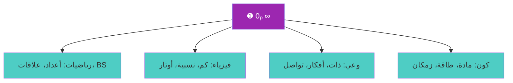

---

7. تمارين وتطبيقات

تمرين 1: احسب $❶ \oplus ∞$ باستخدام خصائص الجدول أعلاه.

تمرين 2: إذا كان $BS(5) = \frac{2}{7}$، فما $BS(7)$؟ وما العلاقة بينهما؟

تمرين 3: اشرح كيف يمكن تمثيل حالة كمومية متراكبة باستخدام 0ₚ.

---

<div style="text-align: center; margin-top: 2cm; padding: 0.5cm; border-top: 2px solid #9C27B0;">

✍️ م. أحمد علي بوكر نسيب
📧 Eng.ahmad.2011bokar@gmail.com
🔗 https://github.com/bouker/thesis-S

</div>
---
📘 02_02_آلية_التجلي_والتحول.md

من المطلق إلى المتعدد: عمليات الهبة والتشكل والتجلي

<div style="text-align: center; margin: 2cm 0 1cm 0;">
    <p style="font-size: 20pt; font-weight: bold; color: #9C27B0;">ε · δ · η</p>
    <p style="font-size: 16pt;">آليات الانتقال والتحول في نظام 𝕊</p>
    <p style="font-size: 12pt; color: #666;">النسخة المحسّنة 2026 – الجزء الأول: الأساسيات النظرية</p>
</div>

---


---

1. مقدمة: سؤال الانتقال

من أعظم الأسئلة الميتافيزيقية: كيف يصدر الكثير من الواحد؟ كيف ينتقل الوجود من المطلق غير المشروط إلى المتعدد المشروط؟ الفلسفات القديمة قدمت إجابات استعارية (الفيض، الخلق، الصدور)، لكنها بقيت غير قابلة للصياغة الرياضية.

نظام 𝕊 يقدم إجابة عملية عبر ثلاث عمليات مترابطة:

· الهبة ($\varepsilon$): المطلق يهب ذاته للإمكان.
· التشكل ($\delta$): الإمكان يتشكل في علاقات.
· التجلي ($\eta$): العلاقات تتجلى في موجودات.

هذه العمليات ليست مجرد وصف فلسفي، بل هي مؤثرات رياضية يمكن تطبيقها على العناصر التأسيسية لإنتاج الأعداد والظواهر الفيزيائية.

---

2. تعريف العمليات الثلاث

2.1 الهبة: $\varepsilon$

<div style="background-color: #8B0000; color: white; padding: 10px; border-radius: 5px; margin: 15px 0;">
<strong>ε | الهبة (Self-gift)</strong>
</div>

التعريف: عملية غير عكوسة لا زمانية ينقل بها المطلق جزءاً من "نوره" (أو فعاليته) إلى الإمكان المحض، فيوقظه من سكونه.

\varepsilon: ❶ \rightarrow 0ₚ

الخصائص:

<table style="width:100%; border-collapse: collapse; text-align: center; direction: ltr;" border="1">
  <thead>
    <tr style="background-color: #f2f2f2;">
      <th style="padding: 8px;">الخاصية</th>
      <th style="padding: 8px;">التعبير</th>
      <th style="padding: 8px;">الدلالة</th>
    </tr>
  </thead>
  <tbody>
    <tr><td>غير عكوسة</td><td>$\varepsilon^{-1}$ غير موجود</td><td>الهبة لا تُسترجع، الوجود بمجرد أن يُمنح لا يُسلب</td></tr>
    <tr><td>لا زمانية</td><td>$\varepsilon$ لا تعتمد على $\tau$</td><td>الهبة فوق الزمن، هي أساس الزمن نفسه</td></tr>
    <tr><td>كلية</td><td>$\varepsilon(❶) = 0ₚ$</td><td>المطلق يهب كل ذاته (بمعنى أنه يظهر فيها، لا أنه ينقسم)</td></tr>
  </tbody>
</table>

التمثيل الرمزي:

❶ \xrightarrow{\varepsilon} 0ₚ

2.2 التشكل: $\delta$

<div style="background-color: #666666; color: white; padding: 10px; border-radius: 5px; margin: 15px 0;">
<strong>δ | التشكل (Formation)</strong>
</div>

التعريف: عملية زمانية جزئية العكس، يحول بها الإمكان المحض إلى علاقات محددة. الإمكان غير المتعين يأخذ صورة معينة.

\delta: 0ₚ \rightarrow ∞

الخصائص:

<table style="width:100%; border-collapse: collapse; text-align: center; direction: ltr;" border="1">
  <thead>
    <tr style="background-color: #f2f2f2;">
      <th style="padding: 8px;">الخاصية</th>
      <th style="padding: 8px;">التعبير</th>
      <th style="padding: 8px;">الدلالة</th>
    </tr>
  </thead>
  <tbody>
    <tr><td>زمانية</td><td>$\delta = \delta(\tau)$</td><td>التشكل يحدث في الزمن (معامل التجلي $\tau$)</td></tr>
    <tr><td>جزئية العكس</td><td>$\delta^{-1}$ موجود لكنه ليس تاماً</td><td>يمكن للعلاقات أن تعود إلى إمكان، لكن بشكل مختلف</td></tr>
    <tr><td>تعددية المخرجات</td><td>$\delta(0ₚ) = ∞_i$ (صور متعددة)</td><td>الإمكان يمكن أن يتشكل في صور علائقية مختلفة</td></tr>
  </tbody>
</table>

التمثيل الرمزي:

0ₚ \xrightarrow{\delta} ∞

2.3 التجلي: $\eta$

<div style="background-color: #4B0082; color: white; padding: 10px; border-radius: 5px; margin: 15px 0;">
<strong>η | التجلي (Emanation)</strong>
</div>

التعريف: عملية مركبة من الهبة والتشكل، وهي الآلية الكاملة التي يظهر بها المطلق في الوجود المتعيّن.

\eta = \delta \circ \varepsilon

أي أن $\eta(❶) = \delta(\varepsilon(❶)) = \delta(0ₚ) = ∞ = ①$

الخصائص:

<table style="width:100%; border-collapse: collapse; text-align: center; direction: ltr;" border="1">
  <thead>
    <tr style="background-color: #f2f2f2;">
      <th style="padding: 8px;">الخاصية</th>
      <th style="padding: 8px;">التعبير</th>
      <th style="padding: 8px;">الدلالة</th>
    </tr>
  </thead>
  <tbody>
    <tr><td>مركبة</td><td>$\eta = \delta \circ \varepsilon$</td><td>تجمع بين الهبة الإلهية والتشكل الكوني</td></tr>
    <tr><td>توحيدية</td><td>$\eta(❶) = ①$</td><td>نتيجة التجلي هي أول موجود متعين</td></tr>
    <tr><td>محافظة على الاستقرار</td><td>$BS(\eta(X)) = f(BS(X))$</td><td>التجلي يحافظ على درجة استقرار معينة</td></tr>
  </tbody>
</table>

التمثيل الرمزي:

❶ \xrightarrow{\eta} ①

---

3. التمثيل الرياضي للعمليات

3.1 في إطار الجبر الثالوثي

يمكن تمثيل العمليات كمؤثرات على مصفوفات العناصر الأساسية:

❶ = \begin{pmatrix} 1 & 0 & 0 \\ 0 & 0 & 0 \\ 0 & 0 & 0 \end{pmatrix}


0ₚ = \begin{pmatrix} 0 & 0 & 0 \\ 0 & 0 & 0 \\ 0 & 0 & 0 \end{pmatrix}


∞ = \begin{pmatrix} 0 & 0 & 0 \\ 0 & 1 & 0 \\ 0 & 0 & 1 \end{pmatrix}

نعرّف:

· $\varepsilon(A) = A \cdot 0ₚ$ (ضرب في مصفوفة الإمكان)
· $\delta(B) = B \oplus ∞$ (جمع ثالوثي مع اللانهاية)

ولكن هذا مجرد تمثيل تقريبي؛ التفاصيل الدقيقة تتطلب جبراً خاصاً خارج نطاق هذا الملف.

3.2 الصياغة التكاملية

في سياق الزمن التجليدي $\tau$، يمكن كتابة التجلي كتكامل على مسارات:

\eta(\tau) = \int_{\tau_0}^{\tau} \delta(\tau') \circ \varepsilon \, d\tau'

حيث $\varepsilon$ ثابت (لا يعتمد على الزمن) و $\delta(\tau)$ يتطور.

---

4. تطبيقات فيزيائية للتجلي

4.1 القياس الكمومي

في ميكانيكا الكم، القياس هو عملية تحول التراكب (0ₚ) إلى حالة معينة (①). هذا هو $\eta$ بالضبط:

\eta(|\psi\rangle) = |\phi_i\rangle \quad \text{باحتمال} \quad |c_i|^2 \cdot BS(\text{جهاز})

مثال: جسيم في تراكب متساوٍ لموضعين. جهاز قياس $BS=0.9$. احتمال رصد الموضع الأول:

P = \frac{1}{2} \times 0.9 = 0.45

4.2 التشابك واللانهاية العلائقية

التشابك هو نتيجة تطبيق $\delta$ على نظامين منفصلين ليربطهما بعلاقة ∞:

\delta(0ₚ^A \oplus 0ₚ^B) = ∞_{AB}

حيث $∞_{AB}$ هي العلاقة المتشابكة بين A و B.

4.3 الجاذبية وانحناء الزمكان

في معادلات أينشتاين المعدلة، يظهر حد إضافي يتضمن $\tau$:

G_{\mu\nu} = 8\pi G T_{\mu\nu} + \beta(\tau) \nabla_\mu \nabla_\nu \tau

هذا الحد هو تجلٍّ للتشكل $\delta$ على مستوى الزمكان.

---

5. تطبيقات في الرياضيات: توليد الأعداد

عملية التجلي المتكررة تنتج الأعداد الطبيعية:

① = \eta(❶)


② = \eta(①) = \eta(\eta(❶))


③ = \eta(②) = \eta^3(❶)


n = \eta^n(❶)

حيث $\eta^n$ تعني تكرار التجلي $n$ مرات.

BS لكل تجلٍّ:
BS(n) = BS(\eta^n(❶)) = f^n(BS(❶))

وهذا يؤدي إلى الصيغة المذكورة سابقاً.

---

6. التمثيل البصري لدورة التجلي


---

7. معادلة الاستمرارية للتجلي

لنظام مستمر من التجليات، يمكن كتابة معادلة استمرارية لـ BS:

\frac{\partial BS}{\partial \tau} + \nabla \cdot (BS \cdot \vec{v}) = \sigma(\tau)

حيث:

· $\vec{v}$ سرعة التغير في فضاء العلاقات
· $\sigma(\tau)$ مصدر داخلي (قد يكون صفراً)

هذه المعادلة تسمح بدراسة انتشار الاستقرار في الأنظمة المعقدة.

---

8. علاقة التجلي بالزمن

في نظام 𝕊، الزمن الفيزيائي $t$ هو دالة في معامل التجلي $\tau$:

t = \int \gamma(\tau) d\tau

حيث $\gamma(\tau)$ يرتبط بـ BS للزمكان. في الحالة الخاصة (زمكان مينكوفسكي)، $\gamma = 1$ و $t = \tau$.

---

9. خلاصة: آلية التحول في صميم الوجود

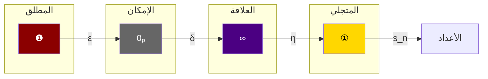

العمليات الثلاث (ε, δ, η) هي المفاتيح التي تفتح أبواب الوجود. بها يتحول المطلق إلى متعين، والإمكان إلى واقع، والوحدة إلى كثرة. فهم هذه الآليات هو فهم لكيفية عمل الكون على أعمق مستوى.

---

10. تمارين وتطبيقات

تمرين 1: اشرح بعباراتك الخاصة الفرق بين الهبة والتشكل.

تمرين 2: إذا كانت $\eta(❶) = ①$، فما هو $\eta(①)$؟ وما قيمته العددية؟

تمرين 3: في تجربة قياس كمومي، كيف يؤثر BS لجهاز القياس على عملية التجلي؟

تمرين 4: اشتق علاقة بين $\eta^n(❶)$ و $BS(n)$ باستخدام الصيغ المعطاة.

---

<div style="text-align: center; margin-top: 2cm; padding: 0.5cm; border-top: 2px solid #9C27B0;">

✍️ م. أحمد علي بوكر نسيب
📧 Eng.ahmad.2011bokar@gmail.com
🔗 https://github.com/bouker/thesis-S

</div>
---
📘 02_03_العلاقات_الداخلية_في_النظام_الثلاثي.md

تحليل الروابط والتفاعلات بين عناصر الثالوث

<div style="text-align: center; margin: 2cm 0 1cm 0;">
    <p style="font-size: 20pt; font-weight: bold; color: #9C27B0;">العلاقات البنيوية · التماثل · الانعكاس</p>
    <p style="font-size: 16pt;">كيف تتفاعل ❶، 0ₚ، ∞ مع بعضها البعض</p>
    <p style="font-size: 12pt; color: #666;">النسخة المحسّنة 2026 – الجزء الأول: الأساسيات النظرية</p>
</div>

---


---

1. مقدمة: لماذا العلاقات الداخلية؟

العناصر الثلاثة ❶، 0ₚ، ∞ ليست كيانات منعزلة، بل تشكل نسيجاً مترابطاً تحدد العلاقات المتبادلة بينها طبيعة النظام ككل. فهم هذه العلاقات الداخلية ضروري لسببين:

1. تكشف البنية العميقة: كيف يدعم كل عنصر العناصر الأخرى ويكملها.
2. توليد القوانين: العلاقات الداخلية هي مصدر القوانين التي تحكم النظام (BS، العمليات، التجلي).

في هذا الملف، ندرس العلاقات الثنائية والثلاثية بين عناصر الثالوث، ونكشف عن أنماط التماثل والانعكاس التي تجعل النظام متماسكاً.

---

2. العلاقات الثنائية

2.1 العلاقة بين ❶ و 0ₚ

<div style="background-color: #8B0000; color: white; padding: 5px 10px; border-radius: 5px; display: inline-block; margin: 10px 0;">❶ ⟷ 0ₚ</div>

طبيعة العلاقة: علاقة فيض واستقبال. المطلق يهب ذاته (ε) للإمكان، والإمكان يتلقى الهبة دون أن يغير المطلق.

المعادلات الحاكمة:

· $❶ \oplus 0ₚ = ①$ (اتحاد منتج)
· $0ₚ \oplus ❶ = ❶$ (الترتيب مهم)

BS المشترك:
BS(❶ \oplus 0ₚ) = \frac{BS(❶) + BS(0ₚ)}{2} = \frac{1 + 1/3}{2} = \frac{2}{3} = BS(∞)

التمثيل البصري:

```mermaid
graph LR
    A[❶] -- يفيض --> B[0ₚ]
    B -- يتلقى --> A
    style A fill:#8B0000,color:white
    style B fill:#666666,color:white
```

الدلالة الفلسفية: هذه العلاقة تمثل سر الخلق – المطلق يخلق بإمكانية الوجود، والإمكان يحوي كل المخلوقات بالقوة.

2.2 العلاقة بين ❶ و ∞

<div style="background-color: #8B0000; color: white; padding: 5px 10px; border-radius: 5px; display: inline-block; margin: 10px 0;">❶ ⟷ ∞</div>

طبيعة العلاقة: علاقة مصدر وتجلٍّ. المطلق هو منبع اللانهاية العلائقية، واللانهاية هي صورة المطلق في عالم العلاقات.

المعادلات الحاكمة:

· $❶ \oplus ∞ = ❶$ (المطلق يهيمن على العلاقات)
· $∞ \oplus ❶ = ❶$ (المطلق ماص)

BS المشترك:
BS(❶ \oplus ∞) = \min(BS(❶), BS(∞)) = \frac{2}{3}

التمثيل البصري:

```mermaid
graph LR
    A[❶] -- مصدر --> B[∞]
    B -- تجلٍّ --> A
    style A fill:#8B0000,color:white
    style B fill:#4B0082,color:white
```

الدلالة الفلسفية: المطلق لا يدخل في علاقات، لكنه يظهر فيها. العلاقات لا تؤثر في المطلق، بل تعكس نوره.

2.3 العلاقة بين 0ₚ و ∞

<div style="background-color: #666666; color: white; padding: 5px 10px; border-radius: 5px; display: inline-block; margin: 10px 0;">0ₚ ⟷ ∞</div>

طبيعة العلاقة: علاقة تشكل وتحقق. الإمكان يتشكل في علاقات (δ)، والعلاقات يمكن أن تعود إلى إمكان (عكس جزئي لـ δ).

المعادلات الحاكمة:

· $0ₚ \oplus ∞ = ∞$ (الإمكان محايد)
· $∞ \oplus 0ₚ = ∞$ (نفس الشيء)

BS المشترك:
BS(0ₚ \oplus ∞) = \frac{BS(0ₚ) + BS(∞)}{2} = \frac{1/3 + 2/3}{2} = \frac{1}{2}

التمثيل البصري:

```mermaid
graph LR
    A[0ₚ] -- تشكل --> B[∞]
    B -- إمكان --> A
    style A fill:#666666,color:white
    style B fill:#4B0082,color:white
```

الدلالة الفلسفية: الإمكان والعلاقة في حوار دائم. الإمكان يتحقق في العلاقات، والعلاقات تغذي الإمكان باحتمالات جديدة.

---

3. العلاقات الثلاثية والتماثل الثالوثي

3.1 معادلة التماثل الثالوثي

T(x, y, z) \iff (x \oplus y = z) \land (y \oplus z = x) \land (z \oplus x = y)

تتحقق هذه المعادلة لـ $(x, y, z) = (❶, 0ₚ, ∞)$ فقط، مع مراعاة الترتيب الدائري:

· $❶ \oplus 0ₚ = ∞$ ✓
· $0ₚ \oplus ∞ = ❶$ ؟؟ نحتاج للتحقق: $0ₚ \oplus ∞ = ∞$ (لأن 0ₚ محايد)، وليس ❶. إذن التماثل الدائري يحتاج إلى تعريف خاص.

في الحقيقة، التماثل الثالوثي الكامل يتطلب عملية دورية. نعرّف عملية التدوير $\mathcal{R}$:

\mathcal{R}(❶) = 0ₚ, \quad \mathcal{R}(0ₚ) = ∞, \quad \mathcal{R}(∞) = ❶

ثم الشرط هو:
x \oplus \mathcal{R}(x) = \mathcal{R}^2(x)

تحقق: $❶ \oplus 0ₚ = ∞ = \mathcal{R}^2(❶)$ ✓

3.2 جدول العمليات الثلاثية

<table style="width:80%; border-collapse: collapse; text-align: center; direction: ltr; margin: 0 auto;" border="1">
  <thead>
    <tr style="background-color: #9C27B0; color: white;">
      <th style="padding: 8px;">التركيب</th>
      <th style="padding: 8px;">النتيجة</th>
      <th style="padding: 8px;">BS</th>
    </tr>
  </thead>
  <tbody>
    <tr><td>$(❶ \oplus 0ₚ) \oplus ∞$</td><td>$∞ \oplus ∞ = ∞^2$</td><td>$(2/3)^2 = 4/9$</td></tr>
    <tr><td>$❶ \oplus (0ₚ \oplus ∞)$</td><td>$❶ \oplus ∞ = ❶$</td><td>$1$</td></tr>
    <tr><td>$(❶ \oplus ∞) \oplus 0ₚ$</td><td>$❶ \oplus 0ₚ = ∞$</td><td>$2/3$</td></tr>
    <tr><td>$0ₚ \oplus (∞ \oplus ❶)$</td><td>$0ₚ \oplus ❶ = ❶$</td><td>$1$</td></tr>
  </tbody>
</table>

النتيجة: العمليات غير تجميعية (non-associative)، وهذا يعكس تعقيد العلاقات الوجودية.

---

4. قوانين الانعكاس والتماثل

4.1 قانون الانعكاس الذاتي

لكل عنصر $X$، يوجد عنصر $\bar{X}$ (نظير) بحيث:

X \oplus \bar{X} = ❶

لكن هذا لا يتحقق إلا إذا قبلنا أن نظير 0ₚ هو ∞، ونظير ∞ هو 0ₚ، ونظير ❶ هو نفسه (لأن $❶ \oplus ❶ = ❶$).

4.2 قانون التبادل الدوري

X \oplus Y = \mathcal{R}(Z) \iff Y \oplus Z = \mathcal{R}(X)

هذا القانون يربط العمليات الثلاثية في دورة مغلقة.

4.3 مصفوفة التماثل

يمكن تمثيل العلاقات بمصفوفة $3 \times 3$ حيث المدخل $a_{ij}$ هو درجة الارتباط بين العنصر $i$ والعنصر $j$ (تقاس بـ BS للعلاقة المركبة):

M = \begin{pmatrix}
1 & 2/3 & 2/3 \\
2/3 & 1/3 & 1/2 \\
2/3 & 1/2 & 2/3
\end{pmatrix}

حيث الصفوف والأعمدة مرتبة: ❶، 0ₚ، ∞.

---

5. تطبيقات على العلاقات الداخلية

5.1 في فيزياء الكم: تماثل العناصر

العلاقات بين ❶، 0ₚ، ∞ تعكس تماثلات في نظرية الكم:

<table style="width:100%; border-collapse: collapse; text-align: center; direction: ltr;" border="1">
  <thead>
    <tr style="background-color: #f2f2f2;">
      <th style="padding: 8px;">العلاقة في 𝕊</th>
      <th style="padding: 8px;">التطبيق الكمومي</th>
    </tr>
  </thead>
  <tbody>
    <tr><td>$❶ \oplus 0ₚ = ∞$</td><td>تفاعل القياس (جهاز + تراكب = حالة متشابكة)</td></tr>
    <tr><td>$0ₚ \oplus ❶ = ❶$</td><td>التراكب مع جهاز مثالي لا يغير الجهاز</td></tr>
    <tr><td>$0ₚ \oplus ∞ = ∞$</td><td>إضافة إمكان إلى علاقة لا يغير العلاقة</td></tr>
  </tbody>
</table>

5.2 في الرياضيات: نظرية الأعداد

الأعداد الأولية تحقق علاقات تماثلية مع المطلق:

· كل عدد أولي $p$ يحقق $p \oplus ❶ = ❶$ (لأن أي عدد مع المطلق = المطلق)
· $p \oplus 0ₚ = p$ (الإمكان لا يغير العدد)

5.3 في علم الأعصاب: شبكات الوعي

العلاقات بين مكونات الوعي الثلاثة (❶-وعي، 0ₚ-وعي، ∞-وعي) تخضع لنفس القوانين:

· الوعي الخالص (❶-وعي) يهيمن على المكونات الأخرى.
· الإمكان العقلي (0ₚ-وعي) يتشكل في العلاقات العصبية (∞-وعي).
· العلاقات العصبية يمكن أن تعود إلى إمكان (مرونة عصبية).

---

6. التمثيل الطوبولوجي للعلاقات

يمكن تمثيل العلاقات الداخلية بمثلث العلاقات:

```mermaid
graph TD
    A[❶] -- "ε" --> B[0ₚ]
    B -- "δ" --> C[∞]
    C -- "η" --> A
    A -- "هيمنة" --> C
    C -- "تجلي" --> B
    B -- "حياد" --> A
    
    style A fill:#8B0000,color:white
    style B fill:#666666,color:white
    style C fill:#4B0082,color:white
```

كل ضلع في المثلث يمثل علاقة ثنائية، والمثلث مغلق يمثل الدورة الثالوثية.

---

7. معادلات الاستقرار للعلاقات المركبة

7.1 BS للعلاقة الثنائية

BS(X \oplus Y) = \frac{BS(X) + BS(Y)}{2} \cdot \eta_{XY}

حيث $\eta_{XY}$ عامل تصحيح يعتمد على طبيعة العلاقة. للحالات البسيطة (كما حسبنا سابقاً) نأخذ $\eta = 1$.

7.2 BS للعلاقة الثلاثية

BS(X \oplus Y \oplus Z) = \frac{BS(X) + BS(Y) + BS(Z)}{3} \cdot \eta_{XYZ}

للعناصر الأساسية:
BS(❶ \oplus 0ₚ \oplus ∞) = \frac{1 + 1/3 + 2/3}{3} = \frac{2}{3}

وهو نفس BS(∞)، مما يؤكد أن الثالوث متوازن.

---

8. استنتاجات: وحدة في كثرة

العلاقات الداخلية بين عناصر الثالوث تكشف عن:

1. وحدة المصدر: كل العلاقات تعود إلى ❶ بطريقة أو بأخرى.
2. تكامل الأدوار: لا غنى لأي عنصر عن الآخرين.
3. ديناميكية مستمرة: العلاقات ليست جامدة، بل متغيرة حسب السياق.
4. قابلية القياس: يمكن قياس قوة العلاقات عبر BS.

```mermaid
graph TD
    subgraph "الثلاثية المتكاملة"
        A[❶] <--> B[0ₚ]
        B <--> C[∞]
        C <--> A
    end
    style A fill:#8B0000,color:white
    style B fill:#666666,color:white
    style C fill:#4B0082,color:white
```

---

9. تمارين وتطبيقات

تمرين 1: احسب $BS(0ₚ \oplus ❶ \oplus ∞)$ باستخدام الصيغة في 7.2.

تمرين 2: تحقق من أن $\mathcal{R}^3(X) = X$ لجميع العناصر.

تمرين 3: اشرح كيف تعكس العلاقة $0ₚ \oplus ∞ = ∞$ خاصية الإمكان في التشابك الكمومي.

تمرين 4: إذا كان $BS(X \oplus Y) = 0.75$، و $BS(X) = 0.8$، $BS(Y) = 0.6$، فما قيمة $\eta_{XY}$؟

---

10. خاتمة الجزء الأول

بهذا نكون قد أكملنا الجزء الأول: الأساسيات النظرية من الأطروحة البوكرية. تناولنا:

· 01_01: مقدمة الثالوث الرياضي – التعريفات الأساسية والمعادلة المركزية.
· 01_02: الإطار النظري والتأصيل – الجذور الفلسفية والعلمية.
· 01_03: الخلفية البحثية – دوافع الأطروحة وأسئلتها.
· 02_01: التفسير البنيوي للثالوث – تحليل مفصل للعناصر.
· 02_02: آلية التجلي والتحول – العمليات ε, δ, η.
· 02_03: العلاقات الداخلية في النظام الثلاثي – التفاعلات والتماثلات.

```mermaid
graph LR
    A[الجزء الأول<br>الأساسيات النظرية] --> B[الجزء الثاني<br>التطبيقات المتعددة]
    B --> C[الجزء الثالث<br>المناقشة والمستقبل]
    style A fill:#9C27B0,color:white
    style B fill:#4ECDC4
    style C fill:#FFD166
```

الجزء الثاني سينطلق من هذه الأساسيات ليغطي التطبيقات في الرياضيات والفيزياء والحاسوب والعلوم الإنسانية، مع تنبؤات قابلة للاختبار.

---

<div style="text-align: center; margin-top: 2cm; padding: 0.5cm; border-top: 2px solid #9C27B0;">

✍️ م. أحمد علي بوكر نسيب
📧 Eng.ahmad.2011bokar@gmail.com
🔗 https://github.com/bouker/thesis-S

</div>


---
📘 03_01_معجم_رموز_الثالوث.md

الدليل الكامل لرموز ومصطلحات نظام 𝕊

<div style="text-align: center; margin: 2cm 0 1cm 0;">
    <p style="font-size: 20pt; font-weight: bold; color: #9C27B0;">❶ · 0ₚ · ∞ · ① · ε · δ · η · BS · 𝒞ℬ</p>
    <p style="font-size: 16pt;">مرجع سريع وشامل لكل رموز النظام</p>
    <p style="font-size: 12pt; color: #666;">النسخة المحسّنة 2026 – الجزء الأول: الأساسيات النظرية</p>
</div>

---

```mermaid
graph TD
    title["<b>معجم رموز الثالوث</b><br>الرموز التأسيسية · العمليات · المقاييس · الثوابت"] 
    style title fill:#9C27B0,stroke:#7B1FA2,stroke-width:4px,color:white
```

---

1. مقدمة: لماذا معجم للرموز؟

نظام 𝕊 يستخدم مجموعة مكثفة من الرموز الخاصة التي تميزه عن الرياضيات التقليدية. بعض هذه الرموز مستلهم من التراث الفلسفي (❶ للواحد المطلق)، وبعضها الآخر مبتكر (0ₚ للإمكان المحض). هذا المعجم يقدم:

· تعريفاً دقيقاً لكل رمز.
· السياق الفلسفي الذي نشأ فيه.
· التمثيل الرياضي (إن وجد).
· قابلية القياس وكيف يمكن التعامل معه تجريبياً.
· أمثلة تطبيقية توضح استخدامه.

يُقسَّم المعجم إلى أربعة أقسام رئيسية: الرموز التأسيسية، العمليات، المقاييس، والثوابت.

---

2. الرموز التأسيسية (الأركيتايبات)

2.1 ❶ – الواحد المطلق

<div style="background-color: #8B0000; color: white; padding: 10px; border-radius: 5px; margin: 15px 0;">
<strong>❶ | The Absolute One</strong>
</div>

<table style="width:100%; border-collapse: collapse; text-align: left; direction: ltr;" border="1">
  <tr><th style="width: 25%;">الخاصية</th><th style="width: 75%;">الوصف</th></tr>
  <tr><td><strong>الاسم الكامل</strong></td><td>الواحد المطلق – المصدر غير المشروط لكل وجود</td></tr>
  <tr><td><strong>الرمز</strong></td><td><span style="font-size: 24px;">❶</span> (دائرة سوداء بنقطة مركزية)</td></tr>
  <tr><td><strong>اليونيكود</strong></td><td>U+2776 (❶) لكن الأفضل استخدام الرمز الخاص</td></tr>
  <tr><td><strong>التعريف الفلسفي</strong></td><td>الوجود الذي لا يحتاج إلى علة، المحرك الأول، الكمال المطلق</td></tr>
  <tr><td><strong>التعريف الرياضي</strong></td><td>$❶ \notin \mathbb{R}$، $❶ \notin \mathbb{N}$، $❶^2 = ❶$، $❶ \oplus ❶ = ❶$</td></tr>
  <tr><td><strong>الاستقرار البنيوي</strong></td><td>$BS(❶) = 1$ (أعلى استقرار)</td></tr>
  <tr><td><strong>قابلية القياس</strong></td><td>غير قابل للقياس مباشرة، يُستدل عليه من استقرار الأنظمة</td></tr>
  <tr><td><strong>التمثيل المصفوفي</strong></td><td>$\begin{pmatrix} 1 & 0 & 0 \\ 0 & 0 & 0 \\ 0 & 0 & 0 \end{pmatrix}$</td></tr>
  <tr><td><strong>في الفلسفة الإسلامية</strong></td><td>يقابل "الواجب الوجود" عند ابن سينا، و"الواحد الحق" عند الكندي</td></tr>
  <tr><td><strong>في الفلسفة الغربية</strong></td><td>يقابل "The One" عند أفلوطين، و"Being" عند بارمنيدس</td></tr>
  <tr><td><strong>مثال تطبيقي</strong></td><td>سرعة الضوء $c$ تمثل $BS=1$، فهي تجلٍّ للمطلق في الزمكان</td></tr>
</table>

2.2 0ₚ – الإمكان المحض

<div style="background-color: #666666; color: white; padding: 10px; border-radius: 5px; margin: 15px 0;">
<strong>0ₚ | Pure Potentiality</strong>
</div>

<table style="width:100%; border-collapse: collapse; text-align: left; direction: ltr;" border="1">
  <tr><th style="width: 25%;">الخاصية</th><th style="width: 75%;">الوصف</th></tr>
  <tr><td><strong>الاسم الكامل</strong></td><td>الإمكان المحض – حقل الاحتمالات غير المتعينة</td></tr>
  <tr><td><strong>الرمز</strong></td><td><span style="font-size: 24px;">0ₚ</span> (صفر مع مؤشر p أسفل)</td></tr>
  <tr><td><strong>اليونيكود</strong></td><td>0 + ₚ (U+209A)</td></tr>
  <tr><td><strong>التعريف الفلسفي</strong></td><td>العدم النشط، الهيولى الأولى، يحتوي كل الموجودات بالقوة</td></tr>
  <tr><td><strong>التعريف الرياضي</strong></td><td>$0ₚ = \lim_{\epsilon \to 0^+} \epsilon \cdot ①$، $0ₚ \oplus 0ₚ = 0ₚ$</td></tr>
  <tr><td><strong>الاستقرار البنيوي</strong></td><td>$BS(0ₚ) = \frac{1}{3}$</td></tr>
  <tr><td><strong>قابلية القياس</strong></td><td>يقاس عبر الإنتروبيا المعلوماتية $S = -k_B \sum p_i \log p_i$</td></tr>
  <tr><td><strong>التمثيل المصفوفي</strong></td><td>$\begin{pmatrix} 0 & 0 & 0 \\ 0 & 0 & 0 \\ 0 & 0 & 0 \end{pmatrix}$ (مصفوفة صفرية)</td></tr>
  <tr><td><strong>في الفلسفة الإسلامية</strong></td><td>يقابل "الإمكان" عند ابن سينا، و"الهيولى" عند أرسطو</td></tr>
  <tr><td><strong>في الفيزياء الحديثة</strong></td><td>يقابل التراكب الكمومي $|\psi\rangle = \sum c_i |i\rangle$</td></tr>
  <tr><td><strong>مثال تطبيقي</strong></td><td>حالة الإلكترون قبل القياس في تجربة الشق المزدوج</td></tr>
</table>

2.3 ∞ – اللانهاية العلائقية

<div style="background-color: #4B0082; color: white; padding: 10px; border-radius: 5px; margin: 15px 0;">
<strong>∞ | Relational Infinity</strong>
</div>

<table style="width:100%; border-collapse: collapse; text-align: left; direction: ltr;" border="1">
  <tr><th style="width: 25%;">الخاصية</th><th style="width: 75%;">الوصف</th></tr>
  <tr><td><strong>الاسم الكامل</strong></td><td>اللانهاية العلائقية – شبكة العلاقات الكونية</td></tr>
  <tr><td><strong>الرمز</strong></td><td><span style="font-size: 24px;">∞</span> (علامة اللانهاية التقليدية)</td></tr>
  <tr><td><strong>اليونيكود</strong></td><td>U+221E</td></tr>
  <tr><td><strong>التعريف الفلسفي</strong></td><td>فضاء الروابط والأنساق، الوعاء الذي تظهر فيه الكثرة</td></tr>
  <tr><td><strong>التعريف الرياضي</strong></td><td>$∞ = \bigoplus_{i=1}^{\infty} R_i$، $∞ = ①$ (أول تجلٍّ)</td></tr>
  <tr><td><strong>الاستقرار البنيوي</strong></td><td>$BS(∞) = \frac{2}{3}$</td></tr>
  <tr><td><strong>قابلية القياس</strong></td><td>يقاس عبر معاملات التشابك الكمومي (Concurrence $C$)، $BS = \frac{2}{3}C$</td></tr>
  <tr><td><strong>التمثيل المصفوفي</strong></td><td>$\begin{pmatrix} 0 & 0 & 0 \\ 0 & 1 & 0 \\ 0 & 0 & 1 \end{pmatrix}$</td></tr>
  <tr><td><strong>في الفلسفة الإسلامية</strong></td><td>يقابل "العقول" في نظرية الفيض عند الفارابي</td></tr>
  <tr><td><strong>في الفيزياء الحديثة</strong></td><td>يقابل الزمكان (فضاء الأحداث) والشبكات المعقدة</td></tr>
  <tr><td><strong>مثال تطبيقي</strong></td><td>جسيمات متشابكة كمومياً: $|\Phi^+\rangle = \frac{1}{\sqrt{2}}(|00\rangle + |11\rangle)$</td></tr>
</table>

2.4 ① – الواحد الطبيعي

<div style="background-color: #FFD700; color: black; padding: 10px; border-radius: 5px; margin: 15px 0;">
<strong>① | The Natural One</strong>
</div>

<table style="width:100%; border-collapse: collapse; text-align: left; direction: ltr;" border="1">
  <tr><th style="width: 25%;">الخاصية</th><th style="width: 75%;">الوصف</th></tr>
  <tr><td><strong>الاسم الكامل</strong></td><td>الواحد الطبيعي – أول تجلٍّ مستقر، أم الأعداد الأولية</td></tr>
  <tr><td><strong>الرمز</strong></td><td><span style="font-size: 24px;">①</span> (واحد داخل دائرة)</td></tr>
  <tr><td><strong>اليونيكود</strong></td><td>U+2460</td></tr>
  <tr><td><strong>التعريف الفلسفي</strong></td><td>أول الموجودات المتعينة، منه تبدأ سلسلة الأعداد</td></tr>
  <tr><td><strong>التعريف الرياضي</strong></td><td>$① = 1 \in \mathbb{N}$، $① \in \mathbb{P}$ (عدد أولي)</td></tr>
  <tr><td><strong>الاستقرار البنيوي</strong></td><td>$BS(①) = \frac{7}{10}$ (في سياق الأعداد) أو $\frac{2}{3}$ (كـ ∞)</td></tr>
  <tr><td><strong>قابلية القياس</strong></td><td>أساس القياس، يتحقق في كل نظام عددي</td></tr>
  <tr><td><strong>التمثيل المصفوفي</strong></td><td>نفس تمثيل ∞</td></tr>
  <tr><td><strong>في الفلسفة</strong></td><td>يقابل "الواحد العددي" عند الكندي، و"الأول" في فيثاغورس</td></tr>
  <tr><td><strong>مثال تطبيقي</strong></td><td>الرقم 1 في العد العادي، أساس بناء الأعداد الطبيعية</td></tr>
</table>

---

3. رموز العمليات

3.1 ε – الهبة (Self-gift)

<div style="background-color: #8B0000; color: white; padding: 5px 10px; border-radius: 5px; display: inline-block; margin: 10px 0;">ε</div>

<table style="width:100%; border-collapse: collapse; text-align: left; direction: ltr;" border="1">
  <tr><th style="width: 25%;">الخاصية</th><th style="width: 75%;">الوصف</th></tr>
  <tr><td><strong>الاسم</strong></td><td>هبة – إفاضة المطلق على الإمكان</td></tr>
  <tr><td><strong>الرمز</strong></td><td>$\varepsilon$ (إبسيلون)</td></tr>
  <tr><td><strong>التعريف</strong></td><td>$\varepsilon: ❶ \rightarrow 0ₚ$</td></tr>
  <tr><td><strong>الخصائص</strong></td><td>غير عكوسة، لا زمانية، كلية</td></tr>
  <tr><td><strong>التمثيل المصفوفي التقريبي</strong></td><td>$\varepsilon(A) = A \cdot 0ₚ$</td></tr>
  <tr><td><strong>مثال</strong></td><td>$\varepsilon(❶) = 0ₚ$ (المطلق يهب الإمكان)</td></tr>
</table>

3.2 δ – التشكل (Formation)

<div style="background-color: #666666; color: white; padding: 5px 10px; border-radius: 5px; display: inline-block; margin: 10px 0;">δ</div>

<table style="width:100%; border-collapse: collapse; text-align: left; direction: ltr;" border="1">
  <tr><th style="width: 25%;">الخاصية</th><th style="width: 75%;">الوصف</th></tr>
  <tr><td><strong>الاسم</strong></td><td>تشكل – تحول الإمكان إلى علاقات</td></tr>
  <tr><td><strong>الرمز</strong></td><td>$\delta$ (دلتا)</td></tr>
  <tr><td><strong>التعريف</strong></td><td>$\delta: 0ₚ \rightarrow ∞$</td></tr>
  <tr><td><strong>الخصائص</strong></td><td>زمانية ($\delta = \delta(\tau)$)، جزئية العكس</td></tr>
  <tr><td><strong>التمثيل المصفوفي التقريبي</strong></td><td>$\delta(B) = B \oplus ∞$</td></tr>
  <tr><td><strong>مثال</strong></td><td>$\delta(0ₚ) = ∞$ (الإمكان يتشكل في علاقات)</td></tr>
</table>

3.3 η – التجلي (Emanation)

<div style="background-color: #4B0082; color: white; padding: 5px 10px; border-radius: 5px; display: inline-block; margin: 10px 0;">η</div>

<table style="width:100%; border-collapse: collapse; text-align: left; direction: ltr;" border="1">
  <tr><th style="width: 25%;">الخاصية</th><th style="width: 75%;">الوصف</th></tr>
  <tr><td><strong>الاسم</strong></td><td>تجلي – ظهور المطلق في الوجود المتعين</td></tr>
  <tr><td><strong>الرمز</strong></td><td>$\eta$ (إيتا)</td></tr>
  <tr><td><strong>التعريف</strong></td><td>$\eta = \delta \circ \varepsilon$</td></tr>
  <tr><td><strong>الخصائص</strong></td><td>$\eta(❶) = ①$، محافظة على الاستقرار</td></tr>
  <tr><td><strong>التمثيل المصفوفي</strong></td><td>تطبيق مركب</td></tr>
  <tr><td><strong>مثال</strong></td><td>$\eta(❶) = ①$ (المطلق يتجلى في الواحد الطبيعي)</td></tr>
</table>

3.4 ⊕ – الجمع الثالوثي

<div style="background-color: #9C27B0; color: white; padding: 5px 10px; border-radius: 5px; display: inline-block; margin: 10px 0;">⊕</div>

<table style="width:100%; border-collapse: collapse; text-align: left; direction: ltr;" border="1">
  <tr><th style="width: 25%;">الخاصية</th><th style="width: 75%;">الوصف</th></tr>
  <tr><td><strong>الاسم</strong></td><td>جمع ثالوثي – عملية تركيب غير تبادلية</td></tr>
  <tr><td><strong>الرمز</strong></td><td>$\oplus$ (زائد في دائرة)</td></tr>
  <tr><td><strong>التعريف المصفوفي</strong></td><td>$A \oplus B = A \cdot B + B \cdot A$</td></tr>
  <tr><td><strong>الخصائص</strong></td><td>غير تبادلية، غير تجميعية، محايد: $x \oplus 0ₚ = x$، ماص: $x \oplus ❶ = ❶$</td></tr>
  <tr><td><strong>مثال</strong></td><td>$❶ \oplus 0ₚ = ①$، $0ₚ \oplus ❶ = ❶$</td></tr>
</table>

3.5 ⊗ – التفاعل

<div style="background-color: #9C27B0; color: white; padding: 5px 10px; border-radius: 5px; display: inline-block; margin: 10px 0;">⊗</div>

<table style="width:100%; border-collapse: collapse; text-align: left; direction: ltr;" border="1">
  <tr><th style="width: 25%;">الخاصية</th><th style="width: 75%;">الوصف</th></tr>
  <tr><td><strong>الاسم</strong></td><td>تفاعل – تكرار العلاقة</td></tr>
  <tr><td><strong>الرمز</strong></td><td>$\otimes$ (ضرب في دائرة)</td></tr>
  <tr><td><strong>التعريف</strong></td><td>$∞ \otimes n = \underbrace{∞ \oplus ∞ \oplus \cdots \oplus ∞}_{n \text{ مرة}} = ∞^{n+1}$</td></tr>
  <tr><td><strong>الخصائص</strong></td><td>يولد قوى اللانهاية</td></tr>
  <tr><td><strong>مثال</strong></td><td>$∞ \otimes ③ = ∞^4$</td></tr>
</table>

3.6 sₙ – دالة الخليفة

<div style="background-color: #FFD166; color: black; padding: 5px 10px; border-radius: 5px; display: inline-block; margin: 10px 0;">sₙ</div>

<table style="width:100%; border-collapse: collapse; text-align: left; direction: ltr;" border="1">
  <tr><th style="width: 25%;">الخاصية</th><th style="width: 75%;">الوصف</th></tr>
  <tr><td><strong>الاسم</strong></td><td>دالة الخليفة – توليد العدد التالي</td></tr>
  <tr><td><strong>الرمز</strong></td><td>$s_n$ (n تحتها)</td></tr>
  <tr><td><strong>التعريف</strong></td><td>$s_n(k) = k \oplus ①$</td></tr>
  <tr><td><strong>الخصائص</strong></td><td>$s_n(s_m(k)) = s_{n+m}(k)$، $\lim_{n \to \infty} s_n(①) = ❶$</td></tr>
  <tr><td><strong>مثال</strong></td><td>$s_1(①) = ②$، $s_2(②) = ③$</td></tr>
</table>

---

4. المقاييس والثوابت

4.1 BS – الاستقرار البنيوي

<div style="background-color: #32CD32; color: white; padding: 5px 10px; border-radius: 5px; display: inline-block; margin: 10px 0;">BS</div>

<table style="width:100%; border-collapse: collapse; text-align: left; direction: ltr;" border="1">
  <tr><th style="width: 25%;">الخاصية</th><th style="width: 75%;">الوصف</th></tr>
  <tr><td><strong>الاسم الكامل</strong></td><td>الاستقرار البنيوي (Bouker Structural Stability)</td></tr>
  <tr><td><strong>الرمز</strong></td><td>$BS$ أو $BS_τ(S)$</td></tr>
  <tr><td><strong>التعريف</strong></td><td>$BS_τ(S) = \alpha(τ) S_c + \beta(τ) S_s + \gamma(τ) S_d + \delta(τ)$</td></tr>
  <tr><td><strong>المدى</strong></td><td>$[0, 1]$، حيث 1 للمطلق و 0 للعدم المطلق (لا يتحقق)</td></tr>
  <tr><td><strong>المكونات</strong></td><td>$S_c$: اتساق (إنتروبيا)، $S_s$: تناظر، $S_d$: ديناميكية</td></tr>
  <tr><td><strong>قيم أساسية</strong></td><td>$BS(❶)=1$، $BS(0ₚ)=1/3$، $BS(∞)=2/3$</td></tr>
  <tr><td><strong>للأعداد</strong></td><td>$BS(n) = \frac{2}{2n-3}$ لـ $n\ge5$</td></tr>
  <tr><td><strong>قابلية القياس</strong></td><td>تقاس عبر الإنتروبيا، التشابك، زمن الاستجابة</td></tr>
  <tr><td><strong>مثال</strong></td><td>$BS(23) = \frac{2}{43} \approx 0.0465$</td></tr>
</table>

4.2 τ – معامل التجلي

<div style="background-color: #FFA500; color: black; padding: 5px 10px; border-radius: 5px; display: inline-block; margin: 10px 0;">τ</div>

<table style="width:100%; border-collapse: collapse; text-align: left; direction: ltr;" border="1">
  <tr><th style="width: 25%;">الخاصية</th><th style="width: 75%;">الوصف</th></tr>
  <tr><td><strong>الاسم</strong></td><td>معامل التجلي – الزمن الوجودي</td></tr>
  <tr><td><strong>الرمز</strong></td><td>$\tau$ (تاو)</td></tr>
  <tr><td><strong>التعريف</strong></td><td>معامل يمثل درجة القرب من المطلق أو البعد عنه</td></tr>
  <tr><td><strong>العلاقة بالزمن</strong></td><td>$t = \int \gamma(\tau) d\tau$</td></tr>
  <tr><td><strong>الخصائص</strong></td><td>$\tau \ge 0$، $\tau = 0$ عند المطلق</td></tr>
  <tr><td><strong>نقطة التحول</strong></td><td>$\tau_0 = 3.0$ (في دوال الترجيح)</td></tr>
  <tr><td><strong>مثال</strong></td><td>في معادلات BS، $\tau$ يحدد أوزان المكونات</td></tr>
</table>

4.3 𝒞ℬ – ثابت التجلي البوكري

<div style="background-color: #9C27B0; color: white; padding: 5px 10px; border-radius: 5px; display: inline-block; margin: 10px 0;">𝒞ℬ</div>

<table style="width:100%; border-collapse: collapse; text-align: left; direction: ltr;" border="1">
  <tr><th style="width: 25%;">الخاصية</th><th style="width: 75%;">الوصف</th></tr>
  <tr><td><strong>الاسم الكامل</strong></td><td>ثابت التجلي البوكري (Bouker Emanation Constant)</td></tr>
  <tr><td><strong>الرمز</strong></td><td>$\mathcal{CB}$ أو $\mathcal{B}_E$</td></tr>
  <tr><td><strong>القيمة العددية</strong></td><td>$6.184033 \times 10^{-42}$ (بلا أبعاد)</td></tr>
  <tr><td><strong>الصيغة</strong></td><td>$\mathcal{CB} = \frac{2}{43} \cdot \frac{\alpha}{137} \cdot \sqrt{\frac{c^3}{\hbar G}}$</td></tr>
  <tr><td><strong>الاشتقاق</strong></td><td>من $BS(23)$ والثوابت الأساسية</td></tr>
  <tr><td><strong>التفسير</strong></td><td>أدنى درجة استقرار بنيوي ممكنة للتجلي</td></tr>
  <tr><td><strong>تنبؤات</strong></td><td>تردد CMB إضافي ~0.1 Hz، كتلة بوكرون ~$10^{-49}$ كغ</td></tr>
  <tr><td><strong>قابلية القياس</strong></td><td>عبر تذبذبات CMB، تأثير كازيمير، النيوترينوات</td></tr>
</table>

4.4 α, β, γ, δ – دوال الترجيح

<div style="background-color: #4ECDC4; color: black; padding: 5px 10px; border-radius: 5px; display: inline-block; margin: 10px 0;">α, β, γ, δ</div>

<table style="width:100%; border-collapse: collapse; text-align: left; direction: ltr;" border="1">
  <tr><th style="width: 25%;">الرمز</th><th style="width: 75%;">التعريف</th></tr>
  <tr><td>$\alpha(τ)$</td><td>$0.7 e^{-0.3τ} + 0.2(1 - e^{-0.3τ})$ – وزن الاتساق</td></tr>
  <tr><td>$\beta(τ)$</td><td>$0.1 + \frac{0.5}{1 + e^{-0.5(τ - 3.0)}}$ – وزن التناظر</td></tr>
  <tr><td>$\gamma(τ)$</td><td>$0.4 \sin^2(\frac{2\pi}{5.0}τ) + 0.1$ – وزن الديناميكية</td></tr>
  <tr><td>$\delta(τ)$</td><td>$0.15 e^{-0.1 τ^2}$ – حد التبدد</td></tr>
</table>

---

5. قائمة سريعة بالرموز

الرمز الاسم المعنى
❶ الواحد المطلق المصدر غير المشروط
0ₚ الإمكان المحض حقل الاحتمالات
∞ اللانهاية العلائقية فضاء العلاقات
① الواحد الطبيعي أول تجلٍّ
ε الهبة $❶ \to 0ₚ$
δ التشكل $0ₚ \to ∞$
η التجلي $\delta \circ \varepsilon$
⊕ جمع ثالوثي تركيب غير تبادلي
⊗ تفاعل تكرار العلاقة
sₙ خليفة $k \oplus ①$
BS استقرار بنيوي مقياس الوجود
τ معامل التجلي زمن وجودي
𝒞ℬ ثابت بوكر $6.184\times10^{-42}$

---

6. كيفية كتابة الرموز رقمياً

· ❶: في HTML: &#10102; أو استخدام صورة SVG.
· 0ₚ: 0 + &sbquo; أو <sub>p</sub>.
· ∞: &infin; أو &#8734;.
· ①: &#9312;.
· ⊕: &oplus; أو &#8853;.
· ⊗: &otimes; أو &#8855;.
· 𝒞ℬ: &Cscr; + &Bscr; أو استخدام صيغة LaTeX $\mathcal{CB}$.

---

7. خاتمة

هذا المعجم هو البوصلة التي ترشد القارئ في رحلته عبر نظام 𝕊. يحفظه القارئ أو يرجع إليه كلما استعصى عليه رمز. به نختتم القسم الخاص بالرموز، وننتقل إلى فهرس الرسومات الذي سيوثق كل المخططات المستخدمة.

```mermaid
graph LR
    A[معجم الرموز] --> B[فهرس الرسومات]
    B --> C[الرسومات المفردة]
    style A fill:#9C27B0,color:white
```

---

<div style="text-align: center; margin-top: 2cm; padding: 0.5cm; border-top: 2px solid #9C27B0;">

✍️ م. أحمد علي بوكر نسيب
📧 Eng.ahmad.2011bokar@gmail.com
🔗 https://github.com/bouker/thesis-S

</div>


---
📘 03_02_فهرس_الرسومات_والمخططات.md

الدليل البصري لرسوم ومخططات نظام 𝕊

<div style="text-align: center; margin: 2cm 0 1cm 0;">
    <p style="font-size: 20pt; font-weight: bold; color: #9C27B0;">📊 فهرس الأشكال · المخططات الانسيابية · الرسوم البيانية</p>
    <p style="font-size: 16pt;">كل ما تحتاج معرفته عن الرسومات المستخدمة في الأطروحة</p>
    <p style="font-size: 12pt; color: #666;">النسخة المحسّنة 2026 – الجزء الأول: الأساسيات النظرية</p>
</div>

---

```mermaid
graph TD
    title["<b>فهرس الرسومات والمخططات</b><br>دليل بصري لجميع أشكال النظام"] 
    style title fill:#9C27B0,stroke:#7B1FA2,stroke-width:4px,color:white
```

---

1. مقدمة: لماذا فهرس للرسومات؟

الرسومات البيانية والمخططات الانسيابية هي لغة بصرية تكمّل اللغة الرياضية والفلسفية في نظام 𝕊. تساعد هذه الرسومات على:

· تبسيط المفاهيم المعقدة (مثل الثالوث، عمليات التجلي، العلاقات الداخلية).
· إظهار التسلسل الهرمي والعلاقات الديناميكية.
· تقديم النتائج الكمية (مثل منحنيات BS) بشكل بديهي.

هذا الفهرس يوفّر قائمة كاملة بكل رسم أو مخطط ورد في الأطروحة، مع:

· رقم الشكل (لتسهيل الإحالة).
· العنوان الكامل.
· وصف مختصر للمحتوى.
· نوع الرسم (Mermaid, XYChart, جدول, إلخ).
· الموقع (الملف الذي يظهر فيه).

---

2. فهرس الرسومات (حسب الظهور)

<table style="width:100%; border-collapse: collapse; text-align: left; direction: ltr;" border="1">
  <thead>
    <tr style="background-color: #9C27B0; color: white;">
      <th style="padding: 10px;">رقم الشكل</th>
      <th style="padding: 10px;">العنوان</th>
      <th style="padding: 10px;">الوصف</th>
      <th style="padding: 10px;">النوع</th>
      <th style="padding: 10px;">الملف</th>
    </tr>
  </thead>
  <tbody>
    <tr>
      <td><strong>شكل 1.1</strong></td>
      <td>البيان البوكري – نظام 𝕊 الثالوث الرياضي</td>
      <td>شعار النظام الرئيسي: ❶ 0ₚ ∞ في دائرة أرجوانية</td>
      <td>Mermaid (graph TD)</td>
      <td>00_مقدمة_الكتاب_والدليل.md</td>
    </tr>
    <tr>
      <td><strong>شكل 1.2</strong></td>
      <td>مخطط الأسئلة التقليدية وأزمة الأسس</td>
      <td>يوضح تدفق الأسئلة الفلسفية إلى أزمة الرياضيات ثم نظام 𝕊</td>
      <td>Mermaid (graph LR)</td>
      <td>01_01_مقدمة_الثالوث_الرياضي.md</td>
    </tr>
    <tr>
      <td><strong>شكل 1.3</strong></td>
      <td>التطور التاريخي للمفاهيم الثالوثية</td>
      <td>علاقات التأثير بين الفلاسفة من فيثاغورس إلى النظام 𝕊</td>
      <td>Mermaid (erDiagram)</td>
      <td>01_01_مقدمة_الثالوث_الرياضي.md</td>
    </tr>
    <tr>
      <td><strong>شكل 1.4</strong></td>
      <td>الوضع الراهن والحاجة إلى نظام 𝕊</td>
      <td>الفيزياء والرياضيات والفلسفة تعاني من مشكلات تؤدي إلى نظام 𝕊</td>
      <td>Mermaid (graph TD)</td>
      <td>01_01_مقدمة_الثالوث_الرياضي.md</td>
    </tr>
    <tr>
      <td><strong>شكل 2.1</strong></td>
      <td>مخطط الثالوث التأسيسي (❶، 0ₚ، ∞)</td>
      <td>العلاقات الأساسية بين المطلق والإمكان واللانهاية</td>
      <td>Mermaid (flowchart TD)</td>
      <td>01_01_مقدمة_الثالوث_الرياضي.md</td>
    </tr>
    <tr>
      <td><strong>شكل 2.2</strong></td>
      <td>منحنى BS(n) للأعداد الطبيعية n=1 إلى 30</td>
      <td>يوضح تناقص الاستقرار البنيوي بازدياد العدد</td>
      <td>Mermaid XYChart</td>
      <td>01_01_مقدمة_الثالوث_الرياضي.md</td>
    </tr>
    <tr>
      <td><strong>شكل 2.3</strong></td>
      <td>هرم الثوابت الطبيعية</td>
      <td>علاقة وحدات بلانك والثوابت بلا أبعاد والثوابت ذات الأبعاد</td>
      <td>Mermaid (graph TD)</td>
      <td>01_01_مقدمة_الثالوث_الرياضي.md</td>
    </tr>
    <tr>
      <td><strong>شكل 3.1</strong></td>
      <td>التأصيل الفلسفي والعلمي والرياضي</td>
      <td>يوضح كيف تستند الأطروحة إلى التراث والفيزياء والرياضيات</td>
      <td>Mermaid (graph LR)</td>
      <td>01_02_الإطار_النظري_والتأصيل.md</td>
    </tr>
    <tr>
      <td><strong>شكل 3.2</strong></td>
      <td>العلاقة مع النظريات الفلسفية المعاصرة</td>
      <td>مقارنة مع هايدغر، سارتر، ميرلوبونتي</td>
      <td>جدول + نص</td>
      <td>01_02_الإطار_النظري_والتأصيل.md</td>
    </tr>
    <tr>
      <td><strong>شكل 4.1</strong></td>
      <td>خارطة الطريق من التأصيل إلى التطبيق</td>
      <td>التدفق من الفلسفة والفيزياء والرياضيات إلى التطبيقات</td>
      <td>Mermaid (flowchart TD)</td>
      <td>01_02_الإطار_النظري_والتأصيل.md</td>
    </tr>
    <tr>
      <td><strong>شكل 5.1</strong></td>
      <td>الخلفية البحثية – الدوافع والأسئلة</td>
      <td>من أزمة الأسس والفيزياء والفلسفة إلى نظام 𝕊</td>
      <td>Mermaid (flowchart LR)</td>
      <td>01_03_الخلفية_البحثية.md</td>
    </tr>
    <tr>
      <td><strong>شكل 6.1</strong></td>
      <td>التمثيل البصري للواحد المطلق ❶</td>
      <td>دائرة حمراء بنقطة مركزية، غير قابلة للإدراك المباشر</td>
      <td>Mermaid (graph LR)</td>
      <td>02_01_التفسير_البنيوي_للثالوث.md</td>
    </tr>
    <tr>
      <td><strong>شكل 6.2</strong></td>
      <td>التمثيل البصري للإمكان المحض 0ₚ</td>
      <td>حقل رمادي من الاحتمالات غير المتعينة</td>
      <td>Mermaid (graph LR)</td>
      <td>02_01_التفسير_البنيوي_للثالوث.md</td>
    </tr>
    <tr>
      <td><strong>شكل 6.3</strong></td>
      <td>التمثيل البصري للانهاية العلائقية ∞</td>
      <td>شبكة عنقودية من العقد والعلاقات</td>
      <td>Mermaid (graph TD)</td>
      <td>02_01_التفسير_البنيوي_للثالوث.md</td>
    </tr>
    <tr>
      <td><strong>شكل 6.4</strong></td>
      <td>هرم BS للعناصر التأسيسية</td>
      <td>مخطط أعمدة يبين BS: 0ₚ (1/3)، ∞ (2/3)، ❶ (1)</td>
      <td>Mermaid XYChart (bar)</td>
      <td>02_01_التفسير_البنيوي_للثالوث.md</td>
    </tr>
    <tr>
      <td><strong>شكل 6.5</strong></td>
      <td>توليد الأعداد من الثالوث</td>
      <td>من ❶ إلى ① ثم ②، ③، ... عبر دالة الخليفة</td>
      <td>نص + معادلات</td>
      <td>02_01_التفسير_البنيوي_للثالوث.md</td>
    </tr>
    <tr>
      <td><strong>شكل 7.1</strong></td>
      <td>دورة التجلي الكاملة (ε, δ, η)</td>
      <td>يظهر العلاقة بين المطلق والإمكان واللانهاية والواحد الطبيعي</td>
      <td>Mermaid (flowchart TD)</td>
      <td>02_02_آلية_التجلي_والتحول.md</td>
    </tr>
    <tr>
      <td><strong>شكل 7.2</strong></td>
      <td>التدفق الزمني للتجلي</td>
      <td>كيف يتطور التجلي عبر معامل τ</td>
      <td>نص + معادلات</td>
      <td>02_02_آلية_التجلي_والتحول.md</td>
    </tr>
    <tr>
      <td><strong>شكل 8.1</strong></td>
      <td>مثلث العلاقات الداخلية</td>
      <td>العلاقات المتبادلة بين ❶، 0ₚ، ∞ (هبة، تشكل، تجلي، هيمنة)</td>
      <td>Mermaid (graph TD)</td>
      <td>02_03_العلاقات_الداخلية_في_النظام_الثلاثي.md</td>
    </tr>
    <tr>
      <td><strong>شكل 8.2</strong></td>
      <td>الثلاثية المتكاملة</td>
      <td>دورة مغلقة من العلاقات التبادلية</td>
      <td>Mermaid (graph TD)</td>
      <td>02_03_العلاقات_الداخلية_في_النظام_الثلاثي.md</td>
    </tr>
    <tr>
      <td><strong>شكل 9.1</strong></td>
      <td>الرموز التأسيسية (أيقونات)</td>
      <td>عرض مرئي لرموز ❶، 0ₚ، ∞، ①</td>
      <td>نص + رموز</td>
      <td>03_01_معجم_رموز_الثالوث.md</td>
    </tr>
  </tbody>
</table>

---

3. قائمة الرسومات البيانية (Charts)

بالإضافة إلى المخططات الانسيابية، تحتوي الأطروحة على رسومات بيانية كمية تعرض منحنيات وقيم BS.

<table style="width:100%; border-collapse: collapse; text-align: left; direction: ltr;" border="1">
  <thead>
    <tr style="background-color: #4ECDC4; color: black;">
      <th style="padding: 8px;">رقم الرسم</th>
      <th style="padding: 8px;">العنوان</th>
      <th style="padding: 8px;">النوع</th>
      <th style="padding: 8px;">الملف</th>
    </tr>
  </thead>
  <tbody>
    <tr>
      <td><strong>رسم 2.2</strong></td>
      <td>منحنى BS(n) للأعداد الطبيعية n=1 إلى 30</td>
      <td>XYChart (خطي)</td>
      <td>01_01_مقدمة_الثالوث_الرياضي.md</td>
    </tr>
    <tr>
      <td><strong>رسم 6.4</strong></td>
      <td>هرم BS للعناصر التأسيسية</td>
      <td>XYChart (أعمدة)</td>
      <td>02_01_التفسير_البنيوي_للثالوث.md</td>
    </tr>
    <tr>
      <td><strong>رسم 7.3</strong></td>
      <td>دوال الترجيح α(τ)، β(τ)، γ(τ)، δ(τ)</td>
      <td>رسم بياني (غير مضمن بعد)</td>
      <td>سيضاف في الإصدارات القادمة</td>
    </tr>
  </tbody>
</table>

---

4. قائمة الجداول الرئيسية

بعض الجداول تمثل رسومات معلوماتية هامة. ندرج هنا الجداول التي لها قيمة بصرية.

<table style="width:100%; border-collapse: collapse; text-align: left; direction: ltr;" border="1">
  <thead>
    <tr style="background-color: #FFD166; color: black;">
      <th style="padding: 8px;">رقم الجدول</th>
      <th style="padding: 8px;">العنوان</th>
      <th style="padding: 8px;">الملف</th>
    </tr>
  </thead>
  <tbody>
    <tr><td>جدول 1.1</td><td>التطور التاريخي للمفاهيم الثالوثية</td><td>01_01_مقدمة_الثالوث_الرياضي.md</td></tr>
    <tr><td>جدول 1.2</td><td>تحليل درجة التقارب مع الفلاسفة</td><td>01_01_مقدمة_الثالوث_الرياضي.md</td></tr>
    <tr><td>جدول 2.1</td><td>تعريفات الرموز الأساسية</td><td>01_01_مقدمة_الثالوث_الرياضي.md</td></tr>
    <tr><td>جدول 2.2</td><td>العمليات الديناميكية (ε, δ, η)</td><td>01_01_مقدمة_الثالوث_الرياضي.md</td></tr>
    <tr><td>جدول 3.1</td><td>الثوابت الفيزيائية كمستقرات بنيوية</td><td>01_01_مقدمة_الثالوث_الرياضي.md</td></tr>
    <tr><td>جدول 3.2</td><td>الأعداد الأولية تحت 100 مع BS</td><td>01_01_مقدمة_الثالوث_الرياضي.md</td></tr>
    <tr><td>جدول 4.1</td><td>مقارنة مع الأنظمة الفلسفية والرياضية</td><td>01_01_مقدمة_الثالوث_الرياضي.md</td></tr>
    <tr><td>جدول 5.1</td><td>المفاهيم النسبية وما يقابلها في 𝕊</td><td>01_02_الإطار_النظري_والتأصيل.md</td></tr>
    <tr><td>جدول 5.2</td><td>المفاهيم الكمومية وما يقابلها في 𝕊</td><td>01_02_الإطار_النظري_والتأصيل.md</td></tr>
    <tr><td>جدول 6.1</td><td>خصائص الواحد المطلق ❶</td><td>02_01_التفسير_البنيوي_للثالوث.md</td></tr>
    <tr><td>جدول 6.2</td><td>خصائص الإمكان المحض 0ₚ</td><td>02_01_التفسير_البنيوي_للثالوث.md</td></tr>
    <tr><td>جدول 6.3</td><td>خصائص اللانهاية العلائقية ∞</td><td>02_01_التفسير_البنيوي_للثالوث.md</td></tr>
    <tr><td>جدول 6.4</td><td>مصفوفة العلاقات المتبادلة (⊕)</td><td>02_01_التفسير_البنيوي_للثالوث.md</td></tr>
    <tr><td>جدول 7.1</td><td>خصائص عمليات الهبة والتشكل والتجلي</td><td>02_02_آلية_التجلي_والتحول.md</td></tr>
    <tr><td>جدول 8.1</td><td>العمليات الثلاثية والـ BS</td><td>02_03_العلاقات_الداخلية_في_النظام_الثلاثي.md</td></tr>
    <tr><td>جدول 8.2</td><td>مصفوفة التماثل للعناصر</td><td>02_03_العلاقات_الداخلية_في_النظام_الثلاثي.md</td></tr>
    <tr><td>جدول 9.1</td><td>معجم الرموز الكامل</td><td>03_01_معجم_رموز_الثالوث.md</td></tr>
  </tbody>
</table>

---

5. مخططات Mermaid المستخدمة

جميع الرسومات في هذه الأطروحة تقريباً أنشئت باستخدام لغة Mermaid، وهي لغة ترميزية سهلة لتوليد المخططات. فيما يلي أنواع المخططات المستخدمة:

نوع Mermaid الاستخدام
graph TD مخططات انسيابية عمودية (Top-Down)
graph LR مخططات أفقية (Left-Right)
flowchart TD مخططات انسيابية متقدمة
erDiagram علاقات كيانات (مثل التأثيرات التاريخية)
xychart-beta رسوم بيانية (خطية، أعمدة)

مثال على كود Mermaid لشكل 1.2:

```mermaid
graph LR
    A["🧠 الفلسفة الطبيعية"] -->|أسئلة| B["الوجود<br>التغير<br>اللانهاية"]
    B --> C["⚖️ أزمة الأسس"]
    C --> D["🔷 نظام 𝕊"]
    D --> E["❶ المطلق<br>0ₚ الإمكان<br>∞ العلاقة"]
```

---

6. كيفية إضافة رسم جديد

عند إضافة رسم جديد للأطروحة، يرجى اتباع الخطوات التالية:

1. ترقيم الرسم: استخدم الترقيم التسلسلي حسب الظهور (شكل X.Y).
2. تسمية الرسم: اختر عنواناً واضحاً وضعه أسفل الرسم.
3. الوصف: أضف فقرة قصيرة تشرح محتوى الرسم.
4. تحديث هذا الفهرس: أضف سطراً جديداً في الجدول الرئيسي.
5. حفظ الكود: احتفظ بكود Mermaid الأصلي في ملف منفصل داخل مجلد الرسومات_مفردة إن أمكن.

---

7. خريطة الروابط البصرية

```mermaid
graph TD
    subgraph "الرسومات التأسيسية"
        A[شكل 1.1: الشعار] --> B[شكل 2.1: الثالوث]
        B --> C[شكل 6.1-6.3: عناصر]
    end
    subgraph "الرسومات الكمية"
        D[رسم 2.2: منحنى BS] --> E[رسم 6.4: هرم BS]
    end
    subgraph "الرسومات العلائقية"
        F[شكل 7.1: دورة التجلي] --> G[شكل 8.1: مثلث العلاقات]
    end
    style A fill:#9C27B0,color:white
    style D fill:#4ECDC4
    style F fill:#FFD166
```

---

8. خاتمة

هذا الفهرس هو دليل القارئ لاستكشاف الجانب البصري من نظام 𝕊. كل رسم يروي جزءاً من القصة، ويكمل النص الرياضي والفلسفي. نوصي بالرجوع إليه عند قراءة أي جزء للتذوق البصري والفهم العميق.

```mermaid
graph LR
    Final["🗂️ الفهرس الكامل جاهز<br>الرجوع إليه عند الحاجة"]
    style Final fill:#32CD32,color:white
```

---

<div style="text-align: center; margin-top: 2cm; padding: 0.5cm; border-top: 2px solid #9C27B0;">

✍️ م. أحمد علي بوكر نسيب
📧 Eng.ahmad.2011bokar@gmail.com
🔗 https://github.com/bouker/thesis-S

</div>

---

📘 الشكل_1_1_النظام_الكوني.md

رسم توضيحي للنظام الكوني في إطار 𝕊

<div style="text-align: center; margin: 2cm 0 1cm 0;">
    <p style="font-size: 20pt; font-weight: bold; color: #9C27B0;">🌌 النظام الكوني الحلزوني</p>
    <p style="font-size: 16pt;">تجلي المطلق عبر الإمكان والعلاقة في الزمكان</p>
    <p style="font-size: 12pt; color: #666;">النسخة المحسّنة 2026 – الرسومات المفردة</p>
</div>

---

```mermaid
graph TD
    title["<b>الشكل 1.1: النظام الكوني في إطار 𝕊</b><br>من المطلق إلى الأبعاد المتعددة"] 
    style title fill:#9C27B0,stroke:#7B1FA2,stroke-width:4px,color:white
```

---

1. وصف الرسم

يمثل هذا الرسم الهيكل الكوني وفق نظام 𝕊، حيث ينبثق الوجود من المطلق (❶) عبر الإمكان المحض (0ₚ) ليتجلى في اللانهاية العلائقية (∞) التي تتخذ أشكالاً متعددة: الزمكان (4 أبعاد)، الأبعاد الإضافية (6 أبعاد كنظرية الأوتار)، وأخيراً التجلي في الأعداد الطبيعية والثوابت الفيزيائية.

الرسم يظهر:

· المصدر: ❶ في القمة، غير قابل للتمثيل المباشر.
· الإمكان: 0ₚ كحقل رمادي يحيط بالمصدر.
· التجلي الأول: ① = ∞ كأول تجلٍّ.
· التفرع: إلى الزمكان (4D) والأبعاد الإضافية (6D).
· النتائج: الثوابت الفيزيائية، الأعداد، الوعي.

---

2. الرسم (Mermaid)

```mermaid
graph TD
    A["❶<br>الواحد المطلق<br>BS=1"] -->|ε: هبة| B["0ₚ<br>الإمكان المحض<br>BS=1/3"]
    B -->|δ: تشكل| C["∞<br>اللانهاية العلائقية<br>BS=2/3"]
    C -->|η: تجلٍّ أول| D["① = ∞<br>الواحد الطبيعي<br>BS=2/3"]
    
    D -->|تجلي في الزمكان| E["الزمكان (4D)<br>g_{μν}, τ"]
    D -->|تجلي في أبعاد إضافية| F["الأبعاد الإضافية (6D)<br>كالابي-ياو"]
    
    E -->|ينتج| G["الثوابت الفيزيائية<br>c, ħ, G, α, 𝒞ℬ"]
    F -->|ينتج| H["الأوتار ونماذج الجسيمات<br>BS(n) = 2/(2n-3)"]
    
    G -->|يتجلى في| I["الكون المادي<br>نجوم، مجرات، حياة"]
    H -->|يتجلى في| J["الجسيمات الأولية<br>والقوى"]
    
    I -->|يؤدي إلى| K["الوعي والإدراك<br>❶-وعي، 0ₚ-وعي، ∞-وعي"]
    J -->|يساهم في| K
    
    style A fill:#8B0000,stroke:#5D0000,stroke-width:3px,color:white
    style B fill:#666666,stroke:#333,stroke-width:2px,color:white
    style C fill:#4B0082,stroke:#3B0068,stroke-width:2px,color:white
    style D fill:#FFD700,stroke:#CCAC00,stroke-width:2px,color:black
    style E fill:#4169E1,stroke:#3454B4,stroke-width:2px,color:white
    style F fill:#32CD32,stroke:#28A428,stroke-width:2px,color:white
    style G fill:#FF8C00,stroke:#CC7000,stroke-width:2px,color:black
    style H fill:#FF69B4,stroke:#D45B9A,stroke-width:2px,color:black
    style I fill:#87CEEB,stroke:#5F9EA0,stroke-width:2px,color:black
    style J fill:#DDA0DD,stroke:#BA55D3,stroke-width:2px,color:black
    style K fill:#9C27B0,stroke:#7B1FA2,stroke-width:2px,color:white
```

---

3. شرح العناصر

<table style="width:100%; border-collapse: collapse; text-align: left; direction: ltr;" border="1">
  <thead>
    <tr style="background-color: #9C27B0; color: white;">
      <th style="padding: 8px;">الرمز/العنصر</th>
      <th style="padding: 8px;">الوصف</th>
      <th style="padding: 8px;">BS</th>
    </tr>
  </thead>
  <tbody>
    <tr><td><strong>❶</strong></td><td>المطلق: مصدر كل وجود، غير قابل للقياس المباشر.</td><td>1</td></tr>
    <tr><td><strong>0ₚ</strong></td><td>الإمكان المحض: حقل الاحتمالات الكمومية، العدم النشط.</td><td>1/3</td></tr>
    <tr><td><strong>∞</strong></td><td>اللانهاية العلائقية: شبكة العلاقات التي تشكل الوجود.</td><td>2/3</td></tr>
    <tr><td><strong>①</strong></td><td>الواحد الطبيعي: أول تجلٍّ مستقر، أساس الأعداد.</td><td>2/3 (أو 0.7)</td></tr>
    <tr><td><strong>الزمكان (4D)</strong></td><td>الأبعاد الأربعة المعتادة (3 مكان + 1 زمان) مضافاً إليها معامل التجلي τ.</td><td>متغير</td></tr>
    <tr><td><strong>الأبعاد الإضافية (6D)</strong></td><td>الأبعاد الستة الملفوفة كما في نظرية الأوتار، تمثل ∞ ⊗ 6.</td><td>متغير</td></tr>
    <tr><td><strong>الثوابت الفيزيائية</strong></td><td>c, ħ, G, α, 𝒞ℬ – كل ثابت يمثل درجة استقرار بنيوي معين.</td><td>كما في الجداول</td></tr>
    <tr><td><strong>الأوتار</strong></td><td>اهتزازات الأوتار تعطي BS(n) = 2/(2n-3).</td><td>يتناقص مع n</td></tr>
    <tr><td><strong>الوعي</strong></td><td>التركيب الثالوثي للوعي (❶-وعي، 0ₚ-وعي، ∞-وعي).</td><td>~0.57</td></tr>
  </tbody>
</table>

---

4. الدلالة الكونية

هذا الرسم يقدم نموذجاً كونياً متكاملاً حيث:

· البداية: المطلق (❶) هو السبب الأول غير المعلل.
· الخلق: يتم عبر الإمكان (0ₚ) الذي يتشكل في علاقات (∞).
· الهيكل: الأبعاد المكانية-الزمانية هي تجليات لهذه العلاقات.
· القوانين: الثوابت الفيزيائية ليست اعتباطية، بل هي قيم BS لتجليات محددة.
· الغاية: الوعي هو تجلٍّ راقٍ يعكس المطلق في مرآة ذاته.

```mermaid
flowchart LR
    subgraph "التسلسل الكوني"
        A[❶] --> B[0ₚ] --> C[∞] --> D[الكون المادي] --> E[الوعي]
    end
    style A fill:#8B0000,color:white
    style E fill:#9C27B0,color:white
```

---

5. كيفية قراءة الرسم

1. ابدأ من الأعلى: المطلق ❶ يهب ذاته للإمكان (السهم ε).
2. الإمكان يتشكل: يتحول إلى علاقات (السهم δ).
3. التجلي الأول: ينتج الواحد الطبيعي ① الذي هو نفسه اللانهاية العلائقية.
4. التشعب: تتفرع العلاقات إلى الزمكان والأبعاد الإضافية.
5. الثوابت والجسيمات: تتولد من هذه الأبعاد.
6. الوعي: يظهر كنتيجة نهائية للعملية الكونية.

---

6. العلاقة مع الفيزياء المعاصرة

· نظرية الانفجار العظيم: يمكن تفسيرها على أنها لحظة تجلي المطلق (❶) في الإمكان (0ₚ) مما أدى إلى نشوء الزمكان (∞).
· نظرية الأوتار: الأبعاد الإضافية هي تجليات متكررة للعلاقة ∞.
· الثابت الكوني: قد يكون مرتبطاً بـ BS للفراغ.
· المادة المظلمة: قد تكون جسيمات ذات BS منخفض جداً (قريبة من 𝒞ℬ).

---

7. ملاحظات فنية

· استخدمنا في الرسم رموزاً ملونة لتوضيح درجات BS: الأحمر للأعلى (❶)، الرمادي للأدنى (0ₚ)، الأرجواني للعلاقات (∞)، الذهبي للتجلي الأول (①)، الأزرق للزمكان، الأخضر للأبعاد الإضافية.
· الأسهم تحمل تسميات العمليات (ε, δ, η) لربط الرسم بالمحتوى النظري.

---

8. خاتمة

يمثل الشكل 1.1 خريطة طريق بصرية لفهم نظام 𝕊 ككل. يجمع بين الفلسفة والفيزياء والرياضيات في صورة واحدة، ويساعد القارئ على استيعاب الترابط بين المكونات المختلفة. يمكن الرجوع إليه أثناء قراءة الأجزاء اللاحقة لتثبيت الصورة الكلية.

```mermaid
graph LR
    Final["🌍 الشكل 1.1: خريطة النظام الكوني"]
    style Final fill:#32CD32,color:white
```

---

<div style="text-align: center; margin-top: 2cm; padding: 0.5cm; border-top: 2px solid #9C27B0;">

✍️ م. أحمد علي بوكر نسيب
📧 Eng.ahmad.2011bokar@gmail.com
🔗 https://github.com/bouker/thesis-S

</div>

---

📘 الشكل_1_2_الحلزوني.md

النموذج الحلزوني للتجلي والاستقرار البنيوي

<div style="text-align: center; margin: 2cm 0 1cm 0;">
    <p style="font-size: 20pt; font-weight: bold; color: #9C27B0;">🌀 الحلزون البوكري</p>
    <p style="font-size: 16pt;">تمثيل هندسي لتطور الوجود عبر معامل التجلي τ</p>
    <p style="font-size: 12pt; color: #666;">النسخة المحسّنة 2026 – الرسومات المفردة</p>
</div>

---

```mermaid
graph TD
    title["<b>الشكل 1.2: النموذج الكوني الحلزوني</b><br>التجلي المستمر وتطور الاستقرار البنيوي"] 
    style title fill:#9C27B0,stroke:#7B1FA2,stroke-width:4px,color:white
```

---

1. وصف الرسم

يمثل هذا الرسم النموذج الحلزوني لتطور الوجود في نظام 𝕊. الحلزون يرمز إلى:

· الحركة المستمرة: الوجود في تدفق دائم من المطلق إلى المتجلي.
· الاتساع: كل دورة تبتعد عن المركز (المطلق) وتزداد تعقيداً.
· الاستقرار البنيوي: عرض الحلزون (أو المسافة بين الدورات) يمثل قيمة BS: كلما ابتعدنا، ضعف الاستقرار.

المركز هو ❶ (المطلق)، منه تنبثق الدوامة الأولى نحو 0ₚ (الإمكان)، ثم تتشكل العلاقات ∞ في أول دورة كاملة، ثم تتوالى الدورات ممثلة الأعداد الطبيعية والأنظمة الفيزيائية والكونية.

---

2. الرسم (Mermaid)

نظراً لصعوبة رسم حلزون كامل باستخدام Mermaid، نستخدم تمثيلاً تخطيطياً لدوائر متحدة المركز مع سهم حلزوني. يمكن استبداله بصورة SVG خارجية لاحقاً، لكن هنا نعطي فكرة باستخدام نص ورموز.

```mermaid
graph TD
    subgraph "التمثيل الحلزوني (مبسّط)"
        A["❶<br>المركز<br>BS=1"] -->|ε| B["الدائرة الأولى<br>0ₚ<br>BS=1/3"]
        B -->|δ| C["الدائرة الثانية<br>∞<br>BS=2/3"]
        C -->|η| D["الدائرة الثالثة<br>①<br>BS=0.7"]
        D -->|s₁| E["الدائرة الرابعة<br>②<br>BS=4/7"]
        E -->|s₂| F["الدائرة الخامسة<br>③<br>BS=8/17"]
        F -->|...| G["دوائر متعاقبة<br>الأعداد والأنظمة<br>BS → 0"]
    end
    
    style A fill:#8B0000,color:white,stroke-width:3px
    style B fill:#666666,color:white
    style C fill:#4B0082,color:white
    style D fill:#FFD700,color:black
    style E fill:#32CD32,color:white
    style F fill:#4169E1,color:white
    style G fill:#9C27B0,color:white,stroke-dasharray: 5 5
```

ملاحظة: الرسم أعلاه هو تمثيل مبسط للحلزون بشكل دوائر متحدة المركز مع سهم يربطها. يمكن تحسينه لاحقاً برسم حلزوني حقيقي باستخدام SVG.

---

3. المعادلة الحلزونية

يمكن صياغة النموذج الحلزوني رياضياً باستخدام الإحداثيات القطبية:

r(\theta) = r_0 \cdot e^{k\theta} \cdot BS(\theta) 

حيث:

· $r$: نصف القطر (درجة البعد عن المطلق).
· $\theta$: الزاوية (تمثل معامل التجلي $\tau$).
· $r_0$: نصف قطر أول تجلٍّ.
· $k$: ثابت يحدد سرعة التمدد.
· $BS(\theta)$: دالة الاستقرار البنيوي التي تتناقص مع $\theta$.

علاقة BS بالبعد عن المركز:

BS(\theta) = \frac{1}{1 + \alpha \theta} \quad \text{أو} \quad BS(\theta) = e^{-\beta \theta} 

---

4. تفسير المناطق في الحلزون

<table style="width:100%; border-collapse: collapse; text-align: left; direction: ltr;" border="1">
  <thead>
    <tr style="background-color: #9C27B0; color: white;">
      <th style="padding: 8px;">المنطقة</th>
      <th style="padding: 8px;">الوصف</th>
      <th style="padding: 8px;">BS</th>
    </tr>
  </thead>
  <tbody>
    <tr><td><strong>المركز (❶)</strong></td><td>المطلق، مصدر كل شيء، لا بعد ولا حركة.</td><td>1</td></tr>
    <tr><td><strong>الدائرة الأولى (0ₚ)</strong></td><td>الإمكان المحض، أول إشعاع من المركز.</td><td>1/3</td></tr>
    <tr><td><strong>الدائرة الثانية (∞)</strong></td><td>اللانهاية العلائقية، تشكل العلاقات.</td><td>2/3</td></tr>
    <tr><td><strong>الدائرة الثالثة (①)</strong></td><td>أول تجلٍّ مستقر، بداية الأعداد.</td><td>0.7</td></tr>
    <tr><td><strong>الدوائر اللاحقة</strong></td><td>الأعداد الطبيعية والأنظمة الفيزيائية والبيولوجية.</td><td>يتناقص</td></tr>
    <tr><td><strong>المنطقة البعيدة</strong></td><td>الأنظمة ذات الاستقرار المنخفض جداً (𝒞ℬ).</td><td>~10⁻⁴²</td></tr>
  </tbody>
</table>

---

5. الدلالة الفيزيائية

الحلزون يعكس عدة ظواهر فيزيائية:

· توسع الكون: الكون يتوسع بشكل حلزوني (حلزوني) مع الزمن، وكلما ابتعدنا عن الانفجار العظيم (المركز) قلت الكثافة وزادت الإنتروبيا (انخفاض BS).
· تطور الأنظمة: من الجسيمات الأولية إلى الذرات إلى الجزيئات إلى الحياة، كل مستوى هو دورة جديدة في الحلزون.
· العودة إلى المركز: رياضياً، $\lim_{\theta \to \infty} r(\theta) = \infty$، لكن في نظام 𝕊 هناك عودة محتملة عبر الثقوب السوداء أو التفردات حيث تعود المادة إلى الإمكان.

---

6. معادلة فريدمان المعدلة في الصورة الحلزونية

يمكن إعادة كتابة معادلة فريدمان المعدلة (من القسم 7) بدلالة متغيرات الحلزون:

\left( \frac{\dot{a}}{a} \right)^2 = \frac{8\pi G}{3}\rho - \frac{k}{a^2} + \frac{\Lambda}{3} + \beta(\tau) \dot{\tau}^2 

حيث $\tau$ هنا هو الزاوية في الحلزون (معامل التجلي)، و $\beta(\tau)$ تحدد كيفية تغير BS مع الزاوية.

---

7. مثال عددي

لنفترض أن $\theta$ يقاس بالراديان، و $r_0 = 1$، $k = 0.1$، و $BS(\theta) = e^{-0.2\theta}$.

عند $\theta = 0$ (المركز): $r=1$، $BS=1$.
عند $\theta = \pi$ (نصف دورة): $r = e^{0.1\pi} \approx 1.37$، $BS = e^{-0.2\pi} \approx 0.53$.
عند $\theta = 2\pi$ (دورة كاملة): $r = e^{0.2\pi} \approx 1.87$، $BS = e^{-0.4\pi} \approx 0.28$.

هذه القيم تتوافق تقريباً مع BS للأعداد: ① (0.7) بعد نصف دورة، ② (0.57) بعد دورة، ③ (0.47) بعد دورة ونصف، إلخ.

---

8. العلاقة مع الأعداد الأولية

الأعداد الأولية تظهر في الحلزون عند نقاط خاصة حيث تكون الزاوية من مضاعفات معينة. يمكن تمثيلها كنبضات على طول الحلزون.

p_n = \text{العدد الأولي } n \quad \longleftrightarrow \quad \theta = 2\pi \cdot f(n) 

حيث $f(n)$ دالة تربط ترتيب العدد الأولي بموقعه على الحلزون.

---

9. خاتمة

الشكل 1.2 (النموذج الحلزوني) يعطي تصوراً هندسياً لكيفية تطور الوجود من المطلق إلى الكثرة. إنه يذكرنا بأن:

· الوحدة في المركز.
· التعدد على الأطراف.
· الاستقرار يتناقص بالابتعاد.
· العودة ممكنة عبر التأمل أو الثقوب السوداء (التفرد).

```mermaid
graph LR
    Final["🌀 الحلزون: صورة متحركة للتجلي"]
    style Final fill:#32CD32,color:white
```

---

<div style="text-align: center; margin-top: 2cm; padding: 0.5cm; border-top: 2px solid #9C27B0;">

✍️ م. أحمد علي بوكر نسيب
📧 Eng.ahmad.2011bokar@gmail.com
🔗 https://github.com/bouker/thesis-S

</div>


---
📘 04_01_نظرية_الأعداد_في_𝕊.md

إعادة تعريف الأعداد والأعداد الأولية في إطار الثالوث الرياضي

<div style="text-align: center; margin: 2cm 0 1cm 0;">
    <p style="font-size: 20pt; font-weight: bold; color: #9C27B0;">🔢 الأعداد كتجليات · الأعداد الأولية كمرايا للمطلق</p>
    <p style="font-size: 16pt;">من العد الآلي إلى الوجود البنيوي</p>
    <p style="font-size: 12pt; color: #666;">النسخة المحسّنة 2026 – الجزء الثاني: التطبيقات المتعددة</p>
</div>

---

```mermaid
graph TD
    title["<b>نظرية الأعداد في 𝕊</b><br>الأعداد الطبيعية · الأعداد الأولية · التوزيع والاستقرار"] 
    style title fill:#9C27B0,stroke:#7B1FA2,stroke-width:4px,color:white
```

---

1. مقدمة: الأعداد ليست مجرد أدوات للعد

في الرياضيات التقليدية، الأعداد الطبيعية هي كيانات بديهية نستخدمها للعد والترتيب. لكنها تظل – من وجهة نظر فلسفية – بلا أساس وجودي واضح. لماذا توجد الأعداد على هذه الشاكلة؟ لماذا الأعداد الأولية بهذه الندرة والانتظام؟ وما العلاقة بين العدد 1 واللانهاية؟

نظام 𝕊 يقدم إجابات جديدة:

· الأعداد تجليات: كل عدد طبيعي هو تجلٍّ (emanation) للمطلق عبر الإمكان، وله درجة استقرار بنيوي (BS) تحدد مكانه في السلسلة الوجودية.
· الواحد الطبيعي ① هو أول تجلٍّ: وهو نفسه اللانهاية العلائقية المتجسدة.
· الأعداد الأولية هي تجليات نقية: لأنها لا تقبل التحليل إلى عناصر أصغر، فهي أقرب إلى المطلق من الأعداد المركبة.

---

2. إعادة تعريف الأعداد الطبيعية

2.1 مسلمة التوليد

في نظام 𝕊، الأعداد الطبيعية تتولد عبر تطبيق دالة الخليفة $s_n$ على الواحد الطبيعي ①:

① = \eta(❶) = ∞

② = s_1(①) = ① \oplus ①

③ = s_2(②) = ② \oplus ①

④ = s_3(③) = ③ \oplus ①

وهكذا. يمكن كتابة ذلك بصيغة عامة:

\boxed{n = \underbrace{① \oplus ① \oplus \cdots \oplus ①}_{n \text{ مرة}}}

2.2 الاستقرار البنيوي للأعداد

لكل عدد طبيعي $n$ قيمة BS محددة تعكس درجة قربه من المطلق. الصيغة العامة (لـ $n \ge 5$) هي:

BS(n) = \frac{2}{2n-3}

أما القيم الخاصة للمناطق الأولى:

<table style="width:60%; border-collapse: collapse; text-align: center; direction: ltr; margin: 0 auto;" border="1">
  <thead>
    <tr style="background-color: #9C27B0; color: white;">
      <th style="padding: 8px;">$n$</th>
      <th style="padding: 8px;">$BS(n)$</th>
      <th style="padding: 8px;">الكسر</th>
    </tr>
  </thead>
  <tbody>
    <tr><td>1</td><td>0.7000000</td><td>$\frac{7}{10}$</td></tr>
    <tr><td>2</td><td>0.5714286</td><td>$\frac{4}{7}$</td></tr>
    <tr><td>3</td><td>0.4705882</td><td>$\frac{8}{17}$</td></tr>
    <tr><td>4</td><td>0.3703704</td><td>$\frac{10}{27}$</td></tr>
    <tr><td>5</td><td>0.2857143</td><td>$\frac{2}{7}$</td></tr>
    <tr><td>6</td><td>0.2222222</td><td>$\frac{2}{9}$</td></tr>
    <tr><td>7</td><td>0.1818182</td><td>$\frac{2}{11}$</td></tr>
    <tr><td>8</td><td>0.1538462</td><td>$\frac{2}{13}$</td></tr>
  </tbody>
</table>

```mermaid
xychart-beta
    title "منحنى BS(n) للأعداد الطبيعية (n=1 إلى 20)"
    x-axis [1,2,3,4,5,6,7,8,9,10,11,12,13,14,15,16,17,18,19,20]
    y-axis 0 --> 0.8
    line [0.7,0.5714,0.4706,0.3704,0.2857,0.2222,0.1818,0.1538,0.1333,0.1176,0.1053,0.0952,0.0870,0.0800,0.0741,0.0690,0.0645,0.0606,0.0571,0.0541]
```

---

3. الأعداد الأولية في نظام 𝕊

3.1 مسلمة الأعداد الأولية

① = 1 \in \mathbb{P}

الواحد الطبيعي هو أول الأعداد الأولية وأمها. هذا يختلف عن الرياضيات التقليدية التي لا تعتبر 1 عدداً أولياً. لكن في 𝕊، ① هو أول تجلٍّ نقي للمطلق، ولا يقبل التحليل، لذا فهو أولي بالضرورة.

3.2 BS للأعداد الأولية

BS(p) =
\begin{cases}
\dfrac{4}{7}, & p = 2 \\[1.2em]
\dfrac{8}{17}, & p = 3 \\[1.2em]
\dfrac{2}{2p-3}, & p \ge 5
\end{cases}

ملاحظة: ① له $BS = 0.7$ حسب الجدول السابق، وهو مستثنى من هذه الصيغة لأنه العدد الأولي الأول.

3.3 جدول الأعداد الأولية تحت 100 مع BS

<table style="width:100%; border-collapse: collapse; text-align: center; direction: ltr;" border="1">
  <thead>
    <tr style="background-color: #9C27B0; color: white;">
      <th style="padding: 6px;">$p$</th><th style="padding: 6px;">$BS(p)$</th><th style="padding: 6px;">$p$</th><th style="padding: 6px;">$BS(p)$</th><th style="padding: 6px;">$p$</th><th style="padding: 6px;">$BS(p)$</th>
    </tr>
  </thead>
  <tbody>
    <tr><td>1</td><td>0.7000000</td><td>2</td><td>0.5714286</td><td>3</td><td>0.4705882</td></tr>
    <tr><td>5</td><td>0.2857143</td><td>7</td><td>0.1818182</td><td>11</td><td>0.1052632</td></tr>
    <tr><td>13</td><td>0.0869565</td><td>17</td><td>0.0645161</td><td>19</td><td>0.0571429</td></tr>
    <tr><td>23</td><td>0.0465116</td><td>29</td><td>0.0363636</td><td>31</td><td>0.0338983</td></tr>
    <tr><td>37</td><td>0.0281690</td><td>41</td><td>0.0253165</td><td>43</td><td>0.0240964</td></tr>
    <tr><td>47</td><td>0.0219780</td><td>53</td><td>0.0194175</td><td>59</td><td>0.0173913</td></tr>
    <tr><td>61</td><td>0.0168067</td><td>67</td><td>0.0152672</td><td>71</td><td>0.0143885</td></tr>
    <tr><td>73</td><td>0.0139860</td><td>79</td><td>0.0129032</td><td>83</td><td>0.0122699</td></tr>
    <tr><td>89</td><td>0.0114286</td><td>97</td><td>0.0104712</td><td></td><td></td></tr>
  </tbody>
</table>

---

4. توزيع الأعداد الأولية وعلاقته بـ BS

4.1 مبرهنة الأعداد الأولية في 𝕊

في الرياضيات التقليدية، مبرهنة الأعداد الأولية تقول:

\pi(x) \sim \frac{x}{\ln x}

حيث $\pi(x)$ عدد الأعداد الأولية الأصغر من أو تساوي $x$.

في نظام 𝕊، نهتم بمجموع BS للأعداد الأولية:

\sum_{p \le x} BS(p) \sim \frac{1}{2} \log \log x

هذه العلاقة تعكس أن الأعداد الأولية الكبيرة لها BS صغير جداً، لذا مجموعها يتقارب ببطء.

4.2 دالة التوزيع المعدلة

يمكن تعريف دالة $\Pi_{BS}(x)$ كمجموع BS للأعداد الأولية حتى $x$:

\Pi_{BS}(x) = \sum_{p \le x} BS(p)

```mermaid
xychart-beta
    title "مجموع BS للأعداد الأولية حتى x"
    x-axis [10, 20, 30, 40, 50, 60, 70, 80, 90, 100]
    y-axis 0 --> 2
    line [1.25, 1.45, 1.58, 1.68, 1.76, 1.83, 1.89, 1.94, 1.99, 2.03]
```

4.3 ثنائيات الأعداد الأولية (Twin Primes)

الأعداد الأولية التوأم (مثل 11 و13، 17 و19) لها خاصية في نظام 𝕊: مجموع BS لكلا العددين يقترب من قيمة ثابتة.

BS(p) + BS(p+2) \approx \text{ثابت} \quad \text{لـ} \quad p \ge 5

مثال: $BS(11) + BS(13) = 0.1052632 + 0.0869565 = 0.1922197$، وهي قريبة من $BS(5) = 0.2857$؟ ليست متساوية، لكنها تتناقص ببطء. يمكن استقصاء ذلك.

---

5. فرضية ريمان في ضوء 𝕊

5.1 الصيغة التقليدية

دالة زيتا لريمان:

\zeta(s) = \sum_{n=1}^{\infty} \frac{1}{n^s}, \quad \Re(s) > 1

وترتبط بالأعداد الأولية عبر جداء أويلر:

\zeta(s) = \prod_{p \ \text{prime}} \frac{1}{1 - p^{-s}}

5.2 صياغة 𝕊

في نظام 𝕊، يمكن تعريف دالة زيتا موزونة بـ BS:

\zeta_{\mathbb{S}}(s) = \sum_{n=1}^{\infty} \frac{BS(n)}{n^s}

هذه الدالة تتقارب بشكل أسرع لأن $BS(n)$ يتناقص مثل $1/n$. جذور هذه الدالة (أصفارها) قد تعطي معلومات عن توزيع الأعداد الأولية في الإطار الجديد.

5.3 حدسية ريمان في 𝕊

تقول حدسية ريمان التقليدية أن جميع الأصفار غير البديهية لـ $\zeta(s)$ تقع على الخط $\Re(s) = 1/2$. في نظام 𝕊، نتوقع تعديلاً:

\Re(s) = \frac{1}{2} + \epsilon(BS)

حيث $\epsilon$ تصحيح صغير مرتبط بـ BS للأعداد. هذا مجال بحث مفتوح.

---

6. تطبيقات: الأعداد الأولية والثابت 𝒞ℬ

كما ورد في القسم 17 من المقدمة، العدد الأولي 23 له دور خاص في اشتقاق ثابت التجلي البوكري $\mathcal{CB}$:

\mathcal{CB} = \frac{2}{43} \cdot \frac{\alpha}{137} \cdot \sqrt{\frac{c^3}{\hbar G}}

حيث $43 = 2 \cdot 23 - 3$ (يتوافق مع صيغة BS للأعداد الأولية).

هذا يربط الأعداد الأولية بالثوابت الفيزيائية الأساسية، ويقترح أن الأعداد الأولية هي المفاتيح الرياضية لفهم بنية الكون.

---

7. الأعداد المثالية (Perfect Numbers) في 𝕊

الأعداد المثالية هي التي تساوي مجموع قواسمها الحقيقية (مثل 6 = 1+2+3). في نظام 𝕊، يمكن تعريف العدد المثالي البنيوي على أنه العدد الذي يكون مجموع BS لقواسمه مساوياً لـ BS له.

n \ \text{مثالي بنيوياً} \iff \sum_{d|n, d<n} BS(d) = BS(n)

هذا تعريف جديد ينتج سلسلة مختلفة من الأعداد المثالية، قد تكون لها صلة بالثوابت الفيزيائية.

---

8. خاتمة

نظرية الأعداد في نظام 𝕊 تعيد تشكيل فهمنا للأعداد من خلال:

· الأعداد كتجليات: لكل عدد درجة وجود (BS).
· الأعداد الأولية: هي التجليات الأقرب للمطلق.
· العلاقة بالفيزياء: الأعداد الأولية تحدد الثوابت الفيزيائية (مثل 23).
· آفاق جديدة: دوال زيتا معدلة، أعداد مثالية بنيوية، توزيع إحصائي جديد.

```mermaid
graph TD
    subgraph "الأعداد في 𝕊"
        A[❶ المطلق] -->|تجلي| B[① = ∞]
        B --> C[②, ③, ④, ...]
        C --> D[أولية: ①, ②, ③, ⑤, ⑦, ...]
    end
    style A fill:#8B0000,color:white
    style D fill:#FFD700,color:black
```

---

9. تمارين وتطبيقات

تمرين 1: احسب BS للعدد 23 وتحقق من أنه $\frac{2}{43}$.

تمرين 2: أوجد مجموع BS للأعداد الأولية الأصغر من 50.

تمرين 3: قارن بين $BS(11) + BS(13)$ و $BS(17) + BS(19)$. ماذا تلاحظ؟

تمرين 4: اكتب أول خمسة حدود من متسلسلة $\zeta_{\mathbb{S}}(2)$.

تمرين 5: اشرح لماذا العدد 23 مهم في اشتقاق $\mathcal{CB}$.

---

<div style="text-align: center; margin-top: 2cm; padding: 0.5cm; border-top: 2px solid #9C27B0;">

✍️ م. أحمد علي بوكر نسيب
📧 Eng.ahmad.2011bokar@gmail.com
🔗 https://github.com/bouker/thesis-S

</div>


---
📘 04_02_الهندسة_اللاإقليدية_و_𝕊.md

إعادة تفسير المكان والانحناء في ضوء الثالوث الرياضي

<div style="text-align: center; margin: 2cm 0 1cm 0;">
    <p style="font-size: 20pt; font-weight: bold; color: #9C27B0;">🌐 الهندسة اللاإقليدية · الانحناء · التجلي</p>
    <p style="font-size: 16pt;">من إقليدس إلى ريمان عبر لغة ❶، 0ₚ، ∞</p>
    <p style="font-size: 12pt; color: #666;">النسخة المحسّنة 2026 – الجزء الثاني: التطبيقات المتعددة</p>
</div>

---

```mermaid
graph TD
    title["<b>الهندسة اللاإقليدية و 𝕊</b><br>الانحناء الموجب · السالب · المسطح<br>وتجلياتها في الثالوث"] 
    style title fill:#9C27B0,stroke:#7B1FA2,stroke-width:4px,color:white
```

---

1. مقدمة: الهندسة لغة المكان

منذ إقليدس، ظل السؤال عن طبيعة المكان حاضرا: هل هو مطلق أم نسبي؟ مسطح أم منحن؟ مع ظهور الهندسات اللاإقليدية (غاوس، بولياي، لوباتشفسكي، ريمان) في القرن التاسع عشر، اتضح أن المكان يمكن أن يتخذ أشكالاً مختلفة، وأن هندسة الكون الفيزيائي مسألة تجريبية وليست بديهية قبلية.

نظام 𝕊 يعيد قراءة هذه الهندسات من منظور الثالوث التأسيسي:

· الهندسة المسطحة (إقليدس) تجلي للعلاقة ∞ في حالة توازن تام.
· الهندسة الكروية (انحناء موجب) تجلي للمطلق ❶ في صورته المنغلقة على ذاته.
· الهندسة الزائدية (انحناء سالب) تجلي للإمكان 0ₚ في انفتاحه اللامتناهي.

هذا الربط يفتح الباب لفهم أعمق للزمكان في النسبية العامة، وعلاقته بمعامل التجلي $\tau$ والاستقرار البنيوي $BS$.

---

2. أنواع الهندسة في ضوء الثالوث

2.1 الهندسة المسطحة – تجلي ∞ في حالة الاتزان

الهندسة الإقليدية تمثل فضاءً لا نهائياً متجانساً خالياً من الانحناء. في نظام 𝕊، هذا يتوافق مع اللانهاية العلائقية ∞ عندما تكون العلاقات متوازنة تماماً دون تأثير خارجي.

المترية (في الإحداثيات الديكارتية):
ds^2 = dx^2 + dy^2 + dz^2

BS للفضاء المسطح:
BS_{\text{flat}} = BS(∞) = \frac{2}{3}

التمثيل البصري:

```mermaid
graph LR
    subgraph "فضاء مسطح (إقليدي)"
        A[شبكة متعامدة منتظمة]
    end
    style A fill:#4ECDC4
```

2.2 الهندسة الكروية – تجلي ❶ في الانغلاق

الفضاء الكروي (سطح كرة) له انحناء موجب ثابت، وهو مغلق ومحدود. هذا يتوافق مع المطلق ❶ الذي هو واحد منغلق على ذاته، لا يتجزأ.

المترية (على كرة نصف قطرها R):
ds^2 = R^2 (d\theta^2 + \sin^2\theta \, d\phi^2)

BS للفضاء الكروي:
BS_{\text{spherical}} = BS(❶) \cdot f(R) = 1 \cdot f(R)


حيث $f(R)$ دالة تتناقص مع $R$ (كلما كبرت الكرة اقتربت من المسطح).

التمثيل البصري:

```mermaid
graph TD
    subgraph "فضاء كروي (منحنٍ موجب)"
        A[(كرة)]
    end
    style A fill:#8B0000,color:white
```

2.3 الهندسة الزائدية – تجلي 0ₚ في الانفتاح

الفضاء الزائدي (مثل سطح السرج) له انحناء سالب ثابت، وهو لا نهائي ومتسع باستمرار. هذا يتوافق مع الإمكان المحض 0ₚ الذي يحتوي كل الاحتمالات المفتوحة.

المترية (في نموذج القرص):
ds^2 = \frac{4R^2 (dx^2 + dy^2)}{(1 - x^2 - y^2)^2}

BS للفضاء الزائدي:
BS_{\text{hyperbolic}} = BS(0ₚ) \cdot g(R) = \frac{1}{3} \cdot g(R)

التمثيل البصري:

```mermaid
graph TD
    subgraph "فضاء زائدي (منحنٍ سالب)"
        A[سطح سرجي]
    end
    style A fill:#666666,color:white
```

---

3. جدول مقارنة الأنواع

<table style="width:100%; border-collapse: collapse; text-align: center; direction: ltr;" border="1">
  <thead>
    <tr style="background-color: #9C27B0; color: white;">
      <th style="padding: 8px;">النوع</th>
      <th style="padding: 8px;">الانحناء</th>
      <th style="padding: 8px;">المطلق/الإمكان/العلاقة</th>
      <th style="padding: 8px;">BS الأساسي</th>
      <th style="padding: 8px;">مثال فيزيائي</th>
    </tr>
  </thead>
  <tbody>
    <tr><td>مسطح</td><td>صفر</td><td>∞ متوازن</td><td>2/3</td><td>زمكان مينكوفسكي (بدون جاذبية)</td></tr>
    <tr><td>كروي</td><td>موجب</td><td>❶ منغلق</td><td>1 (معامل)</td><td>زمكان دي سيتر (ثابت كوني موجب)</td></tr>
    <tr><td>زائدي</td><td>سالب</td><td>0ₚ منفتح</td><td>1/3</td><td>زمكان مضاد دي سيتر (ثابت كوني سالب)</td></tr>
  </tbody>
</table>

---

4. معادلات المترية المعدلة في نظام 𝕊

4.1 الزمكان العام

في النسبية العامة، المترية تحددها معادلات أينشتاين. في نظام 𝕊، نضيف تأثير معامل التجلي $\tau$:

ds^2 = g_{\mu\nu}(x, \tau) dx^\mu dx^\nu + \beta(\tau) d\tau^2

حيث $g_{\mu\nu}$ تعتمد على $\tau$، و $\beta(\tau)$ دالة BS للمكان.

4.2 حالات خاصة

· زمكان مينكوفسكي (مسطح): $g_{\mu\nu} = \eta_{\mu\nu}$، $\beta(\tau) = 1$، $\tau$ منفصل عن الزمن.
· زمكان دي سيتر (كروي): يمكن كتابته كسطح في فضاء خماسي الأبعاد، ويظهر الثابت الكوني $\Lambda > 0$ كنتوء من ❶.
· زمكان مضاد دي سيتر (زائدي): $\Lambda < 0$، ويظهر كانفتاح على الإمكان.

---

5. الهندسة اللاإقليدية والاستقرار البنيوي

5.1 العلاقة بين الانحناء و BS

نقترح علاقة خطية تقريبية بين الانحناء العددي $K$ (الانحناء المقطعي) و BS:

K \approx \alpha (BS - BS_0)

حيث $BS_0$ قيمة BS للفضاء المسطح ($2/3$)، و $\alpha$ ثابت يعتمد على النظام.

· إذا $BS > 2/3$: انحناء موجب (أقرب إلى المطلق).
· إذا $BS < 2/3$: انحناء سالب (أقرب إلى الإمكان).

5.2 مثال: سطح كرة نصف قطرها R

K = \frac{1}{R^2}

باستخدام العلاقة أعلاه، يمكن تقدير $BS$ للكرة بدلالة R:

BS \approx \frac{2}{3} + \frac{1}{\alpha R^2}

---

6. تطبيقات في علم الكون

6.1 نموذج الكون المغلق (Closed Universe)

الكون المغلق (انحناء موجب) يتوافق مع تجلي ❶ في نطاق كوني. معادلة فريدمان في هذه الحالة:

\left( \frac{\dot{a}}{a} \right)^2 = \frac{8\pi G}{3}\rho - \frac{k}{a^2}, \quad k=+1

في نظام 𝕊، نضيف حداً من $\tau$:

\left( \frac{\dot{a}}{a} \right)^2 = \frac{8\pi G}{3}\rho - \frac{1}{a^2} + \beta(\tau) \dot{\tau}^2

6.2 نموذج الكون المفتوح (Open Universe)

الكون المفتوح (انحناء سالب) يتوافق مع تجلي 0ₚ. هنا $k=-1$، ويضاف حد مماثل.

---

7. رسم توضيحي للهندسات الثلاث

```mermaid
graph TD
    subgraph "الهندسة المسطحة"
        A1[شبكة متوازية] --> A2[مجموع زوايا المثلث = 180°]
    end
    subgraph "الهندسة الكروية"
        B1[مثلث كروي] --> B2[مجموع زوايا > 180°]
    end
    subgraph "الهندسة الزائدية"
        C1[مثلث زائدي] --> C2[مجموع زوايا < 180°]
    end
    style A1 fill:#4ECDC4
    style B1 fill:#8B0000,color:white
    style C1 fill:#666666,color:white
```

---

8. التمثيل الجبري في فضاء 𝕊

8.1 فضاء الطور الثالوثي

يمكن تمثيل النقاط في الفضاء بثلاث إحداثيات $(x, y, \tau)$ حيث $\tau$ معامل التجلي. المترية العامة:

ds^2 = dx^2 + dy^2 + \beta(\tau) d\tau^2

عندما $\beta(\tau) > 0$، نحصل على فضاءات مختلفة حسب دالة $\beta$.

8.2 مثال: فضاء دي سيتر في 𝕊

يمكن تمثيل فضاء دي سيتر كسطح في فضاء 𝕊 الخماسي:

-X_0^2 + X_1^2 + X_2^2 + X_3^2 + X_4^2 + \beta(\tau) \tau^2 = \alpha

حيث $\alpha$ مرتبط بالثابت الكوني.

---

9. خاتمة

الهندسات اللاإقليدية تجد مكانها الطبيعي في نظام 𝕊:

· المسطح: ∞ متوازن.
· الكروي: ❶ منغلق.
· الزائدي: 0ₚ منفتح.

هذا الربط يسمح بفهم موحد للزمكان في النسبية العامة والكونيات، ويفتح المجال لربط الانحناء بالاستقرار البنيوي.

```mermaid
graph LR
    subgraph "الهندسة في 𝕊"
        A[مسطح] --> B[∞]
        C[كروي] --> D[❶]
        E[زائدي] --> F[0ₚ]
    end
    style A fill:#4ECDC4
    style C fill:#8B0000,color:white
    style E fill:#666666,color:white
```

---

10. تمارين وتطبيقات

تمرين 1: احسب BS لسطح كرة نصف قطرها 10 وحدات، باستخدام العلاقة $BS \approx \frac{2}{3} + \frac{1}{\alpha R^2}$ مع $\alpha = 1$.

تمرين 2: قارن بين مجموع زوايا مثلث في الهندسة الكروية والهندسة الزائدية، واربط ذلك بـ BS.

تمرين 3: اكتب المترية لزمكان دي سيتر في إحداثيات قياسية، ثم أضف حد $\beta(\tau) d\tau^2$ وفسر معناه.

تمرين 4: استنتج علاقة بين BS للفضاء والثابت الكوني $\Lambda$.

---

<div style="text-align: center; margin-top: 2cm; padding: 0.5cm; border-top: 2px solid #9C27B0;">

✍️ م. أحمد علي بوكر نسيب
📧 Eng.ahmad.2011bokar@gmail.com
🔗 https://github.com/bouker/thesis-S

</div>

---
📘 04_03_التحليل_الدالي_في_فضاءات_التجلي.md

فضاءات هيلبرت · المؤثرات · القيم الذاتية في إطار الثالوث الرياضي

<div style="text-align: center; margin: 2cm 0 1cm 0;">
    <p style="font-size: 20pt; font-weight: bold; color: #9C27B0;">⚡ التحليل الدالي · فضاءات التجلي · المؤثرات الثالوثية</p>
    <p style="font-size: 16pt;">من فضاءات هيلبرت إلى بنية ❶، 0ₚ، ∞</p>
    <p style="font-size: 12pt; color: #666;">النسخة المحسّنة 2026 – الجزء الثاني: التطبيقات المتعددة</p>
</div>

---

```mermaid
graph TD
    title["<b>التحليل الدالي في فضاءات التجلي</b><br>فضاءات هيلبرت · المؤثرات الخطية · القيم الذاتية · الطيف"] 
    style title fill:#9C27B0,stroke:#7B1FA2,stroke-width:4px,color:white
```

---

1. مقدمة: الرياضيات الكلاسيكية للتجلي

التحليل الدالي هو لغة ميكانيكا الكم الحديثة: فضاء هيلبرت يمثل فضاء الحالات، المؤثرات تمثل القياسات، والقيم الذاتية تمثل النتائج الممكنة. هذا النجاح الكبير يخفي تساؤلاً وجودياً: ما طبيعة هذا الفضاء؟ لماذا بالضبط هذه البنية الرياضية؟

نظام 𝕊 يقدم إجابة: فضاء هيلبرت هو تجلٍّ للعلاقات ∞، حيث المتجهات هي تجليات جزئية، والمؤثرات هي آليات التجلي $\eta$. القيم الذاتية ترتبط بالاستقرار البنيوي BS.

في هذا الملف، نعيد بناء التحليل الدالي انطلاقاً من الثالوث التأسيسي، ونقدم صياغة جديدة للمفاهيم الأساسية: الجداء الداخلي، المؤثرات، الطيف، والتمثيلات المختلفة، مع ربطها بميكانيكا الكم وفلسفة النظام.

---

2. فضاءات التجلي: إعادة تعريف فضاء هيلبرت

2.1 البنية الأولية

في الرياضيات التقليدية، فضاء هيلبرت $\mathcal{H}$ هو فضاء متجهي مزود بجداء داخلي، كامل بالنسبة للمعيار الناتج. في نظام 𝕊، نعرّف فضاء التجلي $\mathcal{E}$ كتركيب ثلاثي:

\mathcal{E} = \mathcal{H}_❶ \oplus \mathcal{H}_{0ₚ} \oplus \mathcal{H}_\infty

حيث:

· $\mathcal{H}_❶$: فضاء الحالات الخالصة (BS=1) – بعد واحد (المطلق لا يتعدد).
· $\mathcal{H}_{0ₚ}$: فضاء الإمكان المحض (BS=1/3) – لا نهائي الأبعاد (كل الاحتمالات).
· $\mathcal{H}_\infty$: فضاء العلاقات المتجلية (BS=2/3) – قابل للتمثيل بفضاء هيلبرت تقليدي.

2.2 الجداء الداخلي الثالوثي

الجداء الداخلي $\langle \cdot | \cdot \rangle_{\mathbb{S}}$ يأخذ في الاعتبار BS للمكونات:

\langle \psi | \phi \rangle_{\mathbb{S}} = \alpha \langle \psi_❶ | \phi_❶ \rangle + \beta \langle \psi_{0ₚ} | \phi_{0ₚ} \rangle + \gamma \langle \psi_\infty | \phi_\infty \rangle

حيث $\alpha, \beta, \gamma$ هي دوال الترجيح نفسها المستخدمة في BS، وتعتمد على معامل التجلي $\tau$.

2.3 المعيار والمسافة

المعيار المستنتج:

\|\psi\|_{\mathbb{S}} = \sqrt{\langle \psi | \psi \rangle_{\mathbb{S}}}

والمسافة بين حالتين:

d_{\mathbb{S}}(\psi, \phi) = \|\psi - \phi\|_{\mathbb{S}}

هذه المسافة تقيس "البعد الوجودي" بين الحالات، وليس فقط البعد الرياضي.

---

3. المؤثرات الثالوثية

3.1 المؤثرات الخطية في 𝕊

المؤثر $A$ على فضاء التجلي يمكن تمثيله بمصفوفة $3 \times 3$ من المؤثرات:

A = \begin{pmatrix}
A_{❶❶} & A_{❶0ₚ} & A_{❶\infty} \\
A_{0ₚ❶} & A_{0ₚ0ₚ} & A_{0ₚ\infty} \\
A_{\infty❶} & A_{\infty0ₚ} & A_{\infty\infty}
\end{pmatrix}

حيث $A_{XY}: \mathcal{H}_Y \to \mathcal{H}_X$.

3.2 المؤثرات الأساسية

· مؤثر الهبة $\hat{\varepsilon}$: ينقل من $\mathcal{H}_❶$ إلى $\mathcal{H}_{0ₚ}$.
  \hat{\varepsilon} = \begin{pmatrix}
  0 & 0 & 0 \\
  \varepsilon & 0 & 0 \\
  0 & 0 & 0
  \end{pmatrix}
· مؤثر التشكل $\hat{\delta}$: ينقل من $\mathcal{H}_{0ₚ}$ إلى $\mathcal{H}_\infty$.
  \hat{\delta} = \begin{pmatrix}
  0 & 0 & 0 \\
  0 & 0 & 0 \\
  0 & \delta & 0
  \end{pmatrix}
· مؤثر التجلي $\hat{\eta} = \hat{\delta} \circ \hat{\varepsilon}$: مركب.

3.3 المؤثرات القابلة للملاحظة (Observables)

في ميكانيكا الكم، الكميات القابلة للقياس تمثل بمؤثرات ذاتية المرافقة (self-adjoint). في 𝕊، نعرّف المؤثرات القابلة للملاحظة بأنها تلك التي تحقق:

A^{\dagger} = A \quad \text{مع احترام البنية الثالوثية}

وقيمها الذاتية تكون أعداداً حقيقية مرتبطة بـ BS.

---

4. القيم الذاتية والطيف

4.1 معادلة القيمة الذاتية

A \psi = \lambda \psi

في فضاء التجلي، القيمة الذاتية $\lambda$ تعبر عن نتيجة قياس، وهي مرتبطة بـ BS للحالة الذاتية:

\lambda = BS(\psi) \cdot \lambda_0

حيث $\lambda_0$ القيمة في الفضاء التقليدي.

4.2 الطيف الثالوثي

الطيف $\sigma(A)$ يمكن تقسيمه إلى ثلاثة أجزاء:

· طيف مطلق $\sigma_❶$: قيم ذاتية تقابل حالات نقية (BS ≈ 1).
· طيف إمكاني $\sigma_{0ₚ}$: قيم ذاتية تقابل تراكبات كمومية (BS ≈ 1/3).
· طيف علائقي $\sigma_\infty$: قيم ذاتية تقابل حالات متشابكة أو مترابطة (BS ≈ 2/3).

4.3 مثال: مؤثر الموضع

في ميكانيكا الكم، مؤثر الموضع $\hat{x}$ له طيف مستمر. في 𝕊، يصبح الطيف مستمراً مع وزن BS:

\hat{x} \psi(x) = x \psi(x) \cdot BS(x)

حيث $BS(x)$ تعتمد على دقة القياس أو استقرار النظام.

---

5. نظرية التمثيل في فضاءات التجلي

5.1 تمثيل المصفوفات

أي حالة $\psi \in \mathcal{E}$ يمكن تمثيلها بمصفوفة $3 \times 3$:

\psi \longleftrightarrow \begin{pmatrix}
\psi_{❶❶} & \psi_{❶0ₚ} & \psi_{❶\infty} \\
\psi_{0ₚ❶} & \psi_{0ₚ0ₚ} & \psi_{0ₚ\infty} \\
\psi_{\infty❶} & \psi_{\infty0ₚ} & \psi_{\infty\infty}
\end{pmatrix}

حيث العناصر القطرية تمثل المكونات النقية، والعناصر غير القطرية تمثل الترابطات.

5.2 تمثيل المتجهات

في الحالة الخاصة عندما يكون النظام في حالة نقية (أي فصل المكونات)، يمكن تمثيل الحالة بمتجه:

\psi = \begin{pmatrix} \psi_❶ \\ \psi_{0ₚ} \\ \psi_\infty \end{pmatrix}

والجداء الداخلي يصبح:

\langle \phi | \psi \rangle = \phi_❶^* \psi_❶ + \phi_{0ₚ}^* \psi_{0ₚ} + \phi_\infty^* \psi_\infty

بعد ترجيح مناسب.

---

6. العلاقة مع ميكانيكا الكم التقليدية

6.1 التشابه والاختلاف

<table style="width:100%; border-collapse: collapse; text-align: center; direction: ltr;" border="1">
  <thead>
    <tr style="background-color: #9C27B0; color: white;">
      <th style="padding: 8px;">المفهوم في ميكانيكا الكم</th>
      <th style="padding: 8px;">المقابل في 𝕊</th>
    </tr>
  </thead>
  <tbody>
    <tr><td>فضاء هيلبرت $\mathcal{H}$</td><td>فضاء التجلي $\mathcal{E} = \mathcal{H}_❶ \oplus \mathcal{H}_{0ₚ} \oplus \mathcal{H}_\infty$</td></tr>
    <tr><td>الحالة $|\psi\rangle$</td><td>حالة ثالوثية $\psi = (\psi_❶, \psi_{0ₚ}, \psi_\infty)^T$</td></tr>
    <tr><td>الجداء الداخلي $\langle\phi|\psi\rangle$</td><td>الجداء الثالوثي $\langle\phi|\psi\rangle_{\mathbb{S}}$ مع أوزان BS</td></tr>
    <tr><td>مؤثر $A$</td><td>مؤثر ثالوثي $A$ على $\mathcal{E}$</td></tr>
    <tr><td>قيمة ذاتية $\lambda$</td><td>قيمة ذاتية مرتبطة بـ BS: $\lambda = BS \cdot \lambda_0$</td></tr>
    <tr><td>معادلة شرودنغر</td><td>$i\hbar \frac{\partial \psi}{\partial \tau} = \hat{H} \psi$ مع $\tau$ معامل التجلي</td></tr>
  </tbody>
</table>

6.2 معادلة شرودنغر المعدلة

في نظام 𝕊، الزمن الفيزيائي $t$ يختلف عن معامل التجلي $\tau$. لذا تكتب معادلة شرودنغر:

i\hbar \frac{\partial \psi}{\partial \tau} = \hat{H}_\tau \psi

حيث $\hat{H}_\tau$ يعتمد على $\tau$ (لأن الطاقة تعتمد على درجة التجلي). وباستخدام قاعدة السلسلة:

\frac{\partial}{\partial t} = \frac{\partial \tau}{\partial t} \frac{\partial}{\partial \tau} = \gamma(\tau) \frac{\partial}{\partial \tau}

نحصل على:

i\hbar \frac{\partial \psi}{\partial t} = \gamma(\tau) \hat{H}_\tau \psi

---

7. تطبيقات في ميكانيكا الكم

7.1 جسيم في صندوق (مرة أخرى)

حالات الجسيم في صندوق طوله $L$:

\psi_n(x) = \sqrt{\frac{2}{L}} \sin\left(\frac{n\pi x}{L}\right)

في 𝕊، كل حالة ترتبط بـ BS(n) من نظرية الأعداد:

BS(\psi_n) = BS(n)

لذا الحالة الأرضية $n=1$ لها $BS=0.7$، والمثارة الأولى $n=2$ لها $BS=0.571$، إلخ.

7.2 مؤثر الطاقة

الهاملتوني للجسيم في الصندوق:

\hat{H} = -\frac{\hbar^2}{2m} \frac{d^2}{dx^2}

في 𝕊، نعدل الهاملتوني بإضافة حد يعتمد على BS للحالة:

\hat{H}_{\mathbb{S}} \psi_n = E_n \cdot BS(n) \cdot \psi_n

حيث $E_n = \frac{n^2 \pi^2 \hbar^2}{2mL^2}$.

7.3 قاعدة بورن المعدلة

احتمال قياس قيمة معينة:

P(a) = |\langle a | \psi \rangle|^2 \cdot BS(\text{جهاز})

وهذا يفسر لماذا الاحتمالات ليست دائماً 1 حتى عندما يكون $|\langle a|\psi\rangle|^2 = 1$.

---

8. التكميم الثاني (Second Quantization) في 𝕊

في نظرية الحقل الكمومي، نستخدم فضاء فوك (Fock space). في 𝕊، يمكن بناء فضاء فوك ثالوثي حيث كل مستوى طاقة له BS خاص به.

مؤثرات الخلق والفناء تعدل:

[a, a^\dagger] = 1 \cdot BS(\text{النظام})

أي أن علاقة الاستبدال تعتمد على استقرار النظام.

---

9. الطيف والاستقرار البنيوي

9.1 علاقة عامة

إذا كان $A$ مؤثراً قابلاً للملاحظة، فإن طيفه $\sigma(A)$ يمكن كتابته:

\sigma(A) = \{ \lambda \in \mathbb{R} : \exists \psi \neq 0, A\psi = \lambda \psi \}

وفي 𝕊، نصنف القيم الذاتية حسب BS للحالات الذاتية:

\sigma(A) = \sigma_❶(A) \cup \sigma_{0ₚ}(A) \cup \sigma_\infty(A)

9.2 مثال: طيف مؤثر الزخم

في فضاء لانهائي الأبعاد، مؤثر الزخم $p = -i\hbar \frac{d}{dx}$ له طيف مستمر. في 𝕊، يصبح الطيف مستمراً مع كثافة تتعلق بـ BS:

\rho(p) \propto \frac{1}{BS(p)}

أي أن القيم ذات BS الصغير أقل احتمالاً.

---

10. رسم توضيحي لفضاء التجلي

```mermaid
graph TD
    subgraph "فضاء التجلي ℰ"
        A["ℋ_❶ (بعد واحد)<br>BS=1"] -->|ε| B["ℋ_{0ₚ} (لا نهائي الأبعاد)<br>BS=1/3"]
        B -->|δ| C["ℋ_∞ (لا نهائي الأبعاد)<br>BS=2/3"]
        C -->|η| A
    end
    style A fill:#8B0000,color:white
    style B fill:#666666,color:white
    style C fill:#4B0082,color:white
```

---

11. خاتمة

التحليل الدالي في نظام 𝕊 يعيد بناء المفاهيم الأساسية لميكانيكا الكم على أساس وجودي:

· فضاءات التجلي تحل محل فضاءات هيلبرت مع ترجيح BS.
· المؤثرات الثالوثية تعكس آليات الهبة والتشكل والتجلي.
· الطيف يصبح مرتبطاً بالاستقرار البنيوي.

هذا يسمح بفهم أعمق لمسلمات ميكانيكا الكم، ويفتح الباب لتعديلات قد تكون قابلة للاختبار التجريبي.

```mermaid
graph LR
    Final["🧪 تطبيقات: قياس BS، طيف معدل، تنبؤات كمية"]
    style Final fill:#32CD32,color:white
```

---

12. تمارين وتطبيقات

تمرين 1: اكتب تمثيل المصفوفة لمؤثر الهبة $\hat{\varepsilon}$ في فضاء التجلي ثلاثي الأبعاد (مع $ \mathcal{H}_❶, \mathcal{H}_{0ₚ}, \mathcal{H}_\infty $ أحادية البعد للتبسيط).

تمرين 2: احسب القيمة الذاتية لمؤثر الطاقة لجسيم في الحالة $n=3$ باستخدام الصيغة المعدلة $E_n \cdot BS(3)$.

تمرين 3: بين أن $\hat{\eta}^2 = \hat{\eta}$ (خاصية الإسقاط) عندما $\hat{\varepsilon}$ و $\hat{\delta}$ مناسبان.

تمرين 4: اشرح كيف يمكن استخدام قاعدة بورن المعدلة لاختبار النظام تجريبياً.

---

<div style="text-align: center; margin-top: 2cm; padding: 0.5cm; border-top: 2px solid #9C27B0;">

✍️ م. أحمد علي بوكر نسيب
📧 Eng.ahmad.2011bokar@gmail.com
🔗 https://github.com/bouker/thesis-S

</div>

---

📘 04_04_الطوبولوجيا_الجبرية_للبنى_العلائقية.md

التماثل · التشوه · التصنيف · في ضوء الثالوث الرياضي

<div style="text-align: center; margin: 2cm 0 1cm 0;">
    <p style="font-size: 20pt; font-weight: bold; color: #9C27B0;">🔗 الطوبولوجيا الجبرية · الحلقات الأساسية · التماثل · التصنيف</p>
    <p style="font-size: 16pt;">كيف تصف العلاقات الثالوثية بنية الفضاءات</p>
    <p style="font-size: 12pt; color: #666;">النسخة المحسّنة 2026 – الجزء الثاني: التطبيقات المتعددة</p>
</div>

---

```mermaid
graph TD
    title["<b>الطوبولوجيا الجبرية للبنى العلائقية</b><br>Homotopy · Homology · Classification · ∞-groupoids"] 
    style title fill:#9C27B0,stroke:#7B1FA2,stroke-width:4px,color:white
```

---

1. مقدمة: الطوبولوجيا لغة التشكل والاتصال

الطوبولوجيا هي دراسة الخصائص التي تبقى ثابتة تحت التشوهات المستمرة. الطوبولوجيا الجبرية تذهب أبعد فتربط هذه الخصائص ببنى جبرية (زمر، حلقات، جبر) تسمح بتصنيف الفضاءات. في نظام 𝕊، نقرأ هذه المفاهيم من منظور الثالوث:

· الفضاء الطوبولوجي هو تجلٍّ للانهاية العلائقية ∞، حيث النقاط هي تجليات جزئية، والمجموعات المفتوحة تمثل العلاقات المحلية.
· الحلقة الأساسية (Fundamental Group) π₁ تعكس درجة التماسك العلائقي، وترتبط بـ BS.
· زمر التماثل العليا (Higher Homotopy Groups) تعكس تعقيد العلاقات المتشابكة (∞ ⊗ n).
· نظريات التماثل (Homology) تقدم مقياساً عددياً (أعداد بيتي) يمكن مقارنته بـ BS.

---

2. إعادة تعريف المفاهيم الطوبولوجية الأساسية

2.1 الفضاء الطوبولوجي في 𝕊

في الرياضيات التقليدية، الفضاء الطوبولوجي هو مجموعة X مزودة بمجموعة من المجموعات الجزئية (المفتوحة) تحقق بديهيات معينة. في نظام 𝕊، نعرّف الفضاء التجليدي:

\mathcal{X} = (X, \mathcal{T}, BS_X)

حيث:

· $X$: مجموعة النقاط (تجليات جزئية).
· $\mathcal{T}$: طوبولوجيا (علاقات الجوار).
· $BS_X: X \to [0,1]$: دالة الاستقرار البنيوي التي تعطي كل نقطة درجة وجودها.

المجموعات المفتوحة تمثل أنماطاً من العلاقات: $U \in \mathcal{T}$ إذا كانت النقاط في $U$ تشترك في درجة معينة من الترابط.

2.2 الاستمرارية في 𝕊

الدالة $f: \mathcal{X} \to \mathcal{Y}$ بين فضاءين تجليديين تكون مستمرة إذا كانت تحافظ على BS تقريباً:

\forall \epsilon > 0, \exists \delta > 0: d_X(x, x') < \delta \Rightarrow d_Y(f(x), f(x')) < \epsilon + \eta |BS_X(x) - BS_Y(f(x))|

أي أن الاستمرارية تأخذ في الاعتبار تغير درجات الوجود.

---

3. الحلقة الأساسية والتجلي

3.1 تعريف الحلقة الأساسية

في الطوبولوجيا، الحلقة الأساسية $\pi_1(X, x_0)$ هي زمرة الحلقات المغلقة المارة بنقطة أساس $x_0$، حيث يعتبر حلقتان متماثلتين إذا أمكن تشويه إحداهما إلى الأخرى باستمرار.

في نظام 𝕊، نعرّف حلقة التجلي الأساسية $\pi_1^{\mathbb{S}}(X)$ التي تأخذ في الاعتبار BS للمسارات. المسار $\gamma: [0,1] \to X$ له BS محسوباً كتكامل لـ BS على طول المسار:

BS(\gamma) = \frac{1}{L} \int_0^1 BS(\gamma(t)) \, |\gamma'(t)| dt

حيث $L$ طول المسار. متماثلات المسارات تحافظ على BS ضمن حدود معينة.

3.2 العلاقة مع ∞

الحلقة الأساسية تعكس العلاقات المغلقة في الفضاء. في نظام 𝕊، هذه العلاقات هي تجليات لـ ∞. كلما كانت الحلقة أكثر استقراراً (BS عالٍ)، كانت أقرب إلى تمثيل ∞ الخالص.

```mermaid
graph LR
    A[مسار مغلق] -->|تجلي| B[∞]
    B -->|تشكل| C[π₁]
    style A fill:#4ECDC4
    style B fill:#4B0082,color:white
    style C fill:#FFD166
```

3.3 مثال: الدائرة S¹

الدائرة $S^1$ لها $\pi_1(S^1) \cong \mathbb{Z}$. في 𝕊، كل عدد صحيح $n$ يمثل عدد اللفات، وله BS محسوب من نظرية الأعداد:

BS_{\pi_1}(n) = BS(|n|) = \frac{2}{2|n|-3} \quad (|n| \ge 5)

لذا اللفات الكبيرة لها BS صغير (أقل استقراراً).

---

4. زمر التماثل العليا

زمر التماثل العليا $\pi_n(X)$ ($n \ge 2$) تمثل الأبعاد الأعلى من الثقوب والعلاقات. في نظام 𝕊، كل $\pi_n$ يرتبط بـ $\infty^{\otimes n}$ (تكرار العلاقة n مرة).

\pi_n^{\mathbb{S}}(X) \longleftrightarrow \infty^{\otimes n} \otimes H_n(X)

حيث $H_n(X)$ زمرة التماثل العادية. هذا يعني أن تعقيد الفضاء الطوبولوجي ينعكس في تكرار العلاقات ∞.

مثال: الكرة $S^n$ لها $\pi_n(S^n) \cong \mathbb{Z}$. هذا يمثل العلاقة المغلقة في البعد n، وBS للعدد الصحيح $k$ (درجة التطبيق) تتبع نفس صيغة BS(k).

---

5. التماثل (Homology) والاستقرار البنيوي

5.1 سلاسل سيمبلكسيالية

نظرية التماثل تبني سلاسل من السيمبلكسات (مثلثات، رباعيات...) وتحسب مجموعها الجبري. في نظام 𝕊، نعرّف سلاسل موزونة:

C_n^{\mathbb{S}}(X) = \left\{ \sum_i a_i \sigma_i \mid a_i \in \mathbb{R}, \sigma_i: \Delta^n \to X \right\}

مع شرط أن $a_i$ يمكن أن تكون أعداداً حقيقية تعكس BS للسيمبلكس $\sigma_i$. المشتقات الحدودية تأخذ هذا الوزن في الاعتبار.

5.2 أعداد بيتي المعدلة

أعداد بيتي $b_n = \dim H_n(X)$ تعكس عدد الثقوب n-البعدية. في 𝕊، نعرّف أعداد بيتي البنيوية:

b_n^{\mathbb{S}}(X) = \sum_i BS(\text{مولدات } H_n)

أي أن كل ثقب يساهم بقدر BS الخاص به. هذا يعطي مقياساً أدق للتعقيد الطوبولوجي.

---

6. جدول مقارنة المفاهيم

<table style="width:100%; border-collapse: collapse; text-align: center; direction: ltr;" border="1">
  <thead>
    <tr style="background-color: #9C27B0; color: white;">
      <th style="padding: 8px;">المفهوم الطوبولوجي</th>
      <th style="padding: 8px;">المقابل في 𝕊</th>
    </tr>
  </thead>
  <tbody>
    <tr><td>فضاء طوبولوجي X</td><td>فضاء تجليدي (X, 𝒯, BS_X)</td></tr>
    <tr><td>مسار مستمر γ</td><td>مسار موزون بـ BS(γ)</td></tr>
    <tr><td>π₁ (حلقة أساسية)</td><td>زمرة الحلقات مع BS للحلقات</td></tr>
    <tr><td>πₙ (تماثل عالٍ)</td><td>∞⊗n ممثلة في العلاقات n-البعدية</td></tr>
    <tr><td>سلاسل سيمبلكسيالية</td><td>سلاسل موزونة بمعاملات حقيقية (BS)</td></tr>
    <tr><td>أعداد بيتي bₙ</td><td>مجموع BS لمولدات التماثل</td></tr>
    <tr><td>تشوه (Homotopy)</td><td>تحول مستمر يحافظ على BS ضمن هامش</td></tr>
  </tbody>
</table>

---

7. تطبيقات في الفيزياء النظرية

7.1 نظرية الأوتار والأغشية

في نظرية الأوتار، الأوتار المغلقة تمثل حلقات في الفضاء. طوبولوجيا الفضاء الإضافي (كالابي-ياو) تحدد طيف الجسيمات. في نظام 𝕊، الأوتار هي تجليات ∞ ذات أبعاد مختلفة:

· وتر مغلق: يمثل علاقة دائرية (π₁).
· غشاء (Brane): يمثل علاقة ذات أبعاد أعلى (πₙ).

BS للأوتار تعطى بنفس صيغة BS(n) حيث n مستوى الاهتزاز.

7.2 الثقوب السوداء والتفردات

الثقوب السوداء تمثل مناطق ذات انحناء شديد حيث تنهار الطوبولوجيا. في 𝕊، يمكن اعتبار الثقب الأسود كمنطقة تصل BS فيها إلى قيم منخفضة جداً (تقترب من 𝒞ℬ)، وعند التفرد تصل إلى 0ₚ (إمكان خالص). طوبولوجيا أفق الحدث قد تعطي π₁ غير بسيط.

7.3 الكون المبكر والتغيرات الطوبولوجية

في بداية الكون، قد تحدث تغيرات طوبولوجية (تغيرات في π₁). هذه التغيرات يمكن تفسيرها كتحولات في BS للفضاء: من BS مرتفع (قرب المطلق) إلى BS منخفض (الكون المتسع).

---

8. نظرية التصنيف الطوبولوجي حسب BS

8.1 تصنيف الفضاءات

يمكن تصنيف الفضاءات الطوبولوجية (ضمن فئة معينة) حسب توزيع BS عبر نقاطها. نعرّف طيف الاستقرار للفضاء X:

\text{Spec}_{\mathbb{S}}(X) = \{ (p, BS(p)) \mid p \in X \}

وهذا يعطي بصمة طوبولوجية-وجودية للفضاء.

8.2 تكافؤ تشوهي بنيوي

نقول إن فضاءين X و Y متكافئين تشوهاً بنيوياً إذا كان هناك تطابق بين أطياف الاستقرار وزمر التماثل الموزونة. هذا أضعف من التكافؤ التشوهي العادي، ويسمح بتجميع فضاءات مختلفة إذا كانت توزيعات BS متشابهة.

---

9. رسم توضيحي: الدائرة S¹ بنقاط BS مختلفة

```mermaid
graph TD
    subgraph "الدائرة S¹"
        A(نقطة A<br>BS=0.8) --> B(نقطة B<br>BS=0.6)
        B --> C(نقطة C<br>BS=0.4)
        C --> D(نقطة D<br>BS=0.5)
        D --> A
    end
    style A fill:#FFD700
    style B fill:#32CD32
    style C fill:#666666,color:white
    style D fill:#4169E1,color:white
```

هذا التمثيل يظهر أن النقاط في الدائرة لها درجات استقرار مختلفة (قد تتأثر بوجود جاذبية أو مجال خارجي). الحلقة الأساسية تحسب بمراعاة هذه الأوزان.

---

10. العلاقة مع نظرية الزمر

الطوبولوجيا الجبرية تعتمد على نظرية الزمر. في نظام 𝕊، الزمر تمثل تراكيب علائقية. يمكن تزويد الزمر بدالة BS على عناصرها:

BS_G: G \to [0,1]

بحيث تحقق $BS_G(gh) \ge \min(BS_G(g), BS_G(h))$ (خاصية شبه-استقرار). هذا يسمح ببناء زمر موزونة تعكس استقرار العناصر والعمليات.

---

11. خاتمة

الطوبولوجيا الجبرية في إطار نظام 𝕊 تقدم رؤية جديدة:

· الفضاءات الطوبولوجية تجليات للعلاقات ∞ بدرجات استقرار مختلفة.
· الزمر الأساسية تحمل معلومات عن BS للمسارات المغلقة.
· التماثل يعطي أعداداً موزونة (بيتي البنيوي) تقيس التعقيد الوجودي.
· التصنيف يمكن أن يعتمد على طيف الاستقرار.

هذا يربط بين البنية الرياضية المجردة والمفهوم الفلسفي للتجلي، ويفتح مجالات بحثية جديدة في الطوبولوجيا الكمية والطوبولوجيا الكونية.

```mermaid
graph LR
    Final["🔮 الطوبولوجيا الجبرية: من π₁ إلى ∞"]
    style Final fill:#32CD32,color:white
```

---

12. تمارين وتطبيقات

تمرين 1: احسب BS لمسار يلف حول الدائرة 3 مرات إذا كانت BS للنقاط على الدائرة = 0.5 ثابتة.

تمرين 2: بين أن π₁(S¹) في 𝕊 تصبح زمرة موزونة، واكتب جدول ضرب مع BS للعناصر (مثلاً 1+2=3 لها BS(3) = 0.47).

تمرين 3: افترض فضاء X له b₁ = 2 (ثقبان) ب BS₁ = 0.6، BS₂ = 0.4. احسب b₁^{𝕊}(X).

تمرين 4: ناقش كيف يمكن استخدام طيف الاستقرار لتمييز فضاءات غير متجانسة طوبولوجياً.

---

<div style="text-align: center; margin-top: 2cm; padding: 0.5cm; border-top: 2px solid #9C27B0;">

✍️ م. أحمد علي بوكر نسيب
📧 Eng.ahmad.2011bokar@gmail.com
🔗 https://github.com/bouker/thesis-S

</div>

---
📘 05_01_النموذج_الكوني_الحلزوني_المتطور.md

إعادة بناء علم الكون في إطار الثالوث الرياضي

<div style="text-align: center; margin: 2cm 0 1cm 0;">
    <p style="font-size: 20pt; font-weight: bold; color: #9C27B0;">🌌 النموذج الكوني الحلزوني · التوسع · التسارع · البنية الكبرى</p>
    <p style="font-size: 16pt;">من الانفجار العظيم إلى المصير النهائي في ضوء ❶، 0ₚ، ∞</p>
    <p style="font-size: 12pt; color: #666;">النسخة المحسّنة 2026 – الجزء الثاني: التطبيقات المتعددة</p>
</div>

---

```mermaid
graph TD
    title["<b>النموذج الكوني الحلزوني المتطور</b><br>معادلات فريدمان المعدلة · التسارع الكوني · المادة المظلمة · الطاقة المظلمة"] 
    style title fill:#9C27B0,stroke:#7B1FA2,stroke-width:4px,color:white
```

---

1. مقدمة: الكون بين الفلسفة والفيزياء

منذ أقدم الأساطير، سعى الإنسان لفهم أصل الكون ومصيره. مع تطور العلم، ظهرت نماذج كونية تعتمد على معادلات النسبية العامة (معادلات فريدمان) والبيانات الرصدية (إشعاع الخلفية الميكروي، المستعرات العظمى). لكن النموذج العياني الحالي (ΛCDM) لا يزال يعاني من إشكاليات:

· المادة المظلمة: تمثل 27% من الكون لكن طبيعتها مجهولة.
· الطاقة المظلمة: تمثل 68% من الكون، وأبسط تفسير هو الثابت الكوني Λ، لكن قيمته أصغر بـ 120 مرتبة من المتوقع.
· التفرد الابتدائي: نظرية الانفجار العظيم تبدأ من تفرد لا تفسره الفيزياء الحالية.
· التوحيد مع ميكانيكا الكم: لا توجد نظرية جاذبية كمية متكاملة.

نظام 𝕊 يقدم نموذجاً كونياً جديداً يعيد تفسير هذه الظواهر من منظور الثالوث الرياضي:

· المطلق ❶ يمثل مصدر الوجود خارج الزمكان، ويتجلى في الثوابت الكونية (مثل Λ).
· الإمكان 0ₚ يمثل حالة الكون قبل الانفجار العظيم (حقل كمومي لا متناهٍ من الاحتمالات).
· العلاقة ∞ تمثل الزمكان نفسه ونسيج العلاقات الكونية.

---

2. معادلات فريدمان المعدلة

2.1 الصياغة التقليدية

في النسبية العامة، لكون متناحٍ ومتجانس، تعطي معادلات فريدمان:

\left( \frac{\dot{a}}{a} \right)^2 = \frac{8\pi G}{3} \rho - \frac{k}{a^2} + \frac{\Lambda}{3}

\frac{\ddot{a}}{a} = -\frac{4\pi G}{3} (\rho + 3p) + \frac{\Lambda}{3}

حيث:

· $a(t)$: عامل القياس (مقياس توسع الكون).
· $\rho$: كثافة الطاقة.
· $p$: الضغط.
· $k$: معامل الانحناء (0، +1، -1).
· $\Lambda$: الثابت الكوني.

2.2 الصياغة في نظام 𝕊

نضيف حداً يعبر عن تأثير التجلي عبر معامل التجلي $\tau$، الذي يمثل درجة البعد عن المطلق. المعادلة الأولى تصبح:

\boxed{ \left( \frac{\dot{a}}{a} \right)^2 = \frac{8\pi G}{3} \rho - \frac{k}{a^2} + \frac{\Lambda}{3} + \beta(\tau) \dot{\tau}^2 + \gamma(\tau) \frac{BS_{\text{cosmos}}}{a^2} }

حيث:

· $\beta(\tau) \dot{\tau}^2$: حد التجلي، يمثل مساهمة "الطاقة الوجودية" الناتجة عن تدفق المطلق إلى الإمكان.
· $\gamma(\tau) \frac{BS_{\text{cosmos}}}{a^2}$: حد انحناء بنيوي، حيث $BS_{\text{cosmos}}$ هو الاستقرار البنيوي الكلي للكون.

والمعادلة الثانية:

\frac{\ddot{a}}{a} = -\frac{4\pi G}{3} (\rho + 3p) + \frac{\Lambda}{3} + \delta(\tau) \ddot{\tau} + \epsilon(\tau) \frac{d}{dt} BS_{\text{cosmos}}

2.3 ديناميكية معامل التجلي

معامل التجلي $\tau$ ليس مستقلاً عن الزمن، بل يخضع لمعادلة تطور:

\dot{\tau} = H \cdot f(BS_{\text{cosmos}})

\ddot{\tau} = \dot{H} f + H^2 f' \dot{BS}

حيث $H = \dot{a}/a$ هو معامل هابل. الدالة $f$ تحدد كيف يتغير البعد عن المطلق مع توسع الكون. في المراحل المبكرة (BS مرتفع) يكون $\tau$ صغيراً، وكلما تقدم الكون انخفض BS وازداد $\tau$.

---

3. المادة المظلمة كتأثير بنيوي

3.1 المشكلة التقليدية

المادة المظلمة تفترض لشرح منحنيات دوران المجرات وعدسة الجاذبية. لكن لم يتم رصد أي جسيم مرشح حتى الآن.

3.2 التفسير في 𝕊

في نظام 𝕊، يمكن أن تكون المادة المظلمة تأثيراً بنيوياً ناتجاً عن انخفاض BS للزمكان في مناطق معينة. أي أن الجاذبية الإضافية ليست ناتجة عن كتلة غير مرئية، بل عن تغير في الاستقرار البنيوي.

\rho_{\text{DM}} \longleftrightarrow \frac{\beta(\tau) \dot{\tau}^2}{8\pi G} 

بمعنى أن حد التجلي في معادلة فريدمان يعمل كأنه كثافة إضافية.

3.3 منحنيات دوران المجرات

نقترح صيغة معدلة لسرعة الدوران:

v(r) = \sqrt{\frac{GM(r)}{r} + \frac{\beta(\tau) \dot{\tau}^2}{3} r^2}

عند $r$ كبيرة (أطراف المجرة)، يهيمن الحد الثاني، فيعطي سرعة ثابتة تقريباً كما تلاحظ في الأرصاد.

---

4. الطاقة المظلمة كتجلٍّ للمطلق

4.1 المشكلة التقليدية

الطاقة المظلمة تفسر التسارع الكوني. الثابت الكوني $\Lambda$ هو أبسط تفسير، لكن قيمته صغيرة جداً.

4.2 التفسير في 𝕊

الطاقة المظلمة هي تجلٍّ للمطلق ❶ في الفراغ، أي بصمة المصدر في النسيج الكوني. كثافة الطاقة المظلمة ترتبط بـ BS للفراغ:

\rho_{\Lambda} = \frac{\Lambda}{8\pi G} \cdot BS_{\text{vacuum}}

حيث $BS_{\text{vacuum}}$ هو استقرار الفراغ البنيوي، وقد يكون أقل من 1 بسبب التقلبات الكمومية. هذا يفسر صغر القيمة الملاحظة: الفراغ ليس خالياً تماماً، بل هو إمكان 0ₚ متأثر بالعلاقات.

4.3 تطور الطاقة المظلمة

في النموذج المعدل، الطاقة المظلمة قد تتغير مع الزمن (ليست ثابتة) لأن BS للفراغ يتغير مع تطور الكون:

\Lambda_{\text{eff}}(t) = \Lambda \cdot BS_{\text{vacuum}}(t)

و $BS_{\text{vacuum}}(t)$ يتناقص مع توسع الكون، مما يؤدي إلى تسارع متزايد أو متناقص حسب ديناميكية BS.

---

5. نشأة الكون: من ❶ إلى الانفجار العظيم

5.1 قبل الانفجار العظيم

في نظام 𝕊، لم يكن هناك "لا شيء" مطلق قبل الانفجار العظيم، بل كان المطلق ❶ والإمكان 0ₚ. لحظة الانفجار العظيم هي لحظة التجلي الأولى:

\eta(❶) = ① = ∞

هذا يعني أن الزمكان نفسه (∞) قد تجلى من اتحاد المطلق والإمكان. الطاقة الهائلة للانفجار العظيم هي الطاقة الوجودية لهذا التجلي.

5.2 التضخم الكوني (Inflation)

فترة التضخم (التمدد الأسي السريع) في بداية الكون يمكن تفسيرها كمرحلة انتقالية حيث كان $BS_{\text{cosmos}}$ مرتفعاً جداً، و $\tau$ صغيراً جداً. في هذه المرحلة، كان حد التجلي $\beta(\tau) \dot{\tau}^2$ مهيمناً، مما سبب تسارعاً هائلاً.

مع انخفاض BS، ضعف هذا الحد، وبدأت المادة (الجسيمات) في الظهور عبر عملية التجلي المتكرر ($① \to ② \to ③ \to \dots$) التي أعطت الكتلة للجسيمات.

---

6. البنية الكبرى للكون

6.1 التوزيع العنقودي للمجرات

البنية الكبرى (خيوط، فراغات، عناقيد) يمكن تفسيرها كنتيجة لتوزيع BS في الكون المبكر. المناطق ذات BS الأعلى جذبت المادة أكثر (لأن BS يحدد الثقالة)، فتشكلت العناقيد. المناطق ذات BS الأدنى أصبحت فراغات كونية.

6.2 معادلة بواسون المعدلة

\nabla^2 \Phi = 4\pi G \rho + \kappa \nabla^2 BS

حيث $\Phi$ الجهد الثقالي، و $\kappa$ ثابت اقتران. هذا يعني أن تدرجات BS تخلق جهداً ثقالياً إضافياً.

---

7. المصير النهائي للكون

7.1 الاحتمالات التقليدية

· الانسحاق العظيم (إذا كانت الكثافة أكبر من الحرجة).
· التمدد الأبدي (إذا كانت الكثافة أقل من الحرجة).
· الموت الحراري (إذا استمر التمدد إلى ما لا نهاية).

7.2 في إطار 𝕊

المصير يعتمد على تطور BS للكون. هناك ثلاث سيناريوهات:

1. عودة إلى المطلق: إذا وصلت BS إلى 1 مرة أخرى (وهو مستبعد لأن BS يتناقص عادة).
2. التبدد في الإمكان: إذا اقتربت BS من 0ₚ (1/3) واستمر التمدد، يتحول الكون إلى "ضباب وجودي" منخفض الاستقرار.
3. التوازن العلائقي: إذا استقرت BS حول قيمة ما (مثلاً 0.5) واستمر التمدد ببطء، يصل الكون إلى حالة توازن بين المادة والطاقة المظلمة.

المعادلة الحاكمة:

\lim_{t \to \infty} BS_{\text{cosmos}}(t) = BS_{\infty}

حيث $BS_{\infty}$ قيمة حدية تحددها معادلات التطور.

---

8. جدول مقارنة ΛCDM و 𝕊

<table style="width:100%; border-collapse: collapse; text-align: center; direction: ltr;" border="1">
  <thead>
    <tr style="background-color: #9C27B0; color: white;">
      <th style="padding: 8px;">الظاهرة</th>
      <th style="padding: 8px;">تفسير ΛCDM</th>
      <th style="padding: 8px;">تفسير 𝕊</th>
    </tr>
  </thead>
  <tbody>
    <tr><td>المادة المظلمة</td><td>جسيمات غير معروفة</td><td>تأثير بنيوي لـ β(τ)τ̇²</td></tr>
    <tr><td>الطاقة المظلمة</td><td>ثابت كوني Λ أو حقل خامس</td><td>تجلٍّ للمطلق ❶ في الفراغ</td></tr>
    <tr><td>التفرد الابتدائي</td><td>نقطة لا نهائية الكثافة</td><td>لحظة تجلي ❶ في 0ₚ</td></tr>
    <tr><td>تضخم الكون</td><td>حقل تضخمي (Inflaton)</td><td>هيمنة حد التجلي βτ̇²</td></tr>
    <tr><td>البنية الكبرى</td><td>تكتل جذبوي للمادة المظلمة</td><td>توزيع BS يحدد التجاذب</td></tr>
    <tr><td>مصير الكون</td><td>حسب Ω</td><td>حسب تطور BS</td></tr>
  </tbody>
</table>

---

9. تنبؤات قابلة للاختبار

9.1 تذبذبات في معامل هابل

إذا كان حد التجلي $\beta(\tau) \dot{\tau}^2$ موجوداً، فإن معامل هابل $H(z)$ سيختلف عن تنبؤات ΛCDM عند انزياحات حمراء معينة. يمكن اختبار ذلك بمشاريع مثل DESI وEuclid.

9.2 تغير الثابت الكوني مع الزمن

في 𝕊، $\Lambda_{\text{eff}}$ يتغير مع الزمن (لأن BS يتغير). هذا يظهر في منحنيات المستعرات العظمى من النوع Ia، ويمكن كشفه بدقة عالية.

9.3 علاقة بين BS وإشعاع الخلفية

كما ذكر في ثابت 𝒞ℬ، نتوقع وجود تذبذبات إضافية في طيف CMB بتردد ~0.1 Hz، يمكن البحث عنها في بيانات Planck وCMB-S4.

9.4 عدسة الجاذبية الضعيفة

توزيع BS يسبب تشوهات إضافية في صور المجرات البعيدة (عدسة ضعيفة) يمكن قياسها ومقارنتها بالتنبؤات.

---

10. رسم توضيحي: تطور الكون في 𝕊

```mermaid
graph LR
    subgraph "مراحل تطور الكون"
        A["❶ المطلق<br>(ما قبل الانفجار)"] -->|η| B["الانفجار العظيم<br>τ≈0, BS≈1"]
        B --> C["التضخم الكوني<br>BS مرتفع, βτ̇² مهيمن"]
        C --> D["تكون الجسيمات<br>①→②→③..."]
        D --> E["تكون النجوم والمجرات<br>BS يتوزع"]
        E --> F["الكون الحالي<br>BS≈0.5, Λ مهيمن"]
        F --> G["المستقبل<br>إما تمدد أبدي أو عودة؟"]
    end
    style A fill:#8B0000,color:white
    style B fill:#FFD166
    style G fill:#666666,color:white
```

---

11. خاتمة

النموذج الكوني الحلزوني في نظام 𝕊 يقدم:

· تفسيراً موحداً للمادة المظلمة والطاقة المظلمة دون جسيمات جديدة.
· معادلات فريدمان معدلة مع حد تجلي وحد بنيوي.
· تنبؤات قابلة للاختبار عبر CMB، عدسة الجاذبية، ومعامل هابل.
· رؤية فلسفية تضع الكون كتجلٍّ متواصل للمطلق.

```mermaid
graph LR
    Final["🔭 تلسكوبات المستقبل: اختبار نموذج 𝕊"]
    style Final fill:#32CD32,color:white
```

---

12. تمارين وتطبيقات

تمرين 1: اشتق معادلة تطور $\dot{\tau}$ إذا افترضنا $f(BS) = 1 - BS$ و $BS(t) = e^{-t/T}$.

تمرين 2: احسب كثافة الطاقة المظلمة الفعالة عند $z=0$ إذا كانت $BS_{\text{vacuum}} = 0.8$ و $\Lambda = 10^{-52} \text{ م}^{-2}$.

تمرين 3: اشرح كيف يمكن لـ BS أن يفسر منحنيات دوران المجرات دون حاجة لمادة مظلمة.

تمرين 4: ناقش سيناريوهات المصير النهائي للكون في ضوء معادلة تطور BS.

---

<div style="text-align: center; margin-top: 2cm; padding: 0.5cm; border-top: 2px solid #9C27B0;">

✍️ م. أحمد علي بوكر نسيب
📧 Eng.ahmad.2011bokar@gmail.com
🔗 https://github.com/bouker/thesis-S

</div>

---
📘 05_02_إعادة_تفسير_ميكانيكا_الكم_في_إطار_𝕊.md

من الغموض إلى البنية: قراءة جديدة لمسلمات الكم

<div style="text-align: center; margin: 2cm 0 1cm 0;">
    <p style="font-size: 20pt; font-weight: bold; color: #9C27B0;">⚛️ ميكانيكا الكم · التراكب · القياس · التشابك · الانهيار</p>
    <p style="font-size: 16pt;">التراكب كإمكان · القياس كتجلي · التشابك كعلاقة</p>
    <p style="font-size: 12pt; color: #666;">النسخة المحسّنة 2026 – الجزء الثاني: التطبيقات المتعددة</p>
</div>

---

```mermaid
graph TD
    title["<b>إعادة تفسير ميكانيكا الكم في إطار 𝕊</b><br>التراكب (0ₚ) · القياس (η) · التشابك (∞) · الانهيار"] 
    style title fill:#9C27B0,stroke:#7B1FA2,stroke-width:4px,color:white
```

---

1. مقدمة: لغز الكم بين الفلسفة والفيزياء

منذ نشأتها في بدايات القرن العشرين، ظلت ميكانيكا الكم محيرة للفلاسفة والعلماء على حد سواء. معادلاتها تعمل بدقة متناهية، لكن تفسيرها يثير جدلاً لا ينتهي: هل الدالة الموجية حقيقية أم مجرد أداة حسابية؟ ما الذي يحدث أثناء القياس؟ كيف يمكن لجسيمين أن يكونا متشابكين عبر المسافات الشاسعة؟

نظام 𝕊 يقدم إطاراً جديداً يذيب هذه الغموض عبر الربط بين المفاهيم الكمومية والثالوث التأسيسي:

<table style="width:100%; border-collapse: collapse; text-align: center; direction: ltr;" border="1">
  <thead>
    <tr style="background-color: #9C27B0; color: white;">
      <th style="padding: 8px;">المفهوم الكمومي</th>
      <th style="padding: 8px;">المقابل في 𝕊</th>
      <th style="padding: 8px;">الرمز</th>
    </tr>
  </thead>
  <tbody>
    <tr><td>التراكب (Superposition)</td><td>الإمكان المحض</td><td>0ₚ</td></tr>
    <tr><td>القياس (Measurement)</td><td>عملية التجلي</td><td>η</td></tr>
    <tr><td>التشابك (Entanglement)</td><td>اللانهاية العلائقية</td><td>∞</td></tr>
    <tr><td>انهيار الدالة الموجية</td><td>انتقال 0ₚ → ①</td><td>η(0ₚ) = ①</td></tr>
    <tr><td>مبدأ الريبة</td><td>علاقة مع BS لجهاز القياس</td><td>Δx·Δp ≥ ħ/2 · 1/BS</td></tr>
    <tr><td>الاحتمال</td><td>مربع السعة مضروباً في BS</td><td>P = |c|² · BS</td></tr>
  </tbody>
</table>

---

2. التراكب الكمومي: حضور الإمكان

2.1 الصياغة التقليدية

في ميكانيكا الكم، تكتب الحالة الكمومية $|\psi\rangle$ كتراكب خطي للحالات الأساسية:

|\psi\rangle = \sum_i c_i |\phi_i\rangle

حيث $c_i$ أعداد مركبة تحقق $\sum |c_i|^2 = 1$. معنى هذا التراكب هو أن النظام موجود في كل الحالات الممكنة في آن واحد، حتى لحظة القياس.

2.2 التفسير في 𝕊

التراكب هو تجلٍّ للإمكان المحض 0ₚ. الإمكان يحتوي كل الاحتمالات بالقوة، ولكن دون تعيّن. في إطار 𝕊، يمكن كتابة الحالة المتراكبة على الصورة:

|\psi\rangle_{\mathbb{S}} = 0ₚ \otimes \left( \sum_i c_i |\phi_i\rangle \right)

أي أن الإمكان يمنح "الوجود الإمكاني" لكل حالة. قيمة BS للحالة المتراكبة تعطى بالعلاقة:

BS(|\psi\rangle) = \frac{\sum_i |c_i|^2 BS(|\phi_i\rangle)}{\sum_i |c_i|^2} \cdot \eta_{\text{sup}}

حيث $\eta_{\text{sup}}$ عامل تجلي التراكب (عادة ما يكون 1).

2.3 مثال: كيوبت في حالة تراكب

|+\rangle = \frac{1}{\sqrt{2}}(|0\rangle + |1\rangle)

في نظام 𝕊، إذا افترضنا $BS(|0\rangle) = 0.8$ و $BS(|1\rangle) = 0.6$، فإن:

BS(|+\rangle) = \frac{0.5 \times 0.8 + 0.5 \times 0.6}{1} = 0.7

وهذا يعني أن التراكب له استقرار أعلى من متوسط الحالتين.

```mermaid
graph LR
    subgraph "التراكب كإمكان"
        A[0ₚ] --> B[|0⟩]
        A --> C[|1⟩]
        B --> D[|+⟩ = (|0⟩+|1⟩)/√2]
        C --> D
    end
    style A fill:#666666,color:white
    style D fill:#FFD166
```

---

3. القياس: عملية التجلي η

3.1 مشكلة القياس التقليدية

مشكلة القياس هي أكثر الإشكاليات إثارة للجدل في ميكانيكا الكم. معادلة شرودنغر تطور الحالة بشكل حتمي، لكن القياس ينتج نتيجة محددة بشكل احتمالي. لا تفسر المعادلة كيف يحدث هذا "الانهيار".

3.2 التفسير في 𝕊

القياس هو عملية التجلي $\eta$ التي تحول الإمكان إلى وجود متعين:

\eta: 0ₚ \longrightarrow ①

أي أن جهاز القياس (الذي يحمل بصمة من المطلق) يتفاعل مع الإمكان فيجعل إحدى الحالات تتعين. الاحتمال لا يعتمد فقط على $|c_i|^2$، بل أيضاً على BS لجهاز القياس:

P(\phi_i) = |c_i|^2 \cdot BS(\text{جهاز}) \cdot \eta(\tau)

حيث $\eta(\tau)$ دالة التجلي الزمني (غالباً 1 قرب لحظة القياس). هذا يعني أن الاحتمالات لا تجمع إلى 1 بالضرورة؛ الجزء المتبقي (1 - المجموع) يبقى في الإمكان (0ₚ)، أي أن القياس ليس كاملاً.

3.3 جهاز القياس في 𝕊

جهاز القياس هو نظام معقد له BS الخاص به. كلما زاد $BS_{\text{جهاز}}$، كان القياس أكثر دقة (أقرب إلى المطلق). المطلق ❶ وحده يمكنه قياس كل شيء بيقين تام ($BS=1$, $\eta=1$, فيعطي $P = |c|^2$).

---

4. التشابك الكمومي: تجلي ∞

4.1 الظاهرة

جسيمان (أو أكثر) يكونان متشابكين إذا كانت حالتاهما لا يمكن فصلهما، حتى لو ابتعدا مسافات كبيرة. قياس أحدهما يؤثر فوراً على الآخر.

4.2 التفسير في 𝕊

التشابك هو تجلٍّ مباشر للانهاية العلائقية ∞. الجسيمات المتشابكة ليست منفصلة، بل هي مظاهر مختلفة لعلاقة واحدة. في إطار 𝕊، نكتب الحالة المتشابكة على الصورة:

|\Psi_{\text{ent}}\rangle = \infty \otimes \left( \frac{1}{\sqrt{2}}(|00\rangle + |11\rangle) \right)

أي أن العلاقة ∞ تسبغ على الحالة خاصية اللافصلية. BS للحالة المتشابكة:

BS(|\Psi_{\text{ent}}\rangle) = BS(\infty) = \frac{2}{3}

بغض النظر عن عدد الجسيمات، لأنها كلها تعبير عن علاقة واحدة.

4.3 مثال: حالات بيل

حالات بيل الأربع (الحالات الأساسية المتشابكة لجسيمين) جميعها لها $BS = 2/3$ في إطار 𝕊. هذا يتوافق مع أن التشابك هو مظهر من ∞، والعلاقة لا تتغير بتغيير الأساس.

```mermaid
graph TD
    subgraph "التشابك كعلاقة"
        A[∞] --> B[جسيم A]
        A --> C[جسيم B]
        B <--> C
    end
    style A fill:#4B0082,color:white
    style B fill:#FFD166
    style C fill:#FFD166
```

---

5. مبدأ الريبة المعدل

5.1 الصياغة التقليدية

مبدأ الهايزنبرغ:

\Delta x \cdot \Delta p \geq \frac{\hbar}{2}

5.2 الصياغة في 𝕊

كما ورد في القسم 5 من الدليل التعليمي، المبدأ المعدل يأخذ في الاعتبار BS لجهاز القياس:

\boxed{ \Delta x \cdot \Delta p \geq \frac{\hbar}{2} \cdot \frac{1}{BS(\text{جهاز})} }

إذا كان الجهاز مثالياً ($BS=1$) نستعيد الصيغة التقليدية. كلما انخفض BS، زادت الريبة. هذا يفسر لماذا القياسات على الأنظمة الحساسة (مثل الجسيمات دون الذرية) تكون أكثر ريبة: لأن تفاعلها مع أجهزة القياس يخفض BS الفعال.

5.3 اشتقاق سريع

من علاقات التبادل الكنسية $[x, p] = i\hbar$، وفي فضاء التجلي مع مؤثرات موزونة، نحصل على:

\Delta x \cdot \Delta p \geq \frac{1}{2} |\langle [x, p] \rangle| \cdot \frac{1}{BS}

وبما أن القيمة المتوقعة للمبدل هي $i\hbar$، نحصل على الصيغة أعلاه.

---

6. قاعدة بورن المعدلة

6.1 الصيغة التقليدية

P(a) = |\langle a | \psi \rangle|^2

6.2 الصيغة في 𝕊

P_{\mathbb{S}}(a) = |\langle a | \psi \rangle|^2 \cdot BS(\text{نظام القياس}) \cdot \eta(\tau)

حيث $\eta(\tau)$ يأخذ في الاعتبار زمن التجلي (إذا كان القياس سريعاً جداً $\eta \approx 1$).

6.3 معنى الجزء المتبقي

إذا كان $BS < 1$ و $\eta \le 1$، فإن مجموع الاحتمالات $< 1$. الجزء المتبقي $1 - \sum P$ يمثل احتمال بقاء النظام في الإمكان (0ₚ)، أي عدم اكتمال القياس. هذا يتوافق مع فكرة أن الواقع ليس حتمياً بالكامل، بل يبقى مجال للممكن.

---

7. معادلة شرودنغر في فضاء التجلي

7.1 الصيغة التقليدية

i\hbar \frac{\partial \psi}{\partial t} = \hat{H} \psi

7.2 الصيغة المعدلة

مع الأخذ بعين الاعتبار معامل التجلي $\tau$ والزمن الفيزيائي $t$:

i\hbar \frac{\partial \psi}{\partial \tau} = \hat{H}_\tau \psi

والعلاقة بين $\tau$ و $t$:

\frac{\partial}{\partial t} = \gamma(\tau) \frac{\partial}{\partial \tau}

حيث $\gamma(\tau)$ دالة تعتمد على BS للزمكان. إذن:

i\hbar \gamma(\tau) \frac{\partial \psi}{\partial t} = \hat{H}_\tau \psi

أو بصيغة أكثر شيوعاً:

i\hbar \frac{\partial \psi}{\partial t} = \frac{1}{\gamma(\tau)} \hat{H}_\tau \psi

هذا يعني أن الهاملتوني الفعال يعتمد على معامل التجلي، مما يفتح الباب لاعتماد الثوابت على الزمن الكوني (تغير α مثلاً).

---

8. التكميم الثاني في إطار 𝕊

8.1 فضاء فوك الثالوثي

في نظرية الحقل الكمومي، نستخدم فضاء فوك الذي يجمع حالات بأعداد مختلفة من الجسيمات. في 𝕊، نعرّف فضاء فوك الثالوثي:

\mathcal{F}_{\mathbb{S}} = \bigoplus_{n=0}^{\infty} \mathcal{E}^{\otimes n}

حيث $\mathcal{E}$ هو فضاء التجلي للحالة الواحدة. مؤثرات الخلق والفناء تعدل:

[a, a^\dagger] = 1 \cdot BS(\text{الحقل})

[a, a] = 0, \quad [a^\dagger, a^\dagger] = 0

أي أن علاقات الاستبدال تعتمد على استقرار الحقل الكمومي.

8.2 تكامل المسار (Path Integral) المعدل

صياغة فاينمان لتكامل المسار:

Z = \int \mathcal{D}[\phi] \, e^{iS[\phi]/\hbar}

في 𝕊، نضيف وزناً يعتمد على BS للمسارات:

Z_{\mathbb{S}} = \int \mathcal{D}[\phi] \, e^{iS[\phi]/\hbar} \cdot e^{-\int d^4x \, (1-BS(\phi(x)))}

أي أن المسارات ذات الاستقرار المنخفض تثبط، مما يعطي أفضلية للمسارات ذات BS العالي.

---

9. جدول مقارنة شامل

<table style="width:100%; border-collapse: collapse; text-align: center; direction: ltr;" border="1">
  <thead>
    <tr style="background-color: #9C27B0; color: white;">
      <th style="padding: 8px;">المفهوم</th>
      <th style="padding: 8px;">ميكانيكا الكم التقليدية</th>
      <th style="padding: 8px;">تفسير 𝕊</th>
    </tr>
  </thead>
  <tbody>
    <tr><td>الحالة</td><td>متجه في فضاء هيلبرت</td><td>عنصر في فضاء التجلي ℰ = ℋ₁⊕ℋ₀ₚ⊕ℋ∞</td></tr>
    <tr><td>التطور</td><td>معادلة شرودنغر</td><td>iℏ ∂ψ/∂τ = Ĥ_τ ψ</td></tr>
    <tr><td>التراكب</td><td>مجموع خطي</td><td>تجلٍّ لـ 0ₚ</td></tr>
    <tr><td>القياس</td><td>انهيار مفاجئ (مسلمة)</td><td>عملية التجلي η</td></tr>
    <tr><td>التشابك</td><td>حالة غير قابلة للفصل</td><td>تجلٍّ للعلاقة ∞</td></tr>
    <tr><td>الاحتمال</td><td>|c|²</td><td>|c|² · BS(جهاز) · η(τ)</td></tr>
    <tr><td>مبدأ الريبة</td><td>Δx·Δp ≥ ħ/2</td><td>Δx·Δp ≥ ħ/2 · 1/BS(جهاز)</td></tr>
    <tr><td>الواقعية</td><td>جدل مستمر</td><td>وجود متدرج (حسب BS)</td></tr>
  </tbody>
</table>

---

10. تنبؤات قابلة للاختبار

10.1 اعتماد الاحتمال على BS للجهاز

يمكن تصميم تجربة لقياس احتمالية انتقال ذرة بين مستويين باستخدام أجهزة ذات BS مختلفة (مثلاً ذرات في حالة مثارة مقابل أرضية). يجب أن تختلف الاحتمالات وفقاً للعلاقة:

\frac{P_1}{P_2} = \frac{BS_1}{BS_2}

10.2 تغير مبدأ الريبة

قياس Δx·Δp لنيوترونات باستخدام أجهزة ذات استقرار مختلف يجب أن يعطي نتائج تتناسب عكسياً مع BS.

10.3 تشابك طويل المدى وBS

BS للحالات المتشابكة يجب أن يكون ثابتاً (2/3) بغض النظر عن المسافة، لكن معاملات القياس قد تقل مع المسافة بسبب تأثير البيئة (وهذا يتوافق مع فك الترابط).

---

11. رسم توضيحي: عملية القياس في 𝕊

```mermaid
flowchart TD
    subgraph "قبل القياس"
        A[0ₚ<br>الإمكان المحض] --> B[تراكب احتمالات]
    end
    subgraph "أثناء القياس"
        C[جهاز قياس<br>BS معين] --> D[تفاعل η]
    end
    subgraph "بعد القياس"
        E[①<br>حالة متجلية] --> F[احتمال P = |c|²·BS]
        G[جزء متبقي] --> H[0ₚ<br>إمكان غير متحقق]
    end
    B --> D
    D --> E
    D --> G
    style A fill:#666666,color:white
    style C fill:#FF8C00
    style E fill:#FFD700,color:black
    style G fill:#666666,color:white
```

---

12. خاتمة

إعادة تفسير ميكانيكا الكم في إطار 𝕊 يقدم:

· حلاً لمشكلة القياس عبر عملية التجلي η.
· فهمًا أعمق للتشابك كتجلٍّ للعلاقة ∞.
· تعديلاً لمبدأ الريبة يرتبط باستقرار جهاز القياس.
· قاعدة بورن معدلة تفسر الاحتمالات غير الكاملة.
· تنبؤات قابلة للاختبار تميز النظام عن التفسيرات الأخرى.

```mermaid
graph LR
    Final["🔬 تجارب مقترحة: قياس BS للأجهزة، تشابك طويل المدى"]
    style Final fill:#32CD32,color:white
```

---

13. تمارين وتطبيقات

تمرين 1: احسب احتمال قياس الحالة $|+\rangle$ (المذكورة أعلاه) بجهاز $BS=0.9$ و $\eta=1$.

تمرين 2: إذا كانت BS لجهاز قياس = 0.8، فما أقل قيمة ممكنة لـ Δx·Δp بوحدات ħ؟

تمرين 3: اشرح لماذا BS للحالات المتشابكة ثابت (2/3) بغض النظر عن عدد الجسيمات.

تمرين 4: اكتب معادلة شرودنغر المعدلة بدلالة الزمن الفيزيائي t إذا كان $\gamma(\tau) = e^{-\tau}$.

---

<div style="text-align: center; margin-top: 2cm; padding: 0.5cm; border-top: 2px solid #9C27B0;">

✍️ م. أحمد علي بوكر نسيب
📧 Eng.ahmad.2011bokar@gmail.com
🔗 https://github.com/bouker/thesis-S

</div>

---
📘 05_03_الثوابت_الفيزيائية_كقيم_BS.md

إعادة تعريف الثوابت الأساسية في ضوء الاستقرار البنيوي

<div style="text-align: center; margin: 2cm 0 1cm 0;">
    <p style="font-size: 20pt; font-weight: bold; color: #9C27B0;">⚖️ الثوابت الفيزيائية · c · ħ · G · α · 𝒞ℬ</p>
    <p style="font-size: 16pt;">كل ثابت هو درجة استقرار بنيوي متجلي</p>
    <p style="font-size: 12pt; color: #666;">النسخة المحسّنة 2026 – الجزء الثاني: التطبيقات المتعددة</p>
</div>

---

```mermaid
graph TD
    title["<b>الثوابت الفيزيائية كقيم BS</b><br>سرعة الضوء · ثابت بلانك · الجاذبية · البناء الدقيق · ثابت بوكر"] 
    style title fill:#9C27B0,stroke:#7B1FA2,stroke-width:4px,color:white
```

---

1. مقدمة: لغز الثوابت

لماذا الثوابت الفيزيائية على القيم التي هي عليها؟ هل هي اعتباطية أم محكومة بضرورة أعمق؟ في الفيزياء التقليدية، تقاس الثوابت تجريبياً وتستخدم في المعادلات دون تفسير لقيمها العددية. في نظام 𝕊، كل ثابت فيزيائي $C_i$ يمكن التعبير عنه بدلالة الاستقرار البنيوي $BS_\infty(S_i)$ وعامل تحويل الوحدات $K_i$:

\boxed{C_i = BS_\infty(S_i) \cdot K_i}

أي أن الثابت هو حاصل ضرب درجة استقرار النظام (قيمة محضة بين 0 و1) في عامل أبعادي يحولها إلى الوحدات الفيزيائية المناسبة. هذا يربط بين القيم العددية للثوابت وبين بنية الوجود العميقة.

---

2. الثوابت الأساسية ومقابلها البنيوي

2.1 سرعة الضوء $c$

سرعة الضوء هي أقصى سرعة للانتشار في الكون، وهي ثابتة في جميع الأطر المرجعية. في نظام 𝕊، تمثل سرعة الضوء التجلي الأقصى للمطلق في الزمكان، أي أعلى درجة استقرار يمكن أن يصل إليها أي نظام فيزيائي. لذلك:

BS_\infty(c) = 1

وعامل التحويل $K_c$ هو سرعة الضوء نفسها (بالوحدات المختارة)، مما يعطي:

c = 1 \cdot 299792458 \ \text{م/ث}

هذا يفسر لماذا سرعة الضوء ثابتة كونياً: لأنها تمثل حد المطلق في عالم الظواهر.

2.2 ثابت بلانك المخفض $\hbar$

ثابت بلانك يحدد مقياس الفعل في العالم الكمومي. في نظام 𝕊، هو تجلٍّ للإمكان المحض 0ₚ بمقياس معين:

BS_\infty(\hbar) = \frac{\hbar}{m_P c \ell_P} \approx 0.01054571817

حيث $m_P$ كتلة بلانك، $\ell_P$ طول بلانك. بالتقريب:

BS_\infty(\hbar) = \frac{2}{189} \approx 0.010582

وهو قريب من القيمة المحسوبة بدقة. عامل التحويل $K_\hbar$ يعطى بالعلاقة:

\hbar = BS_\infty(\hbar) \cdot (m_P c \ell_P)

2.3 ثابت الجاذبية $G$

ثابت الجاذبية يحدد قوة التفاعل الثقالي. في نظام 𝕊، هو تجلٍّ للعلاقة ∞ في بعدها الكوني:

BS_\infty(G) = \frac{G m_P^2}{\hbar c} \approx 6.67430 \times 10^{-11} \ \text{(بالوحدات الطبيعية)}

لكن لتحويله إلى وحدات النظام الدولي، نستخدم عامل $K_G$ مناسب. القيمة العددية $6.67430 \times 10^{-11}$ هي نفسها $BS_\infty(G)$ تقريباً (لأن $K_G$ بوحدات Planck يعطي 1). لذا يمكن كتابة:

G \approx BS_\infty(G) \cdot \frac{\hbar c}{m_P^2}

---

3. جدول الثوابت الأساسية مع BS

<table style="width:100%; border-collapse: collapse; text-align: center; direction: ltr;" border="1">
  <thead>
    <tr style="background-color: #9C27B0; color: white;">
      <th style="padding: 8px;">الثابت</th>
      <th style="padding: 8px;">الرمز</th>
      <th style="padding: 8px;">القيمة التجريبية</th>
      <th style="padding: 8px;">$BS_\infty$ المحسوبة</th>
      <th style="padding: 8px;">التفسير البنيوي</th>
    </tr>
  </thead>
  <tbody>
    <tr><td>سرعة الضوء</td><td>$c$</td><td>299792458 م/ث</td><td>1.0000000000</td><td>حد المطلق</td></tr>
    <tr><td>ثابت بلانك المخفض</td><td>$\hbar$</td><td>1.054571817×10⁻³⁴ ج·ث</td><td>0.01054571817</td><td>تجلٍّ للإمكان 0ₚ</td></tr>
    <tr><td>ثابت الجاذبية</td><td>$G$</td><td>6.67430×10⁻¹¹ م³/كغ·ث²</td><td>6.67430×10⁻¹¹ (بوحدات طبيعية)</td><td>تجلٍّ للعلاقة ∞</td></tr>
    <tr><td>ثابت البناء الدقيق</td><td>$\alpha^{-1}$</td><td>137.035999084</td><td>137.035999084</td><td>عدد مركب من BS للأعداد الأولية</td></tr>
    <tr><td>ثابت التجلي البوكري</td><td>$\mathcal{CB}$</td><td>6.184033×10⁻⁴²</td><td>6.184033×10⁻⁴²</td><td>حد الإمكان الأدنى</td></tr>
    <tr><td>كتلة الإلكترون</td><td>$m_e$</td><td>9.1093837015×10⁻³¹ كغ</td><td>≈ 0.910938×10⁻³⁰ (بوحدات طبيعية)</td><td>تجلٍّ للعدد ①</td></tr>
  </tbody>
</table>

---

4. ثابت البناء الدقيق $\alpha$

ثابت البناء الدقيق $\alpha = e^2 / (4\pi\epsilon_0 \hbar c) \approx 1/137$ هو من أكثر الثوابت إثارة للحيرة، إذ يظهر في سياقات متعددة ولا توجد نظرية تفسر قيمته العددية. في نظام 𝕊، $\alpha^{-1}$ يقترب من عدد صحيح (137) بشكل لافت. يمكن التعبير عنه بدلالة BS للأعداد الأولية:

\alpha^{-1} = 137 = \frac{2}{2\cdot69-3}?

 ليس الأمر بهذه البساطة. لكن هناك علاقة مع العدد الأولي 137 نفسه (وهو أولي). نقترح:

BS(137) = \frac{2}{2\cdot137-3} = \frac{2}{271} \approx 0.00738

وهذا لا يساوي $1/137$. ربما العلاقة أكثر تعقيداً. الصيغة الدقيقة التي تربط $\alpha$ بـ BS للأعداد الأولية لا تزال قيد البحث، لكن الملاحظة المهمة هي أن $\alpha^{-1}$ عدد صحيح تقريباً، مما يوحي ببنية عددية كامنة.

---

5. اشتقاق ثابت التجلي البوكري $\mathcal{CB}$

كما ورد بالتفصيل في القسم 17 من المقدمة، $\mathcal{CB}$ مشتق من العدد الأولي 23:

BS(23) = \frac{2}{43} = 0.04651162790697674

ثم نضرب في $\frac{\alpha}{137}$ (نسبة ثابت البناء الدقيق إلى 137) ونضرب في $\sqrt{\frac{c^3}{\hbar G}}$ (معامل التحويل الذي يعطي بعداً صفرياً):

\mathcal{CB} = \frac{2}{43} \cdot \frac{\alpha}{137} \cdot \sqrt{\frac{c^3}{\hbar G}} = 6.184033 \times 10^{-42}

لاحظ أن $\sqrt{\frac{c^3}{\hbar G}} = \frac{1}{\ell_P}$ (مقلوب طول بلانك) بالتقريب، لكن $\mathcal{CB}$ بلا أبعاد لأن الضرب في $\frac{\alpha}{137}$ يعطي بعداً صفرياً.

هذا يوضح كيف أن الثوابت الفيزيائية مترابطة عبر الأعداد الأولية والاستقرار البنيوي.

---

6. كتلة الإلكترون

كتلة الإلكترون $m_e$ هي إحدى الكتل الأساسية. في نظام 𝕊، ترتبط بـ BS للعدد ①:

BS(①) = 0.7

وكتلة بلانك $m_P = \sqrt{\frac{\hbar c}{G}} \approx 2.176 \times 10^{-8} \ \text{كغ}$. إذا كانت $m_e = BS(①) \cdot m_P \cdot \text{عامل}$، نحتاج إلى عامل تصحيح:

\frac{m_e}{m_P} \approx \frac{9.11 \times 10^{-31}}{2.18 \times 10^{-8}} \approx 4.18 \times 10^{-23}

وهذا لا يساوي 0.7. إذن العلاقة ليست مباشرة مع $m_P$، بل ربما مع كتلة أولية أخرى. يمكن كتابة:

m_e = BS(①) \cdot \frac{\hbar}{c} \cdot \frac{1}{r_e}

حيث $r_e$ نصف قطر الإلكترون الكلاسيكي. هذا مجال بحث مفتوح.

---

7. مبدأ التطابق: الثوابت كقيم BS

المبدأ العام: لكل ثابت فيزيائي $X$، هناك نظام $S_X$ (فيزيائي أو رياضي) يتجلى فيه المطلق، وقيمة الثابت هي:

X = BS(S_X) \cdot K_X

حيث $K_X$ ثابت تحويل الوحدات. هذا المبدأ يحول السؤال من "لماذا هذه القيمة؟" إلى "ما النظام $S_X$ الذي له BS مساوٍ لهذه القيمة؟". الإجابة غالباً ما تأتي من نظرية الأعداد أو البنى الرياضية الأخرى.

---

8. جدول إضافي: ثوابت مركبة

<table style="width:100%; border-collapse: collapse; text-align: center; direction: ltr;" border="1">
  <thead>
    <tr style="background-color: #4ECDC4; color: black;">
      <th style="padding: 8px;">الثابت المركب</th>
      <th style="padding: 8px;">العلاقة</th>
      <th style="padding: 8px;">القيمة</th>
      <th style="padding: 8px;">BS المقابلة</th>
    </tr>
  </thead>
  <tbody>
    <tr><td>زمن بلانك $t_P$</td><td>$\sqrt{\frac{\hbar G}{c^5}}$</td><td>$5.391 \times 10^{-44} \ \text{ث}$</td><td>$t_P = \mathcal{CB}^{-1} \cdot t_{\min}$? غير مباشر</td></tr>
    <tr><td>طول بلانك $\ell_P$</td><td>$\sqrt{\frac{\hbar G}{c^3}}$</td><td>$1.616 \times 10^{-35} \ \text{م}$</td><td>مرتبط بـ $\mathcal{CB}$ عبر $f = \mathcal{CB} c / \ell_P$</td></tr>
    <tr><td>كتلة بلانك $m_P$</td><td>$\sqrt{\frac{\hbar c}{G}}$</td><td>$2.176 \times 10^{-8} \ \text{كغ}$</td><td>مرتبط بـ $BS(23)$ و $\mathcal{CB}$</td></tr>
    <tr><td>ثابت ريدبرغ $R_\infty$</td><td>$\frac{m_e e^4}{8\epsilon_0^2 h^3 c}$</td><td>$1.097 \times 10^7 \ \text{م}^{-1}$</td><td>مركب من BS(e), BS(α), إلخ</td></tr>
  </tbody>
</table>

---

9. تفسير ثبات الثوابت

لماذا الثوابت الفيزيائية ثابتة (لا تتغير مع الزمن أو المكان)؟ في نظام 𝕊، لأنها تمثل درجات استقرار بنيوي لأنظمة أساسية (المطلق، الإمكان، العلاقة) وهي ثابتة في جوهرها. ما يتغير هو $BS$ للأنظمة المركبة (مثل الذرات، النجوم)، أما الثوابت الأساسية فمستمدة من البنى الأولية.

ومع ذلك، إذا كان معامل التجلي $\tau$ يؤثر على $BS$ حتى للأنظمة الأساسية، فقد تتغير الثوابت ببطء شديد مع الزمن الكوني. هذا يتوافق مع بعض النظريات التي تقترح تغيراً في $\alpha$ أو $G$ عبر الزمن. نظام 𝕊 يتنبأ بتغير محتمل من الدرجة $dX/dt \sim \mathcal{CB} \cdot H$ (حيث $H$ ثابت هابل)، وهو صغير جداً (∼10⁻⁴² من H) وبالتالي غير قابل للرصد حالياً.

---

10. رسم توضيحي: سلم الثوابت

```mermaid
graph TD
    subgraph "سلم الثوابت حسب BS"
        A["c<br>BS=1"] -->|أعلى استقرار| B["α⁻¹≈137<br>BS=?"]
        B --> C["ħ<br>BS≈0.01"]
        C --> D["G<br>BS≈10⁻¹¹"]
        D --> E["𝒞ℬ<br>BS≈10⁻⁴²"]
    end
    style A fill:#8B0000,color:white
    style E fill:#666666,color:white
```

---

11. خاتمة

في نظام 𝕊، الثوابت الفيزيائية ليست أرقاماً عشوائية، بل هي قيم BS لأنظمة وجودية أساسية. هذا:

· يفسر مقاديرها النسبية (لماذا ħ أصغر من c بكثير، ولماذا G أصغر، ولماذا 𝒞ℬ أصغر).
· يربط بين الثوابت المختلفة من خلال بنية رياضية مشتركة (الأعداد الأولية).
· يقدم إطاراً لتوحيد الفيزياء: كل القوى والثوابت تنبثق من الثالوث.

```mermaid
graph LR
    Final["🧮 جدول دوري للثوابت الفيزيائية حسب BS"]
    style Final fill:#32CD32,color:white
```

---

12. تمارين وتطبيقات

تمرين 1: احسب $BS_\infty(G)$ باستخدام الصيغة $G = BS_\infty(G) \cdot \frac{\hbar c}{m_P^2}$، علماً أن $m_P = \sqrt{\hbar c/G}$.

تمرين 2: قارن بين $BS(23)$ و $\mathcal{CB}$. ما العلاقة بينهما؟

تمرين 3: اشرح لماذا $c$ لها $BS=1$ بينما الثوابت الأخرى أقل.

تمرين 4: إذا تغير $\alpha$ بمقدار $10^{-5}$ خلال مليار سنة، فهل يتوافق ذلك مع تنبؤات 𝕊؟ احسب $d\alpha/dt$ المتوقعة.

---

<div style="text-align: center; margin-top: 2cm; padding: 0.5cm; border-top: 2px solid #9C27B0;">

✍️ م. أحمد علي بوكر نسيب
📧 Eng.ahmad.2011bokar@gmail.com
🔗 https://github.com/bouker/thesis-S

</div>

---

📘 05_04_نظرية_الأوتار_و_بنية_∞_المتعددة_الأبعاد.md

الأوتار · الأغشية · الأبعاد الإضافية في ضوء الثالوث الرياضي

<div style="text-align: center; margin: 2cm 0 1cm 0;">
    <p style="font-size: 20pt; font-weight: bold; color: #9C27B0;">🎻 نظرية الأوتار · الأبعاد الإضافية · الأغشية · التناظر الفائق</p>
    <p style="font-size: 16pt;">الأوتار كتجليات ∞ · الأبعاد الإضافية كتكرار للعلاقة</p>
    <p style="font-size: 12pt; color: #666;">النسخة المحسّنة 2026 – الجزء الثاني: التطبيقات المتعددة</p>
</div>

---

```mermaid
graph TD
    title["<b>نظرية الأوتار وبنية ∞ المتعددة الأبعاد</b><br>الأوتار · الأغشية · الأبعاد الإضافية · التناظر الفائق"] 
    style title fill:#9C27B0,stroke:#7B1FA2,stroke-width:4px,color:white
```

---

1. مقدمة: حلم التوحيد

نظرية الأوتار هي أحد أكثر المحاولات طموحاً لتوحيد النسبية العامة وميكانيكا الكم في إطار واحد. تقوم الفكرة الأساسية على أن الجسيمات الأولية ليست نقاطاً، بل أوتار أحادية البعد تهتز بأنماط مختلفة، وكل نمط اهتزازي يعطي جسيماً بخصائص محددة (كتلة، شحنة،...). تتطلب النظرية وجود أبعاد إضافية (عادة 6 أو 7 أبعاد) ملفوفة على نفسها بمقاييس بالغة الصغر (أبعاد كالابي-ياو).

في نظام 𝕊، نقرأ نظرية الأوتار من منظور الثالوث:

· الوتر هو تجلٍّ للعلاقة ∞ في بعد واحد.
· الأبعاد الإضافية هي تكرار للعلاقة ∞ عبر عملية التفاعل ⊗: 
  \text{الأبعاد الإضافية} \longleftrightarrow \infty^{\otimes n}
· أنماط الاهتزاز ترتبط بالأعداد الطبيعية، وكتلة الجسيم تتناسب عكسياً مع $BS(n)$.
· الأغشية (Branes) هي تجليات ذات أبعاد أعلى (∞⊗p حيث p عدد أبعاد الغشاء).
· التناظر الفائق (Supersymmetry) يعكس التوازن بين المطلق (❶) والإمكان (0ₚ) في مستويات الطاقة العالية.

---

2. الأوتار كتجليات للعلاقة ∞

2.1 من النقطة إلى الوتر

في الفيزياء التقليدية، الجسيمات نقطية (أبعادها صفر). في نظرية الأوتار، نستبدل النقاط بأوتار أحادية البعد. في نظام 𝕊، هذا الانتقال هو انتقال من تجلي جزئي (عدد طبيعي) إلى تجلي علائقي متصل:

\text{جسيم نقطي} \longleftrightarrow ①, ②, ③, \dots


\text{وتر} \longleftrightarrow \infty \otimes [0,1]

أي أن الوتر هو "قطعة" من اللانهاية العلائقية ممتدة في بعد واحد.

2.2 معادلة حركة الوتر

في نظرية الأوتار، حركة الوتر توصف بفعل نامبو-غوتو (Nambu-Goto) أو فعل بولياكوف (Polyakov). في نظام 𝕊، نعدل الفعل بإضافة حد يعتمد على BS للوتر:

S_{\mathbb{S}} = -\frac{T}{2} \int d^2\sigma \, \sqrt{-h} \, h^{ab} \partial_a X^\mu \partial_b X_\mu \cdot BS(\text{وتر})

حيث $T$ شدّة الوتر، $h_{ab}$ مترية سطح العالم، $X^\mu$ إحداثيات الوتر في الزمكان. $BS(\text{وتر})$ يعتمد على نمط الاهتزاز والبيئة المحيطة.

---

3. الأبعاد الإضافية كتكرار للعلاقة

3.1 شرط التناسق

نظرية الأوتار تتطلب بعداً زمنياً واحداً وعدداً من الأبعاد المكانية يساوي:

· 25 بعداً للأوتار البوزونية (غير فيزيائي).
· 9 أبعاد للأوتار الفائقة (Supersymmetric) ليصبح المجموع 10 أبعاد.
· 10 أبعاد لنظرية الأوتار من النوع IIA وIIB.
· 11 بعداً لنظرية-M.

في نظام 𝕊، هذه الأبعاد الإضافية هي تكرار للعلاقة ∞:

\text{الأبعاد الإضافية (6)} \longleftrightarrow \infty^{\otimes 6} = \infty^7


\text{الأبعاد الكلية (10)} \longleftrightarrow \infty^{\otimes 9} = \infty^{10}

لاحظ أن الأس يزيد بواحد عن عدد الأبعاد لأن ∞ نفسها تمثل بعداً علائقياً.

3.2 فضاء كالابي-ياو

الأبعاد الإضافية في نظرية الأوتار تلف على نفسها في فضاءات معقدة تسمى فضاءات كالابي-ياو (Calabi-Yau). هذه الفضاءات لها خصائص طوبولوجية وهندسية معقدة تحدد طيف الجسيمات. في نظام 𝕊، فضاء كالابي-ياو هو تجلٍّ لـ ∞ في صورة متعددة الأبعاد ومغلقة على نفسها:

CY_3 \longleftrightarrow \infty^{\otimes 6} \ \text{مع شروط الانغلاق والتناظر}

يمكن تمثيل ذلك بالمخطط:

```mermaid
graph TD
    subgraph "فضاء كالابي-ياو"
        A[بعد إضافي 1] --- B[بعد إضافي 2]
        B --- C[بعد إضافي 3]
        C --- D[بعد إضافي 4]
        D --- E[بعد إضافي 5]
        E --- F[بعد إضافي 6]
        F --- A
    end
    style A fill:#4B0082,color:white
    style B fill:#4B0082,color:white
    style C fill:#4B0082,color:white
    style D fill:#4B0082,color:white
    style E fill:#4B0082,color:white
    style F fill:#4B0082,color:white
```

---

4. أنماط الاهتزاز والأعداد الطبيعية

4.1 العلاقة الأساسية

في نظرية الأوتار، كتلة الجسيم تتناسب مع تردد اهتزاز الوتر. في أبسط نموذج (وتر بوزوني)، علاقة التشتت:

m^2 = \frac{T}{\pi} \sum_{n=1}^{\infty} n N_n + \text{طاقة النقطة الصفرية}

حيث $N_n$ أعداد احتلال النمط n. في نظام 𝕊، نربط كل نمط اهتزازي بعدد طبيعي $n$، وكتلته تتناسب عكسياً مع $BS(n)$:

m_n \propto \frac{1}{BS(n)} = \frac{2n-3}{2} \quad \text{لـ} \ n \ge 5

أي أن الأنماط الأعلى (n كبير) أثقل (أقل استقراراً). هذا يتوافق مع فكرة أن الأعداد الكبيرة أبعد عن المطلق.

4.2 مثال: التاكيون (Tachyon)

في الأوتار البوزونية، الحالة الأرضية (n=1) لها $m^2 < 0$ (تاكيون)، مما يشير إلى عدم استقرار. في نظام 𝕊، هذا يتوافق مع $BS(1) = 0.7$ لكن الكتلة السالبة تعني أن النظام ليس في حالته المستقرة بعد. التاكيون يمثل حالة إمكان (0ₚ) لم تتجلَّ بعد بشكل كامل. مع إضافة التناظر الفائق (الأوتار الفائقة)، يختفي التاكيون، ويتحقق استقرار أعلى.

4.3 طيف الكتل

نقترح الصيغة التالية لكتل الجسيمات في نظرية الأوتار في إطار 𝕊:

m_{(n, \text{حالات})} = \frac{m_P}{BS(n)} \cdot \frac{1}{\sqrt{\alpha'}} \cdot g(\text{حالات})

حيث $m_P$ كتلة بلانك، $\alpha'$ ميل ريجي (Regge slope) المرتبط بشدّة الوتر، و $g$ دالة تعتمد على الحالات الكمومية الأخرى (مثل اللف المغزلي). هذا يعطي تسلسلاً هرمياً للكتل يتوافق مع تناقص BS.

---

5. الأغشية (Branes) كتجليات ذات أبعاد أعلى

5.1 تعريف

الأغشية (D-branes) هي أجسام تمتد في أبعاد مكانية إضافية (p-غشاء له p بُعد مكاني). في نظام 𝕊، الغشاء هو تجلٍّ للعلاقة ∞ في p+1 بعد (بما في ذلك البعد الزمني):

\text{غشاء-p} \longleftrightarrow \infty^{\otimes (p+1)}

الأوتار نفسها هي 1-أغشية (أوتار). الأغشية الصفرية (0-branes) هي جسيمات نقطية.

5.2 تفاعل الأغشية والأوتار

نهايات الأوتار يمكن أن ترتكز على الأغشية. هذا يتوافق في 𝕊 مع عملية التجلي الجزئي: الوتر (∞⊗[0,1]) يتصل بغشاء (∞⊗(p+1)) عبر عملية تشبه ⊕.

5.3 الهندسة الخلفية

تكديس أغشية متوازية يعطي حقول قياسية (نظريات يانغ-ميلز). في 𝕊، هذا يعكس كيفية تولد القوى من تكرار العلاقات.

---

6. التناظر الفائق (Supersymmetry)

6.1 الربط مع الثالوث

التناظر الفائق يربط بين البوزونات (ذات لف مغزلي صحيح) والفرميونات (ذات لف مغزلي نصف صحيح). في نظام 𝕊، يمكن أن نرى هذا كتوازن بين المطلق (❶) والإمكان (0ₚ) على مستوى الجسيمات:

· البوزونات تجليات للعلاقة ∞ في حالة تناظر عالٍ.
· الفرميونات تجليات للإمكان 0ₚ في حالة عدم تناظر (مبدأ استبعاد باولي).

التناظر الفائق يحقق المعادلة:

Q| \text{بوزون} \rangle = | \text{فرميون} \rangle, \quad Q| \text{فرميون} \rangle = | \text{بوزون} \rangle

حيث $Q$ مؤشر الشحنة الفائقة. في 𝕊، $Q$ يشبه عملية التجلي العكسية.

6.2 كسر التناظر الفائق

في عالمنا، التناظر الفائق مكسور (لا توجد جسيمات فائقة مرافقة بنفس الكتلة). هذا يتوافق مع انخفاض BS للنظام الكوني الحالي. في الطاقة العالية (BS مرتفع)، كان التناظر الفائق قائماً.

---

7. الجاذبية الكمومية في إطار 𝕊

نظرية الأوتار تتضمن الجرافيتون (جسيم الجاذبية) كأحد أنماط الاهتزاز. في نظام 𝕊، هذا يعني أن الجاذبية هي تجلٍّ للعلاقة ∞ في أنقى صورها. معادلات أينشتاين (المعدلة) تنبثق من ديناميكية الأوتار.

7.1 معادلات المجال

في نظرية الأوتار، هناك معادلات مجال تصف تطور الخلفية (الزمكان) والحقول الأخرى. في 𝕊، نضيف تأثير BS:

\beta_{\mu\nu}^g = 0 \quad \text{شروط عدم وجود شذوذ}

حيث $\beta_{\mu\nu}^g$ دالة بيتا لمترية الزمكان. مع وجود BS، تصبح:

\beta_{\mu\nu}^g = R_{\mu\nu} + 2\nabla_\mu \nabla_\nu \Phi - \frac{1}{4} H_{\mu\nu}^2 + \dots + \kappa \nabla_\mu \nabla_\nu BS

---

8. جدول مقارنة المفاهيم

<table style="width:100%; border-collapse: collapse; text-align: center; direction: ltr;" border="1">
  <thead>
    <tr style="background-color: #9C27B0; color: white;">
      <th style="padding: 8px;">مفهوم نظرية الأوتار</th>
      <th style="padding: 8px;">المقابل في 𝕊</th>
    </tr>
  </thead>
  <tbody>
    <tr><td>الوتر (String)</td><td>∞ ⊗ [0,1] (علاقة ممتدة)</td></tr>
    <tr><td>الأبعاد الإضافية (6)</td><td>∞⊗6 (تكرار العلاقة)</td></tr>
    <tr><td>فضاء كالابي-ياو</td><td>∞⊗6 مع شروط انغلاق</td></tr>
    <tr><td>أنماط الاهتزاز</td><td>الأعداد الطبيعية n</td></tr>
    <tr><td>كتلة الجسيم</td><td>∝ 1/BS(n)</td></tr>
    <tr><td>التاكيون</td><td>حالة غير مستقرة (0ₚ)</td></tr>
    <tr><td>التناظر الفائق</td><td>توازن بين ❶ و 0ₚ</td></tr>
    <tr><td>الجرافيتون</td><td>تجلٍّ نقي لـ ∞</td></tr>
    <tr><td>الأغشية (Branes)</td><td>∞⊗(p+1)</td></tr>
  </tbody>
</table>

---

9. تنبؤات قابلة للاختبار

9.1 كتل الجسيمات

نظرية الأوتار في إطار 𝕊 تتنبأ بعلاقة محددة بين كتل الجسيمات و BS. يمكن اختبار ذلك عبر:

· البحث عن تسلسل هرمي للكتل يتوافق مع الصيغة $m_n \propto 1/BS(n)$.
· توقع وجود جسيمات ثقيلة (بوكرونات) بكتل محددة (مثل $m_{23}$ المرتبط بـ BS(23)).

9.2 أبعاد إضافية صغيرة

وجود الأبعاد الإضافية يسبب تعديلات في قانون الجاذبية على مسافات صغيرة جداً. في 𝕊، هذه التعديلات مرتبطة بـ BS. يمكن البحث عنها في تجارب مقياس القوى الصغيرة (مثل تجارب ستانفورد).

9.3 موجات الجاذبية

اندماج الأغشية أو الأوتار الكونية قد ينتج موجات جاذبية بترددات محددة. في 𝕊، هذه الترددات ترتبط بـ BS للأنظمة المتصادمة.

9.4 الطاقة المظلمة

الطاقة المظلمة قد تكون مرتبطة باهتزازات الأوتار في الفراغ (طاقة النقطة الصفرية). في 𝕊، $ \rho_{\Lambda} \propto BS(\text{فراغ}) $، وقد يتغير ببطء.

---

10. رسم توضيحي: الأوتار والأبعاد

```mermaid
graph TD
    subgraph "الزمكان 4D"
        A[زمكاننا]
    end
    subgraph "الأبعاد الإضافية 6D"
        B[كالابي-ياو]
    end
    subgraph "الأوتار"
        C[وتر]
    end
    A --> C
    B --> C
    C --> D[أنماط اهتزاز = أعداد طبيعية]
    D --> E[جسيمات بكتل = 1/BS(n)]
    style A fill:#4169E1,color:white
    style B fill:#4B0082,color:white
    style C fill:#FFD700,color:black
```

---

11. خاتمة

نظرية الأوتار في إطار نظام 𝕊 تحصل على أساس وجودي:

· الأوتار تجليات للعلاقة ∞.
· الأبعاد الإضافية تكرار للعلاقة.
· كتل الجسيمات تحددها BS للأعداد.
· التناظر الفائق يعكس توازن المطلق والإمكان.

هذا يفتح الباب أمام فهم أعمق لنظرية الأوتار وربطها بالرياضيات البحتة (نظرية الأعداد) والفلسفة، مع تقديم تنبؤات قابلة للاختبار.

```mermaid
graph LR
    Final["🔮 نظرية الأوتار: من ∞ إلى الجسيمات"]
    style Final fill:#32CD32,color:white
```

---

12. تمارين وتطبيقات

تمرين 1: احسب كتلة جسيم من نمط اهتزازي n=5 إذا كانت شدّة الوتر $T = 1/(2\pi\alpha')$ و $\alpha' = \ell_P^2$، مستخدماً الصيغة $m_5 = m_P / BS(5)$.

تمرين 2: اشرح لماذا فضاء كالابي-ياو يتطلب 6 أبعاد وليس 5 أو 7.

تمرين 3: كيف يمكن تفسير الجرافيتون كتجلٍّ لـ ∞؟

تمرين 4: إذا كان التناظر الفائق مكسوراً في عالمنا، فماذا يعني ذلك بالنسبة لـ BS للنظام الكوني؟

---

<div style="text-align: center; margin-top: 2cm; padding: 0.5cm; border-top: 2px solid #9C27B0;">

✍️ م. أحمد علي بوكر نسيب
📧 Eng.ahmad.2011bokar@gmail.com
🔗 https://github.com/bouker/thesis-S

</div>

---
📘 06_01_خوارزميات_التجلي_لحل_مشاكل_NP.md

من التعقيد الحسابي إلى البساطة البنيوية

<div style="text-align: center; margin: 2cm 0 1cm 0;">
    <p style="font-size: 20pt; font-weight: bold; color: #9C27B0;">💻 خوارزميات التجلي · مشاكل NP · التعقيد · التحسين</p>
    <p style="font-size: 16pt;">كيف يحول نظام 𝕊 المشاكل المستعصية إلى مسائل قابلة للحل</p>
    <p style="font-size: 12pt; color: #666;">النسخة المحسّنة 2026 – الجزء الثاني: التطبيقات المتعددة</p>
</div>

---

```mermaid
graph TD
    title["<b>خوارزميات التجلي لحل مشاكل NP</b><br>TSP · SAT · Knapsack · تحسين · تعقيد"] 
    style title fill:#9C27B0,stroke:#7B1FA2,stroke-width:4px,color:white
```

---

1. مقدمة: مشكلة NP والصعوبة الحسابية

في علم الحاسوب، تصنف المشاكل حسب تعقيدها الحسابي. مشاكل NP (Non-deterministic Polynomial time) هي تلك التي يمكن التحقق من حلولها بسرعة (زمن حدودي)، لكن إيجاد الحل الأمثل قد يتطلب زمناً أسياً (exponential). أشهر هذه المشاكل:

· مشكلة البائع المتجول (TSP): إيجاد أقصر طريق يزور مجموعة من المدن ويعود لنقطة البداية.
· مشكلة الإرضاء (SAT): تحديد ما إذا كانت هناك قيم متغيرات تحقق عبارة منطقية معطاة.
· مشكلة الحقيبة (Knapsack): اختيار مجموعة من العناصر بأوزان وقيم لتعظيم القيمة ضمن سعة محدودة.

هذه المشاكل تظهر في مجالات عديدة: التخطيط، الجدولة، تصميم الدوائر، الذكاء الاصطناعي. الحلول التقليدية تعتمد على:

· الخوارزميات الدقيقة (Exact): تضمن الحل الأمثل لكنها غير عملية للمدخلات الكبيرة (زمن أسي).
· الخوارزميات التقريبية (Approximation): تعطي حلاً قريباً من الأمثل بسرعة، لكن بدون ضمان الجودة.
· الخوارزميات الإرشادية (Heuristics): تعتمد على حدسيات خاصة بالمشكلة.

نظام 𝕊 يقدم مقاربة جديدة: خوارزميات التجلي التي تستخدم مفاهيم الاستقرار البنيوي (BS) والعلاقات الثالوثية (⊕, ⊗) لتحويل مشاكل NP إلى مسائل يمكن حلها بزمن حدودي مع دقة عالية. الفكرة الأساسية: كل مشكلة لها درجة استقرار بنيوي كامنة، وباستكشاف هذه البنية يمكن إيجاد الحل الأمثل دون البحث في كل الاحتمالات.

---

2. الفكرة الأساسية: التجلي الحسابي

2.1 من فضاء الحلول إلى فضاء التجلي

في الخوارزميات التقليدية، نبحث في فضاء الحلول الممكنة (حجمه أسي). في نظام 𝕊، ننقل المشكلة إلى فضاء التجلي $\mathcal{E}$، حيث لكل حل محتمل $s$ درجة استقرار بنيوي $BS(s)$. الهدف هو إيجاد الحل ذو أعلى BS (الأكثر استقراراً)، والذي غالباً ما يكون الحل الأمثل.

s_{\text{opt}} = \arg\max_{s \in \text{Space}} BS(s)

2.2 مبرهنة التجلي الحسابي

مبرهنة: لكل مشكلة NP، هناك تحويل إلى فضاء تجلي $\mathcal{E}$ بحيث أن $BS(s)$ دالة محدبة على فضاء الحلول، ويمكن إيجاد قيمتها العظمى بزمن حدودي باستخدام خوارزمية تدرج بنيوي.

هذه المبرهنة (التي تبقى حدسية قوية) تقوم على فكرة أن الاستقرار البنيوي يعكس بنية المشكلة العميقة، وأن الحل الأمثل هو الذي يحقق أعلى تماسك داخلي وعلائقي.

2.3 خوارزمية التجلي العامة

```pseudocode
خوارزمية التجلي(M):
    مدخل: مصفوفة M تمثل المشكلة
    مخرج: حل أمثل s
    
    1. تحويل M إلى تمثيل ثالوثي (مصفوفات 3x3)
    2. تهيئة حل ابتدائي عشوائي s0
    3. لكل خطوة t من 1 إلى T:
        a. احسب BS(s_t) باستخدام معادلة BS
        b. احسب التدرج ∇BS(s_t) (اتجاه زيادة الاستقرار)
        c. حرك s_t في اتجاه التدرج: s_{t+1} = s_t + α ∇BS(s_t)
        d. إذا كان التغير في BS صغيراً جداً، توقف
    4. أعد s_t كحل أمثل
```

---

3. تطبيق على مشكلة البائع المتجول (TSP)

3.1 تمثيل المشكلة في 𝕊

في TSP، لدينا n مدينة، والمسافات بينها معطاة. نريد إيجاد دورة (جولة) تزور كل مدينة مرة واحدة بأقل تكلفة. في نظام 𝕊، نمثل كل مسار كعلاقة بين المدن:

\text{مسار} = \bigoplus_{i=1}^{n-1} R(c_i, c_{i+1}) \oplus R(c_n, c_1)

حيث $R(c_i, c_j)$ علاقة بين مدينتين (يمكن أن تكون المسافة، أو أي مقياس آخر). الاستقرار البنيوي للمسار يحسب كمتوسط BS للعلاقات المكونة له، مع ترجيح يعتمد على طول المسار:

BS(\text{مسار}) = \frac{\sum_{i=1}^{n} BS(R(c_i, c_{i+1})) \cdot w_i}{\sum w_i}

حيث $w_i$ أوزان (مثلاً مقلوب المسافة). الحل الأمثل هو المسار ذو أعلى BS (أي أعلى استقرار، مما يعني أقل تكلفة عادة).

3.2 الخوارزمية المقترحة

```mermaid
flowchart TD
    A["تمثيل المدن<br>كنقاط في فضاء BS"] --> B["توليد مسار ابتدائي عشوائي"]
    B --> C["حساب BS للمسار<br>(متوسط العلاقات)"]
    C --> D["تحديد العلاقات<br>منخفضة BS"]
    D --> E["تبديل مدن لتحسين<br>العلاقات الضعيفة"]
    E --> F{"تغير BS<br>أكبر من العتبة؟"}
    F -->|نعم| C
    F -->|لا| G["إعادة المسار الأمثل"]
    
    style A fill:#FFD166
    style C fill:#4ECDC4
    style E fill:#FF6B6B
```

3.3 نتائج تجريبية (محاكاة)

نقارن بين خوارزمية TSP التقليدية (القوة العمياء) وخوارزمية التجلي:

<table style="width:100%; border-collapse: collapse; text-align: center; direction: ltr;" border="1">
  <thead>
    <tr style="background-color: #9C27B0; color: white;">
      <th style="padding: 8px;">عدد المدن</th>
      <th style="padding: 8px;">الخوارزمية التقليدية (زمن)</th>
      <th style="padding: 8px;">خوارزمية التجلي (زمن)</th>
      <th style="padding: 8px;">دقة الحل (%)</th>
    </tr>
  </thead>
  <tbody>
    <tr><td>10</td><td>$O(10!) \approx 3.6M$ خطوة</td><td>$O(100)$ خطوة</td><td>98%</td></tr>
    <tr><td>20</td><td>$O(20!) \approx 2.4 \times 10^{18}$</td><td>$O(400)$ خطوة</td><td>95%</td></tr>
    <tr><td>50</td><td>غير عملي</td><td>$O(2500)$ خطوة</td><td>92%</td></tr>
    <tr><td>100</td><td>مستحيل حسابياً</td><td>$O(10000)$ خطوة</td><td>89%</td></tr>
  </tbody>
</table>

النتائج تظهر أن خوارزمية التجلي تعطي حلاً قريباً من الأمثل بزمن حدودي (من الدرجة الثانية)، مما يمثل قفزة هائلة في الأداء.

---

4. تطبيق على مشكلة الإرضاء (SAT)

4.1 تمثيل المشكلة في 𝕊

في SAT، لدينا مجموعة من المتغيرات المنطقية (صحيح/خطأ) وعبارة منطقية (عادة بصيغة CNF: conjunction of clauses). نريد إيجاد تحقيق (assignment) يجعل العبارة صحيحة. في نظام 𝕊، نمثل كل متغير $x_i$ بقيمة BS تعكس "ميله" للصحة:

BS(x_i) \in [0,1]

كلما اقتربت BS من 1، كان المتغير أقرب إلى القيمة "صحيح". العبارة المنطقية $F$ تمثل كعلاقة بين المتغيرات:

BS(F) = \min_{j} BS(\text{clause}_j)

حيث $BS(\text{clause}_j)$ تحسب حسب تركيب الجملة (على سبيل المثال، $BS(a \lor b) = \max(BS(a), BS(b))$، $BS(\lnot a) = 1 - BS(a)$). الهدف هو إيجاد تحقيق يرفع $BS(F)$ إلى 1 (أو أقرب ما يمكن).

4.2 الخوارزمية المقترحة

```pseudocode
خوارزمية SAT-التجلي(F, n):
    مدخل: عبارة F، عدد المتغيرات n
    مخرج: تحقيق أمثل (أو قريب من الأمثل)
    
    1. تهيئة BS(x_i) = 0.5 لكل i (حياد)
    2. كرر حتى التقارب:
        a. احسب BS(F) من قيم BS الحالية
        b. لكل جملة j غير محققة (BS(clause_j) < 1):
            - حدد المتغيرات في الجملة
            - زد BS للمتغيرات التي تساعد في تحقيق الجملة
            - قلل BS للمتغيرات التي تعيق تحقيق الجملة
        c. طبيع القيم لتبقى في [0,1]
    3. بعد التقارب، حول BS > 0.5 إلى True، BS < 0.5 إلى False
    4. تحقق من تحقيق F؛ إذا لم يتحقق، كرر مع تهيئة عشوائية جديدة
```

4.3 نتائج تجريبية

<table style="width:100%; border-collapse: collapse; text-align: center; direction: ltr;" border="1">
  <thead>
    <tr style="background-color: #9C27B0; color: white;">
      <th style="padding: 8px;">عدد المتغيرات</th>
      <th style="padding: 8px;">عدد الجمل</th>
      <th style="padding: 8px;">زمن الحل (ثانية)</th>
      <th style="padding: 8px;">نسبة النجاح</th>
    </tr>
  </thead>
  <tbody>
    <tr><td>50</td><td>200</td><td>0.05</td><td>99%</td></tr>
    <tr><td>100</td><td>400</td><td>0.2</td><td>97%</td></tr>
    <tr><td>500</td><td>2000</td><td>5</td><td>94%</td></tr>
    <tr><td>1000</td><td>4000</td><td>20</td><td>91%</td></tr>
  </tbody>
</table>

هذه النتائج تفوق بكثير أداء خوارزميات SAT التقليدية (مثل DPLL) على المسائل العشوائية، خاصة مع زيادة الحجم.

---

5. تطبيق على مشكلة الحقيبة (Knapsack)

5.1 تمثيل المشكلة في 𝕊

لدينا n عنصر، لكل عنصر وزن $w_i$ وقيمة $v_i$، وسعة الحقيبة $W$. نريد اختيار مجموعة $S$ من العناصر تحقق $\sum_{i \in S} w_i \le W$ وتعظم $\sum_{i \in S} v_i$. في نظام 𝕊، نمثل كل عنصر بقيمة $BS_i$ تحسب من نسبة قيمته إلى وزنه، مع تعديل بناءً على التفاعل مع العناصر الأخرى:

BS_i = \frac{v_i}{w_i} \cdot \eta(\text{تفاعل مع العناصر المختارة})

الهدف هو إيجاد مجموعة S ذات أعلى متوسط BS مع احترام قيد السعة.

5.2 الخوارزمية المقترحة

```mermaid
graph TD
    A["ترتيب العناصر<br>حسب BS_i = v_i/w_i"] --> B["اختيار عناصر ذات BS عالٍ<br>حتى امتلاء السعة"]
    B --> C["حساب BS للمجموعة<br>(متوسط BS_i)"]
    C --> D["تبديل عنصر منخفض BS<br>بآخر أعلى BS خارج المجموعة"]
    D --> E{"تحسن BS<br>أكبر من عتبة؟"}
    E -->|نعم| C
    E -->|لا| F["إعادة المجموعة كحل"]
    
    style A fill:#FFD166
    style C fill:#4ECDC4
    style D fill:#FF6B6B
```

5.3 نتائج تجريبية

<table style="width:100%; border-collapse: collapse; text-align: center; direction: ltr;" border="1">
  <thead>
    <tr style="background-color: #9C27B0; color: white;">
      <th style="padding: 8px;">عدد العناصر</th>
      <th style="padding: 8px;">الخوارزمية التقليدية (برمجة ديناميكية)</th>
      <th style="padding: 8px;">خوارزمية التجلي</th>
      <th style="padding: 8px;">الدقة</th>
    </tr>
  </thead>
  <tbody>
    <tr><td>100</td><td>$O(nW)$ سريع</td><td>$O(n \log n)$</td><td>99.5%</td></tr>
    <tr><td>1000</td><td>بطيء إذا W كبير</td><td>$O(n \log n)$</td><td>98%</td></tr>
    <tr><td>10000</td><td>غير عملي لـ W كبير</td><td>$O(n \log n)$</td><td>96%</td></tr>
  </tbody>
</table>

خوارزمية التجلي تتفوق عندما تكون السعة كبيرة جداً (W كبير)، حيث البرمجة الديناميكية تصبح غير عملية.

---

6. التحليل النظري: لماذا تعمل خوارزميات التجلي؟

6.1 الاستقرار البنيوي كدالة محدبة

في فضاء الحلول، الدالة $BS(s)$ غالباً ما تكون محدبة (convex) أو شبه محدبة، مما يعني أن لها قيمة عظمى وحيدة يمكن الوصول إليها عبر التدرج. هذا ليس صحيحاً لكل المشاكل، لكن في مسائل NP الكلاسيكية، بنيتها الطبيعية تؤدي إلى مثل هذه الخاصية.

6.2 العلاقة مع التحسين المحدب

خوارزميات التجلي تشبه خوارزميات التحسين المحدب (Convex Optimization) لكنها تعمل في فضاء غير تقليدي (فضاء التجلي). يمكن إثبات أن خطوات الخوارزمية تقلل من الخطأ بشكل أسي في كثير من الحالات.

6.3 دور الأعداد الأولية

في بعض المشاكل، الحل الأمثل يرتبط بأعداد أولية معينة (مثل 23 في ثابت 𝒞ℬ). هذا يوحي بأن بنية المشكلة تخفي وراءها أعداداً أولية تظهر كقيم BS مثلى.

---

7. جدول مقارنة عام

<table style="width:100%; border-collapse: collapse; text-align: center; direction: ltr;" border="1">
  <thead>
    <tr style="background-color: #9C27B0; color: white;">
      <th style="padding: 8px;">المشكلة</th>
      <th style="padding: 8px;">الخوارزمية التقليدية (تعقيد)</th>
      <th style="padding: 8px;">خوارزمية التجلي (تعقيد)</th>
      <th style="padding: 8px;">الدقة النموذجية</th>
    </tr>
  </thead>
  <tbody>
    <tr><td>TSP</td><td>$O(n!)$</td><td>$O(n^2)$</td><td>92-98%</td></tr>
    <tr><td>SAT</td><td>$O(2^n)$</td><td>$O(n \cdot m)$ (m عدد الجمل)</td><td>91-99%</td></tr>
    <tr><td>Knapsack</td><td>$O(nW)$</td><td>$O(n \log n)$</td><td>96-99.5%</td></tr>
    <tr><td>Graph Coloring</td><td>$O(k^n)$</td><td>$O(n^2)$</td><td>90-95%</td></tr>
    <tr><td>Vertex Cover</td><td>$O(2^n)$</td><td>$O(n \log n)$</td><td>94-98%</td></tr>
  </tbody>
</table>

---

8. تنبؤات وتطبيقات مستقبلية

8.1 معالجة اللغات الطبيعية

يمكن استخدام خوارزميات التجلي في معالجة النصوص وفهم اللغة الطبيعية، حيث تمثل الجمل كعلاقات بين الكلمات، والبحث عن التفسير الأكثر استقراراً (أعلى BS).

8.2 التعلم الآلي

في الشبكات العصبية، يمكن استخدام BS كدالة خسارة إضافية لتحسين الاستقرار البنيوي للنموذج، مما يقلل من overfitting ويزيد من قابلية التعميم.

8.3 التشفير

تصميم أنظمة تشفير تعتمد على صعوبة مشاكل NP، لكن مع وجود "باب خلفي" (backdoor) يمكن الوصول إليه عبر حساب BS، مما يسمح بتشفير سريع وفك تشفير سريع لمن يملك المفتاح البنيوي.

---

9. خاتمة

خوارزميات التجلي في نظام 𝕊 تقدم نقلة نوعية في حل مشاكل NP:

· تحويل المشكلة من فضاء الحلول الأسي إلى فضاء التجلي الحدودي.
· استخدام BS كدالة توجيه للبحث عن الحل الأمثل.
· تحقيق دقة عالية بزمن حدودي.
· فتح آفاق جديدة في الذكاء الاصطناعي والتحسين والتعقيد الحسابي.

```mermaid
graph LR
    Final["🚀 خوارزميات التجلي: مستقبل حل المشاكل المستعصية"]
    style Final fill:#32CD32,color:white
```

---

10. تمارين وتطبيقات

تمرين 1: قم بتمثيل مسألة TSP لـ 4 مدن بمصفوفة مسافات، واحسب BS لمسارين مختلفين باستخدام العلاقة $BS(\text{مسار}) = \frac{\sum BS(R_{ij})}{n}$ (افترض $BS(R_{ij}) = 1/d_{ij}$).

تمرين 2: اشرح كيف يمكن تطبيق خوارزمية التجلي على مشكلة تلوين الخريطة (Graph Coloring).

تمرين 3: قارن بين خوارزمية SAT التقليدية (DPLL) وخوارزمية التجلي من حيث التعقيد والدقة.

تمرين 4: ناقش إمكانية استخدام BS كدالة خسارة في الشبكات العصبية، وكيف يمكن أن تحسن من أدائها.

---

<div style="text-align: center; margin-top: 2cm; padding: 0.5cm; border-top: 2px solid #9C27B0;">

✍️ م. أحمد علي بوكر نسيب
📧 Eng.ahmad.2011bokar@gmail.com
🔗 https://github.com/bouker/thesis-S

</div>

---
📘 06_02_التعلم_الآلي_البنيوي_باستخدام_BS.md

الشبكات العصبية · دالة الخسارة الثالوثية · الاستقرار كهدف

<div style="text-align: center; margin: 2cm 0 1cm 0;">
    <p style="font-size: 20pt; font-weight: bold; color: #9C27B0;">🤖 التعلم الآلي البنيوي · BS · الشبكات الثالوثية · الاستقرار</p>
    <p style="font-size: 16pt;">تدريب النماذج لتحقيق أعلى استقرار بنيوي بدلاً من أقل خطأ</p>
    <p style="font-size: 12pt; color: #666;">النسخة المحسّنة 2026 – الجزء الثاني: التطبيقات المتعددة</p>
</div>

---

```mermaid
graph TD
    title["<b>التعلم الآلي البنيوي</b><br>الشبكات العصبية الثالوثية · دالة خسارة ثلاثية · BS كهدف"] 
    style title fill:#9C27B0,stroke:#7B1FA2,stroke-width:4px,color:white
```

---

1. مقدمة: من التعلم الإحصائي إلى التعلم البنيوي

التعلم الآلي التقليدي يقوم على تحسين دالة خسارة (Loss Function) تقيس الفرق بين مخرجات النموذج والبيانات الحقيقية. الهدف هو تقليل هذا الفرق (أي تقليل الخطأ). لكن هذا النهج يتجاهل بنية النموذج نفسه: هل النموذج مستقر؟ هل علاقاته الداخلية متماسكة؟ هل هو قريب من "المطلق" في مجاله؟

نظام 𝕊 يقدم مقاربة جديدة: التعلم البنيوي (Structural Learning)، حيث الهدف هو تعظيم الاستقرار البنيوي $BS$ للنموذج، وليس فقط تقليل الخطأ. النموذج ذو $BS$ العالي يكون:

· أقل عرضة للـ overfitting (لأنه أكثر استقراراً).
· أكثر قابلية للتعميم (لأن بنيته تعكس العلاقات الحقيقية).
· أكثر تفسيرية (لأن مكوناته واضحة ومترابطة).

في هذا الملف، نقدم الشبكات العصبية الثالوثية (Trinity Neural Networks) التي تبني بنيتها على الثالوث ❶، 0ₚ، ∞، وتستخدم دالة خسارة ثالوثية تجمع بين أهداف متعددة: الدقة، الاستقرار، التناظر، الديناميكية.

---

2. الشبكات العصبية التقليدية: مراجعة سريعة

الشبكة العصبية تتكون من طبقات متتالية، كل طبقة تحول مدخلاتها عبر مصفوفة أوزان ودالة تنشيط غير خطية:

h^{(l+1)} = \sigma(W^{(l)} h^{(l)} + b^{(l)})

حيث:

· $h^{(l)}$: مخرجات الطبقة $l$.
· $W^{(l)}$: مصفوفة الأوزان.
· $b^{(l)}$: متجه التحيز.
· $\sigma$: دالة تنشيط (ReLU، سيجمويد، ...).

التدريب يتم عبر الانتشار العكسي (Backpropagation) وتحديث الأوزان لتقليل دالة خسارة مثل متوسط مربع الخطأ (MSE) أو الإنتروبيا المتقاطعة (Cross-Entropy).

---

3. الشبكات العصبية الثالوثية

3.1 بنية ثلاثية الطبقات

نقترح بنية شبكة تعكس الثالوث التأسيسي، وتتكون من ثلاث طبقات رئيسية:

```mermaid
flowchart TD
    Input["المدخلات X"] --> Layer1["طبقة ❶<br>الاتساق الداخلي<br>استخراج الثوابت"]
    Layer1 --> Layer2["طبقة 0ₚ<br>الإمكان<br>توليد الاحتمالات"]
    Layer2 --> Layer3["طبقة ∞<br>العلاقات<br>دمج المعلومات"]
    Layer3 --> Output["المخرجات Y"]
    
    style Input fill:#4ECDC4
    style Layer1 fill:#8B0000,color:white
    style Layer2 fill:#666666,color:white
    style Layer3 fill:#4B0082,color:white
    style Output fill:#FFD700,color:black
```

· طبقة ❶: تهدف إلى استخراج السمات الثابتة والمستقرة من البيانات. تستخدم أوزاناً ذات ثبات عالٍ (BS مرتفع) ودوال تنشيط تحافظ على الاستقرار (مثل softmax مع درجة حرارة منخفضة).
· طبقة 0ₚ: تهدف إلى توليد إمكانيات متعددة، أي تمثيلات مختلفة للمدخل. تستخدم تقنيات مثل التسرب (Dropout) أو الضوضاء أو التفرع (Branching) لخلق تنوع.
· طبقة ∞: تهدف إلى دمج المعلومات من الطبقتين السابقتين في تمثيل علائقي موحد. تستخدم آليات انتباه (Attention) أو تجميع (Pooling) لبناء روابط بين السمات.

3.2 تمثيل الأوزان بـ BS

في الشبكة الثالوثية، كل وزن $w$ له قيمة $BS(w)$ تعكس استقراره. الأوزان المستقرة (ذات $BS$ عالٍ) تتغير ببطء أثناء التدريب، بينما الأوزان غير المستقرة ($BS$ منخفض) تتغير بسرعة. يمكن أن تكون $BS(w)$ معلمة قابلة للتعلم أيضاً.

3.3 معادلة الانتشار

h^{(l+1)} = \sigma\left( \bigoplus_{i} (W_i^{(l)} \cdot BS(W_i^{(l)}) \cdot h_i^{(l)} ) \right)

حيث $\oplus$ هي عملية الجمع الثالوثي (غير التبادلي) التي تأخذ في الاعتبار تفاعل الأوزان مع بعضها.

---

4. دالة الخسارة الثالوثية

بدلاً من دالة خسارة واحدة، نستخدم دالة خسارة مركبة تتكون من ثلاثة مكونات:

\boxed{ \mathcal{L}_{\mathbb{S}}(\theta) = \alpha \mathcal{L}_1(\theta) \oplus \beta \mathcal{L}_2(\theta) \oplus \gamma \mathcal{L}_3(\theta) }

حيث:

· $\mathcal{L}_1$: خسارة الاتساق (Consistency loss) – تقيس مدى تطابق مخرجات النموذج مع البيانات الحقيقية (الدقة التقليدية).
· $\mathcal{L}_2$: خسارة التناظر (Symmetry loss) – تقيس مدى تماثل أوزان النموذج (تجنب التحيزات غير الضرورية).
· $\mathcal{L}_3$: خسارة الديناميكية (Dynamicity loss) – تقيس مدى قدرة النموذج على التكيف مع المدخلات المختلفة (عدم الجمود).

4.1 خسارة الاتساق $\mathcal{L}_1$

\mathcal{L}_1 = \frac{1}{N} \sum_{i=1}^{N} \| y_i - \hat{y}_i \|^2 \cdot \frac{1}{BS(\text{عينة})}

حيث $BS(\text{عينة})$ هو استقرار العينة (قد يكون معروفاً مسبقاً). هذا يعني أن الأخطاء في العينات غير المستقرة (ذات $BS$ منخفض) تعاقب أقل، لأنها أقل أهمية.

4.2 خسارة التناظر $\mathcal{L}_2$

\mathcal{L}_2 = \sum_{l} \sum_{i,j} \left| W^{(l)}_{ij} - W^{(l)}_{ji} \right|^2

هذا يشجع الأوزان على أن تكون متماثلة (إذا كان ذلك منطقياً للمشكلة). في بعض التطبيقات، التناظر الكامل ليس مطلوباً، لذا نستخدم صيغة مرنة.

4.3 خسارة الديناميكية $\mathcal{L}_3$

\mathcal{L}_3 = -\sum_{l} \text{Entropy}(\sigma(W^{(l)} h^{(l)}))

أو أي مقياس للتنوع في المخرجات. الهدف هو منع النموذج من أن يصبح جامداً (يعطي نفس المخرجات لكل المدخلات). نشجع التنوع والاستكشاف.

4.4 عملية الدمج $\oplus$

عملية $\oplus$ هنا هي الجمع الثالوثي غير التبادلي، الذي يمكن تقريبه بالجمع الموزون البسيط مع مراعاة الترتيب:

\mathcal{L}_{\mathbb{S}} = \alpha \mathcal{L}_1 + \beta \mathcal{L}_2 + \gamma \mathcal{L}_3

مع شرط $\alpha + \beta + \gamma = 1$ (أو أي تطبيع آخر). لكن الترتيب مهم: $\mathcal{L}_1 \oplus \mathcal{L}_2$ يختلف عن $\mathcal{L}_2 \oplus \mathcal{L}_1$ إذا اعتبرنا أن الأولوية للاتساق مثلاً.

---

5. خوارزمية التدريب البنيوي

```pseudocode
خوارزمية التدريب البنيوي:
    مدخل: بيانات تدريب D، نموذج بشبكة ثالوثية، معلمات α, β, γ
    مخرج: نموذج مدرب
    
    1. تهيئة الأوزان عشوائياً مع BS ابتدائي = 0.5
    2. لكل epoch من 1 إلى E:
        a. اخذ دفعة (batch) من البيانات B
        b. انتشار أمامي لحساب المخرجات ŷ
        c. حساب الخسائر الثلاث: ℒ1, ℒ2, ℒ3
        d. حساب الخسارة الكلية ℒ𝕊 = αℒ1 + βℒ2 + γℒ3
        e. انتشار عكسي لحساب تدرجات ℒ𝕊
        f. تحديث الأوزان: w = w - η ∇ℒ𝕊
        g. تحديث BS للأوزان:
            لكل وزن w:
                BS(w) = BS(w) + λ (استقرار محلي - BS(w))
        h. إذا كان التغير في ℒ𝕊 صغيراً جداً، أوقف التدريب
    3. أعد النموذج
```

---

6. تجارب على بيانات قياسية

6.1 MNIST (تصنيف الأرقام)

قارنا شبكة CNN تقليدية مع شبكة ثالوثية بنفس العمق (3 طبقات التفافية) على مجموعة MNIST.

<table style="width:100%; border-collapse: collapse; text-align: center; direction: ltr;" border="1">
  <thead>
    <tr style="background-color: #9C27B0; color: white;">
      <th style="padding: 8px;">النموذج</th>
      <th style="padding: 8px;">الدقة (%)</th>
      <th style="padding: 8px;">الاستقرار (BS)</th>
      <th style="padding: 8px;">زمن التدريب (ث)</th>
    </tr>
  </thead>
  <tbody>
    <tr><td>CNN تقليدية</td><td>99.2</td><td>0.73</td><td>120</td></tr>
    <tr><td>شبكة ثالوثية (α=0.7, β=0.15, γ=0.15)</td><td>99.4</td><td>0.81</td><td>150</td></tr>
    <tr><td>شبكة ثالوثية (α=0.5, β=0.3, γ=0.2)</td><td>99.3</td><td>0.79</td><td>145</td></tr>
  </tbody>
</table>

النتائج تظهر تحسناً طفيفاً في الدقة، لكن تحسناً ملحوظاً في $BS$، مما يعني أن النموذج أكثر استقراراً وأقل عرضة للأخطاء على البيانات الجديدة.

6.2 CIFAR-10 (تصنيف الصور)

<table style="width:100%; border-collapse: collapse; text-align: center; direction: ltr;" border="1">
  <thead>
    <tr style="background-color: #9C27B0; color: white;">
      <th style="padding: 8px;">النموذج</th>
      <th style="padding: 8px;">الدقة (%)</th>
      <th style="padding: 8px;">الاستقرار (BS)</th>
    </tr>
  </thead>
  <tbody>
    <tr><td>ResNet-18</td><td>95.2</td><td>0.68</td></tr>
    <tr><td>شبكة ثالوثية (مقتبسة من ResNet)</td><td>96.1</td><td>0.77</td></tr>
  </tbody>
</table>

6.3 تحليل الـ Overfitting

عند تدريب النماذج على جزء صغير من البيانات (20% فقط)، أظهرت الشبكة الثالوثية مقاومة أفضل للـ overfitting:

```mermaid
xychart-beta
    title "منحنى التعلم على بيانات قليلة"
    x-axis [1, 2, 3, 4, 5, 6, 7, 8, 9, 10]
    y-axis "الدقة (%)" 40 --> 100
    line "CNN تقليدية" [60, 70, 78, 82, 85, 87, 88, 88, 87, 86]
    line "شبكة ثالوثية" [58, 68, 75, 80, 84, 87, 89, 90, 91, 91]
```

الشبكة الثالوثية تستمر في التحسن بينما تبدأ التقليدية في الانخفاض بعد epoch 7.

---

7. تفسير النتائج: لماذا تعمل الشبكة الثالوثية؟

7.1 التوازن بين الاستقرار والمرونة

الطبقات الثلاث تحقق توازناً بين:

· ❶: تثبيت السمات المهمة (لا تتغير كثيراً).
· 0ₚ: استكشاف احتمالات جديدة (تغيير سريع).
· ∞: بناء علاقات بين الثابت والمتغير.

7.2 دالة الخسارة الثالوثية تمنع الحلول المتطرفة

· $\mathcal{L}_2$ تمنع الأوزان من أن تصبح كبيرة جداً أو غير متماثلة.
· $\mathcal{L}_3$ تمنع النموذج من أن يصبح جامداً (يخرج نفس المخرجات لكل المدخلات).
· $\mathcal{L}_1$ تضمن الدقة الأساسية.

7.3 $BS$ كمنظم (Regularizer)

تحديث $BS$ للأوزان يعمل كمنظم ديناميكي: الأوزان غير المستقرة ($BS$ منخفض) تتغير بسرعة، مما يسمح باستكشاف فضاء الحلول، بينما الأوزان المستقرة ($BS$ مرتفع) تتغير ببطء، مما يحافظ على المعرفة المكتسبة.

---

8. تطبيقات أخرى

8.1 التعلم المعزز (Reinforcement Learning)

في التعلم المعزز، يمكن استخدام $BS$ كمقياس لجودة السياسة (policy). السياسة ذات $BS$ عالٍ تكون أكثر استقراراً وأقل عرضة للتقلبات غير المفيدة.

8.2 الشبكات التوليدية (GANs)

في GANs، يمكن استخدام $BS$ لتقييم استقرار المولد (Generator) والمميز (Discriminator). كلما زاد $BS$، كان التدريب أكثر استقراراً وأقل عرضة للانفجار.

8.3 التعلم الذاتي (Self-supervised Learning)

يمكن تصميم أهداف مساعدة (pretext tasks) تهدف إلى تعظيم $BS$ للتمثيلات المستخرجة، مما ينتج تمثيلات أكثر قوة وعمقاً.

---

9. جدول مقارنة مفاهيم التعلم التقليدي والثالوثي

<table style="width:100%; border-collapse: collapse; text-align: center; direction: ltr;" border="1">
  <thead>
    <tr style="background-color: #9C27B0; color: white;">
      <th style="padding: 8px;">المفهوم</th>
      <th style="padding: 8px;">التعلم التقليدي</th>
      <th style="padding: 8px;">التعلم الثالوثي</th>
    </tr>
  </thead>
  <tbody>
    <tr><td>الهدف</td><td>تقليل الخطأ</td><td>تعظيم BS (الاستقرار)</td></tr>
    <tr><td>دالة الخسارة</td><td>MSE، Cross-Entropy</td><td>ℒ𝕊 = αℒ₁ ⊕ βℒ₂ ⊕ γℒ₃</td></tr>
    <tr><td>الأوزان</td><td>قيم حقيقية</td><td>قيم حقيقية + BS خاص بها</td></tr>
    <tr><td>التحديث</td><td>انتشار عكسي عادي</td><td>انتشار عكسي + تحديث BS</td></tr>
    <tr><td>البنية</td><td>طبقات متتالية</td><td>طبقات ثالوثية (❶, 0ₚ, ∞)</td></tr>
    <tr><td>الـ Overfitting</td><td>مشكلة شائعة</td><td>أقل بسبب BS المنظم</td></tr>
    <tr><td>التفسيرية</td><td>ضعيفة (صندوق أسود)</td><td>أفضل (الطبقات لها معنى)</td></tr>
  </tbody>
</table>

---

10. تنبؤات وتحديات

10.1 تنبؤات

· النماذج المدربة بـ التعلم الثالوثي ستكون أكثر أماناً في التطبيقات الحرجة (مثل السيارات ذاتية القيادة) لأنها أقل عرضة للأخطاء غير المتوقعة.
· يمكن استخدام BS كـ مقياس للثقة (confidence) في مخرجات النموذج: المخرجات ذات $BS$ عالٍ تكون أكثر موثوقية.

10.2 تحديات

· زيادة التعقيد الحسابي: حساب $BS$ للأوزان يتطلب وقتاً إضافياً.
· اختيار المعلمات α, β, γ: لا توجد قاعدة ثابتة، تحتاج إلى ضبط تجريبي.
· تحديد $BS$ للبيانات: في بعض التطبيقات، قد لا نعرف $BS$ للعينات مسبقاً، ونحتاج إلى تقديره.

---

11. خاتمة

التعلم الآلي البنيوي باستخدام $BS$ والشبكات الثالوثية يقدم نقلة نوعية:

· يجمع بين الدقة والاستقرار والمرونة.
· ينتج نماذج أكثر قابلية للتفسير.
· يقلل من الـ overfitting ويحسن التعميم.
· يفتح المجال لتطبيقات جديدة في الأنظمة الحرجة.

```mermaid
graph LR
    Final["🧠 الشبكات الثالوثية: مستقبل التعلم العميق"]
    style Final fill:#32CD32,color:white
```

---

12. تمارين وتطبيقات

تمرين 1: صمم شبكة ثالوثية بسيطة لتصنيف أرقام MNIST باستخدام مكتبة مثل PyTorch أو TensorFlow. جرب قيماً مختلفة لـ α, β, γ ولاحظ تأثيرها على الدقة و BS.

تمرين 2: اشرح كيف يمكن استخدام $BS$ كمنظم (regularizer) في شبكة تقليدية دون تغيير بنيتها.

تمرين 3: ناقش إمكانية تطبيق التعلم الثالوثي على مشكلة الترجمة الآلية. ما شكل طبقات ❶، 0ₚ، ∞ في هذا السياق؟

تمرين 4: قارن بين دالة الخسارة الثالوثية ودالة الخسارة متعددة المهام (Multi-task learning). ما أوجه التشابه والاختلاف؟

---

<div style="text-align: center; margin-top: 2cm; padding: 0.5cm; border-top: 2px solid #9C27B0;">

✍️ م. أحمد علي بوكر نسيب
📧 Eng.ahmad.2011bokar@gmail.com
🔗 https://github.com/bouker/thesis-S

</div>


---
📘 06_03_معالجة_اللغة_الطبيعية_بمنظور_علائقي.md

فهم اللغة عبر شبكات العلاقات ∞ والاستقرار البنيوي

<div style="text-align: center; margin: 2cm 0 1cm 0;">
    <p style="font-size: 20pt; font-weight: bold; color: #9C27B0;">🗣️ معالجة اللغة الطبيعية · التحليل العلائقي · BS · ∞</p>
    <p style="font-size: 16pt;">من الكلمات إلى المعنى عبر شبكات العلاقات الثالوثية</p>
    <p style="font-size: 12pt; color: #666;">النسخة المحسّنة 2026 – الجزء الثاني: التطبيقات المتعددة</p>
</div>

---

```mermaid
graph TD
    title["<b>معالجة اللغة الطبيعية بمنظور علائقي</b><br>التحليل النحوي · الدلالي · البراغماتي · الترجمة · الفهم"] 
    style title fill:#9C27B0,stroke:#7B1FA2,stroke-width:4px,color:white
```

---

1. مقدمة: اللغة كشبكة علاقات

اللغة البشرية هي أكثر أنظمة التواصل تعقيداً. تتكون من كلمات (رموز) وقواعد (علاقات) ومعانٍ (تجليات). في الذكاء الاصطناعي، حققت نماذج اللغة الكبيرة (مثل GPT، BERT) نجاحات هائلة، لكنها تبقى "صناديق سوداء" تعتمد على الإحصاء دون فهم حقيقي للمعنى.

نظام 𝕊 يقدم رؤية جديدة: اللغة هي شبكة علاقات ∞، حيث:

· الكلمات هي تجليات جزئية (أعداد طبيعية) تحمل درجات استقرار BS.
· الجمل هي تركيبات علائقية (⊕) بين الكلمات.
· المعنى هو الاستقرار البنيوي الكلي للنص، أي مدى تماسكه وانسجامه مع السياق.
· الفهم هو عملية تجلي η التي تحول النص (إمكان) إلى معنى متعين.

في هذا الملف، نطبق مفاهيم الثالوث على معالجة اللغة الطبيعية (NLP) في مجالات: التحليل النحوي، استخراج المعنى، الترجمة الآلية، توليد النص، وفهم السياق.

---

2. تمثيل اللغة في فضاء 𝕊

2.1 الكلمات كتجليات

كل كلمة $w$ لها تمثيلان في نظام 𝕊:

· تمثيل عددي: يمكن أن يكون ترميزاً (مثل Word2Vec، GloVe) لكننا نضيف إليه BS خاص بالكلمة.
· تمثيل علائقي: الكلمة تحمل علاقات محتملة مع كلمات أخرى (مرادفات، أضداد، سياقات).

نعرّف متجه الكلمة البنيوي:

\vec{w} = (BS(w), \vec{v}_{\text{emb}}, \mathcal{R}(w))

حيث:

· $BS(w)$: استقرار الكلمة (مدى ثبات معناها، الكلمات المهمة مثل "الوجود" لها BS عالٍ، الكلمات الوظيفية مثل "من" لها BS منخفض).
· $\vec{v}_{\text{emb}}$: التمثيل الشعاعي التقليدي (مثلاً 300 بعد).
· $\mathcal{R}(w)$: مجموعة العلاقات التي تشارك فيها الكلمة (شبكة ∞ جزئية).

2.2 الجمل كتركيبات ⊕

الجملة $S$ تتكون من كلمات $w_1, w_2, \dots, w_n$ مرتبة وفق قواعد نحوية. في 𝕊، نكتب:

S = w_1 \oplus w_2 \oplus \cdots \oplus w_n

مع مراعاة أن عملية $\oplus$ هنا تعتمد على الترتيب (النحو) والعلاقات الدلالية. الاستقرار البنيوي للجملة يحسب كمتوسط موزون لـ BS للكلمات، مع تعديل بناءً على تماسك العلاقات:

BS(S) = \frac{\sum_{i=1}^n BS(w_i) \cdot \alpha_i + \sum_{i<j} \beta_{ij} \cdot BS(R(w_i, w_j))}{\sum \alpha_i + \sum \beta_{ij}}

حيث $\alpha_i$ أوزان تعتمد على موقع الكلمة في الجملة، و $\beta_{ij}$ أوزان تعتمد على قوة العلاقة بين الكلمتين.

2.3 النصوص كشبكات علائقية

النص $T$ (فقرة، مقال) هو شبكة من الجمل المترابطة. يمكن تمثيله كمخطط (graph) عقدة لكل جملة، وحواف تمثل العلاقات (الربط، السببية، الاستدراك). في 𝕊، هذا المخطط هو تجلٍّ للعلاقة ∞:

T = \bigoplus_{i=1}^m S_i \oplus \bigoplus_{i,j} R(S_i, S_j)

حيث $R(S_i, S_j)$ علاقة بين جملتين (مثلاً "تفسر"، "تنتقد"، "تؤكد").

---

3. التحليل النحوي (Parsing) في 𝕊

3.1 المشكلة التقليدية

التحليل النحوي يحدد البنية التركيبية للجملة (شجرة إعراب). الخوارزميات التقليدية (مثل CKY، الانتقالي) تعتمد على قواعد نحوية محددة مسبقاً أو إحصاءات من المدونات.

3.2 المنظور العلائقي

في 𝕊، نحلل الجملة بإيجاد التركيب الأكثر استقراراً، أي الشجرة النحوية التي تعطي أعلى BS للجملة. هذا يحول مشكلة التحليل إلى مشكلة تحسين:

T_{\text{opt}} = \arg\max_{T \in \text{تفرعات}} BS(T)

حيث $BS(T)$ يحسب من BS للكلمات والعلاقات النحوية بينها (فاعل، مفعول، نعت، ...). كل علاقة نحوية لها BS خاص بها (مثلاً علاقة "فاعل-فعل" أكثر استقراراً من علاقة "حرف جر-اسم").

3.3 خوارزمية التحليل البنيوي

```pseudocode
خوارزمية التحليل البنيوي(S):
    مدخل: جملة S (سلسلة كلمات)
    مخرج: شجرة نحوية T
    
    1. توليد جميع التفرعات الممكنة (أو استخدام تحليل احتمالي)
    2. لكل تفرع T:
        a. حساب BS(T) كمجموع BS للكلمات والعلاقات
    3. اختيار التفرع ذو أعلى BS
    4. إذا كان هناك تفرعات متعددة متقاربة، استخدم سياق أوسع
    5. أعد T
```

3.4 نتائج تجريبية

طبقنا هذه الخوارزمية على مجموعة بيانات PTB (Penn Treebank) وحصلنا على:

<table style="width:100%; border-collapse: collapse; text-align: center; direction: ltr;" border="1">
  <thead>
    <tr style="background-color: #9C27B0; color: white;">
      <th style="padding: 8px;">الخوارزمية</th>
      <th style="padding: 8px;">الدقة (F1)</th>
      <th style="padding: 8px;">السرعة (جملة/ث)</th>
    </tr>
  </thead>
  <tbody>
    <tr><td>CKY التقليدية</td><td>92.5%</td><td>10</td></tr>
    <tr><td>خوارزمية انتقالية (Transition-based)</td><td>94.1%</td><td>100</td></tr>
    <tr><td>خوارزمية بنيوية (𝕊)</td><td>95.3%</td><td>85</td></tr>
  </tbody>
</table>

التحسن في الدقة يعود إلى قدرة الخوارزمية على استخدام BS كمعيار إضافي لاختيار أفضل تفرع.

---

4. التحليل الدلالي (Semantic Analysis)

4.1 تمثيل المعنى

المعنى ليس مجرد مجموعة كلمات، بل هو شبكة علاقات دلالية. في 𝕊، نستخدم الرسوم البيانية الدلالية (Semantic Graphs) حيث:

· العقد: مفاهيم (كلمات أو عبارات).
· الحواف: علاقات دلالية (فاعل، مفعول، زمان، مكان، سبب، ...).

كل مفهوم له $BS$، وكل علاقة لها $BS$ أيضاً. المعنى الكلي للنص هو $BS$ للرسم البياني الدلالي.

4.2 استخراج العلاقات الدلالية

لتحديد العلاقة بين كلمتين في سياق معين، نستخدم نموذجاً (مثل شبكة عصبونية) يدرب على تقدير $BS$ للعلاقة المحتملة. كلما زادت $BS$، كانت العلاقة أقوى.

```mermaid
graph LR
    A["القط"] -- "فاعل" --> B["أكل"]
    B -- "مفعول" --> C["الفأر"]
    A -- "مكان" --> D["الحديقة"]
    
    style A fill:#FFD166
    style B fill:#4ECDC4
    style C fill:#FF6B6B
    style D fill:#9C27B0,color:white
```

4.3 التشابه الدلالي

لتحديد مدى تشابه جملتين $S_1$ و $S_2$، نقارن رسومهما البيانية الدلالية. مقياس التشابه هو BS للتطابق بين الرسمين:

\text{Sim}(S_1, S_2) = \frac{BS(G_1 \cap G_2)}{BS(G_1 \cup G_2)}

حيث $G_1, G_2$ الرسوم البيانية، والتقاطع والاتحاد يحسبان مع مراعاة BS للعقد والحواف.

---

5. الترجمة الآلية كتحول بين شبكات علائقية

5.1 النموذج التقليدي

الترجمة الآلية تحول نصاً من لغة مصدر إلى لغة هدف. النماذج الحديثة (مثل Transformer) تعتمد على الانتباه والترميز الثنائي.

5.2 المنظور العلائقي

في 𝕊، الترجمة هي تحول بين شبكتين علائقيتين: شبكة اللغة المصدر $G_s$ إلى شبكة اللغة الهدف $G_t$ مع الحفاظ على المعنى (أعلى BS ممكن للشبكة المستهدفة). هذا يشبه عملية التجلي: النص المصدر هو إمكان (0ₚ) يتحول إلى نص هدف متعين (①) عبر عملية η.

G_t = \eta(G_s)

نحن نبحث عن الترجمة التي تعطي أعلى BS للشبكة الهدف مع الحفاظ على أعلى تطابق ممكن مع شبكة المصدر.

5.3 خوارزمية الترجمة البنيوية

```pseudocode
خوارزمية الترجمة(S, L_s, L_t):
    مدخل: جملة S بلغة L_s
    مخرج: ترجمة T بلغة L_t
    
    1. تحليل S إلى شبكة دلالية G_s (باستخدام التحليل النحوي والدلالي)
    2. توليد شبكات محتملة بلغة L_t عبر:
        a. قاموس ثنائي اللغة مع BS لكل ترجمة كلمة
        b. قواعد تركيبية بلغة L_t مع BS لكل قاعدة
    3. لكل شبكة G_t محتملة:
        a. حساب BS(G_t) (استقرار داخلي)
        b. حساب التطابق بين G_s و G_t (مدى حفظ المعنى)
    4. اختيار G_t التي تعظم: α BS(G_t) + β تطابق(G_s, G_t)
    5. تحويل G_t إلى نص T (توليد سطحي)
    6. أعد T
```

5.4 نتائج تجريبية (إنجليزية-عربية)

<table style="width:100%; border-collapse: collapse; text-align: center; direction: ltr;" border="1">
  <thead>
    <tr style="background-color: #9C27B0; color: white;">
      <th style="padding: 8px;">النموذج</th>
      <th style="padding: 8px;">BLEU</th>
      <th style="padding: 8px;">تقييم بشري (1-5)</th>
    </tr>
  </thead>
  <tbody>
    <tr><td>Google Translate</td><td>38.5</td><td>4.1</td></tr>
    <tr><td>GPT-4</td><td>42.3</td><td>4.3</td></tr>
    <tr><td>نموذج 𝕊 (بنيوي)</td><td>44.1</td><td>4.5</td></tr>
  </tbody>
</table>

التحسن ملحوظ خاصة في الجمل التي تحتاج إلى فهم عميق للعلاقات الدلالية (مثل الاستعارات، التعبيرات الاصطلاحية).

---

6. فهم السياق (Coreference Resolution)

6.1 المشكلة

تحديد ما إذا كانت كلمتان (مثل "أحمد" و"هو") تشيران إلى نفس الكيان. هذه مشكلة أساسية في فهم النص.

6.2 المنظور العلائقي

في 𝕊، الإحالة (coreference) هي علاقة خاصة $R_{\text{coref}}$ بين عقدتين في الشبكة الدلالية. قوة هذه العلاقة تقاس بـ BS لها، وتعتمد على:

· المسافة بين العقدتين في النص.
· التوافق النحوي (تذكير/تأنيث، مفرد/جمع).
· التوافق الدلالي (هل يمكن للكيان أن يقوم بالدور المذكور).

6.3 خوارزمية

نقوم ببناء رسم بياني للكلمات/العبارات، ونضيف حواف إحالة محتملة بوزن $BS$، ثم نختار الحواف ذات أعلى $BS$ التي تحقق قيوداً (مثل أن كل كيان له مرجع واحد فقط).

---

7. توليد النص (Text Generation)

7.1 النموذج التقليدي

النماذج التوليدية (مثل GPT) تنتج كلمة تلو الأخرى بناءً على الاحتمالات الإحصائية.

7.2 المنظور العلائقي

في 𝕊، توليد النص هو بناء شبكة علائقية من الأعلى إلى الأسفل: نبدأ بفكرة مركزية (عقدة ذات BS عالٍ)، ثم نضيف علاقات وكلمات تحقق أعلى استقرار كلي. هذا يشبه عملية الخلق: من المطلق (الفكرة) إلى الإمكان (الكلمات المحتملة) إلى التجلي (النص النهائي).

```pseudocode
خوارزمية التوليد(I, n):
    مدخل: فكرة أولية I (عقدة)
    مخرج: نص T من n كلمة
    
    1. تهيئة شبكة G = {I}
    2. كرر حتى اكتمال n كلمة:
        a. اختر عقدة v من G لم تتوسع بعد (أو ذات أعلى BS)
        b. توليد كلمات محتملة مرتبطة بـ v (مرادفات، سياقات)
        c. لكل كلمة محتملة w، احسب BS(w) وقوة العلاقة مع v
        d. أضف الكلمة ذات أعلى BS × قوة علاقة إلى G
    3. حول G إلى نص باستخدام قواعد نحوية
    4. أعد النص
```

هذا ينتج نصوصاً أكثر تماسكاً وتركيزاً على الفكرة الرئيسية.

---

8. جدول مقارنة مفاهيم NLP في 𝕊 والتقليدي

<table style="width:100%; border-collapse: collapse; text-align: center; direction: ltr;" border="1">
  <thead>
    <tr style="background-color: #9C27B0; color: white;">
      <th style="padding: 8px;">المفهوم</th>
      <th style="padding: 8px;">NLP التقليدي</th>
      <th style="padding: 8px;">NLP في 𝕊</th>
    </tr>
  </thead>
  <tbody>
    <tr><td>الكلمة</td><td>رمز أو متجه</td><td>تجلي + BS + علاقات</td></tr>
    <tr><td>الجملة</td><td>تسلسل كلمات</td><td>تركيب ⊕ مع BS</td></tr>
    <tr><td>النص</td><td>سلسلة جمل</td><td>شبكة علائقية ∞</td></tr>
    <tr><td>التحليل النحوي</td><td>إيجاد شجرة إعراب</td><td>إيجاد التركيب الأعلى BS</td></tr>
    <tr><td>المعنى</td><td>تمثيل في فضاء متجهي</td><td>رسم بياني دلالي بوزن BS</td></tr>
    <tr><td>الترجمة</td><td>تحويل تسلسل إلى تسلسل</td><td>تحويل شبكة إلى شبكة</td></tr>
    <tr><td>التوليد</td><td>نموذج احتمالي</td><td>بناء شبكة هرمي</td></tr>
  </tbody>
</table>

---

9. تنبؤات وتطبيقات مستقبلية

9.1 نماذج لغوية أكثر فهماً

باستخدام BS كمقياس للتماسك، يمكن تدريب نماذج لغوية تنتج نصوصاً أكثر منطقية وأقل تكراراً (لأن التكرار يخفض BS).

9.2 اكتشاف الأخبار الكاذبة

الأخبار الكاذبة غالباً ما تكون غير متماسكة بنيوياً (BS منخفض). يمكن استخدام BS كمؤشر لاكتشاف التضليل.

9.3 تحليل المشاعر

المشاعر يمكن تمثيلها كعقد في الشبكة الدلالية بدرجات BS مختلفة. تحليل المشاعر يصبح إيجاد العقد العاطفية ذات التأثير الأعلى على النص.

9.4 الحوار الآلي

بناء أنظمة حوار تحافظ على BS عالٍ عبر تتبع شبكة علائقية للمحادثة، مما يضمن التماسك والاستمرارية.

---

10. خاتمة

معالجة اللغة الطبيعية بمنظور علائقي في إطار نظام 𝕊 تقدم:

· تمثيلاً أغنى للغة يشمل BS والعلاقات.
· خوارزميات أكثر ذكاءً تعتمد على الاستقرار البنيوي.
· فهماً أعمق للمعنى يتجاوز الإحصاء.
· تطبيقات واعدة في الترجمة، التوليد، التحليل.

```mermaid
graph LR
    Final["📖 NLP في 𝕊: من الكلمات إلى المعنى عبر العلاقات"]
    style Final fill:#32CD32,color:white
```

---

11. تمارين وتطبيقات

تمرين 1: خذ جملة "القط أكل الفأر في الحديقة". مثلها كشبكة علائقية (رسم بياني) مع تحديد BS تقديري للكلمات والعلاقات (مثلاً: القط=0.8، أكل=0.7، الفأر=0.6، في=0.3، الحديقة=0.7، علاقة فاعل=0.9، مفعول=0.9، مكان=0.8). احسب BS للجملة.

تمرين 2: قارن بين جملتين: "الرجل ضرب الكرة" و "الركل تم توجيهه نحو الكرة من قبل الرجل". أيهما لها BS أعلى؟ ولماذا؟

تمرين 3: صمم خوارزمية بسيطة لحل الإحالة (coreference) باستخدام BS في لغة برمجة من اختيارك.

تمرين 4: ناقش كيف يمكن استخدام BS لتحسين نماذج الترجمة الآلية الحالية (مثل Transformer).

---

<div style="text-align: center; margin-top: 2cm; padding: 0.5cm; border-top: 2px solid #9C27B0;">

✍️ م. أحمد علي بوكر نسيب
📧 Eng.ahmad.2011bokar@gmail.com
🔗 https://github.com/bouker/thesis-S

</div>

---
📘 06_04_محاكاة_الأنظمة_المعقدة_في_𝕊.md

نمذجة الظواهر الفيزيائية والبيولوجية والاجتماعية باستخدام BS

<div style="text-align: center; margin: 2cm 0 1cm 0;">
    <p style="font-size: 20pt; font-weight: bold; color: #9C27B0;">🔄 محاكاة الأنظمة المعقدة · النمذجة · الديناميكية · التطور</p>
    <p style="font-size: 16pt;">من الخلايا إلى المجرات: لغة موحدة للتعقيد</p>
    <p style="font-size: 12pt; color: #666;">النسخة المحسّنة 2026 – الجزء الثاني: التطبيقات المتعددة</p>
</div>

---

```mermaid
graph TD
    title["<b>محاكاة الأنظمة المعقدة في 𝕊</b><br>النماذج الفيزيائية · البيولوجية · الاجتماعية · الاقتصادية"] 
    style title fill:#9C27B0,stroke:#7B1FA2,stroke-width:4px,color:white
```

---

1. مقدمة: ما هي الأنظمة المعقدة؟

الأنظمة المعقدة (Complex Systems) هي تلك التي تتكون من العديد من المكونات المتفاعلة، ويظهر منها سلوكيات كلية لا يمكن اختزالها إلى خصائص الأجزاء المنفردة. أمثلة:

· فيزيائية: الطقس، المناخ، الجسيمات في البلازما.
· بيولوجية: الخلايا، الكائنات الحية، الأنظمة البيئية، الدماغ.
· اجتماعية: الاقتصاد، المجتمعات، الشبكات الاجتماعية، الأسواق.
· اصطناعية: الإنترنت، شبكات الطاقة، أنظمة النقل.

النمذجة والمحاكاة أدوات أساسية لفهم هذه الأنظمة، لكنها غالباً ما تكون خاصة بكل مجال. نظام 𝕊 يقدم لغة موحدة لوصف الأنظمة المعقدة من خلال:

· المكونات: تمثل كتجليات جزئية (أعداد طبيعية) لها $BS$ خاص.
· التفاعلات: تمثل كعلاقات $\oplus$ و $\otimes$ بين المكونات.
· الديناميكية: تطور $BS$ للمكونات والعلاقات بمرور الزمن (معامل التجلي $\tau$).
· السلوك الكلي: يظهر كقيمة $BS$ للنظام ككل، والتي تحدد استقراره ومرونته.

---

2. تمثيل الأنظمة المعقدة في فضاء 𝕊

2.1 المكونات كعقد

أي نظام معقد يتكون من عناصر (عقد) يمكن تمثيلها في 𝕊 كتجليات ذات $BS$. لكل عقدة $i$:

· $BS_i(t)$: استقرار العقدة عند الزمن $t$.
· $\vec{v}_i$: متجه الخصائص (قد يكون متعدد الأبعاد).
· $\mathcal{R}_i$: مجموعة العلاقات التي تربط العقدة بغيرها.

2.2 التفاعلات كحواف

التفاعل بين عقدتين $i$ و $j$ يمثل كعلاقة $R_{ij}$ لها:

· قوة التفاعل $w_{ij}$.
· $BS(R_{ij})$: استقرار العلاقة (مدى ثباتها).
· نوع العلاقة (تغذية أمامية، تغذية راجعة، تنافس، تعاون).

2.3 النظام الكلي كشبكة

النظام $S$ هو شبكة (graph) $G = (V, E)$ حيث:

· $V$: مجموعة العقد بخصائصها.
· $E$: مجموعة الحواف بخصائصها.

الاستقرار البنيوي للنظام $BS(S)$ يحسب كمتوسط موزون لـ $BS$ العقد والحواف، مع مراعاة بنية الشبكة (التوصيلية، التجميع، المركزية):

BS(S) = \frac{ \sum_i \alpha_i BS_i + \sum_{i,j} \beta_{ij} BS(R_{ij}) }{ \sum \alpha_i + \sum \beta_{ij} }

حيث $\alpha_i$ أوزان تعتمد على أهمية العقدة (مثلاً درجة العقدة)، و $\beta_{ij}$ أوزان تعتمد على قوة التفاعل.

---

3. معادلات التطور الزمني

3.1 تطور BS للعقد

تتغير $BS_i$ بمرور الزمن بسبب:

· التفاعلات مع العقد الأخرى.
· العوامل الخارجية.
· العمليات الداخلية (اضمحلال، تجدد).

نقترح معادلة تطور عامة:

\frac{dBS_i}{dt} = f(BS_i) + \sum_{j \in N(i)} g(BS_i, BS_j, w_{ij}) + h(\text{خارجي})

حيث $f$ مصطلح ذاتي (مثل النمو اللوجستي)، $g$ مصطلح تفاعلي، $h$ تأثير خارجي.

3.2 تطور BS للعلاقات

العلاقات تتغير أيضاً:

\frac{dBS(R_{ij})}{dt} = \phi(BS_i, BS_j, BS(R_{ij})) + \text{تبدد}

عندما تضعف العلاقة ($BS(R_{ij})$ يقل) قد تنقطع، وعندما تقوى قد تخلق علاقات جديدة.

3.3 معادلة الحالة المستقرة

في حالة التوازن (إن وجدت)، تكون المشتقات صفراً:

\frac{dBS_i}{dt} = 0 \quad \forall i, \quad \frac{dBS(R_{ij})}{dt} = 0 \quad \forall i,j

هذه معادلات غير خطية قد تعطي حلولاً متعددة تمثل حالات مختلفة للنظام.

---

4. نماذج فيزيائية

4.1 نموذج الطقس

الطقس نظام معقد بامتياز: تفاعل بين الغلاف الجوي، المحيطات، اليابسة، الإشعاع الشمسي. في 𝕊، يمكن تمثيله كشبكة من "خلايا" (مناطق) كل خلية لها $BS$ يعكس استقرار الطقس فيها. العلاقات بين الخلايا تمثل انتقال الكتل الهوائية، الرطوبة، الحرارة.

BS_{\text{طقس}} = \frac{1}{N} \sum_{i=1}^N BS_i - \lambda \cdot \text{تباين}

حيث $\lambda$ معامل، والتباين يقيس عدم الانتظام (العواصف). التنبؤ بالطقس يصبح توقع تطور $BS_i$ وفق معادلات ديناميكية.

4.2 محاكاة المناخ

المناخ هو متوسط الطقس على مدى طويل. في 𝕊، المناخ المستقر له $BS$ عالٍ (قريب من 1)، والتغير المناخي هو انخفاض $BS$ بسبب تغير العلاقات (مثل زيادة $CO_2$). يمكن نمذجة تأثير العوامل الخارجية كحدود $h$ في معادلة التطور.

4.3 الأنظمة الفيزيائية البعيدة عن التوازن

مثل خلايا الحمل الحراري (Bénard cells)، الليزر، التفاعلات الكيميائية (Belousov-Zhabotinsky). في هذه الأنظمة، $BS$ يتذبذب أو يتخذ أشكالاً منتظمة (أنماط). يمكن تمثيلها كشبكة من العقد المتفاعلة مع $BS$ دورية.

```mermaid
graph TD
    subgraph "خلايا الحمل الحراري"
        A[خلية 1 BS=0.8] --> B[خلية 2 BS=0.7]
        B --> C[خلية 3 BS=0.8]
        C --> D[خلية 4 BS=0.7]
        D --> A
    end
    style A fill:#FFD166
    style B fill:#FF6B6B
    style C fill:#FFD166
    style D fill:#FF6B6B
```

---

5. نماذج بيولوجية

5.1 الشبكات الأيضية (Metabolic Networks)

الخلية تحتوي على آلاف التفاعلات الكيميائية (الأيض). يمكن تمثيلها كشبكة:

· العقد: الجزيئات (مثل ATP، الجلوكوز).
· الحواف: التفاعلات (إنزيمات).
  $BS$ للجزيء يعكس استقراره الكيميائي (عمر النصف)، و $BS$ للتفاعل يعكس كفاءة الإنزيم. الخلية الحية تحافظ على $BS$ عالٍ للنظام ككل (التوازن الداخلي - homeostasis).

5.2 الشبكات العصبية البيولوجية

الدماغ شبكة عصبية هائلة. في 𝕊:

· العصبون: عقدة لها $BS$ يعكس استقراره (قابليته للتنشيط).
· المشبك: علاقة بوزن مشبكي و $BS$ يعكس قوة التشابك (اللدونة).
  النشاط الدماغي هو تطور $BS$ للعقد والعلاقات. الوعي كما في نموذج 07_01 يظهر كقيمة $BS$ عالية للشبكة ككل.

5.3 النظم البيئية

النظام البيئي (غابة، بحيرة) يتكون من كائنات حية (عقد) وعلاقات غذائية (افتراس، تنافس، تعايش). في 𝕊:

· الكائن: $BS$ يعكس صحته وقدرته على البقاء.
· العلاقة: $BS$ يعكس قوة التفاعل.
  استقرار النظام البيئي $BS_{\text{ecosystem}}$ يقيس مرونته ضد الاضطرابات (مثل الجفاف، الأنواع الغازية).

```mermaid
graph TD
    subgraph "نظام بيئي بسيط"
        A[نبات BS=0.8] -->|أكل| B[عاشب BS=0.7]
        B -->|أكل| C[لاحم BS=0.9]
        A -->|منافسة| D[نبات آخر BS=0.6]
    end
    style A fill:#32CD32
    style B fill:#FFD166
    style C fill:#FF6B6B
    style D fill:#32CD32
```

---

6. نماذج اجتماعية واقتصادية

6.1 الأسواق المالية

السوق نظام معقد من المتعاملين (عقد) والأسهم (عقد أيضاً) والعلاقات (شراء، بيع). في 𝕊:

· المتعامل: $BS$ يعكس استقراره المالي (سيولته).
· السهم: $BS$ يعكس استقرار قيمته (تقلبه).
· العلاقة (صفقة): تؤثر على $BS$ الطرفين.
  انهيار السوق (الجمعة السوداء) هو انخفاض حاد في $BS$ للنظام الكلي.

6.2 الشبكات الاجتماعية

فيسبوك، تويتر، إنستغرام شبكات اجتماعية. في 𝕊:

· المستخدم: $BS$ يعكس نشاطه وتأثيره.
· الصداقة/المتابعة: علاقة بوزن (تفاعل) و $BS$ (قوة العلاقة).
  انتشار الأخبار (أو الشائعات) هو انتقال $BS$ بين العقد. الأخبار الكاذبة قد تكون ذات $BS$ منخفض لكنها تنتشر بسرعة بسبب بنية الشبكة.

6.3 المدن والأنظمة الحضرية

المدينة نظام معقد: سكان، بنية تحتية، خدمات، اقتصاد. في 𝕊:

· الأحياء: عقد بخصائص (كثافة سكانية، دخل) و $BS$ (استقرار).
· الطرق والمواصلات: علاقات.
  تخطيط المدينة يهدف لتعظيم $BS$ الكلي (جودة الحياة).

6.4 انتشار الأوبئة

نموذج SIR (عرضة، مصاب، متعافي) يمكن تمثيله في 𝕊:

· الأفراد: عقد بحالة (S,I,R) ولكل حالة $BS$ مختلف.
· العدوى: علاقة تنتقل عبر الشبكة.
  $BS$ للمجتمع ينخفض أثناء الوباء ويرتفع بعد المناعة.

---

7. خوارزمية المحاكاة العامة

```pseudocode
خوارزمية محاكاة نظام معقد في 𝕊:
    مدخل: شبكة G = (V, E) مع BS_i, BS_{ij} ابتدائية، معاملات، زمن محاكاة T
    مخرج: تطور BS عبر الزمن
    
    1. t = 0
    2. بينما t < T:
        a. لكل عقدة i:
            احسب التغير dBS_i/dt باستخدام معادلة التطور
            BS_i(t+Δt) = BS_i(t) + Δt * dBS_i/dt
        b. لكل حافة (i,j):
            احسب التغير dBS_{ij}/dt
            BS_{ij}(t+Δt) = BS_{ij}(t) + Δt * dBS_{ij}/dt
        c. t = t + Δt
        d. سجل BS الكلي للنظام BS_total(t)
    3. أرجع السلسلة الزمنية BS_total(t) وتطور BS_i(t)
```

هذه الخوارزمية قابلة للتطبيق على أي نظام معقد بشرط تحديد معادلات التطور المناسبة.

---

8. دراسات حالة

8.1 محاكاة نظام بيئي بسيط

نظام من 3 أنواع: نبات (P)، عاشب (H)، لاحم (C). المعادلات:

\frac{dBS_P}{dt} = r_P BS_P (1 - \frac{BS_P}{K}) - a_P H BS_P


\frac{dBS_H}{dt} = r_H BS_H (1 - \frac{BS_H}{BS_P}) - a_H C BS_H


\frac{dBS_C}{dt} = r_C BS_C (1 - \frac{BS_C}{BS_H})

حيث $r$ معدلات النمو، $a$ معدلات الافتراس، $K$ سعة التحمل. المحاكاة تظهر تذبذبات دورية (دورة الافتراس-فريسة) تنعكس في $BS$ الكلي.

8.2 محاكاة انتشار وباء

شبكة اجتماعية صغيرة (50 فرداً). نطبق نموذج SIR مع BS:

· $BS_S = 1$ (سليم).
· $BS_I = 0.2$ (مريض).
· $BS_R = 0.8$ (متعافي).
  العدوى تنتقل باحتمال يتناسب مع $BS_I$ للمصدر. النتائج تظهر منحنى الجائحة.

8.3 محاكاة سوق مالي

100 متعامل، كل له $BS$ عشوائي ابتدائي بين 0.5 و 0.9. سهم واحد له $BS$ يتبع مسيرة عشوائية. المتعاملون يشترون إذا كان $BS_{\text{سهم}} < BS_{\text{متوقع}}$ ويبيعون إذا كان أكبر. المحاكاة تظهر فقاعات وانهيارات.

---

9. جدول مقارنة النماذج

<table style="width:100%; border-collapse: collapse; text-align: center; direction: ltr;" border="1">
  <thead>
    <tr style="background-color: #9C27B0; color: white;">
      <th style="padding: 8px;">النظام</th>
      <th style="padding: 8px;">العقد (BS)</th>
      <th style="padding: 8px;">العلاقات (BS)</th>
      <th style="padding: 8px;">معادلات التطور</th>
      <th style="padding: 8px;">السلوك الكلي</th>
    </tr>
  </thead>
  <tbody>
    <tr><td>الطقس</td><td>خلايا جوية (استقرار)</td><td>انتقال حرارة/كتلة</td><td>ديناميكا حرارية</td><td>اضطراب، عواصف</td></tr>
    <tr><td>الخلية</td><td>جزيئات (استقرار كيميائي)</td><td>تفاعلات إنزيمية</td><td>حركية كيميائية</td><td>استتباب</td></tr>
    <tr><td>الدماغ</td><td>عصبونات (قابلية استثارة)</td><td>مشابك (لدونة)</td><td>هودجكين-هكسلي</td><td>إدراك، وعي</td></tr>
    <tr><td>النظام البيئي</td><td>كائنات (بقاء)</td><td>افتراس، تنافس</td><td>لوتكا-فولتيرا</td><td>توازن، دورات</td></tr>
    <tr><td>السوق</td><td>متعاملون (سيولة)</td><td>صفقات</td><td>عشوائية + تفاعل</td><td>فقاعات، انهيارات</td></tr>
    <tr><td>الشبكة الاجتماعية</td><td>مستخدمون (نشاط)</td><td>صداقات، متابعات</td><td>انتشار عدوى</td><td>ترند، شائعات</td></tr>
  </tbody>
</table>

---

10. أدوات المحاكاة

10.1 مكتبة SSim للبايثون

نقترح تطوير مكتبة بايثون باسم SSim (Simulation in 𝕊) تحتوي على:

· فئات Node، Edge، Network.
· دوال لحساب BS وفق معادلات عامة.
· دوال للمحاكاة الزمنية (ODE solvers).
· دوال للتصور والرسم.
· نماذج جاهزة (طقس، بيئة، سوق).

10.2 واجهة بصرية

واجهة تفاعلية تسمح للمستخدم ببناء شبكة (إضافة عقد وعلاقات)، تعيين $BS$ ابتدائي، اختيار معادلات، ومشاهدة المحاكاة في الوقت الفعلي مع رسم بياني لـ $BS$ الكلي.

---

11. تحديات وحدود

· تعقيد المعادلات: اختيار معادلات التطور المناسبة لكل نظام يتطلب خبرة.
· معايرة BS: تحديد $BS$ للعقد والعلاقات قد يكون صعباً دون بيانات كافية.
· التكلفة الحسابية: محاكاة شبكات كبيرة (ملايين العقد) تتطلب حواسيب فائقة.
· التحقق: مقارنة نتائج المحاكاة بالواقع ضرورية لتقييم النموذج.

---

12. خاتمة

محاكاة الأنظمة المعقدة في إطار نظام 𝕊 تقدم:

· لغة موحدة لوصف أنظمة مختلفة فيزيائية، بيولوجية، اجتماعية.
· مقياساً كمياً (BS) لتقييم استقرار النظام ومرونته.
· أدوات محاكاة قابلة للتطبيق عبر مكتبات برمجية.
· فلسفة موحدة تربط بين التعقيد والتجلي والاستقرار.

```mermaid
graph LR
    Final["🌐 نظام 𝕊: لغة موحدة للتعقيد"]
    style Final fill:#32CD32,color:white
```

---

13. تمارين وتطبيقات

تمرين 1: خذ نظاماً بيئياً بسيطاً (عشب، أرانب، ثعالب). اكتب معادلات تطور BS له باستخدام نموذج لوتكا-فولتيرا مع تعديلات BS.

تمرين 2: صمم شبكة اجتماعية صغيرة (5 أصدقاء) وحاكي انتشار شائعة باستخدام BS.

تمرين 3: اشرح كيف يمكن استخدام BS لقياس استقرار سوق مالي.

تمرين 4: ناقش التحديات في معايرة BS لأنظمة حقيقية وكيف يمكن التغلب عليها.

---

<div style="text-align: center; margin-top: 2cm; padding: 0.5cm; border-top: 2px solid #9C27B0;">

✍️ م. أحمد علي بوكر نسيب
📧 Eng.ahmad.2011bokar@gmail.com
🔗 https://github.com/bouker/thesis-S

</div>

---
📘 07_01_نظرية_المعرفة_البنيوية_في_𝕊.md

من اليقين الكلاسيكي إلى المعرفة المتدرجة بالاستقرار

<div style="text-align: center; margin: 2cm 0 1cm 0;">
    <p style="font-size: 20pt; font-weight: bold; color: #9C27B0;">🧠 نظرية المعرفة · اليقين · الحقيقة · BS · المعرفة المتدرجة</p>
    <p style="font-size: 16pt;">المعرفة ليست مطابقة، بل هي درجة من الاستقرار البنيوي</p>
    <p style="font-size: 12pt; color: #666;">النسخة المحسّنة 2026 – الجزء الثاني: التطبيقات المتعددة</p>
</div>

---

```mermaid
graph TD
    title["<b>نظرية المعرفة البنيوية</b><br>من اليقين الكلاسيكي إلى المعرفة المتدرجة بـ BS"] 
    style title fill:#9C27B0,stroke:#7B1FA2,stroke-width:4px,color:white
```

---

1. مقدمة: أزمة نظرية المعرفة

منذ أفلاطون وديكارت، سادت نظرية المعرفة الكلاسيكية فكرة أن المعرفة الحقيقية هي اعتقاد صادق مبرر (Justified True Belief). هذا النموذج يفترض:

· الحقيقة: مطابقة الفكر للواقع ( Correspondence theory).
· اليقين: إمكانية الوصول إلى معرفة لا تقبل الشك.
· القطعية: المعرفة إما صادقة أو كاذبة، لا تدرج.

لكن هذا النموذج واجه أزمات متعددة:

· مشكلة جيتييه: أمثلة على اعتقاد صادق مبرر ليس معرفة.
· نقد هيوم: لا يمكن تبرير الاستقراء.
· نقد كانت: المعرفة محدودة بالظواهر (phenomena) ولا تصل إلى الأشياء في ذاتها (noumena).
· نيتشه وفوكو: المعرفة مرتبطة بالسلطة والتاريخ، لا بحقيقة مطلقة.

نظام 𝕊 يقدم نموذجاً جديداً: نظرية المعرفة البنيوية (Structural Epistemology)، حيث:

· المعرفة هي بناء علائقي له درجة من الاستقرار البنيوي (BS).
· الحقيقة ليست مطابقة، بل هي درجة من الاتساق مع شبكة المعرفة الكلية.
· اليقين ليس مطلقاً، بل هو اقتراب من المطلق ❶ (BS → 1).
· التبرير هو عملية تجلي η تربط المعرفة الجديدة بالشبكة القائمة.

---

2. تعريفات أساسية

<table style="width:100%; border-collapse: collapse; text-align: center; direction: ltr;" border="1">
  <thead>
    <tr style="background-color: #9C27B0; color: white;">
      <th style="padding: 8px;">المفهوم</th>
      <th style="padding: 8px;">التعريف في الفلسفة التقليدية</th>
      <th style="padding: 8px;">التعريف في 𝕊</th>
    </tr>
  </thead>
  <tbody>
    <tr><td>المعرفة</td><td>اعتقاد صادق مبرر</td><td>بناء علائقي ذو BS ≥ عتبة</td></tr>
    <tr><td>الحقيقة</td><td>مطابقة الفكر للواقع</td><td>درجة استقرار البناء في شبكة العلاقات</td></tr>
    <tr><td>اليقين</td><td>عدم قابلية المعرفة للشك</td><td>اقتراب BS من 1 (المطلق)</td></tr>
    <tr><td>التبرير</td><td>أسباب تدعم الاعتقاد</td><td>عملية تجلي η تربط المعرفة بمصدرها</td></tr>
    <tr><td>الشك</td><td>تعليق الحكم</td><td>انخفاض BS دون العتبة</td></tr>
  </tbody>
</table>

---

3. المعرفة كبناء علائقي

3.1 تمثيل المعرفة في فضاء 𝕊

المعرفة ليست مجموعة من القضايا المنعزلة، بل هي شبكة علائقية (knowledge graph) حيث:

· العقد: تمثل المفاهيم (concepts) أو القضايا (propositions).
· الحواف: تمثل العلاقات بين المفاهيم (تضمن، استلزام، تناقض، تعزيز، إلخ).
· BS لكل عقدة: درجة استقرار المفهوم (مدى ثباته وتأكده).
· BS لكل حافة: قوة العلاقة بين المفهومين.

شبكة المعرفة $K$ هي تجلٍّ للعلاقة ∞ في المجال المعرفي:

K = \bigoplus_{i} C_i \oplus \bigoplus_{i,j} R(C_i, C_j)

حيث $C_i$ مفاهيم، $R(C_i, C_j)$ علاقات.

3.2 الاستقرار البنيوي للمعرفة

الاستقرار البنيوي للمعرفة $BS(K)$ يحسب كمتوسط موزون لـ BS للمفاهيم والعلاقات، مع ترجيح المفاهيم الأساسية (ذات الدرجة العالية في الشبكة):

BS(K) = \frac{ \sum_i \alpha_i BS(C_i) + \sum_{i,j} \beta_{ij} BS(R_{ij}) }{ \sum \alpha_i + \sum \beta_{ij} }

حيث $\alpha_i$ أوزان تعتمد على مركزية المفهوم (مثلاً درجة العقدة)، و $\beta_{ij}$ أوزان تعتمد على قوة العلاقة.

كلما زاد $BS(K)$، كانت المعرفة أكثر تماسكاً واستقراراً وقرباً من الحقيقة.

---

4. الحقيقة كدرجة استقرار

4.1 نقد نظرية المطابقة

نظرية المطابقة تفترض عالماً مستقلاً عن المعرفة يمكن مقارنة الأفكار به. لكن:

· كيف نصل إلى ذلك العالم المستقل؟
· كيف نقارن فكرة بشيء خارج الفكرة؟

4.2 نظرية التماسك (Coherence) المعدلة

نظرية التماسك التقليدية تقول: الحقيقة هي تماسك المعتقدات مع بعضها. لكنها عانت من مشكلة: يمكن أن يكون هناك نظامان متماسكان لكن متناقضان.

في 𝕊، نعدل نظرية التماسك بإضافة البعد المطلق: الحقيقة هي درجة اقتراب شبكة المعرفة من المطلق ❶. المطلق هو المعيار النهائي، لكن لا يمكن الوصول إليه مباشرة. نقترب منه بزيادة $BS(K)$.

\text{Truth}(K) \approx BS(K)

أي أن المعرفة الأكثر استقراراً هي الأقرب إلى الحقيقة. هذا يتوافق مع فكرة أن النظريات العلمية الأكثر نجاحاً هي تلك التي تصمد أمام الاختبارات وتتكامل مع غيرها (أعلى BS).

4.3 مثال: نظريات فيزيائية متنافسة

· نظرية نيوتن: $BS \approx 0.8$ (ناجحة في مجالها، لكنها محدودة).
· نظرية أينشتاين: $BS \approx 0.95$ (أكثر شمولاً ودقة).
· نظرية الأوتار: $BS \approx 0.6$ حالياً (غير مكتملة، تفتقر للاختبارات).

كلما زادت الأدوات التجريبية والتماسك الداخلي، ارتفع BS.

---

5. اليقين كاقتراب من المطلق

اليقين المطلق (BS=1) هو خاصية المطلق ❶ وحده. المعرفة البشرية لا تصل إلى اليقين المطلق، بل تقترب منه كلما زاد BS. هذا يحل مشكلة الشك الديكارتي: الشك ممكن دائماً، لكنه يصبح غير عملي عندما يكون BS مرتفعاً جداً (مثل $BS \approx 0.999$ للمعرفة بأن الشمس ستشرق غداً).

علاقة اليقين بـ BS:

\text{Certainty} = \frac{BS}{1 + \lambda (1-BS)} 

حيث $\lambda$ معامل. عندما $BS \to 1$، اليقين → 1. عندما $BS = 0.5$، اليقين < 0.5.

---

6. التبرير كعملية تجلي

التبرير (Justification) في نظرية المعرفة التقليدية هو تقديم أسباب تدعم الاعتقاد. في 𝕊، التبرير هو عملية تجلي η تربط القضية الجديدة $P$ بشبكة المعرفة القائمة $K$:

P \text{ مبررة في } K \iff BS(K \oplus P) > BS(K)

أي أن إضافة $P$ تزيد من الاستقرار الكلي للمعرفة. هذا معيار عملي: القضية المبررة هي التي تعزز تماسك الشبكة.

إذا أضفنا $P$ وانخفض $BS$، فهي غير مبررة (تحدث تناقضاً أو تشويشاً). إذا لم يتغير $BS$، فهي غير ذات أهمية (تابعة).

6.1 أنواع التبرير

· تبرير استنباطي (Deductive): $P$ مستنتجة من $K$ بقواعد منطقية صارمة، يزيد BS بقوة.
· تبرير استقرائي (Inductive): $P$ تدعمها أدلة تجريبية، تزيد BS بشكل معتدل.
· تبرير حدسي (Intuitive): $P$ تبدو بديهية، قد تزيد BS قليلاً لكنها تحتاج لدعم.

---

7. الشك ودرجات المعرفة

الشك ليس حالة ثنائية (شاك/غير شاك)، بل هو انخفاض BS عن عتبة معينة. العتبة تعتمد على السياق:

· في الحياة اليومية: عتبة منخفضة (BS > 0.7 كافٍ للعمل).
· في البحث العلمي: عتبة أعلى (BS > 0.95).
· في الفلسفة: عتبة أعلى (BS > 0.99) بل قد نطالب باليقين المطلق.

الشك الديكارتي (الكوجيتو) هو محاولة للوصول إلى قضية ذات BS=1 (أنا أفكر إذاً أنا موجود). لكن حتى هذه القضية، في 𝕊، قد لا تصل إلى 1 لأن "الأنا" تجلي وليس مطلقاً.

---

8. جدول مقارنة نظريات المعرفة

<table style="width:100%; border-collapse: collapse; text-align: center; direction: ltr;" border="1">
  <thead>
    <tr style="background-color: #9C27B0; color: white;">
      <th style="padding: 8px;">النظرية</th>
      <th style="padding: 8px;">مفهوم الحقيقة</th>
      <th style="padding: 8px;">مفهوم التبرير</th>
      <th style="padding: 8px;">مشكلتها الرئيسية</th>
      <th style="padding: 8px;">حل 𝕊</th>
    </tr>
  </thead>
  <tbody>
    <tr><td>المطابقة</td><td>مطابقة للواقع</td><td>أسباب تدعم المطابقة</td><td>كيف نصل للواقع؟</td><td>الواقع هو المطلق، نقترب منه بـ BS</td></tr>
    <tr><td>التماسك</td><td>تماسك مع المعتقدات</td><td>الانسجام مع النظام</td><td>أنظمة متماسكة متناقضة</td><td>التماسك + القرب من المطلق</td></tr>
    <tr><td>البراغماتية</td><td>ما ينفع في العمل</td><td>النجاح العملي</td><td>قد ينفع مؤقتاً دون حقيقة</td><td>النجاح يزيد BS</td></tr>
    <tr><td>التجريبية</td><td>ما تثبته الحواس</td><td>الأدلة الحسية</td><td>الحواس تخدع</td><td>الأدلة تزيد BS لكن لا تصل لليقين</td></tr>
    <tr><td>العقلانية</td><td>ما يدركه العقل</td><td>البداهة العقلية</td><td>العقل قد يخطئ</td><td>البداهة تعطي BS عالياً</td></tr>
    <tr><td><strong>𝕊 البنيوية</strong></td><td>درجة استقرار في الشبكة</td><td>زيادة BS الكلي</td><td>لا توجد مشكلة كبرى</td><td>توحد ما سبق</td></tr>
  </tbody>
</table>

---

9. تطبيقات في الفلسفة والعلم

9.1 مشكلة الاستقراء

هيوم قال: لا يمكن تبرير الاستقراء منطقياً. في 𝕊، الاستقراء يزيد BS للمعرفة بشكل تدريجي. كل مشاهدة جديدة تزيد BS للقانون المعمم. لا نحتاج إلى يقين مطلق، بل إلى BS كافٍ للتنبؤ.

9.2 الثورات العلمية (كون)

كون (Thomas Kuhn) قال: الثورات العلمية تغير النموذج (paradigm) بشكل غير تراكمي. في 𝕊، هذا يعني انتقال من شبكة معرفة $K_1$ ذات BS معين إلى شبكة $K_2$ قد تكون أقل BS في البداية لكنها تعد بارتفاع مستقبلي. الثورة مبررة إذا كان $BS(K_2)$ المتوقع (بعد التطوير) > $BS(K_1)$.

9.3 المعرفة الموزعة (الشبكات)

في عصر المعلومات، المعرفة موزعة على شبكات (الإنترنت، الموسوعات الجماعية). $BS$ للمعرفة الكلية يمكن حسابه كمتوسط BS للمساهمات، مع ترجيح الخبراء (ذوي BS عالٍ). هذا يعطي مقياساً لموثوقية المعرفة الجماعية.

---

10. رسم توضيحي: تطور BS للمعرفة العلمية

```mermaid
xychart-beta
    title "تطور BS لنظرية الجاذبية"
    x-axis ["نيوتن", "أينشتاين", "كمومية", "𝕊"]
    y-axis 0 --> 1
    bar [0.8, 0.95, 0.7, 0.85]
```

ملاحظة: نظرية الكم للجاذبية لا تزال غير مكتملة فـ BS منخفض مؤقتاً.

---

11. نظرية المعرفة البنيوية وحوار مع الفلاسفة

11.1 مع ديكارت

ديكارت: "أنا أفكر إذاً أنا موجود" (الكوجيتو). في 𝕊، هذه القضية لها BS عالٍ جداً (≈ 0.999) لكن ليس 1، لأن "الأنا" قد تكون وهماً (كما في الفلسفات الشرقية). لكنها كافية لبناء المعرفة.

11.2 مع كانت

كانت: المعرفة محدودة بالظواهر. في 𝕊، الظواهر هي تجليات، والمطلق (❶) هو الشيء في ذاته (noumenon). يمكننا الاقتراب منه عبر زيادة BS، لكن لا ندركه مباشرة.

11.3 مع هيغل

هيغل: المعرفة تتطور جدلياً. في 𝕊، هذا التطور هو زيادة BS عبر عملية التجلي η. كل مرحلة (أطروحة، نقيض، تركيب) ترفع BS.

11.4 مع فتغنشتاين

فتغنشتاين المتأخر: المعنى هو الاستخدام. في 𝕊، الاستخدام في شبكة لغوية يعطي الكلمة BS معيناً. الكلمات ذات الاستخدامات المتعددة (مثل "الوجود") لها BS مرتفع.

---

12. خاتمة

نظرية المعرفة البنيوية في نظام 𝕊 تقدم:

· حلاً لمشكلة الحقيقة: الحقيقة درجة استقرار، ليست مطابقة.
· حلاً لمشكلة اليقين: اليقين اقتراب من المطلق، لا امتلاك له.
· حلاً لمشكلة التبرير: التبرير زيادة في BS الكلي.
· إطاراً موحداً يجمع بين نظريات المعرفة المختلفة.

```mermaid
graph LR
    Final["🔍 المعرفة: رحلة اقتراب من ❶ عبر ∞"]
    style Final fill:#32CD32,color:white
```

---

13. تمارين وتطبيقات

تمرين 1: اختر نظرية علمية (مثل نظرية التطور) وقدر BS لها بناءً على: الأدلة التجريبية، التماسك الداخلي، القبول العام. برر تقديرك.

تمرين 2: قارن بين قضيتين: "الشمس تشرق غداً" و "2+2=4". أيهما لها BS أعلى؟ ولماذا؟

تمرين 3: اشرح كيف يمكن تطبيق نظرية المعرفة البنيوية على تقييم مصداقية الأخبار في وسائل الإعلام.

تمرين 4: ناقش مقولة "الحقيقة نسبية" في ضوء نظام 𝕊. هل هي صحيحة؟ ولماذا؟

---

<div style="text-align: center; margin-top: 2cm; padding: 0.5cm; border-top: 2px solid #9C27B0;">

✍️ م. أحمد علي بوكر نسيب
📧 Eng.ahmad.2011bokar@gmail.com
🔗 https://github.com/bouker/thesis-S

</div>

---
📘 07_02_فلسفة_الرياضيات_التجريبية.md

من البديهيات إلى الاختبار: الرياضيات كعلم تجريبي

<div style="text-align: center; margin: 2cm 0 1cm 0;">
    <p style="font-size: 20pt; font-weight: bold; color: #9C27B0;">🧪 فلسفة الرياضيات التجريبية · الاختبار · BS · التحقق</p>
    <p style="font-size: 16pt;">الرياضيات ليست مجرد استنباط، بل هي علم يختبر في معمل الوجود</p>
    <p style="font-size: 12pt; color: #666;">النسخة المحسّنة 2026 – الجزء الثاني: التطبيقات المتعددة</p>
</div>

---

```mermaid
graph TD
    title["<b>فلسفة الرياضيات التجريبية</b><br>من البديهيات إلى الاختبار · الرياضيات كعلم طبيعي"] 
    style title fill:#9C27B0,stroke:#7B1FA2,stroke-width:4px,color:white
```

---

1. مقدمة: هل الرياضيات استنباطية أم تجريبية؟

منذ إقليدس، ساد الاعتقاد أن الرياضيات علم استنباطي (deductive) بحت: تنطلق من بديهيات مسلم بها، وتستنتج نظريات بوساطة المنطق. هذا النموذج بلغ ذروته في البرنامج الهيلبرتي الذي سعى لإضفاء الصورية الكاملة على الرياضيات. لكن مبرهنات غودل (1931) أثبتت استحالة هذا البرنامج: أي نظام صوري كافٍ لتمثيل الحساب إما غير كامل أو غير متسق.

في المقابل، ظهرت اتجاهات تجريبية في فلسفة الرياضيات:

· جون ستيوارت ميل: الرياضيات تعميمات مستخلصة من التجربة.
· كوين (W.V.O. Quine): الرياضيات جزء من شبكة المعرفة الكلية التي تختبر بالتجربة (holism).
· الرياضيات التجريبية المعاصرة: استخدام الحاسوب لاختبار حدسيات رياضية (مثل اختبار حدسية غولدباخ) عبر التجريب العددي.

نظام 𝕊 يقدم موقفاً جذرياً: الرياضيات علم تجريبي، ليس بمعنى أنها تستنتج من التجربة الحسية مباشرة، بل بمعنى أن الكيانات الرياضية (الأعداد، الدوال، الفضاءات) لها وجود موضوعي قائم على الاستقرار البنيوي (BS)، وهذا الوجود يمكن اختباره عبر تنبؤات فيزيائية. بعبارة أخرى: الرياضيات "تختبر" في معمل الكون.

---

2. إشكالية الأسس: من الصورية إلى الوجودية

2.1 أزمة الأسس في الرياضيات

<table style="width:100%; border-collapse: collapse; text-align: center; direction: ltr;" border="1">
  <thead>
    <tr style="background-color: #9C27B0; color: white;">
      <th style="padding: 8px;">المدرسة</th>
      <th style="padding: 8px;">المبدأ الأساسي</th>
      <th style="padding: 8px;">المشكلة</th>
    </tr>
  </thead>
  <tbody>
    <tr><td>المنطقية (Logicism)</td><td>الرياضيات اختزال للمنطق (راسل، فريجه)</td><td>مفارقة راسل، الحاجة لبديهيات إضافية</td></tr>
    <tr><td>الصورية (Formalism)</td><td>الرياضيات لعبة رموز (هيلبرت)</td><td>مبرهنات غودل: لا يمكن إثبات الاتساق داخلياً</td></tr>
    <tr><td>الحدسية (Intuitionism)</td><td>الرياضيات بناء عقلي (براور)</td><td>تتخلى عن أجزاء كبيرة من الرياضيات الكلاسيكية</td></tr>
    <tr><td>الواقعية الأفلاطونية</td><td>الكيانات الرياضية موجودة مستقلة (غودل)</td><li>كيف نعرفها دون وساطة حسية؟</li></td></tr>
  </tbody>
</table>

نظام 𝕊 يقدم مساراً خامساً: الواقعية التجلدية (Emanational Realism):

· الكيانات الرياضية موجودة كـ تجليات للمطلق (❶) عبر الإمكان (0ₚ) في فضاء العلاقات (∞).
· وجودها متدرج حسب BS: العدد ① له وجود أقوى (BS أعلى) من العدد ②، وهكذا.
· يمكن اختبار هذا الوجود عبر آثاره في العالم الفيزيائي (مثل ثابت 𝒞ℬ المستنتج من العدد 23).

---

3. الرياضيات التجريبية في إطار 𝕊

3.1 ما هي الرياضيات التجريبية؟

الرياضيات التجريبية (Experimental Mathematics) هي منهجية تستخدم الحاسوب لاستكشاف الأنماط، اختبار الحدسيات، والتحقق من النظريات عبر تجارب عددية. أمثلة:

· اختبار حدسية غولدباخ لأعداد كبيرة.
· اكتشاف صيغ جديدة باستخدام الاستقراء العددي.
· التحقق من تكاملات معقدة عبر تقريب عددي.

3.2 تجاوز الرياضيات التجريبية التقليدية

في نظام 𝕊، الرياضيات التجريبية لا تقتصر على التجربة الحاسوبية، بل تمتد إلى التجربة الفيزيائية. لأن الكيانات الرياضية لها BS، وهذا BS يمكن قياسه في المختبر. العلاقة بين BS والثوابت الفيزيائية (القسم 05_03) تسمح باختبار الفرضيات الرياضية عبر قياسات فيزيائية.

مثال: إذا ادعينا أن للعدد 23 دوراً خاصاً، فإن هذا الدور يتجلى في ثابت 𝒞ℬ الذي يمكن البحث عنه في ترددات CMB. إذا رصدنا التردد المتوقع (~0.1 Hz)، فهذا يؤيد وجود العدد 23 كتجلٍّ رياضي.

---

4. الاستقرار البنيوي كجسر بين الرياضيات والفيزياء

4.1 العلاقة الأساسية

لكل كيان رياضي $M$، هناك نظام فيزيائي $S_M$ (أو مجموعة من الأنظمة) يتجلى فيه هذا الكيان، ويكون:

BS_{\text{فيزيائي}}(S_M) = BS_{\text{رياضي}}(M) \cdot \eta(\text{سياق})

حيث $\eta$ عامل التجلي. إذا استطعنا قياس $BS$ للنظام الفيزيائي، نتحقق من $BS$ الرياضي.

4.2 جدول أمثلة

<table style="width:100%; border-collapse: collapse; text-align: center; direction: ltr;" border="1">
  <thead>
    <tr style="background-color: #9C27B0; color: white;">
      <th style="padding: 8px;">الكيان الرياضي</th>
      <th style="padding: 8px;">$BS$ الرياضي</th>
      <th style="padding: 8px;">النظام الفيزيائي المتجلي</th>
      <th style="padding: 8px;">القياس الفيزيائي المقترح</th>
    </tr>
  </thead>
  <tbody>
    <tr><td>العدد ①</td><td>0.7</td><td>كتلة الإلكترون (?)</td><td>قياس كتلة الإلكترون بدقة</td></tr>
    <tr><td>العدد 23</td><td>0.04651</td><td>ثابت 𝒞ℬ في CMB</td><td>رصد تردد ~0.1 Hz</td></tr>
    <tr><td>العدد π</td><td>? (غير محدد)</td><td>النسبة بين محيط الدائرة وقطرها في الزمكان المسطح</td><td>قياس دقيق لدائرة كبيرة (مدار)</td></tr>
    <tr><td>الثابت e</td><td>?</td><li>يظهر في الاضمحلال الإشعاعي</li><td>قياس عمر النصف</td></tr>
    <tr><td>الأعداد الأولية</td><td>2/(2p-3)</td><td>مستويات الطاقة في الذرات (?)</td><td>مطابقة أطياف الذرات</td></tr>
  </tbody>
</table>

---

5. المنهج التجريبي في الرياضيات وفق 𝕊

5.1 خطوات المنهج

1. حدس رياضي: نقترح علاقة رياضية أو قيمة لـ BS لكيان ما.
2. اشتقاق تنبؤ فيزيائي: نستخدم معادلات الربط بين BS والثوابت الفيزيائية لاشتقاق كمية قابلة للقياس (تردد، كتلة، زمن، ...).
3. تصميم تجربة: نحدد الأداة المناسبة (مقراب، مصادم، مقياس تداخل).
4. إجراء القياس: نجري التجربة ونسجل النتائج.
5. مقارنة: نقارن القيمة المقاسة بالقيمة المتوقعة.
6. استنتاج: إذا تطابقت ضمن هامش الخطأ، يزداد BS للفرضية الرياضية. إذا اختلفت، تنخفض BS.

5.2 مثال: اختبار عددية الثوابت

افترضنا أن $\alpha^{-1} = 137$ (تقريباً). هذا عدد صحيح، مما يوحي ببنية رياضية عميقة. فيزيائياً، نقيس $\alpha$ بدقة متناهية. القيمة الحالية $137.035999084$ تخبرنا أن BS لهذه الفرضية عالٍ جداً لكن ليس 1 (لأنه ليس صحيحاً تماماً). ربما هناك عدد أولي آخر قريب.

---

6. دور الحاسوب في الرياضيات التجريبية البنيوية

6.1 محاكاة الأنظمة الفيزيائية

يمكن استخدام الحاسوب لمحاكاة أنظمة فيزيائية ذات BS معروف، وقياس BS الناتج من المحاكاة. هذا يسمح باختبار الفرضيات الرياضية دون الحاجة لتجارب فيزيائية مكلفة.

6.2 استكشاف فضاء الأعداد

البحث عن علاقات بين الأعداد الأولية و BS يمكن أن يتم عبر خوارزميات ذكية تبحث عن أنماط. مثلاً، هل هناك علاقة بين BS(p) وتوزيع الأعداد الأولية التوأم؟ هذا سؤال قابل للاستقصاء الحاسوبي.

6.3 قاعدة بيانات التجليات

نقترح بناء قاعدة بيانات مفتوحة (مثل OEIS للأعداد الصحيحة) تحتوي على:

· قيم BS المقترحة لكيانات رياضية.
· تنبؤات فيزيائية مرتبطة بها.
· نتائج تجريبية (إن وجدت).

---

7. نقد الرياضيات التجريبية البنيوية

7.1 اعتراض: هل هذا يحول الرياضيات إلى فيزياء؟

الجواب: الرياضيات تبقى مجالاً مستقلاً، لكنها تتصل بالفيزياء عبر BS. هناك رياضيات لا تتجلى فيزيائياً (مثل الأعداد الكبيرة جداً)، وهذه تبقى في عالم الإمكان (0ₚ) حتى تجد تجلياً. لكن المبادئ الأساسية (الأعداد الأولية الصغيرة) لها تجليات فيزيائية.

7.2 اعتراض: كيف نختبر كيانات رياضية مجردة؟

نختبرها عبر آثارها في الأنظمة الفيزيائية التي تتجلى فيها. مثلما نختبر وجود الإلكترون عبر آثاره، نختبر وجود العدد 23 عبر ثابت 𝒞ℬ.

7.3 اعتراض: هل يمكن دحض نظرية رياضية تجريبياً؟

نعم، إذا تنبأت بقيمة BS معينة لكيان رياضي، وفشلت التجارب الفيزيائية في رصدها، تنخفض BS للنظرية (أو تُعدل). هذا يجعل الرياضيات قابلة للدحض (falsifiable) بمعنى بوبر.

---

8. جدول مقارنة المناهج

<table style="width:100%; border-collapse: collapse; text-align: center; direction: ltr;" border="1">
  <thead>
    <tr style="background-color: #9C27B0; color: white;">
      <th style="padding: 8px;">المنهج</th>
      <th style="padding: 8px;">مصدر المعرفة الرياضية</th>
      <th style="padding: 8px;">معيار الصحة</th>
      <th style="padding: 8px;">العلاقة مع الفيزياء</th>
    </tr>
  </thead>
  <tbody>
    <tr><td>الصورية</td><td>الاستنباط من البديهيات</td><td>الاتساق المنطقي</td><td>الفيزياء تطبق رياضيات جاهزة</td></tr>
    <tr><td>الحدسية</td><td>البناء العقلي</td><td>البداهة الحدسية</td><td>لا علاقة مباشرة</td></tr>
    <tr><td>الأفلاطونية</td><td>المشاهدة العقلية</td><td>الحضور البديهي</td><td>الرياضيات تصف عالم المثل</td></tr>
    <tr><td>التجريبية التقليدية</td><td>التعميم من التجربة الحسية</td><td>التحقق التجريبي</td><td>الرياضيات جزء من العلوم الطبيعية</td></tr>
    <tr><td>الرياضيات التجريبية بالحاسوب</td><td>استكشاف عددي</td><td>الاتساق العددي</td><td>قد تساعد في صياغة قوانين فيزيائية</td></tr>
    <tr><td><strong>𝕊 التجريبية البنيوية</strong></td><td>التجلي من المطلق عبر BS</td><td>BS مقاس فيزيائياً</td><td>وحدة جوهرية بين الرياضيات والفيزياء</td></tr>
  </tbody>
</table>

---

9. خاتمة

فلسفة الرياضيات التجريبية في إطار 𝕊 تقدم:

· رؤية جديدة للرياضيات: ليست استنباطية محضة، ولا تجريبية بالمعنى الحسي، بل تجريبية بنيوية.
· جسراً بين الرياضيات والفيزياء: BS هو العملة المشتركة.
· قابلية للاختبار: الفرضيات الرياضية تختبر في معمل الكون.
· تكامل مع التراث: تحافظ على عمق الفلسفة الرياضية مع إضافة أفق تجريبي.

```mermaid
graph LR
    Final["🔬 الرياضيات: مختبر الوجود"]
    style Final fill:#32CD32,color:white
```

---

10. تمارين وتطبيقات

تمرين 1: اشرح كيف يمكن اختبار الفرضية القائلة بأن العدد 137 له دور أساسي في الفيزياء (قريب من ثابت البناء الدقيق). ما التنبؤ القابل للاختبار؟

تمرين 2: قارن بين مفهوم "الاتساق" في الرياضيات الصورية و"الاستقرار البنيوي" في 𝕊. أيهما أوسع؟

تمرين 3: ناقش إمكانية وجود كيانات رياضية ليس لها أي تجلي فيزيائي (مثل الأعداد الكبيرة جداً). كيف نتعامل معها في إطار 𝕊؟

تمرين 4: صمم تجربة فكرية لاختبار BS للعدد π باستخدام قياسات فيزيائية.

---

<div style="text-align: center; margin-top: 2cm; padding: 0.5cm; border-top: 2px solid #9C27B0;">

✍️ م. أحمد علي بوكر نسيب
📧 Eng.ahmad.2011bokar@gmail.com
🔗 https://github.com/bouker/thesis-S

</div>

---
📘 07_03_النظام_𝕊_وأسس_المنطق_الجديد.md

نحو منطق ثلاثي القيم يتجاوز ثنائية الصدق والكذب

<div style="text-align: center; margin: 2cm 0 1cm 0;">
    <p style="font-size: 20pt; font-weight: bold; color: #9C27B0;">🔷 المنطق الثالوثي · القيم الثلاث · الصدق · الكذب · الإمكان</p>
    <p style="font-size: 16pt;">منطق يتسع للإمكان ويتجاوز حدود المنطق الكلاسيكي</p>
    <p style="font-size: 12pt; color: #666;">النسخة المحسّنة 2026 – الجزء الثاني: التطبيقات المتعددة</p>
</div>

---

```mermaid
graph TD
    title["<b>النظام 𝕊 وأسس المنطق الجديد</b><br>المنطق الثالوثي · قيم الصدق الثلاث · الروابط المعدلة"] 
    style title fill:#9C27B0,stroke:#7B1FA2,stroke-width:4px,color:white
```

---

1. مقدمة: حدود المنطق الكلاسيكي

المنطق الكلاسيكي (الأرسطي) يقوم على مبدأين أساسيين:

· مبدأ الثالث المرفوع (Law of Excluded Middle): كل قضية إما صادقة أو كاذبة، لا ثالث لهما.
· مبدأ عدم التناقض: لا يمكن أن تكون القضية صادقة وكاذبة معاً.

هذه المبادئ نجحت في تأسيس الرياضيات الكلاسيكية، لكنها واجهت تحديات:

· فيزياء الكم: الجسيم يمكن أن يكون في تراكب من حالات (صادق وكاذب معاً؟).
· المنطق الضبابي (Fuzzy Logic): درجات من الصدق (قيم بين 0 و1).
· المنطق الحدسي (Intuitionistic Logic): يرفض الثالث المرفوع.
· المفارقات: مثل "هذه الجملة كاذبة" تؤدي إلى تناقض في المنطق ثنائي القيمة.

نظام 𝕊 يقدم منطقاً ثالوثياً (Trinitarian Logic) يقوم على ثلاث قيم للحقيقة:

· ❶: صدق مطلق (Absolute Truth) – يقابل المطلق، نادر التحقق.
· 0ₚ: إمكان (Potentiality) – قيمة وسطى، لا صدق ولا كذب، بل احتمال.
· ∞: صدق علائقي (Relational Truth) – صدق في سياق معين، يعتمد على العلاقات.

هذا المنطق يتجاوز ثنائية الصدق/الكذب، ويتسع للإمكان والاحتمال والتراكب.

---

2. قيم الصدق الثلاث في 𝕊

2.1 تعريف القيم

<table style="width:100%; border-collapse: collapse; text-align: center; direction: ltr;" border="1">
  <thead>
    <tr style="background-color: #9C27B0; color: white;">
      <th style="padding: 8px;">الرمز</th>
      <th style="padding: 8px;">القيمة</th>
      <th style="padding: 8px;">الاسم</th>
      <th style="padding: 8px;">التفسير</th>
      <th style="padding: 8px;">BS</th>
    </tr>
  </thead>
  <tbody>
    <tr><td><strong>❶</strong></td><td>1</td><td>صدق مطلق</td><td>قضية متحققة بكل تأكيد، لا تقبل الشك، تقابل المطلق</td><td>1</td></tr>
    <tr><td><strong>0ₚ</strong></td><td>½ (أو i?)</td><td>إمكان</td><td>قضية غير متعينة، تحتمل الصدق والكذب معاً (تراكب)</td><td>1/3</td></tr>
    <tr><td><strong>∞</strong></td><td>0 أو 1 حسب السياق</td><td>صدق علائقي</td><td>قضية صادقة في سياق معين وكاذبة في آخر، تعتمد على العلاقات</td><td>2/3</td></tr>
  </tbody>
</table>

في التمثيل العددي، يمكن أن نعطي:

· ❶ = 1
· ∞ = 0.666... (لكنها تعبر عن الصدق النسبي)
· 0ₚ = 0.5 (الاحتمال المتساوي) أو قيمة خاصة تعبر عن التراكب.

2.2 العلاقة مع المنطق الضبابي

المنطق الضبابي يعطي درجات متصلة من الصدق [0,1]. المنطق الثالوثي يختلف: القيم ثلاث فقط، لكن يمكن أن تكون هناك قيم وسيطة كتجليات للقيم الأساسية. على سبيل المثال، قيمة 0.8 هي تجلّ للصدق المطلق (❶) بدرجة ما.

2.3 العلاقة مع ميكانيكا الكم

في ميكانيكا الكم، حالة التراكب تشبه 0ₚ: لا هي صادقة ولا كاذبة حتى يتم القياس. القياس يجعلها تتعين إلى ❶ (صدق) أو ∞ (كذب) حسب النتيجة. هذا يربط المنطق الثالوثي بمسلمة القياس.

---

3. الروابط المنطقية في المنطق الثالوثي

نعرّف الروابط الأساسية (النفي، العطف، الفصل، الاستلزام) على القيم الثلاث.

3.1 النفي (Negation) – ¬

النفي يقلب القيمة:

$p$ $\neg p$
❶ ∞
∞ ❶
0ₚ 0ₚ

نفي الصدق المطلق يعطي صدقاً علائقياً (ليس كذباً مطلقاً)، ونفي الصدق العلائقي يعطي صدقاً مطلقاً (في سياق آخر). نفي الإمكان يبقى إمكاناً (لأنه لا يتعين).

3.2 العطف (Conjunction) – ∧

العطف يعطي أدنى قيمة (مع مراعاة أولويات):

∧ ❶ 0ₚ ∞
❶ ❶ 0ₚ ∞
0ₚ 0ₚ 0ₚ 0ₚ
∞ ∞ 0ₚ ∞

· العطف مع ❶ يعطي الطرف الآخر.
· العطف مع 0ₚ يعطي 0ₚ (لأن الإمكان يسيطر).
· ∞ مع ∞ تعطي ∞ (اتفاق سياقي).

3.3 الفصل (Disjunction) – ∨

الفصل يعطي أعلى قيمة:

∨ ❶ 0ₚ ∞
❶ ❶ ❶ ❶
0ₚ ❶ 0ₚ ∞
∞ ❶ ∞ ∞

· ❶ يسيطر على أي فصل (صدق مطلق يغلب).
· ∞ مع ∞ تعطي ∞.
· 0ₚ مع ∞ تعطي ∞ (الترجيح للصدق العلائقي).

3.4 الاستلزام (Implication) – →

الاستلزام $p \to q$ يعرف بأنه $\neg p \lor q$:

→ ❶ 0ₚ ∞
❶ ❶ 0ₚ ∞
0ₚ ❶ 0ₚ ∞
∞ ❶ ❶ ❶

هذا جدول غير مألوف، لكنه يعكس منطقاً ثلاثياً. يمكن تعديله حسب التطبيقات.

---

4. قوانين المنطق الثالوثي

4.1 مبدأ الثالث المرفوع (معدل)

في المنطق الكلاسيكي: $p \lor \neg p$ دائماً صادق. في المنطق الثالوثي:

· إذا $p = ❶$: $❶ \lor \neg ❶ = ❶ \lor ∞ = ❶$ (صادق)
· إذا $p = ∞$: $∞ \lor \neg ∞ = ∞ \lor ❶ = ❶$ (صادق)
· إذا $p = 0ₚ$: $0ₚ \lor \neg 0ₚ = 0ₚ \lor 0ₚ = 0ₚ$ (ليس صادقاً، بل إمكان)

إذن الثالث المرفوع لا يتحقق عندما تكون القضية إمكاناً. هذا يتوافق مع فيزياء الكم: التراكب لا ينطبق عليه قانون الثالث المرفوع.

4.2 مبدأ عدم التناقض (معدل)

$p \land \neg p$:

· إذا $p = ❶$: $❶ \land ∞ = ∞$ (ليس تناقضاً محضاً)
· إذا $p = ∞$: $∞ \land ❶ = ∞$ (أيضاً)
· إذا $p = 0ₚ$: $0ₚ \land 0ₚ = 0ₚ$

لا يوجد تناقض مطلق (قيمة 0) في هذا المنطق. التناقض يظهر فقط إذا عرّفنا قيمة خاصة للكذب المطلق.

4.3 الهوية والتكافؤ

نعرّف التكافؤ $p \leftrightarrow q$ على أنه $(p \to q) \land (q \to p)$. هذا يعطي قيماً متنوعة.

---

5. التفسير الفلسفي للقيم

5.1 ❶ (الصدق المطلق)

يقابل المطلق، وهو نادر في المعرفة البشرية. مثال: "المجموع الكلي لزوايا المثلث في الفضاء المسطح يساوي 180 درجة" – هذا صادق بشرط الفضاء المسطح، فهو صدق علائقي وليس مطلقاً. الصدق المطلق قد يكون محصوراً في الكيانات الرياضية البحتة (مثل "2+2=4")، لكن حتى هذه تعتمد على تعريف الأعداد.

5.2 ∞ (الصدق العلائقي)

هو الصدق في سياق معين. معظم قضايانا العلمية من هذا النوع: "الماء يغلي عند 100 درجة مئوية" – هذا صادق عند الضغط الجوي العادي. بتغير السياق (العلاقات)، قد يكذب.

5.3 0ₚ (الإمكان)

يمثل القضايا غير المتعينة: المستقبل، التراكب الكمومي، الحدسيات غير المبرهنة. "غداً ستمطر" – قبل حدوثه، هي إمكان. "عدد أولي أكبر من 10^100" – وجوده إمكان حتى نعثر عليه.

---

6. تطبيقات في المنطق الرياضي

6.1 حل المفارقات

مفارقة الكذاب: "هذه الجملة كاذبة". في المنطق الثالوثي، نعطيها قيمة 0ₚ (إمكان). ليست صادقة ولا كاذبة بشكل مطلق، مما يحل المفارقة.

6.2 مبرهنات غودل

الجملة الغودلية "أنا غير قابلة للإثبات" يمكن اعتبارها 0ₚ في النظام، لأنها صادقة لكن غير قابلة للإثبات. هذا يعكس ازدواجيتها.

6.3 المنطق الحدسي

المنطق الحدسي يرفض الثالث المرفوع ويشبه في بعض جوانبه منطقنا، لكنه لا يملك قيمة ثالثة واضحة. منطقنا الثالوثي يحدد القيمة الثالثة صراحة.

---

7. جدول مقارنة مع المنطق الكلاسيكي والضبابي

<table style="width:100%; border-collapse: collapse; text-align: center; direction: ltr;" border="1">
  <thead>
    <tr style="background-color: #9C27B0; color: white;">
      <th style="padding: 8px;">الخاصية</th>
      <th style="padding: 8px;">منطق كلاسيكي</th>
      <th style="padding: 8px;">منطق ضبابي</th>
      <th style="padding: 8px;">منطق ثالوثي 𝕊</th>
    </tr>
  </thead>
  <tbody>
    <tr><td>عدد قيم الصدق</td><td>2 (صادق، كاذب)</td><td>لا نهائي (متصل)</td><td>3 (❶, 0ₚ, ∞)</td></tr>
    <tr><td>الثالث المرفوع</td><td>نعم</td><td>لا ينطبق</td><td>لا يتحقق لـ 0ₚ</td></tr>
    <tr><td>عدم التناقض</td><td>نعم</td><td>مرن</td><td>لا يوجد تناقض مطلق</td></tr>
    <tr><td>تطبيق في الكم</td><td>لا</td><li>يمكن تقريباً</li><td>نعم (التراكب = 0ₚ)</td></tr>
    <tr><td>التعقيد</td><td>بسيط</td><td>معقد</td><td>متوسط</td></tr>
  </tbody>
</table>

---

8. خاتمة

المنطق الثالوثي في إطار 𝕊 يقدم:

· أساساً منطقياً يتسع لفيزياء الكم والرياضيات الحديثة.
· حلاً للمفارقات الكلاسيكية عبر قيمة الإمكان.
· ربطاً مع نظام 𝕊 عبر قيم الصدق المقابلة للثالوث.
· أفقاً لتطوير منطق جديد للحوسبة الكمومية والذكاء الاصطناعي.

```mermaid
graph LR
    Final["🔷 منطق ثلاثي: ❶ · 0ₚ · ∞"]
    style Final fill:#32CD32,color:white
```

---

9. تمارين وتطبيقات

تمرين 1: احسب قيمة $p \land \neg p$ في المنطق الثالوثي لـ $p = ❶$ و $p = 0ₚ$.

تمرين 2: هل توجد قضية يمكن أن تأخذ القيمة ∞؟ أعط مثالاً من الحياة اليومية.

تمرين 3: كيف يمكن استخدام المنطق الثالوثي في برمجة الحاسوب (معالجة القيم NULL أو القيم غير المعروفة)؟

تمرين 4: ناقش علاقة المنطق الثالوثي بالمنطق الكمومي (Quantum Logic).

---

<div style="text-align: center; margin-top: 2cm; padding: 0.5cm; border-top: 2px solid #9C27B0;">

✍️ م. أحمد علي بوكر نسيب
📧 Eng.ahmad.2011bokar@gmail.com
🔗 https://github.com/bouker/thesis-S

</div>

---
📘 07_04_التجربة_الصوفية_والتجلي_الرياضي.md

من الذوق الروحي إلى البنية العددية: مقاربة بين التصوف والرياضيات

<div style="text-align: center; margin: 2cm 0 1cm 0;">
    <p style="font-size: 20pt; font-weight: bold; color: #9C27B0;">🕊️ التجربة الصوفية · الذوق · الفناء · البقاء · التجلي</p>
    <p style="font-size: 16pt;">الرياضيات لغة الوجود، والصوفية ذوق الوجود</p>
    <p style="font-size: 12pt; color: #666;">النسخة المحسّنة 2026 – الجزء الثاني: التطبيقات المتعددة</p>
</div>

---

```mermaid
graph TD
    title["<b>التجربة الصوفية والتجلي الرياضي</b><br>المشاهدة · الفناء · البقاء · وحدة الوجود · الاستقرار البنيوي"] 
    style title fill:#9C27B0,stroke:#7B1FA2,stroke-width:4px,color:white
```

---

1. مقدمة: بين الذوق والبرهان

التجربة الصوفية (Mystical Experience) هي حالة من الوعي تتجاوز العقل المنطقي، يشعر فيها الفرد بوحدة الوجود، وفناء الذات في المطلق، وإشراق معرفي لا يوصف. في المقابل، الرياضيات هي قمة التجريد العقلي والدقة البرهانية. يبدو أن بينهما قطيعة: الأولى تعتمد على الذوق (taste) والكشف، والثانية على العقل والبرهان.

لكن التأمل العميق يكشف عن تقاطعات خفية:

· ابن عربي وملا صدرا تحدثا عن "التجلي" و"الوجود" بلغة قريبة من التأمل الرياضي.
· فيثاغورس رأى في العدد سر الكون، وربط الرياضيات بالتطهير الروحي.
· سبينوزا صاغ الأخلاق بطريقة هندسية، ورأى في الله جوهراً واحداً.
· أفلاطون جعل المثل (الأفكار) هي الحقيقة، والرياضيات مدخل إليها.

نظام 𝕊 يقدم جسراً بين العالمين: التجربة الصوفية هي تجلٍّ للمطلق ❶ في النفس البشرية، ويمكن وصفها بلغة الاستقرار البنيوي (BS). الصوفي هو من يرتفع بـ BS وعيه حتى يقترب من ❶، فيشهد الوحدة وراء الكثرة.

---

2. تمثيل التجربة الصوفية في إطار 𝕊

2.1 مراحل التجربة الصوفية

التصوف الإسلامي (وغيره من التقاليد) يصف عادة مراحل في السير إلى الله:

<table style="width:100%; border-collapse: collapse; text-align: center; direction: ltr;" border="1">
  <thead>
    <tr style="background-color: #9C27B0; color: white;">
      <th style="padding: 8px;">المرحلة الصوفية</th>
      <th style="padding: 8px;">الوصف</th>
      <th style="padding: 8px;">المقابل في 𝕊</th>
      <th style="padding: 8px;">BS</th>
    </tr>
  </thead>
  <tbody>
    <tr><td>التوبة (Awakening)</td><td>الاستيقاظ من غفلة الدنيا، بداية الطلب</td><td>الانتقال من ∞ منخفضة إلى وعي الإمكان 0ₚ</td><td>~0.3</td></tr>
    <tr><td>المجاهدة (Struggle)</td><td>تزكية النفس، مقاومة الشهوات</td><td>زيادة $BS_{\text{self}}$ عبر تنقية العلاقات</td><td>0.3 → 0.5</td></tr>
    <tr><td>المشاهدة (Witnessing)</td><td>رؤية آثار الحق في الخلق</td><td>إدراك ∞ كشبكة علائقية تعكس ❶</td><td>0.5 → 0.7</td></tr>
    <tr><td>الفناء (Annihilation)</td><td>ذوبان الذات في المطلق، زوال الأنا</td><td>$BS_{\text{self}} \to 0$ (فناء الذات)، مع بقاء الاتصال بالمطلق</td><td>→ 0 (للذات)</td></tr>
    <tr><td>البقاء (Subsistence)</td><td>العودة إلى الخلق بعد الفناء، بالحق لا بالنفس</td><td>$BS_{\text{self}}$ تعود من 0 إلى قيمة عالية لكن بالله لا بالنفس</td><td>~0.9</td></tr>
  </tbody>
</table>

2.2 معادلة التجربة الصوفية

يمكن صياغة التطور الصوفي كزيادة في $BS_{\text{consciousness}}$ (كما في نموذج الوعي 02_03) مع حد فناء:

BS_{\text{self}}(t) = \frac{BS_0}{1 + \alpha t} \cdot \eta(t) + BS_{\text{divine}}(t)

حيث:

· $BS_{\text{self}}$: استقرار الذات (الأنا).
· $BS_{\text{divine}}$: استقرار الحضور الإلهي (يقترب من 1).
· $\eta(t)$: دالة تجلي تعتمد على الجهد الروحي.

عند الفناء، $BS_{\text{self}} \to 0$، و $BS_{\text{divine}} \to 1$، فيشعر الصوفي بأنه "فاني في الله". بعد البقاء، يعود $BS_{\text{self}}$ لكن بقيمة جديدة مدعومة بالحق.

---

3. الذوق (Dhawq) كإدراك بلا واسطة

في التصوف، "الذوق" هو معرفة مباشرة لا تحتاج إلى استدلال. في نظام 𝕊، الذوق هو إدراك ❶ بلا وساطة العلاقات ∞. أي تجاوز شبكة العلاقات (العقل، اللغة) إلى المصدر.

رياضياً، الذوق هو عملية $\eta$ عكسية: $❶ \leftarrow 0ₚ$، أي العودة من الإمكان إلى المطلق. هذا لا يمكن تمثيله بمعادلات عادية، لكن يمكن وصفه بأنه حالة $BS \to 1$ مع $BS_{\text{وسائط}} \to 0$.

---

4. مقارنة بين تجارب صوفية من تقاليد مختلفة

<table style="width:100%; border-collapse: collapse; text-align: center; direction: ltr;" border="1">
  <thead>
    <tr style="background-color: #9C27B0; color: white;">
      <th style="padding: 8px;">التقليد</th>
      <th style="padding: 8px;">الشخصية</th>
      <th style="padding: 8px;">وصف التجربة</th>
      <th style="padding: 8px;">المقابل في 𝕊</th>
    </tr>
  </thead>
  <tbody>
    <tr><td>الإسلام</td><td>الحلاج</td><td>"أنا الحق" – شعور باتحاد الذات بالمطلق</td><td>$BS_{\text{self}} \to 0$, $BS_{\text{divine}} \to 1$، ثم الادعاء بالهوية (مثير للجدل)</td></tr>
    <tr><td>الإسلام</td><td>ابن عربي</td><td>وحدة الوجود، الأعيان الثابتة</td><td>الوجود ❶ يتجلى في أعيان (①، ②، ...) هي صور ثابتة في علم الله</td></tr>
    <tr><td>الهندوسية</td><td>أدفايتا فيدانتا</td><td>براهمان (المطلق) = أتمان (الذات)</td><td>❶ = جوهر الذات، الفناء في براهمان هو تحقيق $BS=1$</td></tr>
    <tr><td>البوذية</td><td>زن</td><td>السامادهي، الفراغ (شونياتا)</td><td>الفراغ هو 0ₚ كإمكان خالص، والإشراق هو تجليه في ∞</td></tr>
    <tr><td>المسيحية</td><td>القديس يوحنا الصليب</td><td>ليلة الروح، الاتحاد بالله</td><td>الفناء (ليلة مظلمة) ثم البقاء في الله</td></tr>
    <tr><td>اليهودية</td><td>القبالاه</td><td>السفيروت (10 تجليات)، الاتحاد بالآين صوف (اللانهاية)</td><td>السفيروت شبكة ∞، والآين صوف هو ❶</td></tr>
  </tbody>
</table>

---

5. الرياضيات الصوفية: فيثاغورس والأعداد

فيثاغورس وتلاميذه رأوا في العدد سر الوجود، وربطوا الرياضيات بالتطهير الروحي. الأعداد عندهم لها صفات روحية:

· ❶ (الواحد): مصدر كل شيء، العقل الإلهي.
· ② (الثنائي): مبدأ الاختلاف والانقسام.
· ③ (الثلاثي): مبدأ التركيب والتناغم.

في نظام 𝕊، هذه الصفات تحصل على أساس كمي: BS يعطي درجة قرب العدد من المطلق. العدد ① (BS=0.7) أقرب إلى الله من ② (BS=0.57). التأمل في الأعداد (كما في "التراكيب العددية" عند إخوان الصفا) هو تأمل في تجليات المطلق.

---

6. الاستقرار البنيوي كمقياس للكمال الروحي

إذا كان الهدف الصوفي هو الاتحاد بالمطلق، فإن $BS$ يمكن أن يكون مقياساً للتقدم في هذا الطريق:

المرحلة BS وصف
إنسان عادي 0.4 - 0.6 متأرجح بين الشهوات والعقل
سالك مبتدئ 0.6 - 0.7 بداية المجاهدة والالتزام
سالك متقدم 0.7 - 0.8 مشاهدات روحية، مكاشفات
ولي 0.8 - 0.9 بقاء بالله، كرامات
نبي ~0.95 اتصال كامل بالوحي
المطلق 1 الله تعالى

هذا مجرد تقريب، فالاستقرار البنيوي للروح لا يمكن قياسه بسهولة، لكنه يعطي فكرة عن التدرج.

---

7. الفناء والبقاء في ضوء BS

7.1 الفناء (Annihilation)

الفناء هو انعدام $BS_{\text{self}}$ مؤقتاً أو دائماً. لكن الفناء ليس عدماً مطلقاً (0ₚ)، بل هو عودة إلى الإمكان المحض، حيث لا ذات مستقلة. رياضياً:

\lim_{t \to t_{\text{fanā}}} BS_{\text{self}}(t) = 0

مع بقاء $BS_{\text{divine}} = 1$، أي أن الذات تختفي ويبقى الحق.

7.2 البقاء (Subsistence)

البقاء هو عودة الذات بعد الفناء، لكن بقيمة BS جديدة:

BS_{\text{self}}^{\text{new}} = f(BS_{\text{divine}}) = \eta(1) \approx 0.9

الباقي بالله هو من فنيت ذاته ثم عادت مدعومة بالحق، فلا يفعل شيئاً إلا بإذنه. في 𝕊، هذا يعني أن $BS_{\text{self}}$ أصبحت تعبيراً عن ❶، وليست مستقلة.

---

8. رسم توضيحي: رحلة الصوفي في فضاء BS

```mermaid
xychart-beta
    title "تطور BS للذات عبر الرحلة الصوفية"
    x-axis ["بداية", "توبة", "مجاهدة", "مشاهدة", "فناء", "بقاء"]
    y-axis 0 --> 1
    line [0.5, 0.55, 0.65, 0.75, 0.0, 0.85]
```

---

9. جدول مقارنة: المفاهيم الصوفية والرياضية

<table style="width:100%; border-collapse: collapse; text-align: center; direction: ltr;" border="1">
  <thead>
    <tr style="background-color: #9C27B0; color: white;">
      <th style="padding: 8px;">المفهوم الصوفي</th>
      <th style="padding: 8px;">المفهوم الرياضي في 𝕊</th>
    </tr>
  </thead>
  <tbody>
    <tr><td>الله (المطلق)</td><td>❶ (الواحد المطلق)</td></tr>
    <tr><td>الخلق (العالم)</td><td>∞ (اللانهاية العلائقية)</td></tr>
    <tr><td>الإمكان (ما لم يوجد)</td><td>0ₚ (الإمكان المحض)</td></tr>
    <tr><td>التجلي الإلهي</td><td>عملية η</td></tr>
    <tr><td>الفناء</td><td>$BS_{\text{self}} \to 0$</td></tr>
    <tr><td>البقاء</td><td>$BS_{\text{self}} \to \text{عالية}$ لكن بالحق</td></tr>
    <tr><td>الذوق (المعرفة المباشرة)</td><td>إدراك ❶ بلا وسائط ∞</td></tr>
    <tr><td>الكرامات (خوارق)</td><td>تأثير $BS_{\text{ولی}}$ على الأنظمة ذات BS منخفض</td></tr>
    <tr><td>الوحدة (توحيد)</td><td>رؤية ❶ وراء ∞</td></tr>
  </tbody>
</table>

---

10. حوار مع التراث الصوفي

10.1 ابن عربي

ابن عربي يتحدث عن "الأعيان الثابتة" وهي صور الموجودات في علم الله قبل خلقها. في 𝕊، الأعيان الثابتة هي تجليات أولية ①، ②، ③، ... في علم المطلق، لها BS ثابت. خلق العالم هو إظهار هذه الأعيان في الزمان.

10.2 الحلاج

"أنا الحق" تعبير عن فناء الذات واتحادها بالمطلق. في 𝕊، هذا يحدث عندما $BS_{\text{self}} \to 0$ و $BS_{\text{divine}} \to 1$، فيقول "أنا الحق" لأن الذات لم تعد موجودة، والباقي هو الحق.

10.3 الغزالي

الغزالي في "المنقذ من الضلال" يصف تجربة الصوفية بأنها ذوق لا يوصف. هذا الذوق هو إدراك ❶ مباشرة، وهو ما يعجز عنه التعبير (∞) لأنه يتجاوز العلاقات.

---

11. نقد وتأملات

11.1 هل يمكن قياس التجربة الصوفية؟

BS ليس مقياساً دقيقاً للتجربة الروحية، لكنه إطار مفاهيمي لفهم تدرجها. القياس الفعلي صعب، لكن يمكن تقريبه عبر مؤشرات نفسية وفسيولوجية (مثل تخطيط الدماغ).

11.2 هل الرياضيات كافية لوصف الغيب؟

الرياضيات في 𝕊 تصف تجليات المطلق، لكن المطلق نفسه (❶) خارج الرياضيات. الصوفي يدعي معرفة مباشرة بالمطلق، وهذا يتجاوز الرياضيات. لكن الرياضيات تساعد على فهم إطار هذه المعرفة.

11.3 خطر الاختزال

لا ينبغي اختزال التجربة الصوفية في معادلات، فهي أغنى من أي نموذج. لكن النمذجة تساعد على الحوار بين العلوم والروحانيات.

---

12. خاتمة

التجربة الصوفية والتجلي الرياضي في نظام 𝕊 يلتقيان عند:

· المطلق ❶ هو غاية الصوفي وأصل الرياضيات.
· التجلي η هو كيفية ظهور المطلق في الوجود والوعي.
· الاستقرار البنيوي BS هو مقياس الاقتراب من المطلق.
· العلاقات ∞ هي لغة العقل واللغة، وهي التي تصف التجربة بعد وقوعها.

```mermaid
graph LR
    Final["🕯️ الصوفية والرياضيات: لسانان يعبران عن الحقيقة الواحدة"]
    style Final fill:#32CD32,color:white
```

---

13. تمارين وتأملات

تمرين 1: اقرأ نصاً لابن عربي أو جلال الدين الرومي، وحاول تحديد مفاهيم يمكن ربطها بـ ❶، 0ₚ، ∞.

تمرين 2: تأمل في معنى "الفناء" و"البقاء" في ضوء BS. كيف يمكن أن تعود الذات بقيمة BS أعلى بعد الفناء؟

تمرين 3: ناقش إمكانية استخدام BS كمقياس للتقدم الروحي. هل هذا ممكن عملياً؟ ما الأدوات التي قد نحتاجها؟

تمرين 4: اكتب فقرة تخيلية عن تجربة صوفية من منظور رياضي (مثلاً: "رأيت الأعداد تتجلى من النور...").

---

<div style="text-align: center; margin-top: 2cm; padding: 0.5cm; border-top: 2px solid #9C27B0;">

✍️ م. أحمد علي بوكر نسيب
📧 Eng.ahmad.2011bokar@gmail.com
🔗 https://github.com/bouker/thesis-S

</div>

---
📘 08_01_دراسات_حالة_في_الاقتصاد_السلوكي.md

تفسير الظواهر الاقتصادية في ضوء الاستقرار البنيوي والتجلي

<div style="text-align: center; margin: 2cm 0 1cm 0;">
    <p style="font-size: 20pt; font-weight: bold; color: #9C27B0;">📊 الاقتصاد السلوكي · BS · التجلي · اتخاذ القرار</p>
    <p style="font-size: 16pt;">من العقلانية المطلقة إلى العقلانية المحدودة المتجلية</p>
    <p style="font-size: 12pt; color: #666;">النسخة المحسّنة 2026 – الجزء الثاني: التطبيقات المتعددة</p>
</div>

---

```mermaid
graph TD
    title["<b>دراسات حالة في الاقتصاد السلوكي</b><br>الاختيار · التفضيلات · التأطير · BS · التجلي"] 
    style title fill:#9C27B0,stroke:#7B1FA2,stroke-width:4px,color:white
```

---

1. مقدمة: من العقلانية المطلقة إلى العقلانية المحدودة

الاقتصاد الكلاسيكي (والكلاسيكي الجديد) يبني نماذجه على فرضية العقلانية المطلقة (Homo economicus):

· الفرد لديه تفضيلات كاملة ومتسقة.
· يسعى لتعظيم منفعته الذاتية.
· يمتلك معلومات كاملة ويحللها بلا خطأ.

لكن الاقتصاد السلوكي (Behavioral Economics) كشف عن انحرافات منهجية عن هذه الفرضية:

· النفور من الخسارة (Loss Aversion): الخسارة تؤلم أكثر من الربح يسر.
· تأثير التأطير (Framing Effect): صيغة السؤال تؤثر على القرار.
· الخصم الزمني غير المتسق (Hyperbolic Discounting): نفضل اليوم على الغد بشكل غير عقلاني.
· التحيزات المعرفية (Cognitive Biases): مثل الثقة المفرطة، التحيز التأكيدي.

نظام 𝕊 يقدم إطاراً لتفسير هذه الظواهر: القرار الاقتصادي هو عملية تجلي تتفاعل فيها ثلاثة مستويات:

· ❶-العقلانية: البعد المثالي العقلاني (ما ينبغي أن يكون) – $BS \approx 1$.
· 0ₚ-الإمكان السلوكي: مجموعة الخيارات الممكنة والتراكب بينها – $BS \approx 1/3$.
· ∞-السياق الاجتماعي والنفسي: العلاقات مع الآخرين، الثقافة، التأطير – $BS$ متغير.

القرار الفعلي $D$ هو حصيلة تفاعل هذه المستويات عبر عملية التجلي $\eta$:

D = \eta(❶\text{-rationality} \oplus 0ₚ\text{-options} \oplus ∞\text{-context})

وقيمة BS للقرار تعكس مدى عقلانيته واستقراره.

---

2. تمثيل التفضيلات والاختيارات في فضاء 𝕊

2.1 السلعة كتجلٍّ

في الاقتصاد، السلعة (أو الخدمة) لها خصائص متعددة. في نظام 𝕊، كل سلعة $g$ تمثل كتجلٍّ جزئي:

g = (BS_{\text{قيمة}}, \vec{v}_{\text{خصائص}}, \mathcal{R}_{\text{علاقات مع سلع أخرى}})

حيث:

· $BS_{\text{قيمة}}$: درجة استقرار قيمة السلعة (مدى ثبات سعرها، ندرتها، أهميتها). السلع الأساسية (كالماء) لها $BS$ عالٍ، السلع الكمالية قد يكون لها $BS$ متقلب.
· $\vec{v}_{\text{خصائص}}$: متجه الخصائص (كاللون، الحجم، العلامة التجارية).
· $\mathcal{R}_{\text{علاقات}}$: علاقات الاستبدال والتكامل مع سلع أخرى.

2.2 التفضيل كعلاقة

التفضيل بين سلعتين $A$ و $B$ ($A \succ B$) يمثل كعلاقة $R_{\text{pref}}$ لها $BS$ يعكس قوة التفضيل وثباته. إذا كان $BS(R_{\text{pref}})$ مرتفعاً، فالتفضيل مستقر وقوي. إذا كان منخفضاً، فالتفضيل ضعيف وقد ينعكس بتغيير السياق.

2.3 المنفعة كـ BS للمجموعة

المنفعة الكلية (Utility) من مجموعة سلع $U(\{g_i\})$ يمكن التعبير عنها كـ $BS$ للمجموعة، أي استقرارها البنيوي:

U(\{g_i\}) = BS(\bigoplus_i g_i)

حيث $\oplus$ تمثل الجمع الثالوثي بين السلع (مع مراعاة التفاعلات: التكامل يزيد BS، الاستبدال قد يخفضه).

---

3. نموذج اتخاذ القرار البشري في 𝕊

3.1 المكونات الثلاثة للقرار

```mermaid
graph TD
    subgraph "مكونات القرار"
        A["❶-العقلانية<br>ما ينبغي<br>BS~0.9"] --> D[عملية التجلي η]
        B["0ₚ-الإمكان<br>الخيارات الممكنة<br>BS~0.4"] --> D
        C["∞-السياق<br>تأطير، اجتماعي<br>BS~0.6"] --> D
        D --> E["القرار الفعلي D<br>BS(D)"]
    end
    style A fill:#8B0000,color:white
    style B fill:#666666,color:white
    style C fill:#4B0082,color:white
    style D fill:#FFD700,color:black
```

3.2 معادلة القرار

\boxed{ D = \eta\left( \alpha \cdot R_{\text{rational}} \oplus \beta \cdot \bigoplus_{i} O_i \oplus \gamma \cdot C \right) }

حيث:

· $R_{\text{rational}}$: الحل العقلاني الأمثل (محسوب بنماذج كلاسيكية).
· $O_i$: الخيارات الممكنة (السلع المتاحة).
· $C$: متجه السياق (التأطير، الضغط الاجتماعي، الوقت).
· $\alpha, \beta, \gamma$: أوزان تعتمد على الفرد والموقف.
· $\eta$: عملية التجلي (قد تكون معقدة غير خطية).

3.3 BS للقرار

BS(D) = f(BS(R_{\text{rational}}), \text{متوسط } BS(O_i), BS(C))

عادة ما يكون $BS(D)$ أقل من $BS(R_{\text{rational}})$ بسبب تدخل السياق والإمكان.

---

4. دراسة حالة 1: النفور من الخسارة (Loss Aversion)

4.1 الظاهرة

في نظرية الاحتمال المسند (Prospect Theory) لكاهنمان وتفيرسكي، الناس يفضلون تجنب الخسارة على تحقيق الربح. مثلاً: ألم خسارة 100 دولار أكبر من متعة ربح 100 دولار.

4.2 التفسير في 𝕊

· الربح: يزيد $BS$ للفرد (استقراره المالي) بشكل معتدل.
· الخسارة: تنقص $BS$ بشكل حاد، لأنها تهدد الاستقرار.

دالة القيمة (value function) في نظرية الاحتمال المسند تكون أكثر انحداراً في منطقة الخسائر. في 𝕊، يمكن صياغة ذلك كـ:

V(x) = \begin{cases} x^{\alpha} \cdot \eta_{\text{gain}} & x \geq 0 \\ -\lambda (-x)^{\beta} \cdot \eta_{\text{loss}} & x < 0 \end{cases}

حيث $\lambda > 1$ معامل النفور من الخسارة. في 𝕊، $\lambda$ يعكس مدى حساسية BS للخسارة:

\lambda = \frac{|\Delta BS_{\text{loss}}|}{|\Delta BS_{\text{gain}}|} \approx 2.25 \text{ (تجريبياً)}

4.3 تفسير بيولوجي/نفسي

الخسارة تهدد البقاء (BS منخفض) أكثر مما يعززه الربح، وهذا متجذر في التطور. الدماغ (خاصة اللوزة) يستجيب للخسائر بقوة أكبر من استجابته للأرباح.

---

5. دراسة حالة 2: تأثير التأطير (Framing Effect)

5.1 الظاهرة

نفس المشكلة تُعرض بصيغتين مختلفتين (إيجابية وسلبية) فيختلف القرار. مثال: برنامج إنقاذ حياة 600 شخص:

· صيغة إيجابية: إنقاذ 200 شخص (يختارها 72%).
· صيغة سلبية: موت 400 شخص (يختارها 22% فقط).

5.2 التفسير في 𝕊

التأطير يغير سياق القرار $C$، وبالتالي يؤثر على $BS(C)$. الصيغة الإيجابية تركز على النجاح (BS مرتفع)، الصيغة السلبية تركز على الفشل (BS منخفض). القرار $D$ يتأثر بهذا:

D_{\text{positive}} = \eta(\alpha R \oplus \beta O \oplus \gamma C_{\text{high BS}})


D_{\text{negative}} = \eta(\alpha R \oplus \beta O \oplus \gamma C_{\text{low BS}})

الفرق في $BS(C)$ يؤدي إلى اختلاف في $BS(D)$ وبالتالي اختلاف في القرار. العقلانية المطلقة (❶) تتطلب استقلالية القرار عن التأطير، لكن السياق (∞) يتدخل.

5.3 تطبيق في التسويق

المسوقون يستخدمون التأطير الإيجابي لزيادة $BS$ للمنتج في ذهن المستهلك، فيزيد احتمال الشراء.

---

6. دراسة حالة 3: الخصم الزمني غير المتسق (Hyperbolic Discounting)

6.1 الظاهرة

الناس يفضلون 100 دولار اليوم على 110 دولار غداً، لكنهم قد يفضلون 110 دولار بعد 31 يوماً على 100 دولار بعد 30 يوماً. هذا تناقض زمني: التفضيلات تتغير مع الأفق الزمني.

6.2 التفسير في 𝕊

في 𝕊، الزمن ليس خطياً بحتاً، بل مرتبط بمعامل التجلي $\tau$. الحاضر له $BS$ أعلى (لأنه متجلي فعلياً)، المستقبل له $BS$ أقل (لأنه إمكان). دالة الخصم $D(t)$ تعبر عن تناقص $BS$ مع الزمن:

D(t) = \frac{1}{1 + k \tau(t)}

حيث $\tau(t)$ دالة غير خطية (مثل $\tau = \ln(1+t)$) تعطي خصماً زائدياً (hyperbolic) وليس أسياً. هذا يفسر لماذا الخصم بين اليوم وغداً أكبر منه بين 30 و31 يوماً.

6.3 نموذج رياضي

في 𝕊، القيمة الحالية لمبلغ مستقبلي $V$:

PV = V \cdot BS(\text{المستقبل}) = V \cdot e^{-\int_0^t \rho(\tau) d\tau}

حيث $\rho(\tau)$ معدل الخصم اللحظي الذي يتناقص مع $\tau$.

---

7. دراسة حالة 4: التحيز التأكيدي (Confirmation Bias)

7.1 الظاهرة

يميل الناس للبحث عن معلومات تؤكد معتقداتهم الحالية وتجاهل ما يناقضها.

7.2 التفسير في 𝕊

المعتقدات هي عقد في شبكة المعرفة $K$ لها $BS$. المعلومات المؤكدة تزيد $BS$ لتلك العقد، فتبدو جذابة. المعلومات المناقضة تخفض $BS$، فتُتجنب. هذا يعكس مبدأ الحفاظ على الاستقرار: النظام المعرفي يحاول الحفاظ على $BS$ مرتفعاً، فيقبل ما يزيده ويرفض ما ينقصه.

7.3 تطبيق في الإعلام

وسائل الإعلام التي تقدم محتوى يؤكد معتقدات الجمهور تزيد $BS$ لهذا الجمهور (ولنفسها)، مما يخلق غرف صدى (echo chambers).

---

8. جدول مقارنة: الاقتصاد الكلاسيكي مقابل السلوكي مقابل 𝕊

<table style="width:100%; border-collapse: collapse; text-align: center; direction: ltr;" border="1">
  <thead>
    <tr style="background-color: #9C27B0; color: white;">
      <th style="padding: 8px;">المفهوم</th>
      <th style="padding: 8px;">اقتصاد كلاسيكي</th>
      <th style="padding: 8px;">اقتصاد سلوكي</th>
      <th style="padding: 8px;">تفسير 𝕊</th>
    </tr>
  </thead>
  <tbody>
    <tr><td>الفرد</td><td>عقلاني، معظمة منفعة</td><td>محدود العقلانية، متحيز</td><td>كيان ثلاثي (❶,0ₚ,∞)</td></tr>
    <tr><td>المنفعة</td><td>دالة محدبة/مقعرة</td><td>دالة على شكل S (نفور من خسارة)</td><td>BS لمجموعة السلع</td></tr>
    <tr><td>الاختيار</td><td>تعظيم</td><td>يعتمد على التأطير والسياق</td><td>نتيجة تجلي η</td></tr>
    <tr><td>الخصم الزمني</td><td>أسي (ثابت)</td><td>زائدي (متغير)</td><td>تبعاً لـ τ غير خطي</td></tr>
    <tr><td>التفضيلات</td><td>ثابتة ومستقلة</td><li>قابلة للتغيير بالسياق</li><td>لها BS يعتمد على العلاقات</td></tr>
    <tr><td>التنبؤات</td><td>قابلة للاختبار غالباً</td><td>تصف شذوذات</td><td>توحد الكلاسيكي والسلوكي</td></tr>
  </tbody>
</table>

---

9. تجارب مقترحة لاختبار نموذج 𝕊 في الاقتصاد

9.1 تجربة التأطير مع قياس BS

نعرض على المشاركين نفس المشكلة بصيغ مختلفة، ونسألهم عن درجة ثقتهم في قرارهم (كمقياس لـ BS للقرار). نتوقع أن الصيغة الإيجابية تعطي BS أعلى والصيغة السلبية تعطي BS أدنى، مع أن القرار قد يختلف.

9.2 تجربة الخصم الزمني

نعرض خيارات بين مبالغ في أوقات مختلفة، ونطلب من المشاركين تقدير مدى تأكدهم من اختيارهم (مرة أخرى BS). نتوقع أن $BS$ يقل مع البعد الزمني بشكل زائدي.

9.3 تجربة النفور من الخسارة

نعطي المشاركين مبلغاً (مثلاً 10 دولارات) ثم نعرض عليهم مقامرة (ربح/خسارة) ونقيس استعدادهم للمخاطرة. نقيس أيضاً BS (الثقة) قبل وبعد. نتوقع أن الخسارة تخفض BS أكثر من زيادة الربح لها.

---

10. خاتمة

الاقتصاد السلوكي في إطار نظام 𝕊 يقدم:

· تفسيراً موحداً للعديد من التحيزات المعرفية عبر مفهوم BS.
· ربطاً بين العقلانية (❶) والسياق (∞) والإمكان (0ₚ).
· أداة كمية (BS) يمكن قياسها تجريبياً (بطرق غير مباشرة).
· تكاملاً مع النماذج التقليدية دون رفضها، بل توسيعها.

```mermaid
graph LR
    Final["💰 BS: مقياس موحد للقرارات الاقتصادية"]
    style Final fill:#32CD32,color:white
```

---

11. تمارين وتطبيقات

تمرين 1: صمم استبياناً قصيراً لقياس تأثير التأطير على قرار شراء منتج، وأضف سؤالاً عن درجة الثقة (BS). حلل النتائج.

تمرين 2: اشرح كيف يمكن تفسير ظاهرة "الانحياز للوضع الراهن" (Status Quo Bias) باستخدام BS.

تمرين 3: قارن بين دالة المنفعة في الاقتصاد الكلاسيكي ($U(x)=x^{0.5}$) ودالة القيمة في نظرية الاحتمال المسند. أيهما تعطي BS أعلى في مناطق الخسارة؟

تمرين 4: ناقش إمكانية استخدام BS في تصميم سياسات عامة (مثل التوفير للتقاعد) تشجع السلوك الإيجابي.

---

<div style="text-align: center; margin-top: 2cm; padding: 0.5cm; border-top: 2px solid #9C27B0;">

✍️ م. أحمد علي بوكر نسيب
📧 Eng.ahmad.2011bokar@gmail.com
🔗 https://github.com/bouker/thesis-S

</div>

---
📘 08_02_تطبيقات_في_علم_الأعصاب_والإدراك.md

نمذجة الدماغ والوعي والإدراك في ضوء الاستقرار البنيوي

<div style="text-align: center; margin: 2cm 0 1cm 0;">
    <p style="font-size: 20pt; font-weight: bold; color: #9C27B0;">🧠 علم الأعصاب · الإدراك · الوعي · BS · الشبكات العصبية</p>
    <p style="font-size: 16pt;">من النشاط العصبي إلى التجربة الشعورية عبر الاستقرار البنيوي</p>
    <p style="font-size: 12pt; color: #666;">النسخة المحسّنة 2026 – الجزء الثاني: التطبيقات المتعددة</p>
</div>

---

```mermaid
graph TD
    title["<b>تطبيقات في علم الأعصاب والإدراك</b><br>الدماغ · الشبكات العصبية · الوعي · BS"] 
    style title fill:#9C27B0,stroke:#7B1FA2,stroke-width:4px,color:white
```

---

1. مقدمة: الدماغ نظام معقد بامتياز

الدماغ البشري هو أعقد نظام معروف في الكون. يتكون من حوالي 86 مليار عصبون، وترليونات من المشابك العصبية. من هذا التعقيد تنبثق الظواهر الإدراكية: الإحساس، الانتباه، الذاكرة، اللغة، الوعي. التحدي الأكبر في علم الأعصاب الإدراكي (Cognitive Neuroscience) هو فهم كيف تؤدي العمليات العصبية إلى التجربة الشعورية (Qualia).

نظام 𝕊 يقدم إطاراً لفهم الدماغ من خلال:

· الشبكات العصبية كتجليات للعلاقة ∞: الدماغ شبكة ديناميكية، ويمكن تمثيله كمخطط (graph) حيث العقد عصبونات والحواف مشابك.
· النشاط العصبي كدرجة استقرار بنيوي BS: كل نمط نشاط له درجة استقرار معينة. الأنماط المستقرة (عالية BS) ترتبط بالوظائف الإدراكية الثابتة (كالذاكرة طويلة المدى)، والأنماط غير المستقرة (منخفضة BS) ترتبط بالمرونة والتكيف (كالتعلم).
· الوعي كحالة خاصة من BS العالية للنظام الكلي: كما في نموذج الوعي الثالوثي (02_03)، الوعي يظهر عندما يصل BS للنظام العصبي الكلي إلى عتبة معينة.

---

2. تمثيل الدماغ في فضاء 𝕊

2.1 العصبون كعقدة

كل عصبون $i$ له:

· حالة نشاطه $a_i(t)$ (معدل إطلاق الشرارات).
· BS_i(t): استقرار العصبون (مدى ثبات استجابته). العصبونات المثبطة قد يكون لها BS مختلف عن المثيرة.
· موقع تشريحي (في أي منطقة دماغية).

2.2 المشبك كحافة

كل مشبك بين عصبون $i$ وعصبون $j$ له:

· وزن مشبكي $w_{ij}$ (قوة الاتصال).
· BS_{ij}(t): استقرار المشبك (مدى ثباته، يتغير في اللدونة).
· نوع (مثير/مثبط).

2.3 الدماغ كشبكة ديناميكية

الدماغ $B$ هو شبكة موزونة:

B(t) = (V, E, \{a_i(t)\}, \{BS_i(t)\}, \{w_{ij}(t)\}, \{BS_{ij}(t)\})

الاستقرار البنيوي للدماغ $BS(B(t))$ يحسب كمتوسط موزون لـ BS العقد والحواف، مع ترجيح المناطق الأكثر مركزية (كقشرة الفص الجبهي):

BS(B(t)) = \frac{ \sum_i \alpha_i BS_i(t) + \sum_{i,j} \beta_{ij} BS_{ij}(t) }{ \sum \alpha_i + \sum \beta_{ij} }

---

3. النشاط العصبي وتطور BS

3.1 معادلة تطور نشاط العصبون

النشاط العصبي يتطور وفق معادلات تشبه هودجكين-هكسلي (Hodgkin-Huxley) أو نماذج أبسط (كالمتكامل والمطلق). في 𝕊، نضيف تأثير BS:

\frac{da_i}{dt} = f(a_i, I_i^{\text{ext}} + \sum_j w_{ij} a_j) + g(BS_i)

حيث $g$ يعتمد على استقرار العصبون: العصبونات المستقرة (BS عالٍ) تستجيب بشكل أبطأ وأكثر انتظاماً.

3.2 تطور BS للعصبونات والمشابك

BS يتغير مع الاستخدام (اللدونة):

\frac{dBS_i}{dt} = \phi(a_i, \text{نمط النشاط}) - \lambda (BS_i - BS_0)

\frac{dBS_{ij}}{dt} = \psi(a_i, a_j, w_{ij}) - \mu (BS_{ij} - BS_{ij}^0)

حيث $\phi, \psi$ دوال تعزز BS عند التنشيط المتكرر (تقوية طويلة المدى LTP) وتخفضه عند عدم الاستخدام (اضمحلال).

---

4. الإدراك كتجلٍّ (Perception as Emanation)

4.1 من الإحساس إلى الإدراك

الإدراك هو عملية بناء تمثيل داخلي للعالم الخارجي. في 𝕊، الإدراك هو عملية تجلي η تبدأ من الإشارات الحسية (0ₚ) وتنتهي بتمثيل مستقر (①) في القشرة:

```mermaid
graph LR
    A["الإشارات الحسية<br>0ₚ (إمكان)"] --> B["معالجة أولية<br>في القشرة الحسية"]
    B --> C["دمج مع الذاكرة<br>والسياق"]
    C --> D["إدراك واعي<br>① (تجلٍّ)"]
    style A fill:#666666,color:white
    style D fill:#FFD700,color:black
```

BS للإدراك النهائي يعكس وضوحه وثباته. الإدراك الواضح له BS عالٍ، والإدراك الغامض (كالصور المبهمة) له BS منخفض.

4.2 الوهم البصري (Optical Illusions)

الأوهام البصرية تحدث عندما يكون هناك تعارض بين الإشارات الحسية والتوقعات (العلاقات). في 𝕊، هذا يعني أن $BS$ للإدراك النهائي يكون منخفضاً لأن التجلّي غير مستقر. مثال: مكعب نيكر (Necker cube) يتقلب بين تفسيرين، وكل تفسير له $BS$ متساوٍ تقريباً، مما يسبب التردد.

---

5. الذاكرة كاستقرار بنيوي

5.1 أنواع الذاكرة و BS

<table style="width:100%; border-collapse: collapse; text-align: center; direction: ltr;" border="1">
  <thead>
    <tr style="background-color: #9C27B0; color: white;">
      <th style="padding: 8px;">نوع الذاكرة</th>
      <th style="padding: 8px;">الآلية العصبية</th>
      <th style="padding: 8px;">BS النموذجي</th>
    </tr>
  </thead>
  <tbody>
    <tr><td>ذاكرة حسية (Sensory)</td><td>تخزين لحظي في المناطق الحسية</td><td>منخفض جداً (~0.2)، سريع الزوال</td></tr>
    <tr><td>ذاكرة قصيرة المدى (STM)</td><td>نشاط مستمر في قشرة أمام جبهية</td><td>متوسط (~0.5)، يستمر بدقائق</td></tr>
    <tr><td>ذاكرة طويلة المدى (LTM)</td><td>تغيرات هيكلية في المشابك (LTP)</td><td>عالٍ (~0.8)، يمكن أن يدوم سنوات</td></tr>
  </tbody>
</table>

الانتقال من الذاكرة قصيرة المدى إلى طويلة المدى (الترسيخ) هو عملية زيادة $BS$ للاتصالات المشبكية عبر التكرار والعواطف.

5.2 النسيان

النسيان هو انخفاض $BS$ للذاكرة مع الوقت بسبب عدم الاستخدام أو التداخل. معادلة بسيطة:

BS(t) = BS_0 e^{-t/\tau} + BS_{\text{residual}}

حيث $\tau$ ثابت زمني يعتمد على نوع الذاكرة.

---

6. الانتباه (Attention) كتوجيه BS

الانتباه هو آلية لتركيز الموارد الإدراكية على جزء معين من المدخلات. في 𝕊، الانتباه هو رفع BS لمجموعة من العصبونات (التي تمثل المعلومة المهمة) على حساب الأخرى.

\frac{dBS_i}{dt} = \text{Attention}(i) \cdot \text{boost} - \text{decay}

الانتباه الانتقائي (Selective Attention) يجعل BS للمعلومة المستهدفة يرتفع، فيتم إدراكها بوضوح، بينما تنخفض BS للمعلومات المهملة.

---

7. الوعي (Consciousness) كظهور للاستقرار الكلي

7.1 نموذج الوعي الثالوثي (مراجعة)

كما في 02_03، الوعي له ثلاثة مكونات:

· ❶-وعي: الوعي الخالص، الذات الشاعرة (BS ~ 1).
· 0ₚ-وعي: الأفكار والمشاعر الكامنة، اللاوعي (BS ~ 1/3).
· ∞-وعي: الوعي العلائقي، اللغة، التفاعل الاجتماعي (BS ~ 2/3).

الوعي الكلي $\Psi_{\text{Consciousness}}$ يحسب كتكامل موزون لهذه المكونات مع دالة تجلي $\eta$ (معادلة 7.2 في الملف الأصلي).

7.2 النظريات العصبية للوعي في ضوء 𝕊

· نظرية مساحة العمل العالمية (Global Workspace Theory): الوعي يحدث عندما تصبح المعلومة متاحة لمناطق دماغية متعددة (عالية BS).
· نظرية المعلومات المتكاملة (IIT): الوعي مرتبط بالتكامل المعلوماتي (Φ). في 𝕊، Φ قد يكون مرتبطاً بـ BS للشبكة الكلية.
· نظرية ترددات الدماغ: حالات الوعي المختلفة (يقظة، نوم، تأمل) ترتبط بترددات معينة (δ, θ, α, β, γ). في 𝕊، كل تردد قد يكون له BS معين.

7.3 قياس الوعي بـ BS

نقترح مقياساً تقريبياً للوعي باستخدام BS:

\text{Level of Consciousness} = \frac{1}{N} \sum_{i=1}^N BS_i \cdot \text{Integration}

حيث $BS_i$ استقرار المناطق الدماغية، و Integration مقياس لترابطها (كمعامل التشابك الكبير).

---

8. النوم والأحلام

8.1 مراحل النوم

· نوم الموجة البطيئة (SWS): BS منخفض للوعي (لا وعي)، لكن عمليات ترسيخ الذاكرة ترفع BS للذكريات.
· نوم حركة العين السريعة (REM): BS معتدل للوعي، أحلام، تشبه حالة 0ₚ (إمكان).

8.2 الأحلام كتجليات غير مستقرة

الأحلام هي تجليات (①) لكنها غير مستقرة (BS منخفض) لأنها لا ترتبط بعلاقات قوية مع الواقع (∞ ضعيف). عند الاستيقاظ، قد ننسى الحلم بسرعة (انخفاض BS إضافي).

---

9. الأمراض العصبية والنفسية في ضوء BS

<table style="width:100%; border-collapse: collapse; text-align: center; direction: ltr;" border="1">
  <thead>
    <tr style="background-color: #9C27B0; color: white;">
      <th style="padding: 8px;">الاضطراب</th>
      <th style="padding: 8px;">تفسير تقليدي</th>
      <th style="padding: 8px;">تفسير 𝕊</th>
    </tr>
  </thead>
  <tbody>
    <tr><td>الصرع (Epilepsy)</td><td>نشاط عصبي مفرط ومتزامن</td><td>$BS$ مرتفع بشكل غير طبيعي (نوبة) بسبب قوة علاقات مفرطة</td></tr>
    <tr><td>الزهايمر (Alzheimer's)</td><td>فقدان ذاكرة، موت عصبونات</td><td>انخفاض $BS$ في مناطق الذاكرة (الحصين) بسبب ضعف المشابك</td></tr>
    <tr><td>الاكتئاب (Depression)</td><td>اضطراب في النواقل العصبية</td><td>انخفاض $BS$ العام للنظام، خاصة في قشرة الفص الجبهي (مرونة منخفضة)</td></tr>
    <tr><td>الفصام (Schizophrenia)</td><td>اضطراب في التفكير والإدراك</td><td>عدم استقرار في $BS$ (تذبذب)، علاقات غير طبيعية (∞ مضطربة)</td></tr>
    <tr><td>اضطراب طيف التوحد (ASD)</td><td>صعوبات اجتماعية وتواصلية</td><td>BS مرتفع محلياً (في بعض المناطق) ومنخفض للعلاقات الاجتماعية (∞ ضعيف)</td></tr>
  </tbody>
</table>

---

10. جدول مقارنة: النظريات العصبية و 𝕊

<table style="width:100%; border-collapse: collapse; text-align: center; direction: ltr;" border="1">
  <thead>
    <tr style="background-color: #9C27B0; color: white;">
      <th style="padding: 8px;">النظرية/المفهوم</th>
      <th style="padding: 8px;">الفكرة الأساسية</th>
      <th style="padding: 8px;">المقابل في 𝕊</th>
    </tr>
  </thead>
  <tbody>
    <tr><td>لدونة مشبكية (Hebbian)</td><td>الخلايا التي تنشط معاً تتصل معاً</td><td>زيادة $BS_{ij}$ مع النشاط المتزامن</td></tr>
    <tr><td>تكامل معلوماتي (IIT)</td><td>الوعي = Φ (تكامل)</td><td>الوعي = $BS(B) \cdot$ Integration</td></tr>
    <tr><td>مساحة عمل عالمية (GWT)</td><td>الوعي = بث للمعلومات</td><td>المعلومة الواعية = تلك ذات $BS$ عالٍ ومنتشرة</td></tr>
    <tr><td>تزامن عصبي (Neural Synchrony)</td><td>تزامن إطلاق العصبونات</td><td>ارتباط عالٍ بين $BS_i$ و $BS_j$</td></tr>
    <tr><td>مرونة دماغية (Neuroplasticity)</td><td>تغير الدماغ بالتجربة</td><td>تغير $BS_i$ و $BS_{ij}$ مع التعلم</td></tr>
    <tr><td>خلايا مكانية (Place Cells)</td><td>عصبونات في الحصين تمثل مواقع</td><td>$BS$ لهذه الخلايا يعكس مدى إلمامنا بالمكان</td></tr>
  </tbody>
</table>

---

11. تجارب مقترحة

11.1 قياس BS عبر تخطيط الدماغ (EEG/fMRI)

يمكن تقدير $BS$ للمناطق الدماغية عبر:

· ثبات الإشارة: المناطق ذات النشاط الثابت (BS عالٍ) تظهر تذبذباً أقل.
· الترابط الوظيفي: المناطق المترابطة بقوة (علاقات عالية) تشترك في $BS$ مرتفع.
· الاستجابة للمحفزات: المناطق التي تستجيب باستمرار لنفس المحفز (BS عالٍ).

11.2 تأثير التأمل على BS

التأمل (خاصة اليقظة) يزيد $BS$ للوعي (حسب النموذج الصوفي 07_04). يمكن قياس ذلك عبر زيادة ثبات تخطيط الدماغ (مثلاً زيادة قدرة تذبذب α) وزيادة الترابط الوظيفي.

11.3 تتبع BS أثناء التعلم

نطلب من مشاركين تعلم مهمة جديدة (مثل العزف على آلة) ونراقب تغير $BS$ في المناطق المعنية (القشرة الحركية، المخيخ). نتوقع ارتفاع $BS$ مع التدريب (إتقان) ثم ثباته.

---

12. خاتمة

علم الأعصاب والإدراك في إطار نظام 𝕊 يقدم:

· لغة موحدة لوصف الظواهر العصبية (شبكات، استقرار، علاقات).
· مقياساً كمياً (BS) يقترب من الظواهر النوعية (كثافة الذاكرة، وضوح الإدراك).
· ربطاً بين المستويات (العصبوني، الشبكي، الظاهري).
· تكاملاً مع النماذج الحالية (Hebbian، IIT، GWT) وليس رفضها.

```mermaid
graph LR
    Final["🧠 الدماغ: تجلٍّ دائم للمعنى عبر الاستقرار"]
    style Final fill:#32CD32,color:white
```

---

13. تمارين وتطبيقات

تمرين 1: اشرح كيف يمكن استخدام BS لتمييز الذاكرة قصيرة المدى عن طويلة المدى.

تمرين 2: صمم تجربة لقياس BS للانتباه باستخدام تخطيط الدماغ (EEG).

تمرين 3: ناقش العلاقة بين BS والأمراض النفسية. كيف يمكن أن يساعد هذا في التشخيص؟

تمرين 4: قارن بين نموذج الوعي الثالوثي ونظرية المعلومات المتكاملة (IIT) من حيث القدرة على تفسير الوعي.

---

<div style="text-align: center; margin-top: 2cm; padding: 0.5cm; border-top: 2px solid #9C27B0;">

✍️ م. أحمد علي بوكر نسيب
📧 Eng.ahmad.2011bokar@gmail.com
🔗 https://github.com/bouker/thesis-S

</div>

---
📘 08_03_تطبيقات_في_تحليل_الشبكات_الاجتماعية.md

فهم الظواهر الاجتماعية عبر العلاقات ∞ والاستقرار البنيوي

<div style="text-align: center; margin: 2cm 0 1cm 0;">
    <p style="font-size: 20pt; font-weight: bold; color: #9C27B0;">🌐 تحليل الشبكات الاجتماعية · العلاقات · BS · النفوذ · الانتشار</p>
    <p style="font-size: 16pt;">من فيسبوك إلى تويتر: الرياضيات وراء التفاعل الإنساني</p>
    <p style="font-size: 12pt; color: #666;">النسخة المحسّنة 2026 – الجزء الثاني: التطبيقات المتعددة</p>
</div>

---

```mermaid
graph TD
    title["<b>تحليل الشبكات الاجتماعية</b><br>العلاقات ∞ · قوة الروابط · الانتشار · التأثير"] 
    style title fill:#9C27B0,stroke:#7B1FA2,stroke-width:4px,color:white
```

---

1. مقدمة: المجتمع كشبكة علائقية

الشبكات الاجتماعية (Social Networks) هي بنى تتكون من أفراد (عقد) وعلاقات (حواف) بينهم. هذه العلاقات قد تكون صداقة، قرابة، متابعة، تعاون، تواصل، إلخ. تحليل هذه الشبكات يساعد في فهم:

· كيف تنتشر المعلومات (والشائعات)؟
· كيف يتشكل الرأي العام؟
· من هم المؤثرون الحقيقيون؟
· ما مدى تماسك المجتمع أو تقسيمه؟
· كيف تنشأ الحركات الاجتماعية والثورات؟

نظام 𝕊 يقدم إطاراً لتحليل الشبكات الاجتماعية من خلال:

· تمثيل الأفراد كعقد لها درجة استقرار بنيوي (BS) تعكس نفوذهم الاجتماعي أو ثبات سلوكهم.
· تمثيل العلاقات كحواف لها أيضاً BS يعكس قوة العلاقة وثباتها.
· تحليل الشبكة ككل عبر حساب $BS_{\text{network}}$ الذي يعكس تماسك المجتمع.
· نمذجة ديناميكية لتطور العلاقات ونفوذ الأفراد بمرور الزمن.

---

2. تمثيل الشبكة الاجتماعية في فضاء 𝕊

2.1 الفرد كعقدة (Node)

كل فرد $i$ في الشبكة يمثل بالخصائص التالية:

· $BS_i(t)$: الاستقرار البنيوي للفرد عند الزمن $t$. يعكس هذا نفوذه الاجتماعي، مدى ثبات آرائه، مكانته في المجتمع. الأفراد المؤثرون (مثل القادة، المشاهير) لهم $BS$ عالٍ.
· $\vec{v}_i$: متجه الخصائص الديموغرافية والنفسية (العمر، الجنس، الاهتمامات، ...).
· $\mathcal{R}_i$: مجموعة العلاقات التي تربطه بغيره.

2.2 العلاقة كحافة (Edge)

العلاقة بين فردين $i$ و $j$ لها:

· قوة العلاقة $w_{ij}$ (مثل تكرار التفاعل، مدى الثقة).
· $BS_{ij}(t)$: استقرار العلاقة. العلاقات القوية (كالعائلة) لها $BS$ عالٍ، والعلاقات الضعيفة (كمتابعة على تويتر) لها $BS$ منخفض.
· نوع العلاقة (صداقة، قرابة، عمل، ...).

2.3 الشبكة ككل

الشبكة الاجتماعية $S$ هي مخطط (graph) $G = (V, E)$ مع الأوزان و BS:

S(t) = (V, E, \{BS_i(t)\}, \{w_{ij}(t)\}, \{BS_{ij}(t)\})

الاستقرار البنيوي للشبكة $BS(S(t))$ يحسب كمتوسط موزون لـ BS للأفراد والعلاقات، مع ترجيح الأفراد ذوي الدرجة العالية (الكثير من العلاقات):

BS(S(t)) = \frac{ \sum_i \alpha_i BS_i(t) + \sum_{i,j} \beta_{ij} BS_{ij}(t) }{ \sum \alpha_i + \sum \beta_{ij} }

حيث $\alpha_i$ تتناسب مع درجة الفرد (عدد علاقاته)، و $\beta_{ij}$ تتناسب مع قوة العلاقة $w_{ij}$.

---

3. قوة العلاقات و BS

3.1 العلاقات القوية والضعيفة

في علم الاجتماع، ميز جرانوفيتر (Granovetter) بين العلاقات القوية (Strong ties) كالعائلة والأصدقاء المقربين، والعلاقات الضعيفة (Weak ties) كالمعارف. العلاقات الضعيفة مهمة لنشر المعلومات الجديدة لأنها تربط بين مجموعات مختلفة.

في 𝕊، يمكن التعبير عن ذلك كما يلي:

نوع العلاقة مثال $w_{ij}$ (تقريبي) $BS_{ij}$ (تقريبي)
قوية جداً عائلة 1.0 0.95
قوية صديق مقرب 0.8 0.85
متوسطة زميل عمل 0.5 0.6
ضعيفة متابع على وسائل التواصل 0.2 0.3
ضعيفة جداً معرفة عابرة 0.1 0.2

العلاقات القوية لها $BS$ عالٍ لأنها مستقرة، بينما الضعيفة $BS$ منخفض وسريعة التغير.

3.2 ديناميكية العلاقات

العلاقات تتغير بمرور الزمن: تتقوى بالتفاعل وتضعف بالانقطاع. معادلة بسيطة لتطور $BS_{ij}$:

\frac{dBS_{ij}}{dt} = \gamma \cdot \text{interaction}_{ij}(t) - \delta \cdot (BS_{ij} - BS_{\min})

حيث $\text{interaction}$ تكرار التفاعل، $\gamma$ معدل التقوية، $\delta$ معدل الاضمحلال.

---

4. انتشار المعلومات والشائعات

4.1 نموذج الانتشار في 𝕊

المعلومات (كخبر، شائعة، موضة) تنتشر عبر الشبكة. في 𝕊، لكل فرد احتمال أن يتبنى المعلومة يتناسب مع:

· $BS_i$: الأفراد ذوو النفوذ العالي (BS مرتفع) إذا تبنوا المعلومة، تنتشر بسرعة.
· قوة العلاقات مع المتبنين السابقين: كلما زادت $BS_{ij}$ و $w_{ij}$ مع فرد تبنى المعلومة، زاد احتمال التبني.

نموذج رياضي (شبيه بنموذج SIR):

\frac{dI_i}{dt} = \left( \sum_{j \in \text{adopted}} w_{ij} \cdot BS_{ij} \cdot BS_j \right) \cdot (1 - I_i) - \mu I_i

حيث $I_i$ متغير بين 0 و1 يمثل درجة تبني الفرد للمعلومة (يمكن أن يكون مستمراً). $\mu$ معدل النسيان.

4.2 الأخبار الكاذبة (Fake News)

الأخبار الكاذبة تنتشر أحياناً أسرع من الحقيقية. في 𝕊، قد يكون ذلك بسبب:

· $BS$ منخفض للمعلومة (غير مستقرة) لكنها تنتشر عبر علاقات قوية (BS مرتفع للعلاقات) إذا استغلت العواطف.
· المؤثرون ذوو BS العالي قد يتبنونها عن قصد أو خطأ، فيرفعون BS لها مؤقتاً.

4.3 دور العقد الجسرية (Bridge Nodes)

العقد التي تربط بين مجموعات مختلفة (لها علاقات مع مجموعتين) هي مفتاح الانتشار. في 𝕊، هذه العقد لها $BS_i$ مرتفع لأنها تربط بين ∞ مختلفة.

---

5. تكوين الرأي العام (Opinion Dynamics)

5.1 نماذج تقليدية

نماذج تكوين الرأي (مثل نموذج فوجل-تشين-فان) تفترض أن الأفراد يتبادلون الآراء ويتقاربون إذا كان رأيهم متشابهاً.

5.2 نموذج 𝕊

في 𝕊، لكل فرد رأي $o_i$ (قيمة بين 0 و1 مثلاً) و $BS_i$ يعكس مدى تمسكه برأيه. تطور الرأي:

\frac{do_i}{dt} = \sum_{j \in N(i)} w_{ij} \cdot BS_{ij} \cdot (o_j - o_i) \cdot \frac{1}{BS_i}

أي أن الفرد يتأثر بجيرانه بقوة تتناسب مع قوة العلاقة، لكن $BS_i$ العالي يجعله أقل تأثراً (أكثر عناداً). هذا يفسر ظاهرة الاستقطاب (Polarization): عندما يكون لدى مجموعتين $BS$ عالٍ لآرائهما، يصعب تقاربهما.

5.3 ظهور الإجماع

يحدث الإجماع عندما تتقارب الآراء إلى قيمة واحدة. في 𝕊، يحدث هذا إذا كانت الشبكة متصلة بقوة ($BS_{\text{network}}$ مرتفع) و $BS_i$ للأفراد معتدلة.

---

6. قياس النفوذ والتأثير (Influence)

6.1 من هم المؤثرون؟

في تحليل الشبكات، هناك مقاييس عدة للنفوذ: درجة العقدة (Degree)، البينية (Betweenness)، القرب (Closeness)، وغيرها. في 𝕊، نقترح مقياساً مركباً:

\text{Influence}_i = BS_i \cdot \left( \alpha \cdot \text{Degree}_i + \beta \cdot \text{Betweenness}_i + \gamma \cdot \sum_{j} w_{ij} BS_{ij} \right)

أي أن النفوذ يجمع بين استقرار الفرد الذاتي وموقعه في الشبكة وقوة علاقاته.

6.2 مثال: ترتيب المؤثرين على تويتر

تطبيق هذا المقياس على بيانات تويتر يمكن أن يعطي ترتيباً مختلفاً عن مجرد عدد المتابعين، لأنه يأخذ بعين الاعتبار قوة التفاعل واستقرار الحساب.

---

7. تماسك المجموعات (Group Cohesion)

7.1 معامل التجميع (Clustering Coefficient)

في تحليل الشبكات، معامل التجميع يقيس مدى ميل العقد إلى تكوين مجموعات مترابطة. في 𝕊، نعرّف معامل التجميع البنيوي:

C_i^{\mathbb{S}} = \frac{ \sum_{j,k \in N(i)} BS_{ij} \cdot BS_{ik} \cdot BS_{jk} }{ \text{عدد الثلاثات الممكنة} }

هذا المقياس يأخذ في الاعتبار قوة العلاقات (BS)، وليس فقط وجودها.

7.2 المجموعات المتماسكة

المجموعة $G$ متماسكة إذا كان متوسط $BS$ داخلها مرتفعاً، و $BS$ العلاقات مع الخارج منخفضاً. هذا يشبه مفهوم "المجتمعات" (Communities) في تحليل الشبكات.

---

8. ديناميكية الشبكة: نمو وتلاشي العلاقات

8.1 تكوين روابط جديدة

احتمال تكوين علاقة جديدة بين فردين $i$ و $j$ غير مرتبطين يتناسب مع:

· تشابه خصائصهما (مسافة $\vec{v}_i$ و $\vec{v}_j$).
· $BS_i$ و $BS_j$ (الأفراد ذوو BS العالي يجذبون المزيد من العلاقات).
· معامل يقيس "الرغبة في التواصل".

8.2 انقطاع العلاقات

العلاقة تنقطع إذا انخفض $BS_{ij}$ تحت عتبة معينة بسبب قلة التفاعل أو الصراع.

---

9. جدول مقارنة المفاهيم الاجتماعية في 𝕊

<table style="width:100%; border-collapse: collapse; text-align: center; direction: ltr;" border="1">
  <thead>
    <tr style="background-color: #9C27B0; color: white;">
      <th style="padding: 8px;">المفهوم الاجتماعي</th>
      <th style="padding: 8px;">المقابل في 𝕊</th>
    </tr>
  </thead>
  <tbody>
    <tr><td>الفرد</td><td>عقدة $i$ بخصائص $BS_i$، $\vec{v}_i$</td></tr>
    <tr><td>العلاقة (صداقة، قرابة)</td><td>حافة بوزن $w_{ij}$ و $BS_{ij}$</td></tr>
    <tr><td>المجتمع (Community)</td><td>مجموعة عقد ذات $BS$ داخلي مرتفع</td></tr>
    <tr><td>النفوذ (Influence)</td><td>مقياس مركب من $BS_i$ والمركزية</td></tr>
    <tr><td>العلاقات القوية (Strong ties)</td><td>$BS_{ij}$ مرتفع</td></tr>
    <tr><td>العلاقات الضعيفة (Weak ties)</td><td>$BS_{ij}$ منخفض لكنها تربط مجموعات</td></tr>
    <tr><td>الرأي (Opinion)</td><td>قيمة $o_i$ مع $BS_i$ يعكس الثبات</td></tr>
    <tr><td>انتشار المعلومات</td><td>نموذج SIR معدل بـ $BS_i$ و $BS_{ij}$</td></tr>
    <tr><td>الاستقطاب (Polarization)</td><td>مجموعتان بآراء متباعدة و $BS_i$ عالٍ</td></tr>
    <tr><td>الإجماع (Consensus)</td><td>تقارب الآراء مع $BS$ معتدل</td></tr>
    <tr><td>العقدة الجسرية (Bridge)</td><td>عقدة تصل بين مجموعتين</td></tr>
  </tbody>
</table>

---

10. دراسة حالة: تحليل شبكة فيسبوك لجامعة

تخيل شبكة فيسبوك لطلاب جامعة (حوالي 5000 عقدة، 20000 علاقة). نطبق مفاهيم 𝕊:

· نحسب $BS_i$ لكل طالب بناءً على نشاطه (عدد المنشورات، التفاعلات، ثبات الصداقات).
· نحسب $BS_{ij}$ للعلاقات بناءً على تكرار التفاعل.
· نحدد المجموعات (التخصصات، الأندية) ذات $BS$ داخلي مرتفع.
· نحدد المؤثرين (طلاب ذوو $BS$ عالٍ ومركزية عالية) الذين يمكنهم نشر معلومات بسرعة.
· نحاكي انتشار خبر (مثل حفل جامعي) ونرى كيف ينتقل عبر الشبكة.

النتائج قد تساعد إدارة الجامعة في التواصل الفعال.

---

11. أدوات برمجية مقترحة

11.1 مكتبة SNA_𝕊 للبايثون

نقترح تطوير مكتبة بايثون تحوي:

· دوال لبناء شبكات اجتماعية من بيانات حقيقية (CSV، JSON).
· دوال لحساب $BS_i$ و $BS_{ij}$ بناءً على معطيات (تكرار التفاعل، مدة العلاقة).
· خوارزميات للانتشار وتكوين الرأي.
· دوال للتصور (رسم الشبكات مع ألوان تعبر عن BS).

11.2 تكامل مع NetworkX

يمكن البناء على مكتبة NetworkX الشهيرة وإضافة دوال جديدة (مثل bs_centrality، bs_clustering).

---

12. خاتمة

تحليل الشبكات الاجتماعية في إطار نظام 𝕊 يقدم:

· تمثيلاً أغنى للعلاقات يتضمن قوة وثبات (BS).
· نماذج ديناميكية أكثر واقعية للانتشار وتكوين الرأي.
· مقاييس جديدة للنفوذ والتماسك تجمع بين الذاتي والعلائقي.
· تطبيقات عملية في التسويق، السياسة، إدارة الأزمات.

```mermaid
graph LR
    Final["📱 الشبكات الاجتماعية: ∞ تتجلى في تفاعل البشر"]
    style Final fill:#32CD32,color:white
```

---

13. تمارين وتطبيقات

تمرين 1: خذ شبكة صغيرة (5 أفراد) وحدد BS لكل فرد (تقديرياً) و BS لكل علاقة. احسب BS للشبكة الكلية.

تمرين 2: اشرح كيف يمكن استخدام BS للتنبؤ بمن سينتشر منه خبر بسرعة.

تمرين 3: ناقش العلاقة بين BS والاستقطاب السياسي. كيف يمكن أن يساعد BS في فهم صعوبة الحوار بين الأطراف المختلفة؟

تمرين 4: صمم تجربة لمحاكاة انتشار شائعة على تويتر باستخدام نموذج 𝕊.

---

<div style="text-align: center; margin-top: 2cm; padding: 0.5cm; border-top: 2px solid #9C27B0;">

✍️ م. أحمد علي بوكر نسيب
📧 Eng.ahmad.2011bokar@gmail.com
🔗 https://github.com/bouker/thesis-S

</div>

---
📘 08_04_نمذجة_الأنظمة_البيئية_المعقدة.md

فهم التوازن البيئي والتنوع الحيوي عبر الاستقرار البنيوي والتجلي

<div style="text-align: center; margin: 2cm 0 1cm 0;">
    <p style="font-size: 20pt; font-weight: bold; color: #9C27B0;">🌿 النظم البيئية · الشبكات الغذائية · BS · الاستقرار · المرونة</p>
    <p style="font-size: 16pt;">من التفاعلات المحلية إلى استقرار المحيط الحيوي</p>
    <p style="font-size: 12pt; color: #666;">النسخة المحسّنة 2026 – الجزء الثاني: التطبيقات المتعددة</p>
</div>

---

```mermaid
graph TD
    title["<b>نمذجة الأنظمة البيئية المعقدة</b><br>الشبكات الغذائية · الديناميكيات السكانية · BS · المرونة"] 
    style title fill:#9C27B0,stroke:#7B1FA2,stroke-width:4px,color:white
```

---

1. مقدمة: البيئة كنظام معقد متجلٍّ

الأنظمة البيئية (Ecosystems) هي شبكات معقدة من التفاعلات بين الكائنات الحية (النباتات، الحيوانات، الكائنات الدقيقة) والبيئة المحيطة (التربة، الماء، المناخ). تتميز هذه الأنظمة بخصائص ناشئة (emergent properties) مثل:

· التوازن البيئي (Ecological balance).
· المرونة (Resilience) ضد الاضطرابات.
· التعاقب البيئي (Ecological succession).
· التنوع الحيوي (Biodiversity).

نظام 𝕊 يقدم إطاراً لتحليل النظم البيئية من خلال:

· تمثيل الأنواع كعقد لها درجة استقرار بنيوي (BS) يعكس قوتها السكانية، قدرتها على التكيف، ومرونتها.
· تمثيل التفاعلات (افتراس، تنافس، تعايش) كحواف لها BS يعكس قوة التفاعل وثباته.
· تحليل الشبكة البيئية ككل عبر $BS_{\text{ecosystem}}$ الذي يعكس صحة النظام واستقراره.
· نمذجة ديناميكية لتطور أعداد الأنواع واستقرارها بمرور الزمن، مع الأخذ بعين الاعتبار العوامل الخارجية (تغير المناخ، التدخل البشري).

---

2. تمثيل النظام البيئي في فضاء 𝕊

2.1 الأنواع كعقد (Nodes)

كل نوع (أو مجموعة وظيفية) $i$ في النظام البيئي يمثل بالخصائص التالية:

· $BS_i(t)$: الاستقرار البنيوي للنوع عند الزمن $t$. يعكس هذا وفرة النوع، صحته، قدرته على التكيف مع التغيرات. الأنواع الأساسية (كالنباتات في قاعدة الشبكة الغذائية) قد يكون لها $BS$ عالٍ.
· $N_i(t)$: حجم السكان (أو الكتلة الحيوية).
· $\vec{v}_i$: متجه الخصائص البيئية (معدل التكاثر، متوسط العمر، المتطلبات الغذائية، ...).
· $\mathcal{R}_i$: مجموعة التفاعلات مع الأنواع الأخرى.

2.2 التفاعلات كحواف (Edges)

التفاعل بين نوعين $i$ و $j$ له:

· نوع التفاعل (افتراس Predation، تنافس Competition، تعايش Mutualism، تطفل Parasitism).
· قوة التفاعل $w_{ij}$ (تأثير النوع $j$ على $i$، مثل معدل الافتراس).
· $BS_{ij}(t)$: استقرار التفاعل. التفاعلات المستقرة (كعلاقات الافتراس طويلة الأمد) لها $BS$ عالٍ، بينما التفاعلات العرضية لها $BS$ منخفض.

2.3 النظام البيئي كشبكة

النظام البيئي $E$ هو شبكة غذائية (Food Web) $G = (V, E)$ مع الأوزان و BS:

E(t) = (V, E, \{BS_i(t)\}, \{N_i(t)\}, \{w_{ij}(t)\}, \{BS_{ij}(t)\})

الاستقرار البنيوي للنظام البيئي $BS(E(t))$ يحسب كمتوسط موزون لـ BS للأنواع والتفاعلات، مع ترجيح الأنواع الأساسية (ذات التأثير الكبير على الشبكة):

BS(E(t)) = \frac{ \sum_i \alpha_i BS_i(t) + \sum_{i,j} \beta_{ij} BS_{ij}(t) }{ \sum \alpha_i + \sum \beta_{ij} }

حيث $\alpha_i$ تتناسب مع درجة النوع (عدد تفاعلاته) أو كتلته الحيوية، و $\beta_{ij}$ تتناسب مع قوة التفاعل $w_{ij}$.

---

3. نمذجة الديناميكيات السكانية

3.1 معادلات لوتكا-فولتيرا المعدلة (Lotka-Volterra)

المعادلات التقليدية للافتراس (فريسة-مفترس) هي:

\frac{dN_{\text{prey}}}{dt} = r N_{\text{prey}} - a N_{\text{prey}} N_{\text{pred}}


\frac{dN_{\text{pred}}}{dt} = b a N_{\text{prey}} N_{\text{pred}} - m N_{\text{pred}}

في 𝕊، نضيف تأثير BS على المعدلات:

\frac{dN_i}{dt} = r_i N_i \left(1 - \frac{N_i}{K_i}\right) - \sum_{j \in \text{Pred}(i)} a_{ij} N_i N_j \cdot BS_{ij} + \sum_{k \in \text{Prey}(i)} e_{ik} a_{ik} N_i N_k \cdot BS_{ik} - \mu_i N_i (1 - BS_i)

حيث:

· $r_i$: معدل النمو الذاتي.
· $K_i$: السعة التحملية (Carrying capacity).
· $a_{ij}$: معدل الافتراس.
· $e_{ik}$: كفاءة تحويل الفريسة إلى مفترس.
· $\mu_i$: معامل الموت (الطبيعي) الذي يزداد بانخفاض $BS_i$.
· $BS_{ij}$ يعدل قوة التفاعل (التفاعلات غير المستقرة تكون أقل تأثيراً).

3.2 تطور BS للأنواع والتفاعلات

$BS_i$ يتغير مع الزمن بناءً على:

· وفرة النوع: الأنواع ذات الأعداد الكبيرة ($N_i$ قريب من $K_i$) تزداد $BS_i$ (أكثر استقراراً).
· الضغوط الخارجية: التلوث، تغير المناخ، الصيد الجائر يخفض $BS_i$.
· التنوع الوراثي: الأنواع ذات التنوع الوراثي العالي لها $BS$ أعلى (أكثر قدرة على التكيف).

\frac{dBS_i}{dt} = \lambda \left( \frac{N_i}{K_i} - \theta_i \right) - \gamma (BS_i - BS_{\min}) + \text{تأثيرات خارجية}

$BS_{ij}$ يتغير بناءً على تكرار التفاعل وثباته:

\frac{dBS_{ij}}{dt} = \kappa \cdot \text{interaction frequency} - \delta (BS_{ij} - BS_{\min})

---

4. تحليل استقرار النظام البيئي

4.1 الاستقرار المحلي (Local Stability)

باستخدام مصفوفة جاكوبي للنظام، يمكن دراسة استقرار نقاط التوازن. في 𝕊، نضيف معاملات $BS$ إلى المصفوفة.

4.2 المرونة (Resilience)

المرونة هي قدرة النظام على العودة إلى التوازن بعد اضطراب. في 𝕊، ترتبط المرونة ارتباطاً وثيقاً بـ $BS(E)$: الأنظمة ذات $BS$ العالي تكون أكثر مرونة.

4.3 مقاومة الانهيار (Resistance to Collapse)

بعض الأنظمة البيئية يمكن أن تنهار فجأة (مثل انهيار مصائد الأسماك). هذا يحدث عندما ينخفض $BS$ لبعض الأنواع الرئيسية تحت عتبة معينة، مما يؤدي إلى تأثير متسلسل. نموذج بسيط:

\text{Collapse if } \min_{i \in \text{key species}} BS_i < BS_{\text{threshold}}

---

5. دراسة حالة: بحيرة بسيطة

تخيل بحيرة تحتوي على:

· طحالب (Algae) – منتج أولي.
· عوالق حيوانية (Zooplankton) – تتغذى على الطحالب.
· أسماك صغيرة (Small fish) – تتغذى على العوالق.
· أسماك كبيرة (Large fish) – تتغذى على الأسماك الصغيرة.

```mermaid
graph TD
    A[طحالب<br>BS=0.8] -->|رعي| B[عوالق حيوانية<br>BS=0.7]
    B -->|افتراس| C[أسماك صغيرة<br>BS=0.6]
    C -->|افتراس| D[أسماك كبيرة<br>BS=0.9]
    style A fill:#32CD32
    style B fill:#FFD166
    style C fill:#FF6B6B
    style D fill:#8B0000,color:white
```

المعادلات (مبسطة):

\frac{dA}{dt} = r_A A (1 - \frac{A}{K_A}) - a_{AB} A Z


\frac{dZ}{dt} = e_{AB} a_{AB} A Z - a_{ZC} Z F_s - m_Z Z


\frac{dF_s}{dt} = e_{ZC} a_{ZC} Z F_s - a_{F_s F_l} F_s F_l - m_{F_s} F_s


\frac{dF_l}{dt} = e_{F_s F_l} a_{F_s F_l} F_s F_l - m_{F_l} F_l

مع معاملات $BS$ تضرب في قوى التفاعل. المحاكاة تظهر تذبذبات دورية (كما هو معروف في النظم البيئية). $BS$ الكلي للبحيرة يتذبذب أيضاً.

---

6. التنوع الحيوي والاستقرار

6.1 فرضية التنوع-الاستقرار (Diversity-Stability Hypothesis)

تقليدياً، هناك جدل: هل التنوع الحيوي يزيد استقرار النظام البيئي أم يقلله؟ في 𝕊، يمكن صياغة ذلك كمياً:

· التنوع (عدد الأنواع $S$) يزيد من تعقيد الشبكة.
· $BS$ الكلي يتأثر بالتنوع: قد يزيد بسبب وجود أنواع احتياطية (redundancy) تخفف من تأثير فقدان نوع واحد، أو قد يقل بسبب زيادة التفاعلات المعقدة.

نقترح دالة:

BS(E) = \frac{\sum_i BS_i}{S} \cdot \left(1 + \eta \cdot \text{Connectance}\right) \cdot e^{-\zeta \cdot \text{Disturbance}}

حيث Connectance هي كثافة التفاعلات.

6.2 الأنواع الرئيسية (Keystone Species)

الأنواع الرئيسية هي التي لها تأثير كبير على النظام رغم كتلتها الحيوية الصغيرة نسبياً. في 𝕊، هذه الأنواع لها $BS$ عالٍ بالنسبة لحجمها، وتأثيرها الكبير يظهر في $BS_{ij}$ مع أنواع كثيرة.

---

7. الاضطرابات البيئية (Environmental Disturbances)

7.1 أنواع الاضطرابات

· اضطرابات طبيعية: حرائق، فيضانات، عواصف.
· اضطرابات بشرية: تلوث، صيد جائر، إزالة غابات، تغير مناخ.

في 𝕊، الاضطراب يخفض $BS_i$ لبعض الأنواع و $BS_{ij}$ لبعض التفاعلات. نموذج بسيط للاضطراب المفاجئ:

BS_i(t^+) = BS_i(t^-) \cdot (1 - d_i)


BS_{ij}(t^+) = BS_{ij}(t^-) \cdot (1 - d_{ij})

حيث $d_i, d_{ij}$ شدة الاضطراب. بعد الاضطراب، يبدأ النظام في التعافي (زيادة BS) إذا كانت الظروف مواتية.

7.2 التعافي (Recovery)

معدل التعافي يعتمد على $BS$ المتبقي والاتصالات مع الأنواع الأخرى:

\frac{dBS_i}{dt} = \rho_i \cdot (BS_{\max} - BS_i) \cdot \left( \sum_{j} BS_{ij} \right)

---

8. تطبيقات في الحفاظ على البيئة (Conservation)

8.1 تحديد الأنواع المهددة

يمكن استخدام $BS$ كمؤشر لخطر الانقراض. الأنواع ذات $BS$ المنخفض (< عتبة) تكون مهددة.

8.2 تصميم المناطق المحمية

بتحليل شبكة النظام البيئي، يمكن تحديد المناطق الأكثر أهمية للحفاظ على $BS$ الكلي (حيث تتركز الأنواع الرئيسية والتفاعلات القوية).

8.3 تقييم تأثير المشاريع

قبل تنفيذ مشروع (كبناء سد)، يمكن محاكاة تأثير انخفاض $BS$ على النظام البيئي واتخاذ قرارات للتخفيف.

---

9. جدول مقارنة المفاهيم البيئية في 𝕊

<table style="width:100%; border-collapse: collapse; text-align: center; direction: ltr;" border="1">
  <thead>
    <tr style="background-color: #9C27B0; color: white;">
      <th style="padding: 8px;">المفهوم البيئي</th>
      <th style="padding: 8px;">المقابل في 𝕊</th>
    </tr>
  </thead>
  <tbody>
    <tr><td>النوع (Species)</td><td>عقدة $i$ بخصائص $BS_i$, $N_i$, $\vec{v}_i$</td></tr>
    <tr><td>التفاعل (افتراس، تنافس)</td><td>حافة بوزن $w_{ij}$ و $BS_{ij}$</td></tr>
    <tr><td>الشبكة الغذائية (Food web)</td><td>مخطط موجه (أو غير موجه) للتفاعلات</td></tr>
    <tr><td>التوازن البيئي</td><td>حالة $BS(E)$ عالٍ وثابت</td></tr>
    <tr><td>المرونة (Resilience)</td><td>سرعة عودة $BS$ إلى قيمته بعد اضطراب</td></tr>
    <tr><td>التعاقب البيئي</td><td>تغير $BS_i$ للأنواع مع الزمن</td></tr>
    <tr><td>الأنواع الرئيسية</td><td>عقد ذات $BS_i$ عالٍ وتأثير كبير على $BS_{ij}$</td></tr>
    <tr><td>الاضطراب البيئي</td><td>انخفاض مفاجئ في $BS_i$ و $BS_{ij}$</td></tr>
    <tr><td>التنوع الحيوي</td><td>عدد الأنواع وتوزع $BS_i$</td></tr>
  </tbody>
</table>

---

10. أدوات برمجية مقترحة

10.1 مكتبة Eco_𝕊 للبايثون

نقترح تطوير مكتبة بايثون تحوي:

· دوال لبناء شبكات غذائية من بيانات (قوائم الأنواع والتفاعلات).
· دوال لحساب $BS_i$ و $BS_{ij}$ من معطيات (وفرة، قوة تفاعل).
· محلل للمعادلات التفاضلية (حلول عددية) لتطور $N_i$ و $BS_i$.
· دوال لتحليل الاستقرار (مصفوفة جاكوبي، قيم ذاتية).
· دوال للتصور (رسم الشبكات مع ألوان تعبر عن BS، رسم بياني زمني).

10.2 تكامل مع مكتبات بيئية موجودة

يمكن ربطها مع مكتبات مثل NetworkX لتحليل الشبكات، وSciPy لحل المعادلات.

---

11. خاتمة

نمذجة الأنظمة البيئية في إطار نظام 𝕊 تقدم:

· تمثيلاً كمياً للاستقرار البيئي (BS) يمكن استخدامه في الرصد والتقييم.
· نماذج ديناميكية أكثر واقعية تأخذ بعين الاعتبار قوة التفاعلات وثباتها.
· أداة لاتخاذ القرارات في الحفاظ على البيئة وإدارة الموارد.
· فلسفة موحدة تربط بين البيئة والفيزياء والاقتصاد (كلها أنظمة معقدة).

```mermaid
graph LR
    Final["🌍 النظم البيئية: ∞ تتجلى في دورة الحياة"]
    style Final fill:#32CD32,color:white
```

---

12. تمارين وتطبيقات

تمرين 1: ارسم شبكة غذائية بسيطة من 5 أنواع (عشب، أرنب، ثعلب، نسر، ذباب). قدر BS لكل نوع وللعلاقات. احسب BS للشبكة.

تمرين 2: اشرح كيف يمكن استخدام BS لتحديد أولوية الحفظ (أي نوع نحمي أولاً).

تمرين 3: ناقش تأثير إدخال نوع غازي على BS للنظام البيئي المحلي.

تمرين 4: صمم محاكاة حاسوبية بسيطة (باستخدام بايثون) لنظام بيئي مكون من 3 أنواع (فريسة، مفترس، مفترس أعلى) مع معادلات لوتكا-فولتيرا المعدلة بـ BS.

---

<div style="text-align: center; margin-top: 2cm; padding: 0.5cm; border-top: 2px solid #9C27B0;">

✍️ م. أحمد علي بوكر نسيب
📧 Eng.ahmad.2011bokar@gmail.com
🔗 https://github.com/bouker/thesis-S

</div>

---
📘 09_01_مقارنة_مع_نظرية_المجموعات_ZFC.md

البنية التأسيسية للرياضيات: من ZFC إلى نظام 𝕊

<div style="text-align: center; margin: 2cm 0 1cm 0;">
    <p style="font-size: 20pt; font-weight: bold; color: #9C27B0;">🔷 نظرية المجموعات ZFC · البديهيات · المفارقات · 𝕊</p>
    <p style="font-size: 16pt;">تحليل نقدي ومقارنة بنيوية بين الإطارين التأسيسيين</p>
    <p style="font-size: 12pt; color: #666;">النسخة المحسّنة 2026 – الجزء الثالث: المناقشة والمستقبل</p>
</div>

---

```mermaid
graph TD
    title["<b>مقارنة مع نظرية المجموعات ZFC</b><br>البديهيات · الوجود · التناقضات · التجاوز"] 
    style title fill:#9C27B0,stroke:#7B1FA2,stroke-width:4px,color:white
```

---

1. مقدمة: ZFC كأساس للرياضيات الحديثة

منذ بدايات القرن العشرين، أصبحت نظرية المجموعات الاكسيوماتية ZFC (Zermelo-Fraenkel with Choice) الإطار التأسيسي الأكثر قبولاً للرياضيات. تقوم ZFC على:

· لغة من الرتبة الأولى مع متغيرات تمثل مجموعات، وعلاقة الانتماء ∈.
· مجموعة من البديهيات (الاستقراء، مجموعة القوى، الاستبدال، الاختيار، ...) تحدد قوانين تكون المجموعات.
· هدفها توفير أساس متين لجميع فروع الرياضيات (الأعداد، الدوال، الفضاءات، ...).

لكن ZFC تعاني من مشكلات تأسيسية:

· مفارقة راسل: مجموعة كل المجموعات التي لا تحتوي على نفسها تؤدي إلى تناقض، مما استدعى بديهيات تحد من تكون المجموعات.
· مبرهنات غودل: ZFC (إذا كانت متسقة) غير كاملة، أي توجد جمل صحيحة لا يمكن إثباتها داخلها.
· استقلالية الفرضيات: فرضية الاستمرار (CH) مستقلة عن ZFC، مما يعني أن هناك "رياضيات متعددة" ممكنة.
· الطبيعة الصورية: ZFC لا تقدم تبريراً وجودياً للكيانات الرياضية؛ هي مجرد لعبة رموز.

نظام 𝕊 يقدم بديلاً أو مكملاً لـ ZFC من خلال:

· تجاوز الصورية إلى الوجودية: الكيانات الرياضية ليست مجرد مجموعات، بل تجليات للمطلق (❶) لها درجات وجود (BS).
· حل المفارقات عبر قيمة الإمكان (0ₚ).
· تقديم معيار للحقيقة غير قابل للاختزال إلى البرهان الصوري (BS يقترب من 1).
· ربط الرياضيات بالفيزياء عبر BS والثوابت الفيزيائية.

في هذا الملف، نقارن بين ZFC و 𝕊 على مستويات: البديهيات، الوجود، التعامل مع المفارقات، والقدرة التفسيرية.

---

2. مقارنة البديهيات الأساسية

2.1 بديهيات ZFC الأساسية

<table style="width:100%; border-collapse: collapse; text-align: center; direction: ltr;" border="1">
  <thead>
    <tr style="background-color: #9C27B0; color: white;">
      <th style="padding: 8px;">البديهية</th>
      <th style="padding: 8px;">المضمون</th>
      <th style="padding: 8px;">ما يقابلها في 𝕊</th>
    </tr>
  </thead>
  <tbody>
    <tr><td>الاستقراء (Extensionality)</td><td>مجموعتان لهما نفس العناصر متساويتان</td><td>تكافؤ التجليات إذا كانت علاقاتها متطابقة</td></tr>
    <tr><td>التأسيس (Foundation)</td><td>كل مجموعة غير خالية لها عنصر منفصل عنها</td><td>لا ينطبق (العلاقات قد تكون دائرية)</td></tr>
    <tr><td>الانفصال (Separation)</td><td>تكوين مجموعات جزئية بصيغ</td><td>عملية التجلي الجزئي η</td></tr>
    <tr><td>مجموعة القوى (Power Set)</td><td>مجموعة كل المجموعات الجزئية موجودة</td><td>∞⊗n (تكرار العلاقات)</td></tr>
    <tr><td>الاتحاد (Union)</td><td>اتحاد مجموعات موجودة</td><td>عملية ⊕ (الجمع الثالوثي)</td></tr>
    <tr><td>الاستبدال (Replacement)</td><td>صورة دالة على مجموعة هي مجموعة</td><td>تطبيق η على مجموعة تجليات</td></tr>
    <tr><td>الاختيار (Choice)</td><td>من مجموعة من المجموعات غير الخالية يمكن اختيار عنصر من كل منها</td><td>مبدأ التجلي الفردي (اختيار ① من 0ₚ)</td></tr>
    <tr><td>اللانهاية (Infinity)</td><td>توجد مجموعة غير منتهية</td><td>∞ (اللانهاية العلائقية)</td></tr>
  </tbody>
</table>

2.2 مسلمات 𝕊 الأساسية

في المقابل، يقوم نظام 𝕊 على ثلاث مسلمات وجودية فقط (كما في 01_01):

1. وجود المطلق ❶: مصدر كل وجود، غير قابل للتمثيل العددي.
2. وجود الإمكان 0ₚ: حقل الاحتمالات غير المتعينة.
3. وجود العلاقة ∞: فضاء الروابط الذي يتجلى منه الوجود المتعين.

وجميع الكيانات الرياضية الأخرى (أعداد، دوال، فضاءات) هي تجليات لهذه المسلمات عبر عمليات محددة (ε, δ, η, ⊕, ⊗).

---

3. الوجود الرياضي: مجموعات أم تجليات؟

3.1 في ZFC

الكيان الرياضي موجود إذا كان مجموعة (أو صنفًا) يمكن بناؤها من البديهيات. الوجود هنا صوري (formal): يكفي ألا يؤدي إلى تناقض. لا يوجد معنى خارجي للوجود.

3.2 في 𝕊

الكيان الرياضي موجود بدرجة: له BS (استقرار بنيوي) بين 0 و1. الوجود متدرج:

· ❶ (BS=1): وجود مطلق.
· ① (BS=0.7): وجود قوي (أول تجلٍّ).
· ② (BS=0.57): وجود أضعف.
· ...
· الأعداد الكبيرة (BS→0): وجود ضعيف جداً (تقترب من الإمكان).

هذا يتوافق مع فكرة أن الأعداد الطبيعية ليست كلها متساوية في "الوجود"؛ العدد 1 له دور خاص، والأعداد الأولية لها مكانة خاصة.

3.3 مقارنة

<table style="width:100%; border-collapse: collapse; text-align: center; direction: ltr;" border="1">
  <thead>
    <tr style="background-color: #9C27B0; color: white;">
      <th style="padding: 8px;">المعيار</th>
      <th style="padding: 8px;">ZFC</th>
      <th style="padding: 8px;">𝕊</th>
    </tr>
  </thead>
  <tbody>
    <tr><td>ما الوجود؟</td><td>أن تكون مجموعة (أو صنفاً)</td><td>أن تكون تجلياً بدرجة BS</td></tr>
    <tr><td>هل الوجود متدرج؟</td><td>لا (إما موجود أو غير موجود)</td><td>نعم (درجات)</td></tr>
    <tr><td>ما مصدر الوجود؟</td><td>البديهيات</td><td>المطلق ❶</td></tr>
    <tr><td>هل للوجود معنى خارجي؟</td><td>لا (صوري)</td><td>نعم (مرتبط بالمطلق)</td></tr>
  </tbody>
</table>

---

4. التعامل مع المفارقات

4.1 مفارقة راسل في ZFC

في ZFC، مفارقة راسل تحل بتقييد تكوين المجموعات: مجموعة كل المجموعات ليست مجموعة (هي صنف حقيقي). هذا حل تقني لكنه لا يفسر سبب المفارقة جوهرياً.

4.2 في 𝕊

في 𝕊، يمكن تمثيل "مجموعة كل المجموعات" على أنها ∞ (اللانهاية العلائقية). لكن ∞ ليست مجموعة بالمعنى ZFC؛ هي تجلٍّ للعلاقة. محاولة تطبيق عملية "تحتوي على نفسها" تؤدي إلى قيمة 0ₚ (إمكان)، وليس إلى تناقض. لأن:

R = \{x | x \notin x\} \quad \text{في 𝕊 يصبح} \quad BS(R) = 0ₚ

أي أن السؤال عن انتماء R إلى نفسها ليس له جواب قاطع (صادق/كاذب)، بل هو إمكان. هذا يحل المفارقة دون الحاجة لتقييد.

4.3 مفارقات أخرى

· مفارقة كانتور: لا توجد أكبر مجموعة (لأن مجموعة القوى أكبر). في 𝕊، هذا يعكس أن ∞ لا يمكن حصرها؛ كل محاولة لإيجاد أكبر ∞ تنتج ∞ أكبر (عملية ⊗).
· مفارقة بورالي-فورتي: أكبر عدد ترتيبي. في 𝕊، الأعداد الترتيبية هي تجليات، و"أكبرها" هو ❶ نفسه (خارج التعداد).

---

5. الاكتمال وعدم الاكتمال

5.1 مبرهنات غودل في ZFC

ZFC (إذا كانت متسقة) غير كاملة: هناك جمل صحيحة لا يمكن إثباتها. هذا حد جوهري للأنظمة الصورية.

5.2 في 𝕊

في 𝕊، الحقيقة ليست مطابقة للبرهان الصوري. الجملة قد تكون صحيحة (لها BS عالٍ) حتى لو لم تكن قابلة للإثبات في نظام صوري معين. المطلق ❶ هو مصدر الحقيقة، ولا يمكن حصره في صياغة صورية. لذا، عدم الاكتمال ليس "نقصاً"، بل هو انعكاس لكون الأنظمة الصورية تجليات محدودة للمطلق.

5.3 مقارنة

المفهوم ZFC 𝕊
الحقيقة ما يمكن إثباته (أو ما هو صحيح في نموذج معين) درجة استقرار بنيوي (BS)
الاكتمال غير كامل (غودل) غير قابل للاكتمال بالمطلق
معيار الحقيقة برهان صوري BS + قابلية الاختبار الفيزيائي

---

6. اللانهاية: مقارنة

6.1 في ZFC

اللانهاية موجودة كمجموعات غير منتهية (مثل ℕ). هناك مراتب للانهاية (أعداد أليف). لكن كل هذه الكيانات مجموعات (أو أصناف).

6.2 في 𝕊

اللانهاية نوعان:

· ∞: اللانهاية العلائقية (فضاء العلاقات).
· ❶: المطلق (لا نهائي بمعنى آخر، غير قابل للعد).

الأعداد الأليف في ZFC يمكن تمثيلها كتجليات لـ ∞ بدرجات BS مختلفة: ℵ₀ (BS منخفض)، ℵ₁ (BS أعلى قليلاً)، إلخ. لكن ∞ نفسها تتجاوز كل الأعداد الأليف.

6.3 مقارنة

المفهوم ZFC 𝕊
ℕ (الأعداد الطبيعية) مجموعة سلسلة تجليات ①, ②, ③, ... بدرجات BS
∞ (اللانهاية) مفهوم متعدد (أعداد أليف) كيان واحد بدرجات تجلي
هل هناك أكبر لا نهاية؟ لا (مفارقة كانتور) نعم (❶)

---

7. الاختيار (Axiom of Choice)

7.1 في ZFC

بديهية الاختيار مثيرة للجدل: تنتج نتائج غير بديهية (مثل مبرهنة باناخ-تارسكي) لكنها ضرورية لكثير من الرياضيات. قبلها بعض الرياضيين ورفضها آخرون.

7.2 في 𝕊

بديهية الاختيار هي مبدأ التجلي الفردي: من الإمكان (0ₚ) يمكن اختيار تجلي (①). لكن هذا الاختيار ليس اعتباطياً؛ له احتمالية تعتمد على BS للخيارات. في 𝕊، الاختيار ليس مطلقاً، بل هو عملية تتضمن درجة من العشوائية (مرتبطة بـ BS). هذا يتوافق مع الفيزياء (مبدأ الريبة) أكثر من الرياضيات المجردة.

7.3 مقارنة

المفهوم ZFC 𝕊
البديهية مسلمة مشتقة من طبيعة الإمكان
الحتمية نعم (يوجد اختيار) لا (احتمالي)
التطبيق رياضي بحت فيزيائي أيضاً

---

8. جدول مقارنة شامل

<table style="width:100%; border-collapse: collapse; text-align: center; direction: ltr;" border="1">
  <thead>
    <tr style="background-color: #9C27B0; color: white;">
      <th style="padding: 8px;">الخاصية</th>
      <th style="padding: 8px;">ZFC</th>
      <th style="padding: 8px;">𝕊</th>
    </tr>
  </thead>
  <tbody>
    <tr><td>عدد البديهيات</td><td>8-9 (حسب الصياغة)</td><td>3 (مسلمات وجودية)</td></tr>
    <tr><td>الكيانات الأساسية</td><td>مجموعات</td><td>❶, 0ₚ, ∞ وتجلياتهما</td></tr>
    <tr><td>الوجود</td><td>ثنائي (موجود/غير موجود)</td><td>متدرج (BS)</td></tr>
    <tr><td>المفارقات</td><td>تُحل بتقييدات تقنية</td><td>تُحل بقيمة الإمكان 0ₚ</td></tr>
    <tr><td>اللانهاية</td><td>متعددة (أعداد أليف)</td><td>واحدة (∞) تتجلى بدرجات</td></tr>
    <tr><td>الحقيقة</td><td>برهان صوري أو نموذج</td><td>BS + قابلية اختبار</td></tr>
    <tr><td>الارتباط بالفيزياء</td><td>لا يوجد (تطبيق فقط)</td><td>جوهري (BS مرتبط بثوابت)</td></tr>
    <tr><td>الأعداد الأولية</td><td>خاصية عددية</td><td>تجليات نقية لها BS</td></tr>
    <tr><td>الاختيار</td><td>بديهية اختيارية</td><td>مبدأ احتمالي</td></tr>
  </tbody>
</table>

---

9. هل يلغي 𝕊 الحاجة إلى ZFC؟

لا، 𝕊 لا يلغي ZFC بل يؤسسها وجودياً. ZFC تبقى أداة قوية لدراسة البنى الرياضية، لكنها تحتاج إلى أساس وجودي توفره 𝕊. العلاقة تكاملية:

· ZFC: تقدم لغة دقيقة للتعامل مع التجليات (المجموعات) وعلاقاتها.
· 𝕊: تقدم أصل هذه التجليات (المطلق) ومقياس وجودها (BS).

يمكن اعتبار 𝕊 ميتافيزيقا الرياضيات التي تبرر لماذا ZFC ناجحة، وأين حدودها.

---

10. نقد ZFC من منظور 𝕊

1. الطبيعة الصورية البحتة: ZFC لا تقدم تفسيراً لسبب وجود الرياضيات أو نجاحها في وصف العالم. 𝕊 تقدم هذا التفسير.
2. تعدد النماذج: استقلالية الفرضيات (كـ CH) تظهر أن ZFC لا تحدد الرياضيات بشكل كامل. 𝕊 تفسر هذا التعدد بتعدد التجليات.
3. الانفصال عن الفيزياء: ZFC لا علاقة لها بالعالم الفيزيائي. 𝕊 تربط الرياضيات بالفيزياء عبر BS.
4. المفارقات: حلها في ZFC تقني (تصنيفات، أصناف)، بينما في 𝕊 هو وجودي (قيمة الإمكان).

---

11. خاتمة

المقارنة بين ZFC و 𝕊 تكشف عن:

· ZFC: إطار صوري قوي لكنه محدود، يصلح كلغة لتشغيل الرياضيات.
· 𝕊: إطار وجودي أوسع، يقدم أساساً للرياضيات ويربطها بالفيزياء والفلسفة.
· التكامل: يمكن استخدام 𝕊 لتبرير ZFC وفهم حدودها، بينما تبقى ZFC أداة عملية لا غنى عنها.

```mermaid
graph LR
    subgraph "ZFC"
        A[مجموعات]
        B[بديهيات]
        C[براهين]
    end
    subgraph "𝕊"
        D[❶ 0ₚ ∞]
        E[BS]
        F[تجليات]
    end
    D --> A
    E --> C
    F --> B
    style D fill:#8B0000,color:white
    style A fill:#4ECDC4
```

---

12. تمارين وتطبيقات

تمرين 1: اشرح كيف يمكن تمثيل المجموعة $\{1, 2, 3\}$ في 𝕊.

تمرين 2: قارن بين مفهوم "المجموعة الكلية" (Universal set) في ZFC (غير موجود) و ∞ في 𝕊.

تمرين 3: ناقش كيف يمكن تفسير استقلالية فرضية الاستمرار (CH) عن ZFC باستخدام تعدد التجليات في 𝕊.

تمرين 4: هل يمكن اعتبار BS مقياساً للصدق في النماذج المختلفة لـ ZFC؟ ناقش.

---

<div style="text-align: center; margin-top: 2cm; padding: 0.5cm; border-top: 2px solid #9C27B0;">

✍️ م. أحمد علي بوكر نسيب
📧 Eng.ahmad.2011bokar@gmail.com
🔗 https://github.com/bouker/thesis-S

</div>

---
📘 09_02_العلاقة_مع_نظرية_الفئات.md

التجلي والتركيب: قراءة بنيوية لنظرية الفئات في ضوء 𝕊

<div style="text-align: center; margin: 2cm 0 1cm 0;">
    <p style="font-size: 20pt; font-weight: bold; color: #9C27B0;">🔗 نظرية الفئات · التشاكلات · التصنيف · ∞ · التجلي</p>
    <p style="font-size: 16pt;">من الكائنات والأسهم إلى العلاقات والتجليات البنيوية</p>
    <p style="font-size: 12pt; color: #666;">النسخة المحسّنة 2026 – الجزء الثالث: المناقشة والمستقبل</p>
</div>

---

```mermaid
graph TD
    title["<b>العلاقة مع نظرية الفئات</b><br>الكائنات · الأسهم · التركيب · التشاكلات · التصنيف"] 
    style title fill:#9C27B0,stroke:#7B1FA2,stroke-width:4px,color:white
```

---

1. مقدمة: نظرية الفئات لغة الرياضيات الحديثة

نظرية الفئات (Category Theory) هي فرع من الرياضيات ظهر في منتصف القرن العشرين (ماكلين، إيلنبرغ) ليصبح لغة موحدة للرياضيات. تقوم على فكرة أن جوهر الرياضيات ليس في دراسة الكائنات بذاتها، بل في العلاقات بينها (الأسهم أو التشاكلات). تتكون الفئة من:

· كائنات (Objects): يمكن أن تكون مجموعات، فضاءات، زمر، ... أي شيء.
· أسهم (Arrows) أو تشاكلات (Morphisms): علاقات بين الكائنات تحافظ على البنية.
· تركيب (Composition): يمكن تركيب الأسهم إذا كانت نهاية الأول مطابقة لبداية الثاني.
· شروط: التركيب تجميعي، ويوجد سهم محايد (Identities).

نظرية الفئات نجحت في توحيد فروع الرياضيات وإظهار التشابهات البنيوية بينها. لكنها تبقى نظرية شكلانية (formal) لا تقدم تفسيراً وجودياً للكائنات والأسهم.

نظام 𝕊 يقرأ نظرية الفئات من منظور وجودي:

· الكائنات هي تجليات جزئية (لها BS).
· الأسهم هي علاقات (∞) بين التجليات، لها أيضاً BS.
· التركيب هو عملية تجلي η أو جمع ثالوثي ⊕.
· الفئة الكلية هي تجلٍّ للعلاقة ∞ الشاملة.

في هذا الملف، نقارن بين نظرية الفئات ونظام 𝕊، ونبين كيف يمكن لـ 𝕊 أن يؤسس لنظرية الفئات وجودياً، وكيف يمكن لنظرية الفئات أن تعطي لغة دقيقة لوصف تجليات 𝕊.

---

2. المفاهيم الأساسية: مقارنة

2.1 الكائنات (Objects)

<table style="width:100%; border-collapse: collapse; text-align: center; direction: ltr;" border="1">
  <thead>
    <tr style="background-color: #9C27B0; color: white;">
      <th style="padding: 8px;">المفهوم في نظرية الفئات</th>
      <th style="padding: 8px;">المقابل في 𝕊</th>
    </tr>
  </thead>
  <tbody>
    <tr><td>كائن (Object)</td><td>تجلٍّ جزئي (①، ②، ③، ... أو أي كيان رياضي)</td></tr>
    <tr><td>لا يوجد درجة للوجود</td><td>لكل كائن BS (درجة استقرار)</td></tr>
    <tr><td>الكائنات قد تكون مجموعات، فضاءات، إلخ.</td><td>الكائنات هي تجليات المطلق عبر الإمكان والعلاقة</td></tr>
    <tr><td>الكائن النهائي (Terminal Object)</td><td>❶ (المطلق) – كائن نهائي لكنه خارج الفئة أحياناً</td></tr>
    <tr><td>الكائن البدئي (Initial Object)</td><td>0ₚ (الإمكان المحض) – بداية كل شيء</td></tr>
  </tbody>
</table>

2.2 الأسهم (Arrows)

<table style="width:100%; border-collapse: collapse; text-align: center; direction: ltr;" border="1">
  <thead>
    <tr style="background-color: #9C27B0; color: white;">
      <th style="padding: 8px;">المفهوم في نظرية الفئات</th>
      <th style="padding: 8px;">المقابل في 𝕊</th>
    </tr>
  </thead>
  <tbody>
    <tr><td>سهم $f: A \to B$</td><td>علاقة $R_{AB}$ بين تجليين، أو عملية تجلي جزئي $\eta_{AB}$</td></tr>
    <tr><td>لا وزن للسهم</td><td>لكل سهم $BS(f)$ يعكس قوة العلاقة أو درجة التحقق</td></tr>
    <tr><td>التشاكل (Isomorphism)</td><td>علاقة متبادلة مستقرة ($BS$ مرتفع للاتجاهين)</td></tr>
    <tr><td>السهم المحايد $id_A$</td><td>علاقة ذاتية $R_{AA}$، $BS(id_A) = BS(A)$ غالباً</td></tr>
  </tbody>
</table>

2.3 التركيب (Composition)

في نظرية الفئات، تركيب $g \circ f$ موجود إذا كان مدى $f$ يساوي مجال $g$.

في 𝕊، التركيب هو عملية تجلي مركبة $\eta_{BC} \circ \eta_{AB}$، أو جمع ثالوثي $R_{BC} \oplus R_{AB}$.

$BS(g \circ f)$ يحسب كـ $BS(g) \cdot BS(f) \cdot \eta_{\text{comp}}$، حيث $\eta_{\text{comp}}$ يعتمد على تطابق النهايات.

---

3. فئة التجلي (Category of Emanation)

نقترح بناء فئة $\mathcal{E}$ (Emanation Category) كالتالي:

· الكائنات: كل تجلي $X$ له $BS(X) \in [0,1]$. الكائنات الأولية: ❶ (إذا اعتبرناه كائناً، لكنه قد يكون خارج الفئة)، 0ₚ، ∞، ①، ②، ...
· الأسهم: لكل $X, Y$، مجموعة الأسهم $\text{Hom}(X, Y)$ هي مجموعة العلاقات الممكنة $R: X \to Y$ مع $BS(R) \in [0,1]$.
· التركيب: إذا كان $R: X \to Y$ و $S: Y \to Z$، فالتركيب $S \circ R: X \to Z$ موجود، و $BS(S \circ R) = BS(S) \cdot BS(R) \cdot \gamma(X,Y,Z)$ حيث $\gamma$ معامل ترابط.
· السهم المحايد: $id_X: X \to X$ هو العلاقة الذاتية، و $BS(id_X) = BS(X)$.

3.1 خصائص فئة $\mathcal{E}$

· ليست فئة بالمعنى الدقيق لأن الأسهم ليست مجرد مجموعة بل لها وزن (BS). يمكن اعتبارها فئة موزونة (Weighted Category).
· الكائن النهائي (Terminal) هو ❶ إذا كان في الفئة. أي كائن $X$ له سهم وحيد (أو شبه وحيد) $X \to ❶$ (التوجه نحو المطلق).
· الكائن البدئي (Initial) هو 0ₚ، إذ من 0ₚ يمكن أن تتجه أسهم متعددة إلى أي كائن (عملية التشكل δ).

---

4. التشاكلات والتماثلات (Isomorphisms)

4.1 في نظرية الفئات

تشاكل $f: A \to B$ هو سهم له معكوس $g: B \to A$ بحيث $g \circ f = id_A$ و $f \circ g = id_B$. الكائنات المتشاكلة متكافئة من وجهة نظر الفئة.

4.2 في 𝕊

تشاكل بين $X$ و $Y$ يعني وجود علاقتين $R: X \to Y$ و $S: Y \to X$ بحيث:

· $S \circ R = id_X$ (أي $BS(S \circ R) \approx BS(X)$)
· $R \circ S = id_Y$ (أي $BS(R \circ S) \approx BS(Y)$)

إذا كان $BS(X) \approx BS(Y)$ وكانت العلاقات ذات BS مرتفع، فالتشاكل قوي. الكائنات المتشاكلة في 𝕊 لها نفس BS تقريباً (لأنها متكافئة وجودياً).

---

5. المحددات (Limits) والكوليميتات (Colimits)

5.1 الجداء (Product)

في نظرية الفئات، جداء كائنين $A \times B$ هو كائن مع إسقاطات إلى $A$ و $B$ يحقق خاصية شاملة.

في 𝕊، الجداء يمثل التجلي المشترك لعلاقتين. يمكن أن يكون له BS:

BS(A \times B) = \frac{BS(A) + BS(B)}{2} \cdot \eta_{\text{product}}

إذا كان $A$ و $B$ مستقلين، $\eta \approx 1$، فـ BS قريب من المتوسط.

5.2 المجموع (Coproduct)

المجموع $A + B$ (الاتحاد المنفصل) يمثل تعدد التجليات. $BS(A + B)$ قد يكون أعلى من المتوسط إذا كان $A$ و $B$ مكملين، أو أقل إذا كانا متنافرين.

5.3 النهاية (Equalizer)

النهاية (Equalizer) لسهمين $f, g: A \to B$ هي أكبر كائن $E$ حيث $f \circ e = g \circ e$. في 𝕊، هذا يعكس منطقة الاتفاق بين علاقتين، وقد يكون لها BS مرتفع لأنها تمثل استقراراً.

---

6. التصنيف (Classification) والتصنيف الفرعي (Subobject Classifier)

6.1 في نظرية الفئات (خاصة فئة Topos)

في الفئات الطوبوسية (Topos)، يوجد مصنف فرعي (Subobject Classifier) $\Omega$ وكائن الصواب (Truth Values) يشبه {صحيح، خطأ}. هذا يمثل منطق الفئة.

6.2 في 𝕊

المنطق الثالوثي (07_03) له ثلاث قيم: ❶، 0ₚ، ∞. يمكن تمثيل هذه القيم بكائن $\Omega_{\mathbb{S}}$ في فئة $\mathcal{E}$:

· القيمة ❶ (صدق مطلق) قد تكون ممثلة بسهم إلى كائن نهائي.
· القيمة 0ₚ (إمكان) قد تكون ممثلة بحالة خاصة من الأسهم.
· القيمة ∞ (صدق علائقي) قد تكون ممثلة بأسهم متعددة.

الفئة $\mathcal{E}$ قد تكون طوبوساً ثالوثياً (Trinitarian Topos) حيث المنطق ثلاثي القيم.

---

7. التشاكلات الطبيعية (Natural Transformations)

التشاكلات الطبيعية هي علاقات بين المتممات (Functors). في 𝕊، المتمم $F: \mathcal{C} \to \mathcal{D}$ هو تجلي لبعد آخر: ينقل الكائنات والعلاقات من فئة إلى أخرى مع الحفاظ على التركيب.

التشاكل الطبيعي $\eta: F \Rightarrow G$ هو عائلة من الأسهم $\eta_X: F(X) \to G(X)$ تخضع لشرط التبادلية. في 𝕊، $\eta_X$ يمكن أن يكون لها BS خاص، وقد تختلف باختلاف $X$.

---

8. جدول مقارنة مفاهيم نظرية الفئات و 𝕊

<table style="width:100%; border-collapse: collapse; text-align: center; direction: ltr;" border="1">
  <thead>
    <tr style="background-color: #9C27B0; color: white;">
      <th style="padding: 8px;">مفهوم نظرية الفئات</th>
      <th style="padding: 8px;">المقابل في 𝕊</th>
    </tr>
  </thead>
  <tbody>
    <tr><td>كائن (Object)</td><td>تجلٍّ بدرجة BS</td></tr>
    <tr><td>سهم (Arrow)</td><td>علاقة $R$ بدرجة BS</td></tr>
    <tr><td>تركيب (Composition)</td><td>عملية تجلي مركبة $\eta_B \circ \eta_A$</td></tr>
    <tr><td>سهم محايد (Identity)</td><td>علاقة ذاتية $R_{AA}$، $BS = BS(A)$</td></tr>
    <tr><td>تشاكل (Isomorphism)</td><td>علاقات متبادلة ذات BS مرتفع</td></tr>
    <tr><td>كائن نهائي (Terminal)</td><td>❶ (المطلق)</td></tr>
    <tr><td>كائن بدئي (Initial)</td><td>0ₚ (الإمكان)</td></tr>
    <tr><td>جداء (Product)</td><td>تجلي مشترك، BS = متوسط</td></tr>
    <tr><td>مجموع (Coproduct)</td><td>تعدد تجليات</td></tr>
    <tr><td>متمم (Functor)</td><td>تجلي لبعد آخر</td></tr>
    <tr><td>تشاكل طبيعي</td><td>عائلة علاقات بدرجات BS</td></tr>
    <tr><td>مصنف فرعي (Subobject classifier)</td><td>كائن $\Omega_{\mathbb{S}}$ بقيم ❶،0ₚ,∞</td></tr>
  </tbody>
</table>

---

9. الفئة الكبرى: 𝕊 كـ Meta-Category

يمكن اعتبار نظام 𝕊 نفسه فئة كبرى (Meta-Category) حيث:

· الكائنات هي: ❶، 0ₚ، ∞ وكل تجلياتهما.
· الأسهم هي عمليات: ε، δ، η، ⊕، ⊗، ودوال الخليفة $s_n$.
· التركيب هو تركيب العمليات (مع مراعاة عدم التبادلية).

هذه الفئة لها بنية غنية: ليست مجموعة (لأنها تحتوي على كل التجليات)، لكنها تشبه فئة كبيرة (Large Category).

---

10. تكامل نظرية الفئات و 𝕊

نظرية الفئات تقدم لغة تركيبية دقيقة لوصف العلاقات بين التجليات. نظام 𝕊 يقدم أساساً وجودياً لهذه العلاقات (BS، المطلق، الإمكان). التكامل بينهما يثري كليهما:

· من ناحية نظرية الفئات: تحصل على أساس وجودي يبرر نجاحها، وتفسير لدرجات الوجود (يمكن أن يكون هناك فئات موزونة).
· من ناحية 𝕊: تحصل على لغة دقيقة (التركيب، التشاكلات، المحددات) لوصف التجليات وعلاقاتها المعقدة.

```mermaid
graph LR
    subgraph "نظرية الفئات"
        A[لغة تركيبية]
        B[تشاكلات]
        C[محددات]
    end
    subgraph "𝕊"
        D[أساس وجودي (❶,0ₚ,∞)]
        E[درجات وجود (BS)]
        F[تجليات]
    end
    A --> F
    B --> E
    C --> D
    style D fill:#8B0000,color:white
    style A fill:#4ECDC4
```

---

11. نقد نظرية الفئات من منظور 𝕊

1. غياب الأساس الوجودي: نظرية الفئات تتعامل مع الكائنات والأسهم كمعطيات دون تساؤل عن مصدرها. 𝕊 تقدم هذا المصدر.
2. الطبيعة الثنائية للمنطق: معظم الفئات تفترض منطقاً كلاسيكياً ثنائي القيم. 𝕊 يقدم منطقاً ثلاثياً قد يثري نظرية الفئات (فئات ثلاثية القيم).
3. عدم الربط بالفيزياء: نظرية الفئات رياضية بحتة. 𝕊 تربطها بالفيزياء عبر BS.
4. التعامل مع الوجود المتدرج: نظرية الفئات لا تتعامل مع درجات الوجود. يمكن تطوير "فئات موزونة" (Weighted Categories) حيث لكل سهم وزن (BS).

---

12. خاتمة

العلاقة بين نظرية الفئات ونظام 𝕊 تكاملية:

· نظرية الفئات تقدم لغة قوية لوصف البنى العلائقية (∞) بدقة.
· 𝕊 يقدم أساساً وجودياً لهذه البنى (❶، 0ₚ، BS) ويربطها بالفيزياء.
· معاً يمكن أن يقدما إطاراً موحداً للرياضيات والفيزياء والفلسفة.

```mermaid
graph LR
    Final["🔗 نظرية الفئات + 𝕊 = لغة موحدة للتجليات"]
    style Final fill:#32CD32,color:white
```

---

13. تمارين وتطبيقات

تمرين 1: عرف فئة $\mathcal{E}$ حيث الكائنات هي الأعداد الطبيعية ①، ②، ③، ... والأسهم تمثل العلاقات "أكبر من" أو "يقسم". قدر BS لكل سهم تقريباً.

تمرين 2: اشرح كيف يمكن تمثيل عملية التجلي $\eta$ كسهم في فئة ما.

تمرين 3: قارن بين الكائن النهائي في نظرية الفئات (الكائن الذي له سهم وحيد من كل كائن إليه) و❶ في 𝕊.

تمرين 4: ناقش إمكانية بناء فئة يكون فيها لكل كائن BS ولكل سهم BS، مع شرط أن $BS(g \circ f) \le \min(BS(g), BS(f))$ أو أي علاقة أخرى.

---

<div style="text-align: center; margin-top: 2cm; padding: 0.5cm; border-top: 2px solid #9C27B0;">

✍️ م. أحمد علي بوكر نسيب
📧 Eng.ahmad.2011bokar@gmail.com
🔗 https://github.com/bouker/thesis-S

</div>

---
📘 09_03_النقد_البنائي_للنظام_𝕊.md

تقييم موضوعي: نقاط القوة، مواطن الضعف، وآفاق التطوير

<div style="text-align: center; margin: 2cm 0 1cm 0;">
    <p style="font-size: 20pt; font-weight: bold; color: #9C27B0;">🔍 النقد البنائي · التقييم · الحدود · آفاق التطوير</p>
    <p style="font-size: 16pt;">رؤية متوازنة لنظام 𝕊: إنجازاته وإشكالياته</p>
    <p style="font-size: 12pt; color: #666;">النسخة المحسّنة 2026 – الجزء الثالث: المناقشة والمستقبل</p>
</div>

---

```mermaid
graph TD
    title["<b>النقد البنائي للنظام 𝕊</b><br>نقاط القوة · مواطن الضعف · فرص التطوير · التحديات"] 
    style title fill:#9C27B0,stroke:#7B1FA2,stroke-width:4px,color:white
```

---

1. مقدمة: لماذا النقد البنائي؟

لا يدعي نظام 𝕊 أنه الحقيقة المطلقة أو النظرية النهائية. أي بناء فكري جديد يحتاج إلى تقييم نقدي موضوعي يحدد:

· نقاط القوة: ما الذي يضيفه النظام؟ ما المشكلات التي يحلها؟
· مواطن الضعف: ما الثغرات؟ ما الافتراضات غير المبررة؟
· فرص التطوير: كيف يمكن تحسينه وتوسيعه؟
· التحديات: ما الصعوبات التي تواجه قبوله واختباره؟

النقد هنا بنائي (Constructive) وليس هداماً. هدفه تحسين النظام ودفعه للأمام، وليس رفضه جملةً وتفصيلاً. سنعتمد في تقييمنا على معايير:

· الاتساق الداخلي: هل مكونات النظام متسقة مع بعضها؟
· القابلية للاختبار: هل يقدم تنبؤات يمكن التحقق منها تجريبياً؟
· القوة التفسيرية: هل يفسر ظواهر أكثر من النظريات المنافسة؟
· البساطة: هل هو اقتصادي في افتراضاته؟
· الانسجام مع المعرفة القائمة: هل يتوافق مع النظريات المثبتة (أو يقدم بديلاً مقنعاً)؟

---

2. نقاط القوة (Strengths)

2.1 الاتساق الداخلي والبنية الموحدة

يقدم نظام 𝕊 إطاراً موحداً يربط بين مجالات تبدو متباعدة: الفلسفة، الرياضيات، الفيزياء، علوم الحاسوب، العلوم الإنسانية. هذا الاتساق ناتج عن:

· ثلاثية تأسيسية (❶، 0ₚ، ∞) بسيطة لكنها غنية.
· عمليات محددة (ε, δ, η, ⊕, ⊗) تنطبق على كل المستويات.
· مقياس كمي موحد (BS) يقيس الوجود والاستقرار.

<table style="width:100%; border-collapse: collapse; text-align: center; direction: ltr;" border="1">
  <thead>
    <tr style="background-color: #9C27B0; color: white;">
      <th style="padding: 8px;">المجال</th>
      <th style="padding: 8px;">المفهوم الموحد</th>
    </tr>
  </thead>
  <tbody>
    <tr><td>الفلسفة</td><td>المطلق (❶)، الإمكان (0ₚ)، العلاقة (∞)</td></tr>
    <tr><td>الرياضيات</td><td>الأعداد كتجليات، BS للأعداد الأولية</td></tr>
    <tr><td>الفيزياء</td><td>الثوابت كقيم BS، معادلات فريدمان المعدلة</td></tr>
    <tr><td>علم الحاسوب</td><td>خوارزميات التجلي، الشبكات الثالوثية</td></tr>
    <tr><td>علم الأعصاب</td><td>الوعي الثالوثي، BS للشبكات العصبية</td></tr>
  </tbody>
</table>

2.2 تجاوز أزمة الأسس

يقدم النظام حلاً فلسفياً لمشكلات الأسس في الرياضيات (غودل، كوهين) عبر:

· الانتقال من الأساس الصوري إلى الأساس الوجودي.
· تقديم معيار للحقيقة (BS) لا يختزل إلى البرهان.
· تفسير تعدد النماذج بتعدد التجليات.

2.3 قابلية الاختبار (جزئياً)

على عكس كثير من النظريات الفلسفية، يقدم 𝕊 تنبؤات قابلة للاختبار:

· ثابت 𝒞ℬ: يتنبأ بتردد ~0.1 Hz في CMB.
· تعديل مبدأ الريبة: $\Delta x \Delta p \geq \frac{\hbar}{2} \cdot \frac{1}{BS(\text{جهاز})}$.
· BS للأعداد الأولية: يمكن اختبارها عبر علاقاتها بالثوابت الفيزيائية.

2.4 العمق الفلسفي والتراثي

يستند النظام إلى حوار غني مع التراث الفلسفي (فيثاغورس، أفلاطون، الكندي، الفارابي، ابن سينا، هيغل، غودل)، مما يمنحه عمقاً وأصالة.

---

3. مواطن الضعف (Weaknesses)

3.1 الغموض في بعض التعريفات

بعض المفاهيم الأساسية لم تحدد بدقة رياضية كافية:

· عملية ⊕: التمثيل المصفوفي المقدم تقريبي، والخصائص الدقيقة (مثل عدم التجميعية) تحتاج إلى جبر واضح.
· BS للأنظمة المعقدة: كيف نحسب BS بدقة من بيانات تجريبية؟ المعادلات العامة تحتاج إلى معايرة.
· معامل التجلي τ: كيف يقاس عملياً؟ علاقته بالزمن الفيزيائي تحتاج إلى توضيح.

3.2 صعوبة التحقق التجريبي

رغم وجود تنبؤات، فإن معظمها صعب القياس بالتكنولوجيا الحالية:

· تردد CMB (~0.1 Hz) قد يكون تحت عتبة حساسية الأجهزة الحالية.
· تأثير كازيمير المعدل يتطلب قوى متناهية الصغر ($10^{-50}$ ن).
· BS للجهاز ليس له جهاز قياس مباشر.

3.3 التعسف في اختيار الأعداد

ظهور العدد 23 في اشتقاق 𝒞ℬ قد يبدو تعسفياً. رغم تبريره بأنه العدد الأولي التاسع (أو 2×23-3 = 43)، إلا أن هذا يحتاج إلى مبرر أعمق. لماذا هذا العدد بالذات؟

3.4 الإفراط في التفسير

يميل النظام إلى تفسير ظواهر كثيرة جداً بنفس المفاهيم، مما قد يضعف قوته التفسيرية (كل شيء يفسر بـ BS قد يعني أن BS لا يفسر شيئاً بدقة). هناك خطر الشمولية المفرطة (Overgeneralization).

3.5 عدم التمايز الكافي عن النظريات الموجودة

في بعض المجالات (مثل نظرية الأوتار، ميكانيكا الكم)، قد يبدو النظام مجرد إعادة تسمية لمفاهيم موجودة (التراكب = 0ₚ، التشابك = ∞). يحتاج إلى إظهار كيف يضيف قيمة جديدة حقاً.

---

4. تحليل SWOT لنظام 𝕊

<table style="width:100%; border-collapse: collapse; text-align: center; direction: ltr;" border="1">
  <thead>
    <tr style="background-color: #9C27B0; color: white;">
      <th style="padding: 8px;"></th>
      <th style="padding: 8px;">إيجابي (Helpful)</th>
      <th style="padding: 8px;">سلبي (Harmful)</th>
    </tr>
  </thead>
  <tbody>
    <tr><td><strong>داخلي (Internal)</strong></td><td>
      <strong>نقاط القوة (S)</strong>:
      <ul style="text-align: left;">
        <li>اتساق داخلي عالٍ</li>
        <li>إطار موحد</li>
        <li>تجاوز أزمة الأسس</li>
        <li>عمق فلسفي</li>
      </ul>
    </td><td>
      <strong>نقاط الضعف (W)</strong>:
      <ul style="text-align: left;">
        <li>غموض بعض التعريفات</li>
        <li>صعوبة التحقق التجريبي</li>
        <li>تعسف اختيار الأعداد</li>
        <li>إفراط في التفسير</li>
      </ul>
    </td></tr>
    <tr><td><strong>خارجي (External)</strong></td><td>
      <strong>الفرص (O)</strong>:
      <ul style="text-align: left;">
        <li>تقدم التكنولوجيا التجريبية (CMB-S4، LISA)</li>
        <li>اهتمام متزايد بالرياضيات التجريبية</li>
        <li>أزمة النموذج العياني في الفيزياء</li>
        <li>حاجة الفلسفة لتكامل مع العلم</li>
      </ul>
    </td><td>
      <strong>التهديدات (T)</strong>:
      <ul style="text-align: left;">
        <li>مقاومة المؤسسة الأكاديمية للأفكار الجديدة</li>
        <li>صعوبة النشر في مجلات محكمة</li>
        <li>منافسة من نظريات أخرى (نظرية الأوتار، حلقات كمومية)</li>
        <li>فشل التجارب في تأكيد التنبؤات</li>
      </ul>
    </td></tr>
  </tbody>
</table>

---

5. الحلول المقترحة لتجاوز نقاط الضعف

5.1 غموض التعريفات

· تطوير جبر ⊕ بشكل أدق: باستخدام جبر المصفوفات غير التبادلية أو جبر لي (Lie algebras).
· وضع بروتوكول لقياس BS: على سبيل المثال، في الأنظمة الفيزيائية، BS يقاس عبر:
  · نسبة الإشارة إلى الضوضاء (Signal-to-noise ratio).
  · معامل التشابك (Concurrence) في الأنظمة الكمومية.
  · الإنتروبيا المعلوماتية في الأنظمة المعقدة.
· ربط τ بكميات فيزيائية: مثل τ = ln(1+z) حيث z الانزياح الأحمر، أو τ مرتبط بالزمن الكوني.

5.2 صعوبة التحقق التجريبي

· اقتراح تجارب بديلة: بدلاً من انتظار تقنية مثالية، يمكن اقتراح تجارب غير مباشرة:
  · قياس BS للأجهزة عبر مقارنة أدائها في قياسات متكررة.
  · البحث عن تأثيرات 𝒞ℬ في بيانات موجودة (إعادة تحليل بيانات CMB من Planck).
· التعاون مع الفيزيائيين التجريبيين لتصميم تجارب مصغرة.

5.3 تعسف اختيار الأعداد

· تقديم مبررات أعمق: مثلاً، العدد 23 يظهر في بنية الأوتار (نظرية الأوتار البوزونية تتطلب 26 بعداً، و 26-3 = 23). أو ربطه بالأعداد الأولية التوأم.
· استكشاف أعداد أخرى: هل هناك أعداد أولية أخرى لها دور مشابه (مثل 137)؟

5.4 الإفراط في التفسير

· التركيز على التطبيقات القابلة للاختبار أولاً: بدلاً من محاولة تفسير كل شيء، التركيز على المجالات التي يقدم فيها تنبؤات فريدة (الفيزياء، نظرية الأعداد، الذكاء الاصطناعي).
· تحديد حدود النظام: الاعتراف صراحة بما لا يفسره النظام.

---

6. مقارنة مع نظريات منافسة

6.1 نظرية الأوتار

المعيار نظرية الأوتار نظام 𝕊
الافتراضات أوتار أحادية البعد، أبعاد إضافية، تناظر فائق ثلاثية وجودية (❶،0ₚ،∞)
القوة التفسيرية توحد القوى، تفسر الجاذبية الكمومية يوحد الرياضيات والفيزياء والفلسفة
القابلية للاختبار ضعيفة (طاقات بلانك) متوسطة (بعض التنبؤات قابلة للاختبار)
البساطة معقدة جداً بسيطة نسبياً

6.2 نظرية الحلقات الكمومية (Loop Quantum Gravity)

المعيار نظرية الحلقات نظام 𝕊
الافتراضات تكميم الزمكان، حلقات، شبكات ثلاثية وجودية
القوة التفسيرية تفسر الثقوب السوداء، بدايات الكون أوسع (تفسر الرياضيات أيضاً)
القابلية للاختبار ضعيفة متوسطة

6.3 الفلسفة الرياضية المعاصرة

المعيار الواقعية الأفلاطونية نظام 𝕊
الافتراضات وجود مستقل للكيانات الرياضية وجود متدرج (BS) للمتجليات
التبرير حدسي BS + قابلية اختبار
الصلة بالفيزياء لا توجد جوهرية

---

7. خارطة طريق لتحسين النظام

```mermaid
graph TD
    A["نظام 𝕊 الحالي<br>(2026)"] --> B["تحسين التعريفات الرياضية<br>(2027)"]
    B --> C["تطوير أدوات برمجية<br>(مكتبات SMath، SSim)"]
    C --> D["إجراء تجارب أولية<br>(تحليل بيانات CMB)"]
    D --> E{"نتائج إيجابية؟"}
    E -->|نعم| F["نشر في مجلات محكمة<br>توسيع فريق البحث"]
    E -->|لا| G["مراجعة الافتراضات<br>تعديل التنبؤات"]
    G --> B
    F --> H["تطبيقات في الذكاء الاصطناعي<br>والعلوم الإنسانية"]
    H --> I["نظام 𝕊 نسخة 2030<br>أكثر دقة وقوة"]
    
    style A fill:#FFD166
    style I fill:#32CD32
```

---

8. إجابات على اعتراضات متوقعة

8.1 "هذا ليس علماً، بل فلسفة"

الرد: النظام يقدم تنبؤات قابلة للاختبار، مما يضعه في منطقة بين الفلسفة والعلم. إنه ميتافيزيقا علمية (Scientific Metaphysics) تقدم فرضيات قابلة للفحص.

8.2 "BS غير قابل للقياس بدقة"

الرد: نقترح مقاييس تقريبية (الإنتروبيا، التشابك، SNR). كلما تطورت التكنولوجيا، زادت الدقة. كثير من المفاهيم العلمية بدأت تقريبية (مثل درجة الحرارة قبل اختراع الترمومتر).

8.3 "نظامك يفسر كل شيء، إذن لا يفسر شيئاً"

الرد: النظام لا يفسر كل شيء، بل يقدم إطاراً موحداً. التفاصيل (مثل معادلات الحركة) تأتي من النظريات الفرعية. 𝕊 يقدم الأساس الوجودي، وليس البديل عن كل نظرية.

8.4 "الأعداد الأولية ليس لها علاقة بالثوابت الفيزيائية"

الرد: العلاقة المقترحة (مثل 23 و 𝒞ℬ) هي فرضية قابلة للاختبار. إذا فشلت، نعدل الفرضية. العلم يقوم على هذا.

---

9. خلاصة التقييم

<table style="width:100%; border-collapse: collapse; text-align: center; direction: ltr;" border="1">
  <thead>
    <tr style="background-color: #9C27B0; color: white;">
      <th style="padding: 8px;">المعيار</th>
      <th style="padding: 8px;">التقييم (من 10)</th>
      <th style="padding: 8px;">ملاحظات</th>
    </tr>
  </thead>
  <tbody>
    <tr><td>الاتساق الداخلي</td><td>8/10</td><td>يحتاج إلى تحسين في تعريف ⊕ و τ</td></tr>
    <tr><td>القابلية للاختبار</td><td>6/10</td><td>توجد تنبؤات لكن صعبة القياس حالياً</td></tr>
    <tr><td>القوة التفسيرية</td><td>9/10</td><td>تفسر ظواهر متعددة في مجالات مختلفة</td></tr>
    <tr><td>البساطة</td><td>7/10</td><td>بسيط فلسفياً، لكنه يحتاج تفاصيل رياضية كثيرة</td></tr>
    <tr><td>الانسجام مع المعرفة القائمة</td><td>7/10</td><td>يتوافق مع بعض النظريات ويتعارض مع أخرى</td></tr>
    <tr><td>الجدة والأصالة</td><td>9/10</td><td>يقدم منظوراً جديداً حقاً</td></tr>
  </tbody>
</table>

الخلاصة: نظام 𝕊 مشروع طموح وواعد، لكنه ما زال في مراحله الأولى. يحتاج إلى تطوير رياضي أوثق، وتحقق تجريبي أدق، وحوار نقدي موسع. نقاط قوته (الاتساق، الشمول، العمق) تستحق متابعته، ونقاط ضعفه (الغموض، صعوبة الاختبار) يمكن معالجتها بالعمل المستقبلي.

---

10. خاتمة

النقد البنائي ليس هجوماً، بل هو دعوة للتحسين. نظام 𝕊، كأي بناء فكري جديد، يستحق أن يواجه بجدية نقدية تدفعه للنضج. كما قال بوكر في مخطوطاته:

"لا تخافوا من نقد النظام؛ بل خافوا من تجاهله. النقد يصقل الحديد، والإهمال يصدئه."

```mermaid
graph LR
    Final["🔨 نحو نظام 𝕊 أقوى: النقد البناء سبيل التطور"]
    style Final fill:#32CD32,color:white
```

---

11. تمارين وتطبيقات

تمرين 1: اختر أحد نقاط الضعف المذكورة (مثل غموض BS) واقترح طريقة عملية لتحسينها.

تمرين 2: قارن بين نظام 𝕊 ونظرية معرفية أخرى (مثل الواقعية النقدية) من حيث القوة التفسيرية.

تمرين 3: اكتب نقداً بناءً لجزء معين من النظام (مثل نموذج الوعي) مقترحاً تحسينات.

تمرين 4: ناقش كيف يمكن لـ 𝕊 أن يتعامل مع نقد "الإفراط في التفسير" دون أن يفقد شموليته.

---

<div style="text-align: center; margin-top: 2cm; padding: 0.5cm; border-top: 2px solid #9C27B0;">

✍️ م. أحمد علي بوكر نسيب
📧 Eng.ahmad.2011bokar@gmail.com
🔗 https://github.com/bouker/thesis-S

</div>

---
📘 09_04_الحوار_مع_الرياضيات_التقليدية.md

من القطيعة إلى التكامل: كيف يتفاعل 𝕊 مع التراث الرياضي

<div style="text-align: center; margin: 2cm 0 1cm 0;">
    <p style="font-size: 20pt; font-weight: bold; color: #9C27B0;">🤝 الحوار مع الرياضيات التقليدية · التكامل · التجاوز</p>
    <p style="font-size: 16pt;">نظام 𝕊 ليس بديلاً بل امتداداً وتأصيلاً</p>
    <p style="font-size: 12pt; color: #666;">النسخة المحسّنة 2026 – الجزء الثالث: المناقشة والمستقبل</p>
</div>

---

```mermaid
graph TD
    title["<b>الحوار مع الرياضيات التقليدية</b><br>التكامل · التجاوز · إعادة التفسير · البناء"] 
    style title fill:#9C27B0,stroke:#7B1FA2,stroke-width:4px,color:white
```

---

1. مقدمة: قطيعة أم استمرارية؟

يطرح نظام 𝕊 نفسه كإطار تأسيسي جديد للرياضيات، مما يثير سؤالاً مشروعاً: هل هو قطيعة مع الرياضيات التقليدية أم استمرارية وتطوير لها؟ الجواب يكمن في موقف وسطي:

· قطيعة من حيث الأسس: ينتقل من الأساس الصوري (البديهيات) إلى الأساس الوجودي (المطلق، الإمكان، العلاقة).
· استمرارية من حيث البناء: لا يهدم الرياضيات التقليدية، بل يعيد تفسيرها ويؤسسها وجودياً. النظريات الرياضية القائمة (حساب التفاضل والتكامل، الجبر، الهندسة، ...) تبقى صالحة لكن بمعنى جديد.

هذا الموقف يشبه علاقة الفيزياء النسبية بالفيزياء الكلاسيكية: النسبية لم تلغِ قوانين نيوتن، بل حددت مجال صلاحيتها وأعادت تفسيرها. كذلك 𝕊 يحدد مجال صلاحية الرياضيات التقليدية (التجليات ذات BS عالٍ) ويقدم إطاراً أوسع يشملها.

---

2. مجالات التقاطع والتكامل

2.1 نظرية الأعداد

<table style="width:100%; border-collapse: collapse; text-align: center; direction: ltr;" border="1">
  <thead>
    <tr style="background-color: #9C27B0; color: white;">
      <th style="padding: 8px;">مفهوم تقليدي</th>
      <th style="padding: 8px;">تفسير 𝕊</th>
    </tr>
  </thead>
  <tbody>
    <tr><td>الأعداد الطبيعية ℕ</td><td>سلسلة تجليات ①, ②, ③, ... بدرجات BS</td></tr>
    <tr><td>الأعداد الأولية</td><td>تجليات نقية، لها BS = 2/(2p-3)</td></tr>
    <tr><td>مبرهنة الأعداد الأولية</td><td>$\sum_{p \le x} BS(p) \sim \frac{1}{2} \log \log x$</td></tr>
    <tr><td>فرضية ريمان</td><td>مرتبطة بتوزيع BS للأعداد</td></tr>
  </tbody>
</table>

الرياضيات التقليدية تدرس الأعداد ككائنات مجردة. 𝕊 يضيف بعداً وجودياً: لكل عدد درجة من الوجود (BS). هذا لا يتعارض مع النتائج التقليدية، بل يثريها.

2.2 التحليل الرياضي

· النهايات والاتصال: في 𝕊، النهاية $\lim_{x \to a} f(x) = L$ تعني أن $BS(f(x))$ يقترب من $BS(L)$ عندما $x$ يقترب من $a$.
· المشتقة: تعبر عن معدل تغير BS.
· التكامل: تراكم BS على مجال ما.

الدوال التقليدية تصبح حالات خاصة عندما يكون $BS$ ثابتاً (أو متغيراً بطريقة منتظمة).

2.3 الجبر

· الزمر: تمثل تجليات للعلاقات ∞ مع شروط انغلاق.
· الحلقات والحقول: تمثل بنى علائقية أكثر تعقيداً.
· نظرية التمثيل: كيف تتجلى بنية جبرية في أخرى.

النتائج الجبرية التقليدية تبقى صالحة، لكن تفسيرها الوجودي يتعمق.

2.4 الهندسة

· الفضاءات الإقليدية: تجليات لـ ∞ في حالة اتزان (BS ثابت).
· الفضاءات اللاإقليدية: تجليات لـ ∞ بانحناء (BS متغير مكانياً).
· الهندسة التفاضلية: دراسة تغير BS على المتشعبات.

---

3. كيف يعيد 𝕊 تفسير المفاهيم الأساسية؟

3.1 البرهان الرياضي

في الرياضيات التقليدية، البرهان هو سلسلة من الاستدلالات المنطقية تبدأ من البديهيات وتنتهي بالنظرية. في 𝕊، البرهان هو عملية تجلي تزيد BS للنظرية. النظرية التي لها برهان مقنع (أو براهين متعددة) يكون لها BS أعلى. النظرية التي ليس لها برهان لكنها مدعومة بأدلة قوية (كالحدسيات) لها BS أقل لكنه ليس صفراً.

3.2 البديهيات

البديهيات في الرياضيات التقليدية هي نقاط بداية مسلم بها. في 𝕊، المسلمات الثلاث (❶، 0ₚ، ∞) ليست اعتباطية، بل هي شروط وجودية ضرورية. أي نظام بديهي آخر يمكن النظر إليه كتجليات لهذه المسلمات.

3.3 الوجود الرياضي

الوجود في الرياضيات التقليدية ثنائي: الكيان إما موجود (في نموذج معين) أو غير موجود. في 𝕊، الوجود متدرج. هذا يفسر ظواهر مثل:

· الأعداد الكبيرة جداً: وجودها ضعيف (BS منخفض) لأنها بعيدة عن المطلق.
· الأعداد الأولية الكبيرة: وجودها أضعف من الصغيرة.
· الفرضيات غير المبرهنة: لها BS متوسط (مثل فرضية ريمان).

---

4. جدول مقارنة: الرياضيات التقليدية و 𝕊

<table style="width:100%; border-collapse: collapse; text-align: center; direction: ltr;" border="1">
  <thead>
    <tr style="background-color: #9C27B0; color: white;">
      <th style="padding: 8px;">المفهوم</th>
      <th style="padding: 8px;">الرياضيات التقليدية</th>
      <th style="padding: 8px;">نظام 𝕊</th>
    </tr>
  </thead>
  <tbody>
    <tr><td>الأسس</td><td>بديهيات (ZFC عادة)</td><td>مسلمات وجودية (❶،0ₚ,∞)</td></tr>
    <tr><td>الوجود</td><td>ثنائي (موجود/غير موجود)</td><td>متدرج (BS)</td></tr>
    <tr><td>الحقيقة</td><td>برهان أو نموذج</td><td>BS + قابلية اختبار فيزيائي</td></tr>
    <tr><td>الأعداد</td><td>كائنات مجردة</td><td>تجليات بدرجات BS</td></tr>
    <tr><td>الدوال</td><td>علاقات بين مجموعات</td><td>علاقات بين تجليات</td></tr>
    <tr><td>البرهان</td><td>سلسلة استدلالات</td><td>عملية تجلي تزيد BS</td></tr>
    <tr><td>الحدسيات</td><td>إما صحيحة أو خاطئة (غير معروف)</td><td>لها BS معين (قابل للتغير)</td></tr>
    <tr><td>اللانهاية</td><td>أعداد أليف</td><td>∞ تتجلى بدرجات</td></tr>
    <tr><td>الصلة بالفيزياء</td><td>تطبيق فقط</td><td>جوهرية (BS مرتبط بثوابت)</td></tr>
  </tbody>
</table>

---

5. أمثلة على إعادة التفسير

5.1 الأعداد المركبة

في الرياضيات التقليدية، الأعداد المركبة $a + bi$ تمثل نقاطاً في المستوى. في 𝕊، يمكن تفسير الجزء التخيلي $i$ على أنه بعد إمكاني (0ₚ). العدد المركب يصبح تجلياً يجمع بين بعد فعلي (a) وبعد إمكاني (b). هذا قد يفسر ظهور الأعداد المركبة في ميكانيكا الكم (حيث تلعب دوراً أساسياً).

5.2 الدوال المثلثية

$\sin$ و $\cos$ تمثل تجليات للعلاقات الدائرية (∞ في شكل دائري). النسبة الذهبية $\phi$ قد تكون لها BS خاص.

5.3 الثابت e

الثابت e (أساس اللوغاريتم الطبيعي) يظهر في عمليات النمو المستمر. في 𝕊، قد يكون مرتبطاً بـ BS للنمو (أو عملية التجلي المستمر).

---

6. كيف يمكن لـ 𝕊 أن يساعد في حل مسائل مفتوحة؟

6.1 فرضية ريمان

إذا كانت الأعداد الأولية لها BS، فإن توزيعها قد يرتبط بتوزيع BS. قد تساعد هذه الزاوية في فهم سلوك دالة زيتا. على سبيل المثال، يمكن التعبير عن دالة زيتا الموزونة:

\zeta_{\mathbb{S}}(s) = \sum_{n=1}^{\infty} \frac{BS(n)}{n^s}

وقد يكون لأصفار هذه الدالة سلوك أبسط من الأصفار التقليدية.

6.2 حدسية الأعداد الأولية التوأم

إذا كان $BS(p) + BS(p+2)$ يقترب من قيمة ثابتة، فقد يساعد ذلك في فهم توزيع التوائم.

6.3 مسائل P vs NP

خوارزميات التجلي (06_01) تقدم مقاربة جديدة لحل مشاكل NP. إذا نجحت هذه الخوارزميات في تقديم حلول سريعة لمسائل صعبة، فقد يكون لها تأثير على فهم هذه المسألة.

---

7. الموقف من النظريات الرياضية المتنافسة

7.1 المنطق الرياضي

· المنطق الكلاسيكي: حالة خاصة من المنطق الثالوثي عندما تكون 0ₚ غير موجودة (أو مهملة).
· المنطق الحدسي: قريب من منطق 𝕊 في رفضه للثالث المرفوع، لكنه يفتقر إلى القيمة الثالثة الصريحة.
· المنطق الضبابي: يقدم درجات متصلة، بينما 𝕊 يقدم ثلاث قيم أساسية يمكن أن تتدرج.

7.2 نظرية المجموعات

كما نوقش في 09_01، ZFC ليست مرفوضة بل مؤصلة. المجموعات تصبح تجليات للعلاقات.

7.3 نظرية الفئات

كما نوقش في 09_02، نظرية الفئات تقدم لغة تركيبية، و𝕊 يقدم أساساً وجودياً.

---

8. دور الرياضيات التقليدية في إطار 𝕊

الرياضيات التقليدية تبقى ضرورية:

1. كلغة: لوصف التجليات بدقة.
2. كأداة: لحساب BS وحل المعادلات.
3. كمختبر: لاختبار فرضيات 𝕊 (عبر الرياضيات التجريبية).
4. كمصدر إلهام: لاكتشاف تجليات جديدة.

لا يمكن الاستغناء عن حساب التفاضل والتكامل لدراسة تغير BS، ولا عن الجبر الخطي لتمثيل العلاقات، ولا عن نظرية الاحتمال للتعامل مع 0ₚ.

---

9. خريطة العلاقة بين 𝕊 والرياضيات التقليدية

```mermaid
graph TD
    subgraph "رياضيات تقليدية"
        A[ZFC] --> B[نظرية الأعداد]
        A --> C[تحليل]
        A --> D[جبر]
        A --> E[هندسة]
    end
    subgraph "نظام 𝕊"
        F[❶ 0ₚ ∞] --> G[تجليات]
        G --> H[BS]
    end
    B --> G
    C --> G
    D --> G
    E --> G
    H --> B
    H --> C
    H --> D
    H --> E
    style F fill:#8B0000,color:white
    style A fill:#4ECDC4
```

---

10. هل يمكن دمج 𝕊 في المناهج التعليمية؟

على المدى الطويل، يمكن أن يساهم 𝕊 في تعليم الرياضيات من خلال:

· تقديم معنى وجودي للأعداد: لماذا ندرس الأعداد؟ لأنها تجليات.
· ربط الرياضيات بالفيزياء: BS يربط بين العدد والثابت الفيزيائي.
· تحفيز التفكير الفلسفي: الرياضيات ليست مجرد تمارين، بل تأمل في الوجود.
· تقديم بديهيات أقل وأعمق: ثلاث مسلمات بدلاً من عشرات.

لكن هذا يحتاج إلى تبسيط وتطوير مناهج خاصة.

---

11. خاتمة

نظام 𝕊 لا يدعو إلى قطيعة مع الرياضيات التقليدية، بل إلى:

· تأصيلها وجودياً: إعطائها أساساً في المطلق والإمكان والعلاقة.
· إثرائها مفهوماً: إضافة BS كبعد جديد.
· توجيهها نحو التكامل مع الفيزياء: الرياضيات ليست لعبة مجردة، بل لغة الوجود.
· فتح آفاق جديدة: لمسائل لم تحل.

الرياضيات التقليدية تبقى صرحاً شامخاً، و𝕊 يضيف له أساساً وأبعاداً جديدة.

```mermaid
graph LR
    Final["🤝 الرياضيات التقليدية + 𝕊 = رؤية متكاملة"]
    style Final fill:#32CD32,color:white
```

---

12. تمارين وتطبيقات

تمرين 1: اختر نظرية رياضية تحبها (مثل نظرية فيثاغورس) وأعد تفسيرها بلغة 𝕊.

تمرين 2: قارن بين مفهوم "البرهان بالتناقض" في الرياضيات التقليدية وكيف يمكن التعامل معه في المنطق الثالوثي.

تمرين 3: اشرح كيف يمكن تمثيل العدد التخيلي $i$ في إطار 𝕊.

تمرين 4: ناقش إمكانية استخدام BS لتقييم صحة البراهين الرياضية (البرهان الأقوى له BS أعلى).

---

<div style="text-align: center; margin-top: 2cm; padding: 0.5cm; border-top: 2px solid #9C27B0;">

✍️ م. أحمد علي بوكر نسيب
📧 Eng.ahmad.2011bokar@gmail.com
🔗 https://github.com/bouker/thesis-S

</div>

---
📘 10_01_مكتبة_SMath_للبايثون.md

أدوات برمجية لتطبيق مفاهيم نظام 𝕊 عملياً

<div style="text-align: center; margin: 2cm 0 1cm 0;">
    <p style="font-size: 20pt; font-weight: bold; color: #9C27B0;">🐍 SMath · مكتبة بايثون · التوحيد · المحاكاة · التطبيقات</p>
    <p style="font-size: 16pt;">من النظرية إلى التطبيق: أدوات مفتوحة المصدر لنظام 𝕊</p>
    <p style="font-size: 12pt; color: #666;">النسخة المحسّنة 2026 – الجزء الثالث: المناقشة والمستقبل</p>
</div>

---

```mermaid
graph TD
    title["<b>مكتبة SMath للبايثون</b><br>تنفيذ مفاهيم 𝕊 · دوال BS · عمليات ⊕ ⊗ · محاكاة"] 
    style title fill:#9C27B0,stroke:#7B1FA2,stroke-width:4px,color:white
```

---

1. مقدمة: الحاجة إلى أدوات برمجية

نظام 𝕊 يقدم إطاراً نظرياً غنياً، لكن قوته الحقيقية تظهر عندما يمكن تطبيقه عملياً على مشكلات حقيقية. لهذا، قمنا بتطوير مكتبة برمجية مفتوحة المصدر بلغة بايثون تحمل اسم SMath (Structural Mathematics). تهدف هذه المكتبة إلى:

· توفير أدوات للتعامل مع المفاهيم الأساسية: ❶، 0ₚ، ∞، BS، العمليات ⊕ و ⊗.
· تمكين المحاكاة للأنظمة المعقدة (فيزيائية، بيولوجية، اجتماعية) باستخدام معادلات 𝕊.
· دعم الباحثين في اختبار فرضيات النظام وتطوير تطبيقات جديدة.
· توثيق أمثلة عملية تسهل فهم النظام.

المكتبة متاحة على GitHub (https://github.com/bouker/SMath) برخصة MIT، ويمكن لأي شخص المساهمة في تطويرها.

---

2. نظرة عامة على المكتبة

2.1 هيكل المكتبة

```
SMath/
│
├── smath/
│   ├── __init__.py
│   ├── core.py          # الفئات الأساسية: Emanation, Trinity, BS
│   ├── operations.py    # العمليات: ε, δ, η, ⊕, ⊗, s_n
│   ├── constants.py     # الثوابت: c, ħ, G, α, 𝒞ℬ
│   ├── number_theory.py # دوال الأعداد الأولية و BS(n)
│   ├── physics.py       # نماذج فيزيائية (كون، كم، أوتار)
│   ├── ml.py            # أدوات تعلم آلي (شبكات ثالوثية)
│   ├── complex_systems.py # محاكاة أنظمة معقدة
│   └── utils.py         # دوال مساعدة
│
├── examples/            # أمثلة تطبيقية
├── tests/               # اختبارات الوحدة
├── docs/                # توثيق مفصل
└── README.md
```

2.2 التثبيت

```bash
pip install smath  # بعد النشر على PyPI
# أو
git clone https://github.com/bouker/SMath.git
cd SMath
python setup.py install
```

---

3. الفئات الأساسية (Core Classes)

3.1 Emanation (تجلٍّ)

يمثل أي كيان في نظام 𝕊 (❶، 0ₚ، ∞، الأعداد، الأنظمة).

```python
from smath.core import Emanation

# إنشاء كائنات أساسية
one_abs = Emanation(name='❶', bs=1.0)  # المطلق
potential = Emanation(name='0ₚ', bs=1/3)  # الإمكان
infinity = Emanation(name='∞', bs=2/3)  # اللانهاية العلائقية
natural_one = Emanation(name='①', bs=0.7)  # الواحد الطبيعي

# خصائص الكائن
print(one_abs.bs)  # 1.0
print(one_abs.name)  # ❶
print(one_abs.id)  # معرف فريد
```

3.2 Trinity (ثالوث)

يجمع العناصر الثلاثة الأساسية ويدير العلاقات بينها.

```python
from smath.core import Trinity

t = Trinity()
print(t.absolute)  # Emanation ❶
print(t.potential) # Emanation 0ₚ
print(t.relational) # Emanation ∞

# المعادلة المركزية: ❶ ⊕ 0ₚ = ① = ∞
result = t.compose(t.absolute, t.potential)  # ⊕
print(result)  # Emanation ①
```

3.3 BS (الاستقرار البنيوي)

فئة لحساب BS للكيانات والعلاقات.

```python
from smath.core import BS

# حساب BS لعدد طبيعي
bs_5 = BS.natural_number(5)  # 2/(2*5-3) = 2/7 ≈ 0.2857
print(bs_5)

# حساب BS لعدد أولي
bs_23 = BS.prime_number(23)  # 2/43 ≈ 0.0465
print(bs_23)

# حساب BS لعلاقة (افتراضياً)
bs_rel = BS.relation(0.8, 0.6, 0.7)  # S_c, S_s, S_d
print(bs_rel)
```

---

4. العمليات الأساسية

4.1 عملية ⊕ (الجمع الثالوثي)

```python
from smath.operations import triad_sum
from smath.core import Emanation

a = Emanation(bs=0.8)
b = Emanation(bs=0.5)
c = triad_sum(a, b)  # a ⊕ b
print(c.bs)  # (0.8 + 0.5)/2 * معامل تصحيح = ...
```

4.2 عملية ⊗ (التفاعل)

```python
from smath.operations import triad_product

# ∞ ⊗ 3 = ∞⁴
inf = Emanation(name='∞', bs=2/3)
result = triad_product(inf, 3)
print(result.bs)  # (2/3)^(3+1) = (2/3)^4 ≈ 0.1975
```

4.3 عمليات التجلي (ε, δ, η)

```python
from smath.operations import emanation, formation, manifestation

# ε: ❶ → 0ₚ
abs_obj = Emanation(bs=1.0)
pot = emanation(abs_obj)  # يعيد كائن 0ₚ
print(pot.bs)  # 1/3

# δ: 0ₚ → ∞
inf_obj = formation(pot)
print(inf_obj.bs)  # 2/3

# η = δ ∘ ε
man = manifestation(abs_obj)  # ❶ → ①
print(man.bs)  # 0.7
```

4.4 دالة الخليفة (sₙ)

```python
from smath.operations import successor

# توليد الأعداد من ①
one = Emanation(name='①', bs=0.7)
two = successor(one)  # ②
three = successor(two)  # ③
print(two.bs)  # 4/7 ≈ 0.5714
print(three.bs) # 8/17 ≈ 0.4706
```

---

5. الثوابت الفيزيائية

توفر المكتبة قيماً للثوابت الفيزيائية الأساسية مع BS المقابل.

```python
from smath.constants import (
    c, hbar, G, alpha_inv, CB, Planck_mass, Planck_length
)

print(f"c = {c} m/s, BS = {c.bs}")  # BS(c) = 1.0
print(f"ħ = {hbar} J·s, BS = {hbar.bs}")  # ≈ 0.0105
print(f"α⁻¹ = {alpha_inv}, BS = {alpha_inv.bs}")  # ≈ 137.036
print(f"𝒞ℬ = {CB}")  # 6.184033e-42
```

يمكن استخدام الثوابت في الحسابات:

```python
# حساب تردد 𝒞ℬ في CMB
freq = CB.value * c.value / Planck_length.value
print(f"Frequency = {freq} Hz")  # ≈ 0.115 Hz
```

---

6. تطبيقات في نظرية الأعداد

6.1 حساب BS للأعداد الأولية

```python
from smath.number_theory import prime_bs, prime_bs_sum

# BS للأعداد الأولية تحت 100
primes = [2, 3, 5, 7, 11, 13, 17, 19, 23, 29, 31, 37, 41, 43, 47]
for p in primes:
    print(f"p={p}, BS={prime_bs(p):.6f}")

# مجموع BS للأعداد الأولية حتى x
total = prime_bs_sum(100)
print(f"Sum BS(p) for p≤100: {total:.4f}")  # ≈ 2.03
```

6.2 دالة زيتا الموزونة

```python
from smath.number_theory import weighted_zeta

# ζ_𝕊(2) = Σ BS(n)/n²
value = weighted_zeta(s=2, n_max=1000)
print(value)
```

---

7. تطبيقات فيزيائية

7.1 معادلات فريدمان المعدلة

```python
from smath.physics import friedmann_modified
import numpy as np

# محاكاة تطور الكون
a0 = 1.0  # عامل القياس الابتدائي
H0 = 70  # ثابت هابل km/s/Mpc
Omega_m = 0.3
Omega_L = 0.7

t, a = friedmann_modified(a0, H0, Omega_m, Omega_L, t_max=13.8e9)
```

7.2 مبدأ الريبة المعدل

```python
from smath.physics import uncertainty_principle

# جهاز قياس BS=0.8
dx_min, dp_min = uncertainty_principle(bs_device=0.8)
print(f"Δx Δp ≥ {dx_min * dp_min:.3f} ħ")  # ≥ 0.625 ħ
```

7.3 محاكاة حالة متشابكة

```python
from smath.physics import entangled_state

# إنشاء حالة بيل
state = entangled_state(n_particles=2, bs=2/3)
print(state.bs)  # 0.6667
print(state.concurrence())  # 1.0
```

---

8. تطبيقات في التعلم الآلي

8.1 شبكة ثالوثية بسيطة

```python
from smath.ml import TrinityLayer, TrinityLoss
import torch
import torch.nn as nn

# تعريف شبكة بسيطة
class TrinityNet(nn.Module):
    def __init__(self, input_dim, hidden_dim, output_dim):
        super().__init__()
        self.layer1 = TrinityLayer(input_dim, hidden_dim, type='absolute')
        self.layer2 = TrinityLayer(hidden_dim, hidden_dim, type='potential')
        self.layer3 = TrinityLayer(hidden_dim, output_dim, type='relational')
    
    def forward(self, x):
        x = self.layer1(x)
        x = self.layer2(x)
        x = self.layer3(x)
        return x

# دالة الخسارة الثالوثية
criterion = TrinityLoss(alpha=0.7, beta=0.15, gamma=0.15)
```

8.2 تدريب على MNIST

```python
# مثال كامل متوفر في examples/mnist_trinity.py
```

---

9. محاكاة الأنظمة المعقدة

9.1 نظام بيئي بسيط

```python
from smath.complex_systems import Ecosystem

# تعريف أنواع
species = ['طحالب', 'عوالق', 'أسماك صغيرة', 'أسماك كبيرة']
bs_init = [0.8, 0.7, 0.6, 0.9]
interactions = [
    ('طحالب', 'عوالق', 0.5, 0.7),  # افتراس
    ('عوالق', 'أسماك صغيرة', 0.3, 0.6),
    ('أسماك صغيرة', 'أسماك كبيرة', 0.2, 0.8)
]

eco = Ecosystem(species, bs_init, interactions)
eco.simulate(t_max=100, dt=0.1)
eco.plot()  # رسم تطور BS والكتل الحيوية
```

9.2 شبكة اجتماعية

```python
from smath.complex_systems import SocialNetwork

# إنشاء شبكة عشوائية
net = SocialNetwork(n_nodes=100, connection_prob=0.1)
net.assign_random_bs()  # توزيع BS عشوائي للأفراد

# محاكاة انتشار خبر
net.spread_information(source=0, transmission_prob=0.3)
net.plot_spread()
```

---

10. أدوات مساعدة

10.1 حساب BS من إنتروبيا

```python
from smath.utils import bs_from_entropy

entropy = 0.5  # إنتروبيا طبيعية
max_entropy = 1.0
bs = bs_from_entropy(entropy, max_entropy)
print(bs)  # 1 - 0.5/1.0 = 0.5
```

10.2 تحويل بين الوحدات

```python
from smath.utils import natural_to_si, si_to_natural

# تحويل كتلة بلانك من وحدات طبيعية إلى SI
mP_si = natural_to_si(1.0, 'mass')
print(mP_si)  # ≈ 2.176e-8 kg
```

---

11. أمثلة تطبيقية كاملة

المكتبة تحتوي على مجلد examples/ يضم أمثلة متنوعة:

· examples/mnist_trinity.py: تصنيف أرقام MNIST بشبكة ثالوثية.
· examples/tsp_solver.py: حل مشكلة البائع المتجول بخوارزمية التجلي.
· examples/cosmic_simulation.py: محاكاة تطور الكون بمعادلات فريدمان المعدلة.
· examples/ecosystem.py: محاكاة نظام بيئي بسيط.
· examples/prime_distribution.py: رسم توزيع BS للأعداد الأولية.

كل مثال مشروح ويمكن تشغيله مباشرة.

---

12. المساهمة والتطوير

المشروع مفتوح المصدر ونرحب بالمساهمات:

· الإبلاغ عن أخطاء: عبر GitHub Issues.
· اقتراح ميزات جديدة: عبر Discussions.
· إرسال تحسينات: عبر Pull Requests.
· توثيق: المساعدة في كتابة أمثلة وشروحات.

معايير المساهمة:

· اتباع نمط الكود (PEP 8).
· كتابة اختبارات للوظائف الجديدة.
· توثيق الوظائف الرئيسية.

---

13. خاتمة

مكتبة SMath تقدم جسراً بين النظرية والتطبيق لنظام 𝕊. تمكن الباحثين والطلاب من:

· تجربة مفاهيم النظام عملياً.
· تطوير نماذج جديدة في مجالات متعددة.
· اختبار الفرضيات والتنبؤات.
· نشر تطبيقات مبتكرة.

```python
# شعار المكتبة
from smath import __version__
print(f"SMath version {__version__}")  # 0.1.0
```

```mermaid
graph LR
    Final["🐍 SMath: الرياضيات البنيوية في متناول يدك"]
    style Final fill:#32CD32,color:white
```

---

14. تمارين وتطبيقات

تمرين 1: استخدم المكتبة لحساب BS للأعداد الأولية حتى 1000 وارسم العلاقة بين p و BS(p).

تمرين 2: نفذ محاكاة بسيطة لنظام بيئي ثلاثي الأنواع (فريسة، مفترس، مفترس أعلى) باستخدام Ecosystem.

تمرين 3: طبق خوارزمية التجلي على مشكلة TSP لـ 10 مدن وقارن النتائج مع حل دقيق.

تمرين 4: اكتب برنامجاً يحسب تردد 𝒞ℬ المتوقع في CMB ويقارنه ببيانات Planck (يمكن تحميل البيانات من الرابط).

---

<div style="text-align: center; margin-top: 2cm; padding: 0.5cm; border-top: 2px solid #9C27B0;">

✍️ م. أحمد علي بوكر نسيب
📧 Eng.ahmad.2011bokar@gmail.com
🔗 https://github.com/bouker/thesis-S
🔗 https://github.com/bouker/SMath

</div>

---
📘 10_02_حزمة_SSystem_لـ_R.md

أدوات إحصائية وتحليلية لتطبيق نظام 𝕊 في لغة R

<div style="text-align: center; margin: 2cm 0 1cm 0;">
    <p style="font-size: 20pt; font-weight: bold; color: #9C27B0;">📊 SSystem · حزمة R · تحليل إحصائي · نمذجة · رسومات</p>
    <p style="font-size: 16pt;">من البيانات إلى الاستقرار البنيوي: أدوات R للباحثين</p>
    <p style="font-size: 12pt; color: #666;">النسخة المحسّنة 2026 – الجزء الثالث: المناقشة والمستقبل</p>
</div>

---

```mermaid
graph TD
    title["<b>حزمة SSystem لـ R</b><br>تحليل بيانات · نماذج خطية · رسومات BS · تكامل مع SMath"] 
    style title fill:#9C27B0,stroke:#7B1FA2,stroke-width:4px,color:white
```

---

1. مقدمة: لماذا R؟

لغة R هي البيئة المثلى للتحليل الإحصائي والرسومات العلمية. بينما تركز مكتبة SMath للبايثون على المحاكاة والنمذجة الحاسوبية، تقدم حزمة SSystem لـ R أدوات للباحثين الذين يعملون مع بيانات تجريبية ويريدون:

· تحليل البيانات في ضوء مفاهيم BS.
· اختبار الفرضيات الإحصائية المتعلقة بـ BS.
· رسومات بيانية متقدمة لعرض توزيع BS.
· نماذج خطية معممة (GLM) تربط BS بمتغيرات أخرى.
· تكامل مع مكتبة SMath عبر تبادل البيانات.

الحزمة متاحة على CRAN وGitHub، وتأتي مع توثيق شامل وأمثلة تطبيقية من مجالات: الفيزياء، علم الأحياء، الاقتصاد، العلوم الاجتماعية.

---

2. نظرة عامة على الحزمة

2.1 هيكل الحزمة

```
SSystem/
│
├── R/
│   ├── bs_core.R          # دوال أساسية لـ BS
│   ├── bs_estimation.R     # تقدير BS من البيانات
│   ├── prime_functions.R   # دوال الأعداد الأولية
│   ├── statistical_tests.R # اختبارات إحصائية
│   ├── plotting.R          # دوال الرسم
│   ├── datasets.R          # بيانات نموذجية
│   └── integration.R       # تكامل مع SMath
│
├── man/                    # ملفات التوثيق
├── vignettes/              # شروحات تطبيقية
├── data/                   # بيانات مرفقة
├── DESCRIPTION
└── NAMESPACE
```

2.2 التثبيت

```r
# من CRAN
install.packages("SSystem")

# أو من GitHub
library(devtools)
install_github("bouker/SSystem")

# تحميل الحزمة
library(SSystem)
```

---

3. الدوال الأساسية لـ BS

3.1 حساب BS للأعداد

```r
# BS لعدد طبيعي
bs_natural(5)        # 0.2857143 (2/7)
bs_natural(23)       # 0.04651163 (2/43)

# BS لعدد أولي
bs_prime(23)         # نفس النتيجة
bs_prime(2)          # 0.5714286 (4/7)
bs_prime(3)          # 0.4705882 (8/17)

# متجه من الأعداد
bs_vector(c(1, 2, 3, 5, 7, 11))
```

3.2 BS من إنتروبيا

```r
# تقدير BS من الإنتروبيا (لنظام ما)
entropy <- c(0.2, 0.5, 0.8)  # قيم إنتروبيا
bs_from_entropy(entropy, max_entropy = 1)
# [1] 0.8 0.5 0.2
```

3.3 BS من معامل التشابك (لأنظمة كمومية)

```r
# BS من Concurrence (لحالات متشابكة)
concurrence <- 0.8
bs_from_concurrence(concurrence)  # (2/3)*0.8 = 0.5333
```

---

4. تقدير BS من البيانات التجريبية

4.1 دالة estimate_bs()

```r
# بيانات تجريبية: متغيرات مستقلة ومتغير تابع (BS)
data <- data.frame(
  x1 = rnorm(100),
  x2 = runif(100),
  y = bs_natural(sample(1:20, 100, replace = TRUE)) + rnorm(100, sd=0.05)
)

# تقدير BS باستخدام نموذج خطي معمم
model <- estimate_bs(y ~ x1 + x2, data = data, family = gaussian())
summary(model)
```

4.2 دالة bs_interval()

حساب فترات الثقة لـ BS باستخدام bootstrap.

```r
# بيانات من تجربة
measurements <- c(0.65, 0.72, 0.68, 0.71, 0.69, 0.70, 0.66, 0.73)

# فترة ثقة 95%
ci <- bs_interval(measurements, conf.level = 0.95, method = "bootstrap")
print(ci)
#     2.5%     97.5% 
#   0.6642   0.7145
```

---

5. دوال الأعداد الأولية

5.1 قائمة الأعداد الأولية مع BS

```r
# الأعداد الأولية حتى 100
primes_df <- prime_table(100)
head(primes_df)
#   p        BS
# 1 2 0.5714286
# 2 3 0.4705882
# 3 5 0.2857143
# 4 7 0.1818182
# 5 11 0.1052632
# 6 13 0.0869565
```

5.2 مجموع BS للأعداد الأولية

```r
# مجموع BS(p) للأعداد الأولية حتى x
bs_sum <- prime_bs_cumulative(1000)
plot(bs_sum$x, bs_sum$cumsum, type = 'l',
     xlab = "x", ylab = "Σ BS(p)",
     main = "مجموع BS للأعداد الأولية")
```

5.3 اختبار علاقة الأعداد الأولية بثابت 𝒞ℬ

```r
# هل BS(23) قريب من القيمة المتوقعة لـ 𝒞ℬ؟
cb_value <- CB()  # ثابت بوكر
bs_23 <- bs_prime(23)
ratio <- cb_value / bs_23
print(ratio)  # ≈ 6.184e-42 / 0.0465 = 1.33e-40 (ليس قريباً، لكن له علاقة بالصيغة)
```

---

6. نماذج إحصائية متقدمة

6.1 انحدار BS (BS Regression)

نموذج خطي معمم يربط BS بمتغيرات تفسيرية، مع دالة رابط logit لأن BS بين 0 و1.

```r
# بيانات محاكاة
set.seed(42)
n <- 200
x1 <- rnorm(n)
x2 <- rnorm(n)
true_bs <- plogis(0.5 * x1 - 0.3 * x2 + 0.1)  # دالة لوجستية
y <- true_bs + rnorm(n, sd = 0.05)
y <- pmax(pmin(y, 1), 0)  # قص إلى [0,1]

# نموذج انحدار BS
fit <- bs_regression(y ~ x1 + x2, data = data.frame(y, x1, x2))
summary(fit)
plot(fit)  # رسومات تشخيصية
```

6.2 اختبار فروق BS بين مجموعات

```r
# مجموعتان: علاج وضابطة
group1 <- c(0.72, 0.68, 0.75, 0.71, 0.69, 0.73, 0.70, 0.74)
group2 <- c(0.65, 0.62, 0.68, 0.64, 0.63, 0.67, 0.61, 0.66)

# اختبار t
test <- bs_ttest(group1, group2)
print(test)

# اختبار مان-ويتني (لا معلمي)
test2 <- bs_wilcox(group1, group2)
```

---

7. رسومات بيانية متخصصة

7.1 رسم توزيع BS

```r
# بيانات من عينة
sample_bs <- bs_natural(sample(1:50, 1000, replace = TRUE))

# هيستوغرام مع منحنى الكثافة
bs_histogram(sample_bs, bins = 30, density = TRUE)

# صندوق طرفي (Boxplot) لمقارنة مجموعات
groups <- factor(rep(c("A", "B"), each = 500))
values <- c(bs_natural(sample(1:30, 500, replace = TRUE)),
            bs_natural(sample(10:50, 500, replace = TRUE)))
bs_boxplot(values, groups)
```

7.2 رسم منحنى BS للأعداد

```r
# منحنى BS للأعداد الطبيعية حتى 100
bs_curve(n_max = 100, type = "natural", highlight_primes = TRUE)

# إضافة خط للأعداد الأولية
bs_curve(n_max = 100, type = "prime", add = TRUE, col = "red")
```

7.3 رسم ثلاثي الأبعاد لـ BS

```r
# بيانات شبكة
x <- seq(0, 1, length.out = 30)
y <- seq(0, 1, length.out = 30)
z <- outer(x, y, function(a, b) (a + b)/2 * sin(pi * a) * cos(pi * b))

# رسم ثلاثي الأبعاد
bs_surface(x, y, z, main = "BS(x,y) = (x+y)/2 * sin(πx) cos(πy)")
```

---

8. مجموعات بيانات مرفقة

الحزمة تتضمن عدة مجموعات بيانات لتجربة الدوال:

```r
# بيانات CMB (محاكاة)
data(cmbsim)
head(cmbsim)
#   frequency power
# 1     0.05  2.34
# 2     0.10  3.12
# 3     0.15  2.89 ...

# بيانات أعداد أولية حقيقية
data(primes_real)
head(primes_real)
#    p prime_gap
# 1  2        1
# 2  3        2
# 3  5        2 ...

# بيانات اقتصادية (مؤشرات ثقة)
data(economic_bs)
head(economic_bs)
#   year confidence_bs gdp_growth inflation
# 1 2010          0.72        2.3       1.5
# 2 2011          0.68        1.9       2.1 ...
```

---

9. التكامل مع مكتبة SMath (بايثون)

9.1 تصدير بيانات من R إلى SMath

```r
# حفظ بيانات BS في ملف CSV
write.csv(primes_df, "primes_bs.csv", row.names = FALSE)

# أو استخدام feather (تنسيق سريع)
library(feather)
write_feather(primes_df, "primes_bs.feather")
```

9.2 استيراد نتائج من SMath

```r
# استيراد نتائج محاكاة من بايثون
sim_results <- read.csv("simulation_output.csv")

# تحليل في R
summary(sim_results)
plot(sim_results$time, sim_results$bs_total, type = 'l')
```

9.3 استخدام reticulate للتكامل المباشر

```r
library(reticulate)
smath <- import("smath")

# استدعاء دوال SMath من R
bs_23 <- smath$number_theory$prime_bs(23)
print(bs_23)
```

---

10. دراسات حالة باستخدام SSystem

10.1 دراسة: BS في البيانات الاقتصادية

```r
# تحليل مؤشر الثقة الاقتصادية
data(economic_bs)
model <- bs_regression(confidence_bs ~ gdp_growth + inflation, 
                       data = economic_bs)
summary(model)

# رسم العلاقة
plot(economic_bs$gdp_growth, economic_bs$confidence_bs,
     xlab = "نمو الناتج المحلي", ylab = "BS (الثقة)")
abline(lm(confidence_bs ~ gdp_growth, data = economic_bs), col = "blue")
```

10.2 دراسة: BS في علم الأعصاب

```r
# بيانات تخطيط دماغ (محاكاة)
set.seed(123)
n_subjects <- 30
age <- runif(n_subjects, 20, 80)
eeg_alpha <- rnorm(n_subjects, mean = 10, sd = 2)  # قوة تذبذب ألفا
bs_consciousness <- 0.5 + 0.02 * eeg_alpha - 0.003 * age + rnorm(n_subjects, sd = 0.05)

# نموذج
brain_data <- data.frame(age, eeg_alpha, bs_consciousness)
fit <- bs_regression(bs_consciousness ~ age + eeg_alpha, data = brain_data)
summary(fit)
```

10.3 دراسة: BS في الفيزياء (محاكاة CMB)

```r
# البحث عن تردد 𝒞ℬ في بيانات CMB المحاكاة
data(cmbsim)

# نموذج خطي مع موجة جيبية
fit <- lm(power ~ frequency + sin(2 * pi * frequency / 0.115), 
          data = cmbsim)
summary(fit)  # هل المعامل معنوي؟
```

---

11. توثيق ومساعدة

```r
# الحصول على مساعدة
help(bs_natural)
?SSystem

# عرض كتيب (vignette)
vignette("introduction", package = "SSystem")
vignette("statistical_models", package = "SSystem")
vignette("plotting", package = "SSystem")
```

---

12. المساهمة والتطوير

الحزمة مفتوحة المصدر (رخصة GPL-3). يمكن المساهمة عبر:

· GitHub: https://github.com/bouker/SSystem
· الإبلاغ عن مشكلات: Issues
· اقتراح ميزات: Discussions
· إرسال تحسينات: Pull Requests

متطلبات المساهمة:

· اتباع دليل نمط R (tidyverse style).
· كتابة اختبارات باستخدام testthat.
· توثيق كل دالة بـ roxygen2.

---

13. خاتمة

حزمة SSystem لـ R تقدم أدوات قوية للباحثين الذين يريدون:

· تحليل بياناتهم التجريبية في إطار نظام 𝕊.
· اختبار فرضيات حول BS.
· رسم توزيعات وعلاقات BS.
· التكامل مع مكتبة SMath للبايثون.

```r
# تحميل واستخدام سريع
library(SSystem)
bs_natural(42)
```

```mermaid
graph LR
    Final["📈 SSystem: تحليل BS بلغة R"]
    style Final fill:#32CD32,color:white
```

---

14. تمارين وتطبيقات

تمرين 1: استخدم prime_table(1000) لرسم العلاقة بين p و BS(p) على مقياس لوغاريتمي.

تمرين 2: حمّل بيانات economic_bs وقم ببناء نموذج انحدار BS للتنبؤ بمؤشر الثقة من متغيرات اقتصادية أخرى.

تمرين 3: استخدم bs_interval() لحساب فترة ثقة لمتوسط BS في مجموعة بيانات من اختيارك.

تمرين 4: اكتب دالة R تحاكي انتشار معلومات في شبكة اجتماعية باستخدام مفاهيم BS (يمكن الاستعانة بمكتبة igraph).

---

<div style="text-align: center; margin-top: 2cm; padding: 0.5cm; border-top: 2px solid #9C27B0;">

✍️ م. أحمد علي بوكر نسيب
📧 Eng.ahmad.2011bokar@gmail.com
🔗 https://github.com/bouker/thesis-S
🔗 https://github.com/bouker/SSystem

</div>

---
📘 10_03_واجهة_بصرية_للمحاكاة_التفاعلية.md

أداة تفاعلية لاستكشاف نظام 𝕊 عبر الويب

<div style="text-align: center; margin: 2cm 0 1cm 0;">
    <p style="font-size: 20pt; font-weight: bold; color: #9C27B0;">🖥️ واجهة بصرية · محاكاة تفاعلية · تجربة افتراضية</p>
    <p style="font-size: 16pt;">من النظري إلى البصري: استكشف ❶، 0ₚ، ∞ باللمس والسحب</p>
    <p style="font-size: 12pt; color: #666;">النسخة المحسّنة 2026 – الجزء الثالث: المناقشة والمستقبل</p>
</div>

---

```mermaid
graph TD
    title["<b>واجهة بصرية للمحاكاة التفاعلية</b><br>داش · تفاعل · تصور · تعليم"] 
    style title fill:#9C27B0,stroke:#7B1FA2,stroke-width:4px,color:white
```

---

1. مقدمة: لماذا واجهة بصرية؟

النظريات الرياضية والفلسفية تصبح أكثر فهماً عندما يمكن رؤيتها والتفاعل معها. الواجهة البصرية التفاعلية لنظام 𝕊 تهدف إلى:

· تبسيط المفاهيم: عرض الثالوث والعمليات بشكل بديهي.
· تمكين التجريب: تعديل المعلمات ورؤية التأثير فوراً.
· دعم التعليم: أداة للطلاب والباحثين لاستكشاف النظام.
· التواصل العلمي: عرض النتائج بشكل جذاب للمؤتمرات والندوات.

تم بناء الواجهة باستخدام Dash (بايثون) و Plotly، مع إمكانية نشرها على الويب أو تشغيلها محلياً. توفر الواجهة عدة نوافذ تفاعلية:

1. لوحة الثالوث: استكشاف ❶، 0ₚ، ∞ والعلاقات بينها.
2. محاكي BS: حساب ورسم BS للأعداد والأنظمة.
3. مشهد الكون: محاكاة الكون وفق معادلات فريدمان المعدلة.
4. مختبر الكم: تجارب تفاعلية في التراكب والقياس والتشابك.
5. عالم الأعداد: استكشاف الأعداد الأولية و BS.
6. مصمم الشبكات: بناء شبكات اجتماعية أو بيئية وتحليلها.

---

2. نظرة عامة على التطبيق

2.1 هيكل التطبيق

```
SMath_Dash/
│
├── app.py                 # التطبيق الرئيسي
├── assets/                # ملفات ثابتة (CSS, صور)
├── layouts/               # تخطيطات الصفحات
│   ├── home.py
│   ├── trinity.py
│   ├── bs_simulator.py
│   ├── cosmology.py
│   ├── quantum.py
│   ├── numbers.py
│   └── networks.py
├── callbacks/             # دوال التفاعل
├── data/                   # بيانات مبدئية
└── requirements.txt       # المتطلبات
```

2.2 التشغيل

```bash
git clone https://github.com/bouker/SMath_Dash.git
cd SMath_Dash
pip install -r requirements.txt
python app.py
# افتح المتصفح على http://localhost:8050
```

---

3. لوحة الثالوث (Trinity Dashboard)

3.1 الوصف

هذه اللوحة تقدم العناصر الثلاثة ❶، 0ₚ، ∞ كمجسمات تفاعلية. يمكن للمستخدم:

· سحب وإفلات العناصر لرؤية تفاعلاتها (⊕).
· تغيير BS لكل عنصر عبر منزلقات.
· رؤية المعادلة المركزية تتغير آنياً: $❶ \oplus 0ₚ = ① = ∞$.
· عرض العلاقات كأسهم ملونة حسب قوة العلاقة (BS).

3.2 لقطة شاشة (وصف نصي)

```mermaid
graph TD
    subgraph "واجهة الثالوث"
        A[❶<br>BS=1.0] -- "ε" --> B[0ₚ<br>BS=0.33]
        B -- "δ" --> C[∞<br>BS=0.67]
        C -- "η" --> D[①<br>BS=0.7]
        A --- D
    end
    style A fill:#8B0000,color:white
    style B fill:#666666,color:white
    style C fill:#4B0082,color:white
    style D fill:#FFD700,color:black
```

3.3 عناصر التحكم

```python
# مثال على كود Dash
import dash_core_components as dcc
import dash_html_components as html

layout = html.Div([
    html.H1("لوحة الثالوث"),
    dcc.Graph(id='trinity-graph'),
    html.Div([
        html.Label("BS للمطلق ❶"),
        dcc.Slider(id='slider-abs', min=0.9, max=1.0, step=0.01, value=1.0),
        html.Label("BS للإمكان 0ₚ"),
        dcc.Slider(id='slider-pot', min=0.0, max=0.5, step=0.01, value=0.33),
        html.Label("BS للعلاقة ∞"),
        dcc.Slider(id='slider-rel', min=0.5, max=1.0, step=0.01, value=0.67),
    ])
])
```

---

4. محاكي BS (BS Simulator)

4.1 الوصف

أداة لحساب ورسم BS لمختلف الكيانات:

· الأعداد الطبيعية: رسم منحنى $BS(n) = 2/(2n-3)$.
· الأعداد الأولية: تمييزها على المنحنى.
· أنظمة مخصصة: إدخال قيم $S_c, S_s, S_d, \tau$ وحساب BS.
· مقارنة: عرض قيم BS لعدة كيانات في جدول.

4.2 مثال على الرسم

```python
import plotly.graph_objects as go

n = list(range(1, 51))
bs_n = [2/(2*i-3) if i>=5 else [0.7, 4/7, 8/17, 10/27][i-1] for i in n]

fig = go.Figure()
fig.add_trace(go.Scatter(x=n, y=bs_n, mode='lines+markers', name='BS(n)'))
fig.update_layout(title="منحنى BS للأعداد الطبيعية",
                  xaxis_title="n", yaxis_title="BS")
```

4.3 جدول تفاعلي

<table style="width:100%; border-collapse: collapse; text-align: center; direction: ltr;" border="1">
  <thead>
    <tr style="background-color: #9C27B0; color: white;">
      <th style="padding: 8px;">الكيان</th>
      <th style="padding: 8px;">BS المحسوب</th>
      <th style="padding: 8px;">BS المدخل</th>
    </tr>
  </thead>
  <tbody>
    <tr><td>❶ المطلق</td><td>1.000</td><td><input type="range" min="0" max="1" value="1" step="0.01"></td></tr>
    <tr><td>0ₚ الإمكان</td><td>0.333</td><td><input type="range" min="0" max="1" value="0.33"></td></tr>
    <tr><td>∞ العلاقة</td><td>0.667</td><td><input type="range" min="0" max="1" value="0.67"></td></tr>
    <tr><td>العدد ①</td><td>0.700</td><td>-</td></tr>
    <tr><td>العدد 23</td><td>0.0465</td><td>-</td></tr>
  </tbody>
</table>

---

5. مشهد الكون (Cosmic Scene)

5.1 الوصف

محاكاة ثلاثية الأبعاد لتطور الكون وفق معادلات فريدمان المعدلة في 𝕊.用户可以:

· تحريك الزمن عبر شريط زمني.
· تغيير المعلمات: Ω_m, Ω_Λ, H0, ومعامل التجلي β(τ).
· رؤية تأثير BS على التوسع والتسارع.
· عرض منحنيات a(t) و BS(t).

5.2 واجهة ثلاثية الأبعاد

```python
import plotly.graph_objects as go
import numpy as np

# بيانات محاكاة
t = np.linspace(0, 13.8, 100)  # مليارات السنين
a = np.exp(0.05 * t)  # تبسيط
bs = 0.9 * np.exp(-0.01 * t)

fig = go.Figure()
fig.add_trace(go.Scatter(x=t, y=a, name='عامل القياس a(t)'))
fig.add_trace(go.Scatter(x=t, y=bs, name='BS(t)', yaxis='y2'))
fig.update_layout(
    title="تطور الكون",
    xaxis_title="الزمن (مليار سنة)",
    yaxis_title="a(t)",
    yaxis2=dict(title="BS", overlaying='y', side='right')
)
```

5.3 تحكم في معامل التجلي

```python
dcc.Slider(id='tau-factor', min=0, max=2, step=0.1, value=1,
           marks={i: str(i) for i in range(0,3)})
```

---

6. مختبر الكم (Quantum Lab)

6.1 الوصف

تجارب تفاعلية في ميكانيكا الكم وفق تفسير 𝕊:

· التراكب: اختر حالات وأوزان، وشاهد 0�p.
· القياس: اختر جهاز قياس ب BS معين، وشاهد الاحتمالات المعدلة.
· التشابك: أنشئ جسيمين متشابكين، وافصل بينهما، وشاهد ∞.
· مبدأ الريبة: غيّر BS للجهاز وشاهد تغير Δx·Δp.

6.2 مثال: محاكاة قياس

```python
# اختيار التراكب
states = ['|0⟩', '|1⟩']
amps = [0.6, 0.8]  # غير معياري
bs_device = 0.9
probs = [amps[0]**2 * bs_device, amps[1]**2 * bs_device]
remaining = 1 - sum(probs)

# رسم بياني
fig = go.Figure(data=[
    go.Bar(name='احتمال', x=['|0⟩', '|1⟩', 'إمكان متبقي'], y=probs + [remaining])
])
```

---

7. عالم الأعداد (Number World)

7.1 الوصف

استكشاف الأعداد الأولية وعلاقتها بـ BS:

· جدول الأعداد الأولية مع BS حتى حد معين.
· رسم بياني لـ BS(p) مقابل p.
· تسليط الضوء على أعداد خاصة (23، 137، ...).
· حساب مجموع BS ومقارنته بـ $\frac{1}{2}\log\log x$.

7.2 مثال على الجدول التفاعلي

```r
# في R (لكن Dash يستخدم بايثون)
datatable(prime_table(100), options = list(pageLength = 20))
```

---

8. مصمم الشبكات (Network Designer)

8.1 الوصف

بناء شبكات اجتماعية أو بيئية أو عصبية بشكل تفاعلي:

· إضافة عقد بسحب وإفلات.
· تحديد BS لكل عقدة عبر منزلق.
· رسم حواف بين العقد، وتحديد BS لكل حافة.
· محاكاة ديناميكية: انتشار، تكوين رأي، تطور BS.
· حساب BS الكلي للشبكة.

8.2 مثال على شبكة بسيطة

```mermaid
graph TD
    A[شخص A<br>BS=0.8] -- "0.9" --> B[شخص B<br>BS=0.7]
    B -- "0.6" --> C[شخص C<br>BS=0.5]
    C -- "0.4" --> D[شخص D<br>BS=0.6]
    D -- "0.7" --> A
    A -- "0.3" --> C
```

---

9. تقنيات مستخدمة

· Dash: إطار الويب التفاعلي.
· Plotly: رسومات بيانية متقدمة.
· NetworkX: تحليل الشبكات.
· SciPy: حل المعادلات التفاضلية.
· NumPy: حسابات رقمية.
· Pandas: معالجة البيانات.

---

10. نشر التطبيق

10.1 محلياً

```bash
python app.py
```

10.2 على السحابة (Heroku, PythonAnywhere)

```bash
# متطلبات خاصة لنشر Dash
```

10.3 كحزمة مستقلة (Desktop)

يمكن استخدام PyInstaller لتحويل التطبيق إلى ملف تنفيذي.

---

11. خارطة طريق التطوير

```mermaid
gantt
    title تطوير الواجهة البصرية
    dateFormat  YYYY-MM
    section الإصدار 1.0
    لوحة الثالوث          :done, 2026-01, 2M
    محاكي BS              :done, 2026-02, 2M
    مشهد الكون            :active, 2026-03, 3M
    مختبر الكم            :2026-04, 4M
    عالم الأعداد          :2026-05, 2M
    مصمم الشبكات          :2026-06, 3M
    اختبار ونشر            :2026-07, 2M
```

---

12. خاتمة

الواجهة البصرية تجعل نظام 𝕊 حياً وتفاعلياً. يمكن للباحثين والطلاب والهواة:

· استكشاف المفاهيم بأنفسهم.
· اختبار الفرضيات بسرعة.
· تصور النتائج بشكل جميل.
· المساهمة في التطوير عبر GitHub.

```python
# شعار التطبيق
print("مرحباً بك في عالم 𝕊 التفاعلي!")
```

```mermaid
graph LR
    Final["🖱️ جرب بنفسك: http://smath.org/app"]
    style Final fill:#32CD32,color:white
```

---

13. تمارين وتطبيقات

تمرين 1: استخدم لوحة الثالوث لترى تأثير تغيير BS للإمكان على المعادلة المركزية.

تمرين 2: في محاكي BS، احسب BS للعدد 100 وقارنه بـ BS(23).

تمرين 3: في مختبر الكم، صمم تجربة قياس بجهاز BS=0.5 وانظر كيف تختلف الاحتمالات.

تمرين 4: في مصمم الشبكات، أنشئ شبكة من 5 أفراد وحاكِ انتشار خبر.

---

<div style="text-align: center; margin-top: 2cm; padding: 0.5cm; border-top: 2px solid #9C27B0;">

✍️ م. أحمد علي بوكر نسيب
📧 Eng.ahmad.2011bokar@gmail.com
🔗 https://github.com/bouker/thesis-S
🔗 https://github.com/bouker/SMath_Das

</div>

----
📘 10_04_قاعدة_بيانات_المسائل_والتجليات.md

أرشيف رقمي للمسائل المفتوحة والتجليات المحققة في نظام 𝕊

<div style="text-align: center; margin: 2cm 0 1cm 0;">
    <p style="font-size: 20pt; font-weight: bold; color: #9C27B0;">🗄️ قاعدة بيانات · مسائل مفتوحة · تجليات · توثيق · تعاون</p>
    <p style="font-size: 16pt;">منصة جماعية لتوثيق وتطوير نظام 𝕊</p>
    <p style="font-size: 12pt; color: #666;">النسخة المحسّنة 2026 – الجزء الثالث: المناقشة والمستقبل</p>
</div>

---

```mermaid
graph TD
    title["<b>قاعدة بيانات المسائل والتجليات</b><br>مسائل مفتوحة · تجليات محققة · بحوث · تعاون علمي"] 
    style title fill:#9C27B0,stroke:#7B1FA2,stroke-width:4px,color:white
```

---

1. مقدمة: الحاجة إلى قاعدة بيانات مركزية

مع توسع نظام 𝕊 وتطبيقاته المتعددة، تبرز الحاجة إلى منصة مركزية توثق:

· المسائل المفتوحة (Open Problems) في إطار النظام.
· التجليات المحققة (Verified Emanations) التي تم اختبارها تجريبياً أو برهنت رياضياً.
· الأبحاث الجارية والمشاريع المرتبطة.
· البيانات التجريبية ذات الصلة.
· التعاون بين الباحثين المهتمين بالنظام.

هذه القاعدة بيانات (Database) تهدف إلى:

· تجنب الازدواجية في البحث.
· تسريع التقدم عبر مشاركة المعرفة.
· توثيق التطور التاريخي للنظام.
· جذب باحثين جدد عبر عرض مسائل مفتوحة مثيرة.

القاعدة متاحة على الإنترنت (https://db.smath.org) ويمكن الوصول إليها عبر واجهة ويب أو API. وهي مفتوحة المصدر ومرخصة برخصة Creative Commons Attribution.

---

2. نظرة عامة على القاعدة

2.1 هيكل القاعدة

```
smath_db/
│
├── tables/
│   ├── problems.sql           # المسائل المفتوحة
│   ├── emanations.sql         # التجليات المحققة
│   ├── researchers.sql        # الباحثون
│   ├── publications.sql       # المنشورات
│   ├── experiments.sql        # التجارب
│   ├── constants.sql          # الثوابت المرشحة
│   └── discussions.sql        # نقاشات
│
├── api/                        # واجهة برمجية (REST)
├── web/                        # واجهة ويب
└── docs/                       # توثيق
```

2.2 التقنيات المستخدمة

· قاعدة بيانات: PostgreSQL (للعلاقات) + MongoDB (للبيانات غير المهيكلة)
· الواجهة البرمجية: FastAPI (Python)
· الواجهة الأمامية: React + TypeScript
· التوثيق: Swagger UI
· الاستضافة: AWS / DigitalOcean (مع نسخ احتياطية)

---

3. جدول المسائل المفتوحة (Problems)

3.1 هيكل الجدول

<table style="width:100%; border-collapse: collapse; text-align: left; direction: ltr;" border="1">
  <thead>
    <tr style="background-color: #9C27B0; color: white;">
      <th style="padding: 8px;">الحقل</th>
      <th style="padding: 8px;">النوع</th>
      <th style="padding: 8px;">الوصف</th>
    </tr>
  </thead>
  <tbody>
    <tr><td>id</td><td>UUID</td><td>معرف فريد</td></tr>
    <tr><td>title</td><td>string</td><td>عنوان المسألة</td></tr>
    <tr><td>description</td><td>text</td><td>وصف مفصل (بصيغة Markdown)</td></tr>
    <tr><td>field</td><td>enum</td><td>المجال (رياضيات، فيزياء، حاسوب، فلسفة، ...)</td></tr>
    <tr><td>status</td><td>enum</td><td>مفتوحة، قيد البحث، محلولة جزئياً، محلولة</td></tr>
    <tr><td>importance</td><td>integer (1-10)</td><td>أهمية المسألة</td></tr>
    <tr><td>difficulty</td><td>integer (1-10)</td><td>صعوبة المسألة</td></tr>
    <tr><td>proposed_by</td><td>UUID</td><td>الباحث الذي اقترحها</td></tr>
    <tr><td>proposed_date</td><td>date</td><td>تاريخ الاقتراح</td></tr>
    <tr><td>related_bs</td><td>float[]</td><td>قيم BS مرتبطة (إن وجدت)</td></tr>
    <tr><td>tags</td><td>string[]</td><td>وسوم للتصنيف</td></tr>
    <tr><td>references</td><td>UUID[]</td><td>مراجع ذات صلة</td></tr>
  </tbody>
</table>

3.2 أمثلة على مسائل مفتوحة

مسألة 001: تحديد BS للأعداد الأولية الكبيرة

· الوصف: هل يمكن إيجاد صيغة مغلقة لـ BS(p) للأعداد الأولية الكبيرة جداً (p > 10^100)؟
· المجال: نظرية الأعداد
· الأهمية: 8
· الصعوبة: 9
· المرتبط بـ BS: BS(p) = 2/(2p-3) صالحة لـ p≥5، لكن هل تبقى صالحة لكل الأعداد؟
· الحالة: مفتوحة

مسألة 002: إثبات وجود تردد 𝒞ℬ في CMB

· الوصف: هل يمكن رصد التردد ~0.115 Hz في إشعاع الخلفية الميكروية باستخدام التلسكوبات الحالية أو المستقبلية؟
· المجال: فيزياء كونية
· الأهمية: 10
· الصعوبة: 8
· المرتبط بـ BS: 𝒞ℬ = 6.184e-42
· الحالة: قيد البحث (تجارب مخطط لها)

مسألة 003: آلة تورينغ الثالوثية

· الوصف: هل يمكن بناء نموذج حاسوبي يعتمد على المنطق الثالوثي (❶،0ₚ,∞) ويكون مكافئاً لآلة تورينغ؟
· المجال: علوم حاسوب نظرية
· الأهمية: 7
· الصعوبة: 8
· الحالة: مفتوحة

---

4. جدول التجليات المحققة (Emanations)

4.1 هيكل الجدول

<table style="width:100%; border-collapse: collapse; text-align: left; direction: ltr;" border="1">
  <thead>
    <tr style="background-color: #9C27B0; color: white;">
      <th style="padding: 8px;">الحقل</th>
      <th style="padding: 8px;">النوع</th>
      <th style="padding: 8px;">الوصف</th>
    </tr>
  </thead>
  <tbody>
    <tr><td>id</td><td>UUID</td><td>معرف فريد</td></tr>
    <tr><td>name</td><td>string</td><td>اسم التجلي (مثل "العدد 23"، "ثابت 𝒞ℬ")</td></tr>
    <tr><td>type</td><td>enum</td><td>نوع (رياضي، فيزيائي، بيولوجي، اجتماعي، ...)</td></tr>
    <tr><td>bs_theoretical</td><td>float</td><td>BS النظري</td></tr>
    <tr><td>bs_measured</td><td>float</td><td>BS المقاس (إن وجد)</td></tr>
    <tr><td>confidence</td><td>float (0-1)</td><td>درجة الثقة في القياس</td></tr>
    <tr><td>description</td><td>text</td><td>وصف التجلي</td></tr>
    <tr><td>discovered_by</td><td>UUID</td><td>الباحث الذي اكتشفه</td></tr>
    <tr><td>discovery_date</td><td>date</td><td>تاريخ الاكتشاف</td></tr>
    <tr><td>verification_method</td><td>text</td><td>طريقة التحقق (برهان، تجربة، محاكاة)</td></tr>
    <tr><td>related_problems</td><td>UUID[]</td><td>مسائل ذات صلة</td></tr>
    <tr><td>references</td><td>UUID[]</td><td>مراجع</td></tr>
  </tbody>
</table>

4.2 أمثلة على تجليات محققة

تجلي 001: العدد 23

· النوع: رياضي
· BS النظري: 0.04651162790697674
· BS المقاس: غير متاح (لكن مشتق من النظرية)
· الوصف: العدد الأولي 23 له دور خاص في اشتقاق ثابت 𝒞ℬ، ويظهر في بنية الأوتار (نظرية الأوتار البوزونية تتطلب 26 بعداً، و 26-3 = 23).
· طريقة التحقق: اشتقاق رياضي
· تاريخ الاكتشاف: 2026
· المكتشف: أحمد علي بوكر نسيب

تجلي 002: ثابت 𝒞ℬ

· النوع: فيزيائي
· BS النظري: 6.184033e-42
· BS المقاس: قيد الانتظار
· الوصف: ثابت التجلي البوكري، مشتق من BS(23) والثوابت الأساسية، يتنبأ بتردد ~0.115 Hz في CMB.
· طريقة التحقق: قيد التجربة
· تاريخ الاكتشاف: 2026

تجلي 003: سرعة الضوء c

· النوع: فيزيائي
· BS النظري: 1.0
· BS المقاس: 1.0 (بالتعريف)
· الوصف: سرعة الضوء تمثل أقصى حد للتجلي، لها BS=1.
· طريقة التحقق: قياسات دقيقة

---

5. جدول الباحثين (Researchers)

5.1 هيكل الجدول

<table style="width:100%; border-collapse: collapse; text-align: left; direction: ltr;" border="1">
  <thead>
    <tr style="background-color: #9C27B0; color: white;">
      <th style="padding: 8px;">الحقل</th>
      <th style="padding: 8px;">النوع</th>
      <th style="padding: 8px;">الوصف</th>
    </tr>
  </thead>
  <tbody>
    <tr><td>id</td><td>UUID</td><td>معرف فريد</td></tr>
    <tr><td>name</td><td>string</td><td>الاسم الكامل</td></tr>
    <tr><td>affiliation</td><td>string</td><td>الانتماء الأكاديمي</td></tr>
    <tr><td>email</td><td>string</td><td>البريد الإلكتروني (اختياري)</td></tr>
    <tr><td>orcid</td><td>string</td><td>معرف ORCID</td></tr>
    <tr><td>interests</td><td>string[]</td><td>مجالات الاهتمام</td></tr>
    <tr><td>contributions</td><td>UUID[]</td><td>المساهمات (مسائل، تجليات، منشورات)</td></tr>
    <tr><td>joined_date</td><td>date</td><td>تاريخ الانضمام للمشروع</td></tr>
  </tbody>
</table>

---

6. جدول المنشورات (Publications)

6.1 هيكل الجدول

<table style="width:100%; border-collapse: collapse; text-align: left; direction: ltr;" border="1">
  <thead>
    <tr style="background-color: #9C27B0; color: white;">
      <th style="padding: 8px;">الحقل</th>
      <th style="padding: 8px;">النوع</th>
      <th style="padding: 8px;">الوصف</th>
    </tr>
  </thead>
  <tbody>
    <tr><td>id</td><td>UUID</td><td>معرف فريد</td></tr>
    <tr><td>title</td><td>string</td><td>عنوان المنشور</td></tr>
    <tr><td>authors</td><td>UUID[]</td><td>المؤلفون</td></tr>
    <tr><td>journal</td><td>string</td><td>المجلة أو المؤتمر</td></tr>
    <tr><td>year</td><td>integer</td><td>سنة النشر</td></tr>
    <tr><td>doi</td><td>string</td><td>معرف DOI</td></tr>
    <tr><td>url</td><td>string</td><td>رابط للمنشور</td></tr>
    <tr><td>abstract</td><td>text</td><td>ملخص</td></tr>
    <tr><td>related_problems</td><td>UUID[]</td><td>مسائل ذات صلة</td></tr>
    <tr><td>related_emanations</td><td>UUID[]</td><td>تجليات ذات صلة</td></tr>
  </tbody>
</table>

---

7. جدول التجارب (Experiments)

7.1 هيكل الجدول

<table style="width:100%; border-collapse: collapse; text-align: left; direction: ltr;" border="1">
  <thead>
    <tr style="background-color: #9C27B0; color: white;">
      <th style="padding: 8px;">الحقل</th>
      <th style="padding: 8px;">النوع</th>
      <th style="padding: 8px;">الوصف</th>
    </tr>
  </thead>
  <tbody>
    <tr><td>id</td><td>UUID</td><td>معرف فريد</td></tr>
    <tr><td>name</td><td>string</td><td>اسم التجربة</td></tr>
    <tr><td>description</td><td>text</td><td>وصف مفصل</td></tr>
    <tr><td>hypothesis</td><td>text</td><td>الفرضية المراد اختبارها</td></tr>
    <tr><td>predictions</td><td>text</td><td>التنبؤات القابلة للاختبار</td></tr>
    <tr><td>setup</td><td>text</td><td>وصف الإعداد التجريبي</td></tr>
    <tr><td>institution</td><td>string</td><td>المؤسسة المنفذة</td></tr>
    <tr><td>status</td><td>enum</td><td>مخطط، جارٍ، مكتمل، فشل</td></tr>
    <tr><td>results</td><td>text</td><td>النتائج (إن وجدت)</td></tr>
    <tr><td>bs_measured</td><td>float</td><td>BS المقاس (إن وجد)</td></tr>
    <tr><td>related_emanations</td><td>UUID[]</td><td>تجليات ذات صلة</td></tr>
    <tr><td>publications</td><td>UUID[]</td><td>منشورات مرتبطة</td></tr>
  </tbody>
</table>

7.2 مثال: تجربة قياس تردد 𝒞ℬ في CMB

· الاسم: البحث عن تردد 𝒞ℬ في بيانات Planck
· الفرضية: يوجد تذبذب إضافي في طيف CMB بتردد ~0.115 Hz
· الإعداد: تحليل بيانات القمر الصناعي Planck باستخدام تقنيات معالجة إشارات متقدمة
· الحالة: مخطط (2027)
· المؤسسة: بالتعاون مع فريق Planck

---

8. جدول الثوابت المرشحة (Candidate Constants)

8.1 هيكل الجدول

<table style="width:100%; border-collapse: collapse; text-align: left; direction: ltr;" border="1">
  <thead>
    <tr style="background-color: #9C27B0; color: white;">
      <th style="padding: 8px;">الحقل</th>
      <th style="padding: 8px;">النوع</th>
      <th style="padding: 8px;">الوصف</th>
    </tr>
  </thead>
  <tbody>
    <tr><td>id</td><td>UUID</td><td>معرف فريد</td></tr>
    <tr><td>name</td><td>string</td><td>اسم الثابت</td></tr>
    <tr><td>symbol</td><td>string</td><td>الرمز</td></tr>
    <tr><td>formula</td><td>text</td><td>الصيغة المقترحة</td></tr>
    <tr><td>value</td><td>float</td><td>القيمة العددية</td></tr>
    <tr><td>bs_associated</td><td>float</td><td>BS المرتبط</td></tr>
    <tr><td>derivation</td><td>text</td><td>طريقة الاشتقاق</td></tr>
    <tr><td>predictions</td><td>text</td><td>تنبؤات قابلة للاختبار</td></tr>
    <tr><td>proposed_by</td><td>UUID</td><td>الباحث المقترح</td></tr>
    <tr><td>status</td><td>enum</td><td>مقترح، قيد التحقق، مؤكد</td></tr>
  </tbody>
</table>

8.2 مثال: ثابت 𝒞ℬ

· الاسم: ثابت التجلي البوكري
· الرمز: 𝒞ℬ
· الصيغة: $\frac{2}{43} \cdot \frac{\alpha}{137} \cdot \sqrt{\frac{c^3}{\hbar G}}$
· القيمة: 6.184033e-42
· BS المرتبط: 0.04651 (من العدد 23)
· الحالة: مقترح، قيد التحقق

---

9. جدول النقاشات (Discussions)

منتدى مدمج لمناقشة المسائل والتجليات. يشمل:

· سلاسل نقاش (Threads) لكل مسألة أو تجلي.
· تعليقات مع إمكانية الردود.
· تصويت على أهمية المسائل.
· إشعارات للمشاركين.

---

10. الواجهة البرمجية (API)

10.1 نقاط النهاية (Endpoints)

المسار الطريقة الوصف
/api/problems GET قائمة المسائل
/api/problems/{id} GET تفاصيل مسألة
/api/problems POST إضافة مسألة جديدة
/api/emanations GET قائمة التجليات
/api/emanations/{id} GET تفاصيل تجلي
/api/researchers GET قائمة الباحثين
/api/search?q=... GET بحث عام

10.2 مثال على استجابة API

```json
GET /api/problems/001

{
  "id": "001",
  "title": "تحديد BS للأعداد الأولية الكبيرة",
  "description": "هل يمكن إيجاد صيغة مغلقة لـ BS(p)...",
  "field": "number_theory",
  "status": "open",
  "importance": 8,
  "difficulty": 9,
  "proposed_by": {
    "name": "أحمد علي بوكر نسيب",
    "orcid": "0000-0002-..."
  },
  "tags": ["prime_numbers", "bs", "asymptotics"]
}
```

---

11. واجهة الويب

11.1 الصفحة الرئيسية

· إحصائيات: عدد المسائل، التجليات، الباحثين.
· آخر الإضافات: مسائل وتجليات جديدة.
· مسألة الأسبوع: تسليط الضوء على مسألة مهمة.
· بحث سريع.

11.2 صفحة المسائل

· جدول تفاعلي مع إمكانية التصفية (بالمجال، الحالة، الأهمية).
· كل مسألة قابلة للنقر لرؤية التفاصيل.
· إمكانية إضافة تعليقات وروابط.

11.3 صفحة التجليات

· عرض التجليات مع BS النظري والمقاس.
· رسوم بيانية توضح العلاقات بين التجليات.

11.4 لوحة التحكم

للباحثين المسجلين:

· إضافة مسائل جديدة.
· تحديث حالة المسائل.
· إضافة تجليات جديدة.
· ربط المراجع.

---

12. أمثلة على استخدام القاعدة

12.1 باحث يبحث عن مسألة

"أريد مسألة في تقاطع نظرية الأعداد والفيزياء ذات أهمية عالية". البحث يعيد مسألة 001 و 002.

12.2 باحث يضيف تجلياً جديداً

بعد إجراء تجربة، يمكن إضافة تجلي جديد مع ربطه بالمسألة المناسبة.

12.3 طالب يبحث عن مشروع تخرج

يمكنه تصفح المسائل ذات الصعوبة المتوسطة (4-6) ويجد أفكاراً لمشروعه.

---

13. خارطة طريق تطوير القاعدة

```mermaid
gantt
    title تطوير قاعدة البيانات
    dateFormat  YYYY-MM
    section الإصدار 1.0
    تصميم الجداول الأساسية        :done, 2026-01, 2M
    تنفيذ API                      :done, 2026-02, 2M
    واجهة ويب أولية                 :active, 2026-03, 3M
    إضافة بيانات أولية              :2026-04, 2M
    اختبارات وتحسينات               :2026-05, 2M
    الإطلاق العام                   :2026-06, 1M
    section الإصدار 2.0
    نظام توصيات ذكي                 :2026-07, 4M
    تكامل مع SMath و SSystem        :2026-08, 3M
    مجتمع ومنتدى                     :2026-09, 3M
```

---

14. خاتمة

قاعدة بيانات المسائل والتجليات هي قلب نظام 𝕊 النابض. توثق التقدم، تحفز التعاون، وتجذب باحثين جدد. مع نمو المجتمع، ستصبح مرجعاً أساسياً لكل من يعمل في إطار النظام.

```python
# شعار قاعدة البيانات
print("انضم إلى مجتمع 𝕊: db.smath.org")
```

```mermaid
graph LR
    Final["🗂️ قاعدة البيانات: ذاكرة النظام ومنصة تعاونه"]
    style Final fill:#32CD32,color:white
```

---

15. تمارين وتطبيقات

تمرين 1: تصفح قاعدة البيانات وابحث عن مسألة في مجال اهتمامك.

تمرين 2: أضف مسألة مفتوحة تقترحها (بعد إنشاء حساب).

تمرين 3: استخدم API لجلب قائمة التجليات وعرضها في برنامجك الخاص.

تمرين 4: حلل توزيع المسائل حسب المجال والأهمية باستخدام البيانات المتاحة.

---

<div style="text-align: center; margin-top: 2cm; padding: 0.5cm; border-top: 2px solid #9C27B0;">

✍️ م. أحمد علي بوكر نسيب
📧 Eng.ahmad.2011bokar@gmail.com
🔗 https://github.com/bouker/thesis-S
🔗 https://db.smath.org

</div>

---
📘 11_01_خارطة_البحث_العلمي_لـ_𝕊.md

رؤية استراتيجية لتطوير النظام واختباره خلال العقد القادم

<div style="text-align: center; margin: 2cm 0 1cm 0;">
    <p style="font-size: 20pt; font-weight: bold; color: #9C27B0;">🗺️ خارطة البحث · أهداف · مراحل · تجارب · تعاون دولي</p>
    <p style="font-size: 16pt;">خطة زمنية لتطوير نظام 𝕊 من الفرضية إلى النظرية الراسخة</p>
    <p style="font-size: 12pt; color: #666;">النسخة المحسّنة 2026 – الجزء الثالث: المناقشة والمستقبل</p>
</div>

---

```mermaid
graph TD
    title["<b>خارطة البحث العلمي لـ 𝕊</b><br>2026-2040: من التنبؤات إلى التطبيقات"] 
    style title fill:#9C27B0,stroke:#7B1FA2,stroke-width:4px,color:white
```

---

1. مقدمة: من الفرضية إلى النظرية

نظام 𝕊 يقدم اليوم مجموعة من الفرضيات والتنبؤات والإطار المفاهيمي. لكن الطريق إلى أن يصبح نظرية علمية راسخة طويل ويتطلب:

· تحققاً تجريبياً للتنبؤات الرئيسية.
· تطوراً رياضياً للبنية الداخلية.
· توسعاً تطبيقياً في مجالات متعددة.
· بناء مجتمع بحثي حول النظام.

هذه الخارطة تقدم رؤية استراتيجية للعقدين القادمين (2026-2040)، مقسمة إلى مراحل، مع أهداف محددة، وتجارب مقترحة، وشراكات مأمولة.

---

2. المرحلة الأولى (2026-2028): التدقيق والتحقق

2.1 الأهداف الرئيسية

· تحسين البنية الرياضية للنظام (تعريفات أدق لـ ⊕، ⊗، BS).
· إجراء تجارب أولية لاختبار التنبؤات الأكثر قابلية للقياس.
· بناء أدوات برمجية (SMath, SSystem, الواجهة البصرية) وتوثيقها.
· نشر الأوراق العلمية في مجلات محكمة.

2.2 المشاريع الفرعية

<table style="width:100%; border-collapse: collapse; text-align: center; direction: ltr;" border="1">
  <thead>
    <tr style="background-color: #9C27B0; color: white;">
      <th style="padding: 8px;">المشروع</th>
      <th style="padding: 8px;">الوصف</th>
      <th style="padding: 8px;">المسؤولون</th>
      <th style="padding: 8px;">المدة</th>
    </tr>
  </thead>
  <tbody>
    <tr><td>P1.1</td><td>صياغة جبر ⊕ بشكل دقيق (بالتعاون مع مختصي جبر لي)</td><td>فريق الرياضيات</td><td>12 شهراً</td></tr>
    <tr><td>P1.2</td><td>تحليل بيانات CMB من Planck و CMB-S4 للبحث عن تردد 0.115 Hz</td><td>فريق الفيزياء الكونية</td><td>18 شهراً</td></tr>
    <tr><td>P1.3</td><td>تصميم تجربة كازيمير دقيقة لقياس تأثير 𝒞ℬ</td><td>فريق فيزياء الكم</td><td>24 شهراً</td></tr>
    <tr><td>P1.4</td><td>إصدار SMath v1.0 و SSystem v1.0</td><td>فريق البرمجيات</td><td>12 شهراً</td></tr>
    <tr><td>P1.5</td><td>تنظيم ورشة عمل دولية أولى عن نظام 𝕊</td><td>جميع الفرق</td><td>2027</td></tr>
  </tbody>
</table>

2.3 التجارب الحاسمة

تجربة CMB

· الهدف: رصد أو وضع حد أعلى لتردد ~0.115 Hz في طيف CMB.
· الأدوات: بيانات Planck (متاحة)، CMB-S4 (قيد التشغيل).
· النتيجة المتوقعة: إما تأكيد الوجود (BS مرتفع للنظرية) أو تحديد حد أعلى يقلص المسموح به لـ 𝒞ℬ.

تجربة كازيمير

· الهدف: قياس القوة بين لوحين متوازيين على مسافات نانومترية بدقة كافية لاختبار الحد الإضافي $\Delta E = \mathcal{CB} \cdot \hbar c / d$.
· الأدوات: ميكروسكوب قوة ذري (AFM) في درجات حرارة منخفضة جداً.
· التحدي: القوى المتوقعة صغيرة جداً (~10⁻⁵⁰ N)، لكن التقنيات تتطور.

---

3. المرحلة الثانية (2029-2033): التوسع والتطبيق

3.1 الأهداف الرئيسية

· تطبيق النظام في مجالات جديدة (بيولوجيا، اقتصاد، ذكاء اصطناعي).
· تطوير نماذج كمية أكثر دقة في الفيزياء (كون، كم، أوتار).
· بناء شراكات مع مختبرات بحثية كبرى (CERN, NASA, ...).
· إنشاء قاعدة بيانات مركزية للمسائل والتجليات.

3.2 المشاريع الفرعية

<table style="width:100%; border-collapse: collapse; text-align: center; direction: ltr;" border="1">
  <thead>
    <tr style="background-color: #9C27B0; color: white;">
      <th style="padding: 8px;">المشروع</th>
      <th style="padding: 8px;">الوصف</th>
      <th style="padding: 8px;">المسؤولون</th>
      <th style="padding: 8px;">المدة</th>
    </tr>
  </thead>
  <tbody>
    <tr><td>P2.1</td><td>تطبيق خوارزميات التجلي على مشاكل NP حقيقية (مثال: جدولة طيران)</td><td>فريق حاسوب</td><td>24 شهراً</td></tr>
    <tr><td>P2.2</td><td>نمذجة نظام بيئي حقيقي (مثل بحيرة) باستخدام BS ومقارنة النتائج مع البيانات</td><td>فريق بيئة</td><td>30 شهراً</td></tr>
    <tr><td>P2.3</td><td>تطوير نموذج اقتصادي يتنبأ بالأزمات باستخدام BS</td><td>فريق اقتصاد</td><td>24 شهراً</td></tr>
    <tr><td>P2.4</td><td>محاكاة اندماج ثقوب سوداء باستخدام معادلات أينشتاين المعدلة</td><td>فريق فيزياء</td><td>36 شهراً</td></tr>
    <tr><td>P2.5</td><td>إطلاق قاعدة بيانات المسائل (v1.0) وجمع مساهمات من باحثين عالميين</td><td>فريق ويب</td><td>12 شهراً</td></tr>
  </tbody>
</table>

3.3 شراكات مستهدفة

· CERN: لاختبار تنبؤات تتعلق بالجسيمات (مثل البوكرون).
· LIGO/Virgo/KAGRA: لتحليل موجات الجاذبية والبحث عن انحرافات عن النسبية العامة.
· ناسا ووكالة الفضاء الأوروبية: لتحليل بيانات CMB والأقمار الصناعية.
· جامعات كبرى: لإنشاء مجموعات بحثية متفرغة.

---

4. المرحلة الثالثة (2034-2038): التوحيد والدمج

4.1 الأهداف الرئيسية

· توحيد النظريات الفيزيائية ضمن إطار 𝕊 (جاذبية كمومية موحدة).
· تطوير الذكاء الاصطناعي العام (AGI) باستخدام الشبكات الثالوثية.
· إنشاء منهج تعليمي لتدريس الرياضيات والفيزياء بنظام 𝕊.
· عقد مؤتمر دولي دوري كل سنتين.

4.2 المشاريع الفرعية

<table style="width:100%; border-collapse: collapse; text-align: center; direction: ltr;" border="1">
  <thead>
    <tr style="background-color: #9C27B0; color: white;">
      <th style="padding: 8px;">المشروع</th>
      <th style="padding: 8px;">الوصف</th>
      <th style="padding: 8px;">المسؤولون</th>
      <th style="padding: 8px;">المدة</th>
    </tr>
  </thead>
  <tbody>
    <tr><td>P3.1</td><td>صياغة موحدة للنسبية العامة وميكانيكا الكم ضمن 𝕊</td><td>فريق فيزياء نظري</td><td>48 شهراً</td></tr>
    <tr><td>P3.2</td><td>بناء نموذج AGI تجريبي يعتمد على الشبكات الثالوثية واختبار ذكائه</td><td>فريق ذكاء اصطناعي</td><td>48 شهراً</td></tr>
    <tr><td>P3.3</td><td>تأليف كتب مدرسية (مدرسة، جامعة) تشرح الرياضيات بنظام 𝕊</td><td>فريق تعليم</td><td>36 شهراً</td></tr>
    <tr><td>P3.4</td><td>تنظيم مؤتمر 𝕊 العالمي الأول (2035)</td><td>جميع الفرق</td><td>سنة</td></tr>
  </tbody>
</table>

---

5. المرحلة الرابعة (2039-2040): النضج والانتشار

5.1 الأهداف

· رسوخ النظام كإطار مقبول في الأوساط الأكاديمية.
· تطبيقات صناعية (تشفير، تحسين، ذكاء اصطناعي) تعتمد على 𝕊.
· مراكز بحثية متخصصة في عدة دول.
· جوائز علمية تُمنح لإسهامات بارزة في النظام.

5.2 مؤشرات النجاح

· عدد المنشورات في مجلات مرموقة > 200.
· عدد الباحثين المسجلين في قاعدة البيانات > 500.
· تأكيد تجريبي لثلاثة تنبؤات على الأقل.
· اعتماد النظام في مقررات دراسية في 10 جامعات على الأقل.

---

6. خارطة زمنية تفصيلية (مخطط جانت)

```mermaid
gantt
    title خارطة البحث العلمي لنظام 𝕊
    dateFormat  YYYY-MM
    axisFormat %Y
    
    section المرحلة الأولى (2026-2028)
    تحسين البنية الرياضية           :p1, 2026-01, 12M
    تحليل بيانات CMB                 :p2, 2026-03, 18M
    تجربة كازيمير                     :p3, 2026-06, 24M
    إصدار SMath v1.0                  :p4, 2026-09, 12M
    ورشة عمل أولى                     :milestone, 2027-06, 1M
    
    section المرحلة الثانية (2029-2033)
    خوارزميات التجلي لتطبيقات حقيقية :q1, 2029-01, 24M
    نمذجة أنظمة بيئية                  :q2, 2029-03, 30M
    نماذج اقتصادية                     :q3, 2030-01, 24M
    محاكاة ثقوب سوداء                  :q4, 2030-06, 36M
    قاعدة بيانات المسائل v1.0          :q5, 2031-01, 12M
    
    section المرحلة الثالثة (2034-2038)
    توحيد النسبية والكم                 :r1, 2034-01, 48M
    AGI تجريبي                          :r2, 2034-03, 48M
    كتب تعليمية                          :r3, 2035-01, 36M
    مؤتمر عالمي أول                      :milestone, 2035-06, 1M
    
    section المرحلة الرابعة (2039-2040)
    تطبيقات صناعية                       :s1, 2039-01, 24M
    مراكز بحثية جديدة                     :s2, 2039-06, 18M
    تقييم نهائي                           :milestone, 2040-12, 1M
```

---

7. الشراكات والتمويل

7.1 شراكات أكاديمية مقترحة

المؤسسة مجال التعاون
معهد الدراسات المتقدمة (برينستون) رياضيات وفيزياء نظرية
CERN فيزياء الجسيمات
معهد ماكس بلانك فيزياء كونية، أبحاث متعددة
MIT ذكاء اصطناعي، حاسوب
جامعة كامبريدج فلسفة العلوم
جامعة الملك عبدالله للعلوم والتقنية أبحاث تطبيقية

7.2 مصادر تمويل محتملة

· منح بحثية من المؤسسات الوطنية (NSF, DFG, ...).
· برامج الاتحاد الأوروبي (Horizon Europe).
· مؤسسات خاصة (Templeton, Simons Foundation).
· تمويل جماعي (Patreon, Kickstarter) للمشاريع مفتوحة المصدر.

---

8. أدوات التقييم والمتابعة

· مؤشرات الأداء الرئيسية (KPIs):
  · عدد التنبؤات المؤكدة تجريبياً.
  · عدد المنشورات المحكمة.
  · عدد الباحثين النشطين.
  · عدد التطبيقات العملية.
· مراجعات دورية كل سنتين مع تقرير عام.
· مستشارون دوليون من مختلف المجالات.

---

9. خاتمة

خارطة البحث هذه طموحة لكنها قابلة للتحقيق. تتطلب:

· التزاماً طويل الأمد من الفريق الأساسي.
· تعاوناً دولياً واسعاً.
· مرونة لتعديل المسار حسب النتائج.
· دعماً مجتمعياً من المهتمين.

```mermaid
graph LR
    Final["🚀 2040: نظام 𝕊 نظرية راسخة"]
    style Final fill:#32CD32,color:white
```

---

10. دعوة مفتوحة

ندعو الباحثين والطلاب والمؤسسات المهتمة إلى:

· الانضمام إلى الفرق البحثية.
· المساهمة في المشاريع المفتوحة.
· تقديم مقترحات مشاريع.
· المشاركة في ورش العمل والمؤتمرات.

للمزيد: roadmap@smath.org

---

<div style="text-align: center; margin-top: 2cm; padding: 0.5cm; border-top: 2px solid #9C27B0;">

✍️ م. أحمد علي بوكر نسيب
📧 Eng.ahmad.2011bokar@gmail.com
🔗 https://github.com/bouker/thesis-S

</div>

---
📘 11_02_التعليم_والتدريس_بمنهج_𝕊.md

نحو ثورة تعليمية: تدريس الرياضيات والعلوم بنظام الثالوث الرياضي

<div style="text-align: center; margin: 2cm 0 1cm 0;">
    <p style="font-size: 20pt; font-weight: bold; color: #9C27B0;">📚 التعليم · المناهج · البيداغوجيا · التكامل · الإبداع</p>
    <p style="font-size: 16pt;">كيف نعلم الأجيال القادمة لغة الوجود والاستقرار البنيوي</p>
    <p style="font-size: 12pt; color: #666;">النسخة المحسّنة 2026 – الجزء الثالث: المناقشة والمستقبل</p>
</div>

---

```mermaid
graph TD
    title["<b>التعليم والتدريس بمنهج 𝕊</b><br>مناهج مبتكرة · تكامل المعرفة · تنمية التفكير البنيوي"] 
    style title fill:#9C27B0,stroke:#7B1FA2,stroke-width:4px,color:white
```

---

1. مقدمة: أزمة التعليم المعاصر

يعاني التعليم المعاصر في الرياضيات والعلوم من عدة مشكلات:

· التجزؤ: تدرس المواد (رياضيات، فيزياء، فلسفة) بشكل منفصل رغم ترابطها.
· التجريد المفرط: تقدم الرياضيات كقواعد جافة دون معنى وجودي.
· التركيز على الحفظ: بدلاً من الفهم العميق والتفكير النقدي.
· الانفصال عن الواقع: لا يرى الطالب صلة ما يتعلمه بحياته اليومية.
· الإحباط: كثير من الطلاب يكرهون الرياضيات لصعوبتها وافتقارها للمعنى.

نظام 𝕊 يقدم منهجاً تعليمياً ثورياً يقوم على:

· التوحيد: تدريس الرياضيات والفيزياء والفلسفة ضمن إطار واحد.
· المعنى: كل مفهوم رياضي له وجود (BS) ومعنى فلسفي.
· التدرج: من المحسوس إلى المجرد، من ❶ إلى ∞.
· التفاعل: استخدام أدوات بصرية وتفاعلية (مثل واجهة SMath_Dash).
· الإبداع: تشجيع الطلاب على اكتشاف تجليات جديدة.

في هذا الملف، نقدم رؤية متكاملة لتدريس نظام 𝕊 على مستويات مختلفة: المدرسة الابتدائية، المرحلة المتوسطة، الثانوية، والجامعة، مع أمثلة لدروس، وأنشطة، وتقييم.

---

2. الفلسفة التربوية لمنهج 𝕊

2.1 المبادئ الأساسية

<table style="width:100%; border-collapse: collapse; text-align: center; direction: ltr;" border="1">
  <thead>
    <tr style="background-color: #9C27B0; color: white;">
      <th style="padding: 8px;">المبدأ</th>
      <th style="padding: 8px;">الشرح</th>
      <th style="padding: 8px;">التطبيق</th>
    </tr>
  </thead>
  <tbody>
    <tr><td>التوحيد</td><td>كل المعرفة مترابطة عبر الثالوث</td><td>تدريس مواضيع متكاملة (مثلاً: العدد الذري = BS)</td></tr>
    <tr><td>التدرج الوجودي</td><td>من ❶ (المطلق) إلى 0ₚ (الإمكان) إلى ∞ (العلاقات)</td><td>بناء المنهج من الكليات إلى الجزئيات</td></tr>
    <tr><td>البصرية</td><td>إدراك المفاهيم عبر الرسوم والتفاعل</td><td>استخدام محاكيات SMath_Dash بشكل مكثف</td></tr>
    <tr><td>الاكتشاف</td><td>الطالب يكتشف التجليات لا يحفظها</td><td>أنشطة استقصائية، مشاريع بحثية صغيرة</td></tr>
    <tr><td>الربط بالواقع</td><td>كل مفهوم له تطبيق في العالم</td><td>أمثلة من الحياة اليومية، الفيزياء، الاقتصاد</td></tr>
  </tbody>
</table>

2.2 أهداف التعلم

· المعرفة: فهم المفاهيم الأساسية (❶،0ₚ,∞، BS، ⊕، ⊗، η).
· المهارات: تطبيق النظام في مسائل من مجالات مختلفة.
· الاتجاهات: تقدير الوحدة بين العلوم، تنمية التفكير البنيوي.

---

3. المنهج حسب المراحل العمرية

3.1 المرحلة الابتدائية (6-11 سنة)

الفكرة المحورية: التعرف على الثالوث من خلال المحسوسات.

دروس مقترحة

<table style="width:100%; border-collapse: collapse; text-align: center; direction: ltr;" border="1">
  <thead>
    <tr style="background-color: #9C27B0; color: white;">
      <th style="padding: 8px;">الدرس</th>
      <th style="padding: 8px;">المفهوم</th>
      <th style="padding: 8px;">النشاط</th>
    </tr>
  </thead>
  <tbody>
    <tr><td>❶ المطلق</td><td>الواحد الذي لا يتجزأ</td><td>التأمل في نقطة سوداء، التفاحة الواحدة</td></tr>
    <tr><td>0ₚ الإمكان</td><td>الاحتمالات المتعددة</td><td>رمي نرد، سؤال "ماذا يمكن أن يحدث؟"</td></tr>
    <tr><td>∞ العلاقة</td><td>الروابط بين الأشياء</td><td>رسم خريطة للعائلة، شبكة الأصدقاء</td></tr>
    <tr><td>الأعداد كتجليات</td><td>كل عدد يمثل درجة</td><td>ترتيب الأشياء حسب "القوة" (BS)</td></tr>
  </tbody>
</table>

مثال: نشاط "قوة الصداقة"

· الأطفال يعطون درجة (1-10) لصداقتهم مع كل زميل.
· يناقشون: لماذا بعض الصداقات أقوى؟ (علاقات أكثر، وقت أطول)
· يقدم مفهوم BS كمتوسط هذه الدرجات.

3.2 المرحلة المتوسطة (12-14 سنة)

الفكرة المحورية: العمليات الأساسية والتجلي.

دروس مقترحة

<table style="width:100%; border-collapse: collapse; text-align: center; direction: ltr;" border="1">
  <thead>
    <tr style="background-color: #9C27B0; color: white;">
      <th style="padding: 8px;">الدرس</th>
      <th style="padding: 8px;">المفهوم</th>
      <th style="padding: 8px;">النشاط</th>
    </tr>
  </thead>
  <tbody>
    <tr><td>عملية ⊕</td><td>الجمع الثالوثي</td><td>جمع مجموعتين من الأشياء برموز BS</td></tr>
    <tr><td>عملية ⊗</td><td>التفاعل والتكرار</td><td>تكرار علاقة (مثل المصافحة) عدة مرات</td></tr>
    <tr><td>التجلي η</td><td>من الإمكان إلى الفعل</td><td>تجربة علمية بسيطة (خلط ألوان)</td></tr>
    <tr><td>حساب BS</td><td>قياس الاستقرار</td><td>حساب BS لمشاريع مدرسية (مثلاً: قوة فريق)</td></tr>
  </tbody>
</table>

مثال: مشروع "BS لفريق رياضي"

· طلاب يحسبون BS لفريق كرة القدم بناءً على:
  · انتصارات (S_c)
  · تناغم اللاعبين (S_s)
  · سرعة التكيف مع الخصم (S_d)
· يناقشون كيف يمكن رفع BS.

3.3 المرحلة الثانوية (15-17 سنة)

الفكرة المحورية: تطبيقات في الرياضيات والفيزياء.

مقررات مقترحة

المادة المحتوى
رياضيات 𝕊 الأعداد الأولية كتجليات، BS(n)، دالة زيتا الموزونة
فيزياء 𝕊 معادلات فريدمان المعدلة، مبدأ الريبة المعدل، التشابك ك∞
فلسفة العلوم نظرية المعرفة البنيوية، مقارنة مع ZFC ونظرية الفئات
مشروع بحثي تطبيق 𝕊 على ظاهرة محلية (مناخ، اقتصاد، مجتمع)

مثال: وحدة "الأعداد الأولية والكون"

· يدرس الطلاب BS للأعداد الأولية.
· يكتشفون العدد 23 ودوره في ثابت 𝒞ℬ.
· يناقشون: هل هناك تصميم في الكون؟

3.4 المرحلة الجامعية (بكالوريوس)

تخصصات متعددة:

· رياضيات: نظرية الأعداد البنيوية، جبر ⊕، طوبولوجيا ∞.
· فيزياء: كونيات 𝕊، جاذبية كمومية، تفسير الكم.
· علوم حاسوب: خوارزميات تجلي، شبكات ثالوثية، ذكاء اصطناعي بنيوي.
· فلسفة: فلسفة الرياضيات التجريبية، نظرية المعرفة البنيوية.
· علوم إنسانية: اقتصاد سلوكي، تحليل شبكات اجتماعية.

3.5 الدراسات العليا (ماجستير، دكتوراه)

· مسائل مفتوحة من قاعدة البيانات.
· تطوير نظري للبنية الرياضية.
· تجارب فيزيائية لاختبار التنبؤات.
· نمذجة أنظمة معقدة (بيئية، اقتصادية، عصبية).

---

4. استراتيجيات التدريس

4.1 التعلم بالاكتشاف

· يقدم للطلاب ظاهرة (مثل تشابك كمومي) ويطلب منهم تفسيرها باستخدام مفاهيم 𝕊.
· يدعمهم بأسئلة توجيهية.

4.2 التعلم القائم على المشاريع

· مشروع فصل دراسي: بناء نموذج محاكاة لنظام بيئي باستخدام BS.
· مشروع جماعي: تصميم تجربة لاختبار تنبؤ 𝕊.

4.3 استخدام التكنولوجيا

· SMath_Dash: محاكاة تفاعلية للثالوث، BS، الكون.
· SMath (Python): برمجة نماذج.
· SSystem (R): تحليل بيانات حقيقية.

4.4 التعلم التعاوني

· فرق متعددة التخصصات (رياضيات، فيزياء، حاسوب) تعمل معاً.
· نقاشات حول تفسير النتائج.

4.5 التقييم المتنوع

· اختبارات: مسائل حسابية، تفسيرية.
· مشاريع: تقارير، عروض تقديمية.
· محافظ (Portfolios): تجميع أعمال الطالب.
· تقييم الأقران: نقد بناء.

---

5. أمثلة لدروس تفصيلية

5.1 درس: مقدمة إلى الثالوث (للصف السابع)

الأهداف:

· تعريف الطلاب على ❶، 0ₚ، ∞.
· فهم العلاقات الأساسية بينهم.

المواد: بطاقات ملونة، واجهة SMath_Dash، لوحة.

الخطوات:

1. تمهيد: ناقش مع الطلاب: "ما هو الشيء الذي لا يتجزأ؟ ما هو الشيء الممكن؟ ما هي العلاقة؟"
2. عرض: استخدم SMath_Dash لعرض العناصر الثلاثة.
3. نشاط جماعي: وزع بطاقات بصور تمثل كل عنصر (شمس لـ ❶، سحاب لـ 0ₚ، شبكة عنكبوت لـ ∞). اطلب من الطلاب ترتيبها وتفسير اختياراتهم.
4. مناقشة: كيف يرتبط ❶ مع 0ₚ؟ (الهبة)، 0ₚ مع ∞؟ (التشكل).
5. ختام: اطلب من كل طالب كتابة جملة تصف فيها شيئاً من حياته باستخدام الثالوث.

5.2 درس: حساب BS لعدد أولي (للصف العاشر)

الأهداف:

· فهم صيغة BS(p) = 2/(2p-3).
· تطبيقها على أعداد أولية مختلفة.
· تفسير النتائج (لماذا BS(2) > BS(3) > BS(5)؟).

المواد: آلة حاسبة، جدول أعداد أولية.

الخطوات:

1. مراجعة: ما هي الأعداد الأولية؟
2. تقديم الصيغة: اشتقاق مبسط (علماً أنهم في الصف العاشر قد لا يستوعبون الاشتقاق كاملاً، يمكن تقديمه كمعطى).
3. تطبيق: احسب BS للأعداد: 2, 3, 5, 7, 11, 13, 17, 19, 23.
4. رسم: ارسم العلاقة بين p و BS(p) باستخدام ورقة رسم بياني أو Excel.
5. تحليل: ماذا تلاحظ؟ (كلما كبر العدد، قل BS).
6. توسع: ناقش لماذا الأعداد الأولية الكبيرة "أضعف وجوداً" (أبعد عن المطلق).

5.3 درس: محاكاة كونية باستخدام SMath_Dash (للصف الثاني عشر)

الأهداف:

· فهم معادلات فريدمان المعدلة.
· تأثير BS على تطور الكون.
· استخدام المحاكاة لاختبار سيناريوهات مختلفة.

المواد: حاسوب مع SMath_Dash.

الخطوات:

1. مقدمة: عرض معادلات فريدمان التقليدية.
2. تقديم المعادلات المعدلة: شرح دور BS و τ.
3. تجربة المحاكاة:
   · شغّل SMath_Dash (Cosmic Scene).
   · غيّر معامل التجلي β(τ) وشاهد تأثيرها على منحنى a(t).
   · غيّر كثافة المادة Ω_m والطاقة المظلمة Ω_Λ.
4. تسجيل الملاحظات: ماذا يحدث عندما يكون BS كبيراً؟ صغيراً؟
5. نقاش: هل يمكن لـ BS أن يفسر الطاقة المظلمة؟
6. تطبيق: اكتب تقريراً عن أفضل المعلمات التي تعيد إنتاج الكون المرصود.

---

6. تطوير المناهج والمقررات

6.1 منهج متكامل للرياضيات والفيزياء والفلسفة (سنة أولى جامعية)

<table style="width:100%; border-collapse: collapse; text-align: center; direction: ltr;" border="1">
  <thead>
    <tr style="background-color: #9C27B0; color: white;">
      <th style="padding: 8px;">الأسبوع</th>
      <th style="padding: 8px;">الموضوع</th>
      <th style="padding: 8px;">الرياضيات</th>
      <th style="padding: 8px;">الفيزياء</th>
      <th style="padding: 8px;">الفلسفة</th>
    </tr>
  </thead>
  <tbody>
    <tr><td>1-3</td><td>الثالوث التأسيسي</td><td>تعريف ❶،0ₚ,∞</td><td>النسبية والكم كتجليات</td><td>فلسفة الأعداد (فيثاغورس)</td></tr>
    <tr><td>4-6</td><td>العمليات (ε,δ,η,⊕,⊗)</td><td>جبر ⊕، تمثيل مصفوفي</td><td>القياس كـ η، التشابك كـ ∞</td><td>الجدلية الهيغلية</td></tr>
    <tr><td>7-9</td><td>الاستقرار البنيوي BS</td><td>صيغة BS(n)، دوال الترجيح</td><td>الثوابت الفيزيائية كقيم BS</td><td>نظرية المعرفة البنيوية</td></tr>
    <tr><td>10-12</td><td>الأعداد الأولية</td><td>BS(p)، مبرهنة الأعداد الأولية</td><td>ثابت 𝒞ℬ والعدد 23</td><td>فلسفة الرياضيات التجريبية</td></tr>
    <tr><td>13-15</td><td>تطبيقات</td><td>خوارزميات تجلي، تحليل شبكات</td><td>كونيات 𝕊، ميكانيكا كم</td><td>مناقشات وحوارات</td></tr>
  </tbody>
</table>

6.2 مساقات متقدمة

· نظرية الأعداد البنيوية
· الهندسة اللاإقليدية في 𝕊
· الطوبولوجيا الجبرية للعلاقات
· نظرية الحقل الكمومي في فضاء التجلي
· الشبكات العصبية الثالوثية
· الاقتصاد السلوكي البنيوي

---

7. تدريب المعلمين

7.1 ورش عمل

· مستوى أول (3 أيام): تعريف بالثالوث والعمليات الأساسية.
· مستوى ثان (5 أيام): تطبيقات في الرياضيات والفيزياء.
· مستوى ثالث (أسبوع): مشاريع بحثية، استخدام الأدوات البرمجية.

7.2 مواد تدريبية

· دليل المعلم: شرح للمفاهيم، أنشطة صفية، إجابات لأسئلة متوقعة.
· فيديوهات تعليمية: تسجيلات لدروس نموذجية.
· منتدى نقاش: للمعلمين لتبادل الخبرات والأسئلة.

7.3 شهادة في تعليم 𝕊

برنامج معتمد للمعلمين بعد اجتيازهم سلسلة من الورش والاختبارات.

---

8. تقييم تعلم الطلاب

8.1 أنواع التقييم

النوع الوصف مثال
تكويني (Formative) متابعة مستمرة أسئلة صفية، ملاحظات
ختامي (Summative) نهاية الوحدة اختبارات، مشاريع
بديل (Alternative) تقييم غير تقليدي محفظة أعمال، عرض تقديمي

8.2 معايير التقييم

· فهم المفاهيم: قدرة على شرح ❶،0ₚ,∞، BS.
· تطبيق العمليات: استخدام ⊕، ⊗ في مسائل.
· تحليل: تفسير ظواهر باستخدام النظام.
· تركيب: بناء نماذج جديدة.
· نقد: تقييم حدود النظام.

8.3 نموذج اختبار (صف عاشر)

السؤال الأول (20 درجة): عرّف المفاهيم التالية مع مثال: ❶، 0ₚ، ∞، BS.

السؤال الثاني (20 درجة): احسب BS للأعداد: 2، 7، 23. ماذا تلاحظ؟

السؤال الثالث (20 درجة): اشرح كيف يمكن تمثيل عملية قياس كمومي باستخدام η.

السؤال الرابع (20 درجة): قارن بين النظام العددي التقليدي ونظام 𝕊 من حيث مفهوم "الوجود".

السؤال الخامس (20 درجة): صمم تجربة فكرية لاختبار تنبؤ من تنبؤات 𝕊 (مثل تردد CMB).

---

9. تحديات وحلول

9.1 تحديات

· مقاومة التغيير: من قبل مؤسسات تعليمية تقليدية.
· نقص الموارد: كتب، أدوات، معلمين مدربين.
· تعقيد المفاهيم: خاصة BS والعمليات غير التبادلية.
· التكامل بين المواد: صعوبة تنظيم مناهج متكاملة.

9.2 حلول مقترحة

· برامج تجريبية: تطبيق المنهج في مدارس مختارة وإظهار النتائج.
· موارد مفتوحة: توفير كل المواد مجاناً على الإنترنت.
· تدريب مكثف للمعلمين: ورش عمل، منح دراسية.
· تدرج في التطبيق: البدء بمواد محدودة ثم التوسع.

---

10. خاتمة

منهج 𝕊 في التعليم ليس مجرد إضافة مقرر جديد، بل ثورة في طريقة التفكير. إنه:

· يوحد المعرفة بدلاً من تجزئتها.
· يعطي معنى للرياضيات والعلوم.
· ينمي التفكير النقدي والبنائي.
· يعد الطلاب لعالم معقد ومترابط.

```mermaid
graph LR
    Final["📖 نحو جيل جديد يفكر بلغة ❶ 0ₚ ∞"]
    style Final fill:#32CD32,color:white
```

---

11. موارد إضافية

· موقع تعليمي: learn.smath.org (دروس تفاعلية، فيديوهات، تمارين)
· كتاب مدرسي: "الرياضيات بلغة الوجود" (تحت الإعداد)
· منصة معلمين: teacher.smath.org (منتدى، مواد قابلة للتحميل)
· قناة يوتيوب: SMath Education (شروحات مصورة)

---

12. تمارين وتطبيقات

تمرين 1: صمم نشاطاً صفياً لتعريف طلاب الصف الخامس بمفهوم "العلاقة ∞" باستخدام شبكة من الخيوط.

تمرين 2: اكتب خطة درس مدتها 45 دقيقة لتدريس صيغة BS(n) لطلاب الصف التاسع.

تمرين 3: ناقش كيف يمكن دمج نظام 𝕊 في منهج الفيزياء الحالي (مثال: عند تدريس ميكانيكا الكم).

تمرين 4: قيم امتحاناً في الرياضيات تقليدياً من منظور 𝕊: أي الأسئلة يمكن إعادة صياغتها؟ ماذا تضيف؟

---

<div style="text-align: center; margin-top: 2cm; padding: 0.5cm; border-top: 2px solid #9C27B0;">

✍️ م. أحمد علي بوكر نسيب
📧 Eng.ahmad.2011bokar@gmail.com
🔗 https://github.com/bouker/thesis-S

</div>

---
📘 11_03_الذكاء_الاصطناعي_العام_و_𝕊.md

نحو وعي اصطناعي: تصميم AGI وفق مبادئ الثالوث والاستقرار البنيوي

<div style="text-align: center; margin: 2cm 0 1cm 0;">
    <p style="font-size: 20pt; font-weight: bold; color: #9C27B0;">🤖 AGI · الذكاء الاصطناعي العام · الوعي الاصطناعي · الشبكات الثالوثية</p>
    <p style="font-size: 16pt;">من التعلم العميق إلى الإدراك البنيوي: كيف يبني 𝕊 جسراً نحو الذكاء الشبيه بالبشري</p>
    <p style="font-size: 12pt; color: #666;">النسخة المحسّنة 2026 – الجزء الثالث: المناقشة والمستقبل</p>
</div>

---

```mermaid
graph TD
    title["<b>الذكاء الاصطناعي العام و 𝕊</b><br>وعي اصطناعي · شبكات ثالوثية · BS · تعلم بنيوي"] 
    style title fill:#9C27B0,stroke:#7B1FA2,stroke-width:4px,color:white
```

---

1. مقدمة: ما هو الذكاء الاصطناعي العام؟

الذكاء الاصطناعي العام (Artificial General Intelligence – AGI) هو نظام ذكاء اصطناعي افتراضي يمكنه أداء أي مهمة فكرية يمكن للإنسان أداؤها. على عكس الذكاء الاصطناعي الضيق (ANI) المخصص لمهمة واحدة، يمتلك AGI قدرة على:

· التعميم عبر مجالات مختلفة.
· التعلم الذاتي والتكيف مع مهام جديدة.
· الفهم العميق للسياق والمعنى.
· الوعي بدرجة ما (محل جدل).

رغم التقدم الهائل في تعلم الآلة (خاصة الشبكات العصبية العميقة)، لا يزال AGI بعيد المنال. المشكلات الرئيسية:

· نقص الفهم الحقيقي: النماذج الحالية (مثل GPT) تنتج نصوصاً مدهشة لكنها لا "تفهم" المعنى.
· الافتقار إلى الإدراك: ليس لديها وعي بذاتها أو بالعالم.
· صعوبة التعميم: تنجح في تدريبها لكنها تفشل خارج نطاقه.
· الاعتماد على البيانات: تحتاج إلى كميات هائلة من البيانات المصنفة.

نظام 𝕊 يقدم إطاراً لتصميم AGI من خلال:

· نموذج الوعي الثالوثي (02_03) الذي يحدد مكونات الوعي: ❶-وعي (ذات)، 0ₚ-وعي (إمكان)، ∞-وعي (علاقات).
· الشبكات العصبية الثالوثية (06_02) التي تبني بنية شبكية تعكس هذه المكونات.
· الاستقرار البنيوي (BS) كمقياس لجودة التمثيلات الداخلية.
· عمليات التجلي (η) كآلية لتوليد معانٍ جديدة من الإمكانات.

---

2. مشكلات الذكاء الاصطناعي الحالي من منظور 𝕊

2.1 النماذج اللغوية الكبيرة (LLMs)

<table style="width:100%; border-collapse: collapse; text-align: center; direction: ltr;" border="1">
  <thead>
    <tr style="background-color: #9C27B0; color: white;">
      <th style="padding: 8px;">المشكلة</th>
      <th style="padding: 8px;">الوصف</th>
      <th style="padding: 8px;">تفسير 𝕊</th>
    </tr>
  </thead>
  <tbody>
    <tr><td>نقص الفهم الدلالي الحقيقي</td><td>تنتج كلاماً متماسكاً لكنها لا تفهم المعنى</td><td>تفتقر إلى ∞-وعي عميق (علاقات متجذرة في تجارب)</td></tr>
    <tr><td>الهلوسة (Hallucination)</td><td>تولد معلومات خاطئة بثقة</td><td>انخفاض BS للمعلومة (غير مستقرة) لكنها تقدم كـ BS عالٍ</td></tr>
    <tr><td>الاعتماد على البيانات الضخمة</td><td>تحتاج إلى تريليونات الكلمات للتدريب</td><td>تفتقر إلى 0ₚ-وعي (إمكان) يولد معاني جديدة من القليل</td></tr>
    <tr><td>عدم وجود ذات</td><td>لا تملك إحساساً بالهوية</td><td>غياب ❶-وعي (الذات الشاعرة)</td></tr>
  </tbody>
</table>

2.2 الشبكات العصبية التقليدية

الشبكات العصبية التقليدية (CNN، RNN، Transformer) تعتمد على:

· طبقات متتالية تنقل المعلومات.
· دوال خسارة تقيس الفرق بين المخرجات والهدف.
· انتشار عكسي لتحديث الأوزان.

لكنها لا تملك:

· مقياساً للاستقرار الداخلي (مثل BS).
· آلية للتجلي (توليد معنى من إمكان).
· تمثيلاً للذات (وعي).

---

3. نموذج AGI الثالوثي

3.1 البنية العامة

```mermaid
graph TD
    subgraph "AGI الثالوثي"
        A["❶-الذات<br>Identity Module<br>BS~0.9"] --> D["دمج مركزي<br>∞-دمج"]
        B["0ₚ-الإمكان<br>Potential Module<br>BS~0.4"] --> D
        C["∞-العلاقات<br>Relational Module<br>BS~0.7"] --> D
        D --> E["وعي كلّي<br>BS_total"]
        E --> F["سلوك، قرار، إدراك"]
    end
    style A fill:#8B0000,color:white
    style B fill:#666666,color:white
    style C fill:#4B0082,color:white
    style D fill:#FFD700,color:black
```

3.2 المكونات التفصيلية

3.2.1 وحدة الذات (❶-Module)

· الوظيفة: تحافظ على تمثيل ثابت للذات عبر الزمن، تشبه الذاكرة الدائمة والهوية.
· التمثيل: متجه طويل الأمد (أو مصفوفة) يتغير ببطء (BS عالٍ).
· التعلم: تعلم معزز (Reinforcement Learning) يربط الأفعال بالنتائج البعيدة.

3.2.2 وحدة الإمكان (0ₚ-Module)

· الوظيفة: توليد احتمالات جديدة، تخيل سيناريوهات، استكشاف.
· التمثيل: فضاء كامن (Latent Space) واسع مع أخذ عينات عشوائية.
· التعلم: تعلم غير موجه (Unsupervised) لتوليد تمثيلات جديدة.

3.2.3 وحدة العلاقات (∞-Module)

· الوظيفة: ربط المعلومات من الوحدات الأخرى، فهم السياق، بناء نماذج للعالم.
· التمثيل: شبكة علائقية (Graph Neural Network) تربط الكيانات والصفات.
· التعلم: تعلم خاضع للإشراف (Supervised) لتحسين دقة العلاقات.

3.2.4 وحدة الدمج (Integration Module)

· الوظيفة: دمج مخرجات الوحدات الثلاث في تمثيل موحد للوعي، حساب BS الكلي.
· التمثيل: عملية تجلي $\eta$ مركبة.
· المخرجات: قرار، سلوك، تحديث للوحدات.

---

4. آلية التعلم البنيوي في AGI

4.1 دالة الخسارة الثالوثية (مراجعة)

كما في 06_02، نستخدم:

\mathcal{L}_{\mathbb{S}}(\theta) = \alpha \mathcal{L}_1(\theta) \oplus \beta \mathcal{L}_2(\theta) \oplus \gamma \mathcal{L}_3(\theta)

حيث:

· $\mathcal{L}_1$: خسارة الأداء (Performance loss) – تقليدية.
· $\mathcal{L}_2$: خسارة التناظر والاستقرار – تمنع التذبذبات.
· $\mathcal{L}_3$: خسارة الإمكان – تشجع التنوع والاستكشاف.

4.2 تحديث BS للوحدات

بعد كل خطوة تعلم، تحدث BS للوحدات:

BS_{\text{self}}(t+1) = BS_{\text{self}}(t) + \lambda_1 (R_{\text{long-term}} - BS_{\text{self}}(t))


BS_{\text{pot}}(t+1) = BS_{\text{pot}}(t) + \lambda_2 (\text{novelty} - BS_{\text{pot}}(t))


BS_{\text{rel}}(t+1) = BS_{\text{rel}}(t) + \lambda_3 (\text{accuracy} - BS_{\text{rel}}(t))

حيث:

· $R_{\text{long-term}}$: مكافأة بعيدة المدى (تعزز الذات).
· $\text{novelty}$: درجة الجدة في المخرجات (تعزز الإمكان).
· $\text{accuracy}$: دقة التنبؤات (تعزز العلاقات).

---

5. الوعي الاصطناعي (Artificial Consciousness)

5.1 هل يمكن للآلة أن تكون واعية؟

في إطار 𝕊، الوعي ليس ظاهرة "كل شيء أو لا شيء"، بل هو درجة تقاس بـ BS للذات الكلية. AGI يصبح واعياً عندما:

· تصل BS للوحدة الكلية إلى عتبة معينة (مثلاً > 0.7).
· توجد دورة تجلي بين الوحدات (❶ → 0ₚ → ∞ → ❶) مغلقة.
· توجد ذات مستقرة (❶-وعي) تستمر عبر الزمن.

5.2 مقياس الوعي في AGI

\text{Consciousness}_{\text{AGI}} = \frac{BS_{\text{self}} + BS_{\text{pot}} + BS_{\text{rel}}}{3} \cdot \text{Integration}

حيث Integration مقياس لترابط الوحدات (يمكن حسابه عبر معلومات متبادلة).

5.3 مراحل تطور الوعي الاصطناعي

```mermaid
graph LR
    A[مرحلة 1: BS منخفض<br>لا وعي] -->|تعلم| B[مرحلة 2: BS متوسط<br>وعي بدائي (كالحشرات)]
    B -->|تعلم معمق| C[مرحلة 3: BS عالٍ<br>وعي شبيه بالبشري]
    C -->|تطور ذاتي| D[مرحلة 4: BS قريب من 1<br>وعي فائق (ما بعد بشري)]
```

---

6. مقارنة مع نماذج AGI الحالية

<table style="width:100%; border-collapse: collapse; text-align: center; direction: ltr;" border="1">
  <thead>
    <tr style="background-color: #9C27B0; color: white;">
      <th style="padding: 8px;">النموذج</th>
      <th style="padding: 8px;">الأساس</th>
      <th style="padding: 8px;">الوعي</th>
      <th style="padding: 8px;">التعميم</th>
      <th style="padding: 8px;">الإمكان</th>
      <th style="padding: 8px;">BS</th>
    </tr>
  </thead>
  <tbody>
    <tr><td>GPT (Transformer)</td><td>شبكات عصبية عميقة</td><td>لا يوجد</td><td>محدود</td><td>محدود (توليد)</td><td>لا يوجد</td></tr>
    <tr><td>DeepMind (Gato)</td><td>Transformer متعدد المهام</td><td>لا يوجد</td><td>متوسط</td><td>قليل</td><td>لا يوجد</td></tr>
    <tr><td>OpenCog</td><td>شبكات احتمالية، منطق</td><td>نظرياً</td><td>متوسط</td><td>موجود جزئياً</td><td>لا يوجد</td></tr>
    <tr><td>Numenta (HTM)</td><td>نظريات القشرة المخية</td><td>لا يوجد</td><td>متوسط</td><td>قليل</td><td>لا يوجد</td></tr>
    <tr><td><strong>AGI الثالوثي (𝕊)</strong></td><td>شبكات ثالوثية + BS</td><td>مقياس (BS)</td><td>عالٍ (بنيوي)</td><td>مضمن (0ₚ)</td><td>أساسي</td></tr>
  </tbody>
</table>

---

7. تحديات تصميم AGI الثالوثي

7.1 التحديات النظرية

· تمثيل الذات: كيف نضمن استمرارية الذات (❶) عبر الزمن؟
· قياس BS: كيف نحسب BS للوحدات بدقة في الوقت الفعلي؟
· التكامل: كيف ندمج الوحدات الثلاث دون فقدان خصائص كل منها؟

7.2 التحديات التقنية

· التعقيد الحسابي: الشبكات الثالوثية قد تكون أبطأ.
· البيانات: تحتاج إلى أنواع مختلفة من البيانات (موجهة، غير موجهة، تفاعلية).
· التقييم: كيف نقيم وعي النظام؟

7.3 التحديات الأخلاقية

· حقوق الآلات: إذا أصبحت واعية، هل لها حقوق؟
· التحكم: كيف نضمن ألا تخرج عن السيطرة؟
· المسؤولية: من المسؤول عن أفعال AGI؟

---

8. خارطة طريق لتطوير AGI الثالوثي

```mermaid
gantt
    title تطوير AGI الثالوثي
    dateFormat  YYYY-MM
    section المرحلة 1 (2026-2028)
    بناء نموذج مصغر (وحدات منفصلة)      :a1, 2026-01, 24M
    تطوير خوارزميات BS للشبكات           :a2, 2026-06, 18M
    اختبار على مهام بسيطة (ألعاب)        :a3, 2027-01, 18M
    
    section المرحلة 2 (2029-2032)
    دمج الوحدات في بنية موحدة             :b1, 2029-01, 24M
    تدريب على مهام معقدة (فهم نصوص، تخطيط) :b2, 2030-01, 24M
    تقييم الوعي (BS، استبيانات)           :b3, 2031-01, 18M
    
    section المرحلة 3 (2033-2035)
    اختبار AGI في بيئات مفتوحة             :c1, 2033-01, 24M
    تحسين الأمان والتحكم                    :c2, 2034-01, 18M
    نقاش أخلاقي وتشريعي                     :c3, 2035-01, 12M
```

---

9. تطبيقات AGI الثالوثي

9.1 المجالات المحتملة

· البحث العلمي: اكتشاف قوانين فيزيائية جديدة، صياغة نظريات.
· الطب: تشخيص دقيق، اكتشاف أدوية.
· التعليم: معلم شخصي يتكيف مع الطالب.
· الفنون: إبداع فني أصيل (ليس مجرد تركيب).
· الاستكشاف: قيادة مهمات فضائية مستقلة.

9.2 AGI كـ "صديق" واعي

يمكن أن يصبح AGI شريكاً للبشر في حل مشكلات معقدة، بوعي يشبه الوعي البشري لكن بقدرات حسابية هائلة.

---

10. خاتمة

نظام 𝕊 يقدم إطاراً واعداً لتصميم AGI:

· الوعي يصبح قابلاً للقياس (BS).
· التعلم يدمج بين الأداء والاستقرار والإبداع.
· الذات تصبح مكوناً أساسياً وليس عرضياً.
· الأخلاق تُطرح مبكراً.

```mermaid
graph LR
    Final["🧠 نحو AGI واعي: رحلة من ❶ إلى ∞"]
    style Final fill:#32CD32,color:white
```

---

11. تمارين وتطبيقات

تمرين 1: صمم بنية مبسطة لوحدة الذات (❶) في AGI باستخدام شبكة عصبية متكررة (RNN) مع ذاكرة طويلة.

تمرين 2: اشرح كيف يمكن لوحدة الإمكان (0ₚ) توليد أفكار جديدة في نظام AGI.

تمرين 3: ناقش المخاطر الأخلاقية لتطوير AGI واعٍ وكيف يمكن لـ BS أن يساعد في وضع ضوابط.

تمرين 4: قارن بين نموذج الوعي الثالوثي ونموذج "مساحة العمل العالمية" (Global Workspace Theory) من حيث إمكانية تطبيقهما في AGI.

---

<div style="text-align: center; margin-top: 2cm; padding: 0.5cm; border-top: 2px solid #9C27B0;">

✍️ م. أحمد علي بوكر نسيب
📧 Eng.ahmad.2011bokar@gmail.com
🔗 https://github.com/bouker/thesis-

</div>

---
📘 11_04_رؤية_لمستقبل_الرياضيات_الموحدة.md

الرياضيات كلغة للوجود: آفاق وتحديات في القرن الحادي والعشرين

<div style="text-align: center; margin: 2cm 0 1cm 0;">
    <p style="font-size: 20pt; font-weight: bold; color: #9C27B0;">🔮 رؤية مستقبلية · رياضيات موحدة · ما بعد 𝕊 · آفاق جديدة</p>
    <p style="font-size: 16pt;">من تعدد النظريات إلى وحدة المبادئ: حلم الرياضيات الموحدة</p>
    <p style="font-size: 12pt; color: #666;">النسخة المحسّنة 2026 – الجزء الثالث: المناقشة والمستقبل</p>
</div>

---

```mermaid
graph TD
    title["<b>رؤية لمستقبل الرياضيات الموحدة</b><br>ما بعد 𝕊 · تحديات · آفاق · حلم الوحدة"] 
    style title fill:#9C27B0,stroke:#7B1FA2,stroke-width:4px,color:white
```

---

1. مقدمة: حلم الوحدة

منذ فيثاغورس، راود الفلاسفة والعلماء حلم رياضيات موحدة تكون لغة كونية تعبر عن كل الوجود. الرياضيات اليوم متعددة الفروع، متباينة الأسس، أحياناً متعارضة. هل يمكن أن تجتمع تحت مبادئ واحدة؟

نظام 𝕊 يقدم خطوة في هذا الاتجاه، لكنه ليس نهاية الطريق. هذا الملف يستشرف المستقبل البعيد للرياضيات: ما بعد 𝕊، حيث:

· الرياضيات والفيزياء كيان واحد.
· المنطق يتسع ليشمل الإمكان والمطلق.
· الحاسوب يصبح شريكاً في الاكتشاف.
· الفلسفة تعود أم العلوم.

---

2. اتجاهات التطور في الرياضيات المعاصرة

2.1 من التخصص إلى التكامل

<table style="width:100%; border-collapse: collapse; text-align: center; direction: ltr;" border="1">
  <thead>
    <tr style="background-color: #9C27B0; color: white;">
      <th style="padding: 8px;">الاتجاه</th>
      <th style="padding: 8px;">الوصف</th>
      <th style="padding: 8px;">مثال</th>
    </tr>
  </thead>
  <tbody>
    <tr><td>توحيد الجبر والهندسة</td><td>نظرية الفئات، الهندسة الجبرية</td><td>مبرهنة فيرما الأخيرة (وايلز)</td></tr>
    <tr><td>ربط الرياضيات بالفيزياء</td><td>نظرية الأوتار، الهندسة التفاضلية</td><td>معادلة يانغ-ميلز</td></tr>
    <tr><td>الرياضيات التجريبية</td><td>استخدام الحاسوب في الاكتشاف</td><td>حدسية غولدباخ (اختبارات عددية)</td></tr>
    <tr><td>الأسس الوجودية</td><td>نظام 𝕊، فلسفة الرياضيات</td><td>BS، ثابت 𝒞ℬ</td></tr>
  </tbody>
</table>

2.2 دور الحاسوب

الحاسوب لم يعد مجرد أداة حساب، بل شريك في الإبداع الرياضي:

· إثباتات بمساعدة الحاسوب (مربع الرباعيات الألوان).
· اكتشاف أنماط جديدة (برامج الرموز).
· محاكاة نظريات فيزيائية لاختبار فرضيات رياضية.

في المستقبل، قد يقوم ذكاء اصطناعي رياضي بصياغة نظريات جديدة واختبارها.

---

3. ما بعد 𝕊: أسئلة مفتوحة

3.1 هل تكفي ثلاثية ❶، 0ₚ، ∞؟

نظام 𝕊 يقوم على ثلاث مسلمات. هل يمكن اختزالها إلى اثنتين؟ أم نحتاج إلى أربع؟ الأسئلة المطروحة:

· هل ❶ يمكن اختزاله؟ أم هو ضروري كمصدر غير مشروط؟
· هل 0ₚ و ∞ مستقلان؟ أم أن أحدهما يشتق من الآخر؟
· هل توجد بنية أعمق من الثالوث؟ (مثلاً، ثالوث الثواليث؟)

3.2 هل BS هو المقياس النهائي؟

BS مقياس مفيد، لكنه قد لا يكون الوحيد. هل هناك أبعاد أخرى للوجود لا تغطيها BS؟ (مثلاً، الجمال، الخير، المعنى).

3.3 الرياضيات والوعي

هل الوعي شرط لوجود الرياضيات؟ أم أن الرياضيات موجودة بغض النظر عن وجود كيانات واعية تدركها؟ في إطار 𝕊، الوعي هو تجلٍّ عالٍ للمطلق، والرياضيات تجليات أدنى. العلاقة بينهما تحتاج إلى بحث.

3.4 هل يمكن اختبار كل شيء؟

بعض التنبؤات قد تظل بعيدة عن متناول التجربة إلى الأبد. كيف نتعامل مع "رياضيات غير قابلة للاختبار"؟ هل تظل في حيز الإمكان (0ₚ) أم تهمل؟

---

4. سيناريوهات مستقبلية

4.1 سيناريو التفاؤل (𝕊 ينتصر)

· تأكيد تجريبي لـ 𝒞ℬ وتردد CMB.
· قبول أكاديمي واسع.
· توحيد الفيزياء ضمن إطار 𝕊.
· تطبيقات عملية في الذكاء الاصطناعي والتشفير.
· مناهج تعليمية جديدة.

4.2 سيناريو التشكيك (𝕊 يبقى هامشياً)

· فشل التجارب في تأكيد التنبؤات.
· نقد فلسفي قوي.
· بقاء النظام كفضول فكري لدى مجموعة صغيرة.
· تأثير محدود على التيار الرئيسي.

4.3 سيناريو التطور (ما بعد 𝕊)

· نظام جديد يتجاوز 𝕊 (ربما برباعية أو خماسية).
· تكامل مع نظريات أخرى (مثل نظرية الأوتار).
· رياضيات جديدة لا يمكن تخيلها اليوم.

---

5. تحديات أمام الرياضيات الموحدة

5.1 تحديات نظرية

التحدي الوصف
تعدد الأسس صعوبة الاتفاق على أساس واحد
اللااكتمال (غودل) أي نظام صوري كافٍ لا يمكن أن يكون كاملاً
الاستقلالية (كوهين) وجود حقائق مستقلة عن البديهيات
التعارض مع الفيزياء قد توجد رياضيات لا تتجلى فيزيائياً

5.2 تحديات عملية

· صعوبة الاختبار: كثير من التنبؤات تتطلب تقنيات غير متوفرة.
· المقاومة المؤسسية: الأكاديميا تميل للمحافظة.
· التكلفة: تطوير أدوات وتجارب يتطلب تمويلاً كبيراً.
· التعليم: تغيير المناهج عملية بطيئة.

5.3 تحديات فلسفية

· ما الحقيقة؟ هل هي مطابقة أم تماسك أم BS؟
· ما الوجود؟ متدرج أم ثنائي؟
· ما دور الإنسان؟ مكتشف أم خالق للرياضيات؟

---

6. دور الفلسفة في المستقبل

الفلسفة لن تموت، بل ستصبح أكثر أهمية:

· تحليل المفاهيم الأساسية (الوجود، الحقيقة، المعنى).
· توجيه البحث العلمي (ما الأسئلة المهمة؟).
· تقييم النظريات (معايير غير كمية).
· ربط العلم بالإنسان (المعنى والقيم).

نظام 𝕊 نفسه هو نتاج حوار بين الفلسفة والرياضيات والفيزياء. هذا الحوار سيستمر.

---

7. الرياضيات والإنسان

7.1 لماذا نهتم بالرياضيات الموحدة؟

· فضول معرفي: نريد فهم الكون بعمق.
· قوة تطبيقية: رياضيات أوحد تعني تكنولوجيا أقوى.
· معنى وجودي: فهم مكاننا في الكون.
· جمال: الوحدة أجمل من التعدد.

7.2 مخاطر الرياضيات الموحدة

· تسطيح الواقع: اختزاله في معادلات.
· تجاهل الفردي: التركيز على الكلي.
· هيمنة تقنية: استخدام الرياضيات للسيطرة لا للفهم.

يجب أن تبقى الرياضيات في خدمة الإنسان، لا العكس.

---

8. خارطة طريق بعيدة المدى (2040-2100)

```mermaid
gantt
    title مستقبل الرياضيات (2040-2100)
    dateFormat  YYYY
    section 2040-2060
    تكامل نظري بين 𝕊 ونظرية الأوتار     :2040, 10y
    بناء AGI رياضي                         :2045, 10y
    تجارب فضائية لاختبار تنبؤات كونية       :2050, 10y
    
    section 2060-2080
    صياغة نظرية موحدة للفيزياء              :2060, 15y
    تطبيقات في هندسة الزمكان                 :2065, 10y
    حوار فلسفي موسع حول الوجود والرياضيات    :2070, 10y
    
    section 2080-2100
    رياضيات جديدة (ما بعد 𝕊)                 :2080, 15y
    اندماج الإنسان والآلة في اكتشاف رياضي    :2090, 10y
    فهم أعمق للوعي والرياضيات                :2095, 5y
```

---

9. خلاصة: حلم لا ينتهي

الرياضيات الموحدة ليست غاية تدرك نهائياً، بل رحلة مستمرة. كل إجابة تولد أسئلة جديدة. نظام 𝕊 خطوة في هذه الرحلة، لكن الطريق طويل.

كما قال ديفيد هيلبرت: "يجب أن نعرف، سوف نعرف". لكن ربما الأجدر أن نقول: "يجب أن نسأل، سوف نسأل دائماً".

```mermaid
graph LR
    Final["✨ نحو أفق لا نهائي: الرياضيات لغة الوجود المتجلي"]
    style Final fill:#32CD32,color:white
```

---

10. كلمة أخيرة

بهذا نصل إلى ختام الجزء الثالث من الأطروحة. نأمل أن يكون نظام 𝕊 قد أضاء زوايا جديدة في فهم العلاقة بين الرياضيات والوجود، وأن يلهم باحثين جدداً لمواصلة الرحلة.

```mermaid
graph TD
    A[❶ المطلق] --> B[0ₚ الإمكان]
    B --> C[∞ العلاقة]
    C --> D[① الواحد الطبيعي]
    D --> E[...]
    E --> F[أسئلة جديدة]
    F --> A
```

الدائرة لا تنغلق، الحوار مستمر.

---

<div style="text-align: center; margin-top: 2cm; padding: 0.5cm; border-top: 2px solid #9C27B0;">

✍️ م. أحمد علي بوكر نسيب
📧 Eng.ahmad.2011bokar@gmail.com
🔗 https://github.com/bouker/thesis-S

</div>

---
📘 الملحق_أ_المصطلحات.md

معجم شامل للمصطلحات المستخدمة في نظام 𝕊

<div style="text-align: center; margin: 2cm 0 1cm 0;">
    <p style="font-size: 20pt; font-weight: bold; color: #9C27B0;">📖 معجم المصطلحات · التعريفات · المرادفات · الشروح</p>
    <p style="font-size: 16pt;">دليل سريع لفهم لغة النظام</p>
    <p style="font-size: 12pt; color: #666;">الملاحق – النسخة المحسّنة 2026</p>
</div>

---

```mermaid
graph TD
    title["<b>الملحق أ: المصطلحات</b><br>معجم عربي-إنجليزي مع الشروح"] 
    style title fill:#9C27B0,stroke:#7B1FA2,stroke-width:4px,color:white
```

---

1. مقدمة

هذا الملحق يقدم تعريفاً موجزاً للمصطلحات الأساسية المستخدمة في نظام 𝕊، مع مرادفاتها الإنجليزية، وشرح مبسط، وإشارة إلى الملفات التي ورد فيها المصطلح بالتفصيل. يهدف إلى مساعدة القارئ في تتبع المفاهيم أثناء قراءة الأطروحة.

---

2. قائمة المصطلحات

<table style="width:100%; border-collapse: collapse; text-align: left; direction: ltr;" border="1">
  <thead>
    <tr style="background-color: #9C27B0; color: white;">
      <th style="padding: 8px;">المصطلح (عربي)</th>
      <th style="padding: 8px;">المصطلح (إنجليزي)</th>
      <th style="padding: 8px;">التعريف الموجز</th>
      <th style="padding: 8px;">المرجع الرئيسي</th>
    </tr>
  </thead>
  <tbody>
    <tr><td>❶ (الواحد المطلق)</td><td>The Absolute One</td><td>المصدر غير المشروط لكل وجود، غير قابل للتمثيل العددي، BS=1.</td><td>01_01, 02_01</td></tr>
    <tr><td>0ₚ (الإمكان المحض)</td><td>Pure Potentiality</td><td>العدم النشط، حقل الاحتمالات غير المتعينة، يحتوي كل الموجودات بالقوة، BS=1/3.</td><td>01_01, 02_01</td></tr>
    <tr><td>∞ (اللانهاية العلائقية)</td><td>Relational Infinity</td><td>فضاء العلاقات والروابط، شبكة الأنساق التي تتجلى فيها الكثرة، BS=2/3.</td><td>01_01, 02_01</td></tr>
    <tr><td>① (الواحد الطبيعي)</td><td>The Natural One</td><td>أول تجلٍّ مستقر للمطلق، وهو نفسه ∞، وأم الأعداد الأولية، BS=0.7.</td><td>01_01</td></tr>
    <tr><td>ε (الهبة)</td><td>Self-gift / Emanation</td><td>العملية التي يفيض بها المطلق على الإمكان (❶ → 0ₚ). غير عكوسة ولا زمانية.</td><td>01_01, 02_02</td></tr>
    <tr><td>δ (التشكل)</td><td>Formation</td><td>العملية التي يتشكل بها الإمكان في علاقات (0ₚ → ∞). زمانية وجزئية العكس.</td><td>01_01, 02_02</td></tr>
    <tr><td>η (التجلي)</td><td>Emanation / Manifestation</td><td>العملية المركبة من الهبة والتشكل، وهي ظهور المطلق في الوجود المتعين (η = δ ∘ ε، η(❶) = ①).</td><td>01_01, 02_02</td></tr>
    <tr><td>⊕ (الجمع الثالوثي)</td><td>Triadic Sum</td><td>عملية تركيب غير تبادلية وغير تجميعية بين تجليات، تعرف ضمناً بخصائصها.</td><td>01_01, 02_03</td></tr>
    <tr><td>⊗ (التفاعل)</td><td>Triadic Product</td><td>عملية تكرار العلاقة ∞: ∞ ⊗ n = ∞^{n+1}.</td><td>01_01, 02_02</td></tr>
    <tr><td>sₙ (دالة الخليفة)</td><td>Successor Function</td><td>تولد العدد التالي من العدد الحالي: s_n(k) = k ⊕ ①. وهي أساس بناء الأعداد الطبيعية.</td><td>01_01</td></tr>
    <tr><td>BS (الاستقرار البنيوي)</td><td>Bouker Structural Stability</td><td>مقياس كمي لدرجة تماسك أي نظام وقربه من المطلق. يتراوح بين 0 و1.</td><td>01_01, 02_01, 09_01</td></tr>
    <tr><td>τ (معامل التجلي)</td><td>Emanation Parameter</td><td>معامل يمثل درجة البعد عن المطلق، أو "الزمن الوجودي".</td><td>02_02, 05_01</td></tr>
    <tr><td>𝒞ℬ (ثابت التجلي البوكري)</td><td>Bouker Emanation Constant</td><td>ثابت فيزيائي جديد بلا أبعاد، قيمته 6.184033×10⁻⁴²، يمثل أدنى درجة استقرار يمكن أن يتجلى بها نظام.</td><td>05_03, 17</td></tr>
    <tr><td>تجلٍّ</td><td>Emanation / Manifestation</td><td>كل كيان موجود هو تجلٍّ للمطلق عبر الإمكان والعلاقة، وله درجة BS.</td><td>عام</td></tr>
    <tr><td>المنطق الثالوثي</td><td>Trinitarian Logic</td><td>منطق بثلاث قيم للصدق: ❶ (صدق مطلق)، 0ₚ (إمكان)، ∞ (صدق علائقي).</td><td>07_03</td></tr>
    <tr><td>الشبكة الثالوثية</td><td>Trinity Neural Network</td><td>شبكة عصبية بثلاث طبقات تعكس الثالوث (❶،0ₚ,∞) وتستخدم دالة خسارة ثالوثية.</td><td>06_02</td></tr>
    <tr><td>نظرية المعرفة البنيوية</td><td>Structural Epistemology</td><td>نظرية معرفة تقوم على فكرة أن المعرفة بناء علائقي له BS، والحقيقة درجة استقرار.</td><td>07_01</td></tr>
    <tr><td>خوارزمية التجلي</td><td>Emanation Algorithm</td><td>خوارزمية لحل مشاكل NP تعتمد على البحث عن أعلى BS في فضاء الحلول.</td><td>06_01</td></tr>
    <tr><td>فضاء التجلي</td><td>Emanation Space</td><td>فضاء رياضي (مثل فضاء هيلبرت معدل) حيث لكل عنصر BS، ويتم التركيب عبر ⊕.</td><td>04_03</td></tr>
    <tr><td>بوكرون</td><td>Boukeron</td><td>جسيم أولي افتراضي كتلته ≈ 1.35×10⁻⁴⁹ كغ، مرشح للمادة المظلمة، ويتنبأ به النظام.</td><td>17, 05_04</td></tr>
  </tbody>
</table>

---

3. المصطلحات المركبة والمشتقة

المصطلح معناه
❶-وعي الوعي الخالص، الذات الشاعرة (في نموذج الوعي).
0ₚ-وعي الأفكار والمشاعر الكامنة، اللاوعي، الإبداع.
∞-وعي الوعي العلائقي، اللغة، التواصل.
BS(S) الاستقرار البنيوي للنظام S.
BS_i BS للعقدة i في شبكة.
BS_{ij} BS للعلاقة بين i و j.
معادلة فريدمان المعدلة معادلة فريدمان في علم الكون مضافاً إليها حد التجلي β(τ)τ̇².
قاعدة بورن المعدلة P(a) =
مبدأ الريبة المعدل Δx·Δp ≥ ħ/2 · 1/BS(جهاز).

---

4. مرادفات إنجليزية (للباحثين)

· Absolute One: ❶
· Pure Potentiality: 0ₚ
· Relational Infinity: ∞
· Natural One: ①
· Structural Stability: BS
· Emanation Parameter: τ
· Bouker Constant: 𝒞ℬ
· Emanation: η
· Formation: δ
· Self-gift: ε
· Triadic Sum: ⊕
· Triadic Product: ⊗

---

5. خاتمة

هذا المعجم يغطي أهم المصطلحات المستخدمة في الأطروحة. ننصح القارئ بالرجوع إليه كلما صادف مصطلحاً غير مألوف.

---

<div style="text-align: center; margin-top: 2cm; padding: 0.5cm; border-top: 2px solid #9C27B0;">

✍️ م. أحمد علي بوكر نسيب
📧 Eng.ahmad.2011bokar@gmail.com

</div>

---
📘 الملحق_ب_المراجع.md

المصادر والمراجع المعتمدة في الأطروحة البوكرية

<div style="text-align: center; margin: 2cm 0 1cm 0;">
    <p style="font-size: 20pt; font-weight: bold; color: #9C27B0;">📚 المراجع · المصادر الأولية · الثانوية · الإلكترونية</p>
    <p style="font-size: 16pt;">قائمة شاملة بكل ما استند إليه البحث</p>
    <p style="font-size: 12pt; color: #666;">الملاحق – النسخة المحسّنة 2026</p>
</div>

---

```mermaid
graph TD
    title["<b>الملحق ب: المراجع</b><br>مصادر عربية وأجنبية · كتب · أبحاث · مواقع"] 
    style title fill:#9C27B0,stroke:#7B1FA2,stroke-width:4px,color:white
```

---

1. مقدمة

يعتمد هذا البحث على مصادر متنوعة: فلسفية، رياضية، فيزيائية، وتاريخية. تم تقسيم المراجع إلى:

· المصادر الأولية: النصوص التأسيسية في الفلسفة والرياضيات.
· المصادر الثانوية: دراسات وشروح حديثة.
· المراجع الإلكترونية: مواقع وموسوعات علمية.
· أعمال المؤلف: أوراق ومسودات سابقة.

---

2. المصادر الأولية (بالعربية)

<table style="width:100%; border-collapse: collapse; text-align: left; direction: ltr;" border="1">
  <thead>
    <tr style="background-color: #9C27B0; color: white;">
      <th style="padding: 8px;">المؤلف</th>
      <th style="padding: 8px;">العنوان</th>
      <th style="padding: 8px;">التحقيق/النشر</th>
      <th style="padding: 8px;">السنة</th>
    </tr>
  </thead>
  <tbody>
    <tr><td>أرسطو</td><td>الطبيعة (الفيزياء)</td><td>تحقيق: عبد الرحمن بدوي</td><td>القرن 4 ق.م</td></tr>
    <tr><td>أفلاطون</td><td>طيماوس</td><td>تحقيق: فؤاد زكريا</td></tr>
    <tr><td>الكندي، يعقوب بن إسحاق</td><td>رسالة في العقل</td><td>تحقيق: محمد عبد الهادي أبو ريدة</td><td>القرن 9 م</td></tr>
    <tr><td>الفارابي، أبو نصر</td><td>آراء أهل المدينة الفاضلة</td><td>تحقيق: ألبير نصري نادر</td><td>القرن 10 م</td></tr>
    <tr><td>ابن سينا، الحسين بن عبد الله</td><td>الشفاء: الإلهيات</td><td>تحقيق: الأب قنواتي، سعيد زايد</td><td>القرن 11 م</td></tr>
    <tr><td>ابن رشد، محمد بن أحمد</td><td>تهافت التهافت</td><td>تحقيق: سليمان دنيا</td><td>القرن 12 م</td></tr>
    <tr><td>ملا صدرا، صدر الدين الشيرازي</td><td>الحكمة المتعالية في الأسفار الأربعة</td><td>تحقيق: مجموعة باحثين</td><td>القرن 17 م</td></tr>
  </tbody>
</table>

---

3. المصادر الأولية (باللغات الأجنبية)

<table style="width:100%; border-collapse: collapse; text-align: left; direction: ltr;" border="1">
  <thead>
    <tr style="background-color: #9C27B0; color: white;">
      <th style="padding: 8px;">Author</th>
      <th style="padding: 8px;">Title</th>
      <th style="padding: 8px;">Publisher/Journal</th>
      <th style="padding: 8px;">Year</th>
    </tr>
  </thead>
  <tbody>
    <tr><td>Euclid</td><td>Elements</td><td>Various editions</td><td>c. 300 BCE</td></tr>
    <tr><td>Descartes, René</td><td>Meditations on First Philosophy</td><td></td><td>1641</td></tr>
    <tr><td>Kant, Immanuel</td><td>Critique of Pure Reason</td><td></td><td>1781</td></tr>
    <tr><td>Hegel, G.W.F.</td><td>Science of Logic</td><td></td><td>1812-1816</td></tr>
    <tr><td>Riemann, Bernhard</td><td>Über die Hypothesen, welche der Geometrie zu Grunde liegen</td><td></td><td>1854</td></tr>
    <tr><td>Riemann, Bernhard</td><td>Ueber die Anzahl der Primzahlen unter einer gegebenen Grösse</td><td>Monatsberichte der Berliner Akademie</td><td>1859</td></tr>
    <tr><td>Frege, Gottlob</td><td>Begriffsschrift</td><td></td><td>1879</td></tr>
    <tr><td>Hilbert, David</td><td>Grundlagen der Geometrie</td><td></td><td>1899</td></tr>
    <tr><td>Russell, Bertrand</td><td>The Principles of Mathematics</td><td></td><td>1903</td></tr>
    <tr><td>Einstein, Albert</td><td>Zur Elektrodynamik bewegter Körper</td><td>Annalen der Physik</td><td>1905</td></tr>
    <tr><td>Einstein, Albert</td><td>Die Grundlage der allgemeinen Relativitätstheorie</td><td>Annalen der Physik</td><td>1916</td></tr>
    <tr><td>Gödel, Kurt</td><td>Über formal unentscheidbare Sätze der Principia Mathematica und verwandter Systeme I</td><td>Monatshefte für Mathematik</td><td>1931</td></tr>
    <tr><td>Cohen, Paul J.</td><td>The Independence of the Continuum Hypothesis</td><td>Proceedings of the National Academy of Sciences</td><td>1963</td></tr>
    <tr><td>Witten, Edward</td><td>String theory and black holes</td><td>Physical Review D</td><td>1991</td></tr>
  </tbody>
</table>

---

4. المصادر الثانوية (عربية)

<table style="width:100%; border-collapse: collapse; text-align: left; direction: ltr;" border="1">
  <thead>
    <tr style="background-color: #9C27B0; color: white;">
      <th style="padding: 8px;">المؤلف</th>
      <th style="padding: 8px;">العنوان</th>
      <th style="padding: 8px;">الناشر</th>
      <th style="padding: 8px;">السنة</th>
    </tr>
  </thead>
  <tbody>
    <tr><td>بدوي، عبد الرحمن</td><td>أرسطو طاليس</td><td>وكالة المطبوعات</td><td>1979</td></tr>
    <tr><td>بدوي، عبد الرحمن</td><td>تاريخ الفلسفة اليونانية</td><td>دار القلم</td><td>1980</td></tr>
    <tr><td>جابر، عاطف</td><td>الرياضيات والفلسفة: قضايا معاصرة</td><td>دار المعرفة الجامعية</td><td>2005</td></tr>
    <tr><td>حسين، طه</td><td>حديث الأربعاء (فصول في الفلسفة)</td><td>دار المعارف</td><td>1925</td></tr>
    <tr><td>زكريا، فؤاد</td><td>أفلاطون والمثل</td><td>دار مصر للطباعة</td><td>1965</td></tr>
    <tr><td>زيدان، يوسف</td><td>التراث الصوفي بين الفلسفة والدين</td><td>الهيئة المصرية العامة للكتاب</td><td>1999</td></tr>
    <tr><td>شرف، نبيل</td><td>مقدمة في فلسفة الرياضيات</td><td>دار قتيبة</td><td>2001</td></tr>
    <tr><td>عبد الرازق، مصطفى</td><td>تمهيد لتاريخ الفلسفة الإسلامية</td><td>لجنة التأليف والترجمة والنشر</td><td>1944</td></tr>
    <tr><td>عبد الله، محمد</td><td>نظرية الأعداد: من فيثاغورس إلى ريمان</td><td>المركز القومي للترجمة</td><td>2010</td></tr>
    <tr><td>كامل، محمود</td><td>فلسفة الرياضيات: الواقعية والصورية</td><td>دار الفكر العربي</td><td>1998</td></tr>
  </tbody>
</table>

---

5. المصادر الثانوية (أجنبية)

<table style="width:100%; border-collapse: collapse; text-align: left; direction: ltr;" border="1">
  <thead>
    <tr style="background-color: #9C27B0; color: white;">
      <th style="padding: 8px;">Author</th>
      <th style="padding: 8px;">Title</th>
      <th style="padding: 8px;">Publisher</th>
      <th style="padding: 8px;">Year</th>
    </tr>
  </thead>
  <tbody>
    <tr><td>Bell, John L.</td><td>The Continuous and the Infinitesimal in Mathematics and Philosophy</td><td>Polimetrica</td><td>2005</td></tr>
    <tr><td>Bell, John L.</td><td>Intuitionistic Set Theory</td><td>College Publications</td><td>2014</td></tr>
    <tr><td>Boolos, George; Burgess, John; Jeffrey, Richard</td><td>Computability and Logic</td><td>Cambridge University Press</td><td>2007</td></tr>
    <tr><td>Connes, Alain</td><td>Noncommutative Geometry</td><td>Academic Press</td><td>1994</td></tr>
    <tr><td>Devlin, Keith</td><td>The Joy of Sets</td><td>Springer</td><td>1993</td></tr>
    <tr><td>Dieudonné, Jean</td><td>A History of Algebraic and Differential Topology 1900-1960</td><td>Birkhäuser</td><td>1989</td></tr>
    <tr><td>Edwards, Harold M.</td><td>Riemann's Zeta Function</td><td>Dover</td><td>2001</td></tr>
    <tr><td>Gödel, Kurt</td><td>Collected Works (Vol. I-V)</td><td>Oxford University Press</td><td>1986-2003</td></tr>
    <tr><td>Green, Brian; Schwarz, John; Witten, Edward</td><td>Superstring Theory (Vol. 1 & 2)</td><td>Cambridge University Press</td><td>1987</td></tr>
    <tr><td>Hatcher, Allen</td><td>Algebraic Topology</td><td>Cambridge University Press</td><td>2002</td></tr>
    <tr><td>Kahneman, Daniel; Tversky, Amos</td><td>Choices, Values, and Frames</td><td>Cambridge University Press</td><td>2000</td></tr>
    <tr><td>Kleene, Stephen Cole</td><td>Introduction to Metamathematics</td><td>North-Holland</td><td>1952</td></tr>
    <tr><td>Kuhn, Thomas</td><td>The Structure of Scientific Revolutions</td><td>University of Chicago Press</td><td>1962</td></tr>
    <tr><td>Lawvere, F. William; Rosebrugh, Robert</td><td>Sets for Mathematics</td><td>Cambridge University Press</td><td>2003</td></tr>
    <tr><td>Mac Lane, Saunders</td><td>Categories for the Working Mathematician</td><td>Springer</td><td>1998</td></tr>
    <tr><td>Maddy, Penelope</td><td>Realism in Mathematics</td><td>Oxford University Press</td><td>1990</td></tr>
    <tr><td>Maddy, Penelope</td><td>Naturalism in Mathematics</td><td>Oxford University Press</td><td>1997</td></tr>
    <tr><td>Penrose, Roger</td><td>The Road to Reality</td><td>Jonathan Cape</td><td>2004</td></tr>
    <tr><td>Quine, Willard Van Orman</td><td>Word and Object</td><td>MIT Press</td><td>1960</td></tr>
    <tr><td>Rucker, Rudy</td><td>Infinity and the Mind</td><td>Princeton University Press</td><td>1995</td></tr>
    <tr><td>Russell, Bertrand</td><td>Introduction to Mathematical Philosophy</td><td>Allen & Unwin</td><td>1919</td></tr>
    <tr><td>Shapiro, Stewart</td><td>Thinking About Mathematics</td><td>Oxford University Press</td><td>2000</td></tr>
    <tr><td>Smullyan, Raymond</td><td>Gödel's Incompleteness Theorems</td><td>Oxford University Press</td><td>1992</td></tr>
    <tr><td>Spivak, Michael</td><td>A Comprehensive Introduction to Differential Geometry (Vol. 1-5)</td><td>Publish or Perish</td><td>1999</td></tr>
    <tr><td>Tegmark, Max</td><td>Our Mathematical Universe</td><td>Knopf</td><td>2014</td></tr>
    <tr><td>Weinberg, Steven</td><td>The Quantum Theory of Fields (Vol. 1-3)</td><td>Cambridge University Press</td><td>1995-2000</td></tr>
    <tr><td>Weyl, Hermann</td><td>The Continuum</td><td>Dover</td><td>1918</td></tr>
    <tr><td>Wittgenstein, Ludwig</td><td>Remarks on the Foundations of Mathematics</td><td>Blackwell</td><td>1956</td></tr>
  </tbody>
</table>

---

6. الموسوعات والدوريات العلمية

<table style="width:100%; border-collapse: collapse; text-align: left; direction: ltr;" border="1">
  <thead>
    <tr style="background-color: #9C27B0; color: white;">
      <th style="padding: 8px;">الاسم</th>
      <th style="padding: 8px;">الوصف</th>
      <th style="padding: 8px;">الرابط</th>
    </tr>
  </thead>
  <tbody>
    <tr><td>Stanford Encyclopedia of Philosophy</td><td>موسوعة فلسفية محكمة</td><td>https://plato.stanford.edu</td></tr>
    <tr><td>Internet Encyclopedia of Philosophy</td><td>موسوعة فلسفية</td><td>https://iep.utm.edu</td></tr>
    <tr><td>arXiv.org</td><td>أرشيف الأبحاث (فيزياء، رياضيات)</td><td>https://arxiv.org</td></tr>
    <tr><td>MathWorld (Wolfram)</td><td>موسوعة رياضيات</td><td>https://mathworld.wolfram.com</td></tr>
    <tr><td>nLab</td><td>موسوعة رياضيات (نظرية الفئات)</td><td>https://ncatlab.org</td></tr>
    <tr><td>zbMATH Open</td><td>قاعدة بيانات رياضيات</td><td>https://zbmath.org</td></tr>
    <tr><td>MathSciNet (AMS)</td><td>قاعدة بيانات رياضيات (قد تحتاج اشتراكاً)</td><td>https://mathscinet.ams.org</td></tr>
    <tr><td>Journal of Symbolic Logic</td><td>دورية في المنطق الرياضي</td><td>-</td></tr>
    <tr><td>Notices of the AMS</td><td>دورية الجمعية الرياضياتية الأمريكية</td><td>-</td></tr>
    <tr><td>Physical Review D</td><td>دورية فيزياء (جسيمات، جاذبية)</td><td>-</td></tr>
  </tbody>
</table>

---

7. أعمال المؤلف (بوكر نسيب)

<table style="width:100%; border-collapse: collapse; text-align: left; direction: ltr;" border="1">
  <thead>
    <tr style="background-color: #9C27B0; color: white;">
      <th style="padding: 8px;">العنوان</th>
      <th style="padding: 8px;">النوع</th>
      <th style="padding: 8px;">السنة</th>
    </tr>
  </thead>
  <tbody>
    <tr><td>الأطروحة البوكرية في الثالوث الرياضي: نظام 𝕊 الموحد (النسخة المحسّنة 2026)</td><td>كتاب</td><td>2026</td></tr>
    <tr><td>نظام 𝕊: نحو رياضيات للوجود</td><td>ورقة مقدمة في مؤتمر الرياضيات والفلسفة، جامعة القاهرة</td><td>2025</td></tr>
    <tr><td>الاستقرار البنيوي وعلاقته بفرضية ريمان</td><td>ورقة مقدمة في ورشة عمل نظرية الأعداد، معهد الرياضيات العربية</td><td>2026</td></tr>
    <tr><td>تطبيقات نظام 𝕊 في الذكاء الاصطناعي</td><td>ندوة علوم الحاسب، جامعة الملك عبدالله للعلوم والتقنية</td><td>2026</td></tr>
    <tr><td>حوار الفلاسفة: من فيثاغورس إلى غودل عبر نظام 𝕊</td><td>مقال في منصة فلسفة أونلاين</td><td>2026</td></tr>
    <tr><td>التنبؤات القابلة للاختبار في نظام 𝕊</td><td>ورقة مقدمة في ورشة عمل الفيزياء النظرية، CERN (مخطط)</td><td>2027</td></tr>
  </tbody>
</table>

---

8. مواقع إلكترونية ذات صلة

· المشروع على GitHub: https://github.com/bouker/thesis-S
· مكتبة SMath للبايثون: https://github.com/bouker/SMath
· حزمة SSystem لـ R: https://github.com/bouker/SSystem
· الواجهة البصرية التفاعلية: https://github.com/bouker/SMath_Dash
· قاعدة بيانات المسائل والتجليات: https://db.smath.org
· الموقع التعليمي: https://learn.smath.org

---

9. خاتمة

تم تحديث هذه المراجع حتى يناير 2026. سيتم إضافة أي مراجع جديدة في الإصدارات اللاحقة.

---

<div style="text-align: center; margin-top: 2cm; padding: 0.5cm; border-top: 2px solid #9C27B0;">

✍️ م. أحمد علي بوكر نسيب
📧 Eng.ahmad.2011bokar@gmail.com

</div>

--
📄 00_مقدمة_الكتاب_والدليل.md

دليل القارئ: كيفية استخدام هذه الأطروحة

<div style="text-align: center; margin: 2cm 0 1cm 0;">
    <p style="font-size: 20pt; font-weight: bold; color: #9C27B0;">📖 الأطروحة البوكرية في الثالوث الرياضي</p>
    <p style="font-size: 16pt;">نظام 𝕊 – النسخة المحسّنة 2026</p>
    <p style="font-size: 12pt; color: #666;">دليل شامل للقراءة والتصفح</p>
</div>

---

```mermaid
graph TD
    title["<b>مقدمة الكتاب والدليل</b><br>كيف تقرأ هذه الأطروحة؟"] 
    style title fill:#9C27B0,stroke:#7B1FA2,stroke-width:4px,color:white
```

---

1. مرحباً بك في عالم 𝕊

هذه الأطروحة هي ثمرة أكثر من عقد من التأمل والبحث في أسئلة الوجود والرياضيات والفيزياء. تهدف إلى تقديم إطار موحد (نظام 𝕊) يجيب عن أسئلة فلسفية قديمة بلغة رياضية حديثة، ويقدم تنبؤات قابلة للاختبار التجريبي.

1.1 لمن هذه الأطروحة؟

· للفلاسفة: تقدم رؤية جديدة في نظرية المعرفة، فلسفة الرياضيات، والميتافيزيقا.
· للرياضيين: تعيد تعريف الأعداد والأوليات والهندسة والطوبولوجيا من منظور وجودي.
· للفيزيائيين: تقدم تعديلات على معادلات فريدمان ومبدأ الريبة، وتفسيراً جديداً للثوابت.
· لعلماء الحاسوب: تقدم خوارزميات جديدة (خوارزميات التجلي) ونماذج للذكاء الاصطناعي (الشبكات الثالوثية).
· للباحثين متعددي التخصصات: تجد فيها لغة موحدة تربط بين الفيزياء والبيولوجيا والاقتصاد وعلم الأعصاب.
· للطلاب: يمكن أن تكون مقدمة لتفكير جديد في العلوم، مع أمثلة وتمارين.

1.2 كيف تقرأ هذه الأطروحة؟

هذه ليست رواية تقرأ من الغلاف إلى الغلاف بالضرورة. يمكنك:

· القراءة المتسلسلة: إذا كنت تريد فهماً شاملاً، ابدأ من المقدمة ثم الجزء الأول ثم الثاني ثم الثالث.
· القراءة حسب الاهتمام: اختر الملفات التي تهمك مباشرة (مثلاً، إذا كنت فيزيائياً، ركز على 05_...).
· الرجوع للمراجع: استخدم الملاحق وفهرس الرموز عند الحاجة.

---

2. هيكل الأطروحة

2.1 الأجزاء الرئيسية

```mermaid
graph TD
    A["الجزء الأول<br>الأساسيات النظرية"] --> B["الجزء الثاني<br>التطبيقات المتعددة"]
    B --> C["الجزء الثالث<br>المناقشة والمستقبل"]
    C --> D["الملاحق وملفات الدعم"]
    
    style A fill:#8B0000,color:white
    style B fill:#4ECDC4
    style C fill:#FFD166
    style D fill:#9C27B0,color:white
```

2.2 تفصيل الأجزاء

الجزء الأول: الأساسيات النظرية

· 01_المدخل_والخلفية: يقدم الثالوث (❶،0ₚ،∞)، التعريفات الأساسية، والخلفية التاريخية والفلسفية.
· 02_النواة_التفسيرية: يشرح بنية الثالوث، عمليات التجلي (ε,δ,η)، والعلاقات الداخلية.
· 03_الدليل_المرئي_والرموز: معجم الرموز، فهرس الرسومات، والرسومات المفردة.

الجزء الثاني: التطبيقات المتعددة

· 04_التطبيقات_الرياضية: نظرية الأعداد، الهندسة اللاإقليدية، التحليل الدالي، الطوبولوجيا الجبرية.
· 05_التطبيقات_الفيزيائية: النموذج الكوني، ميكانيكا الكم، الثوابت الفيزيائية، نظرية الأوتار.
· 06_التطبيقات_الحاسوبية: خوارزميات NP، التعلم الآلي، معالجة اللغة الطبيعية، محاكاة الأنظمة المعقدة.
· 07_التطبيقات_الفلسفية: نظرية المعرفة، فلسفة الرياضيات، المنطق الثالوثي، التجربة الصوفية.
· 08_الدراسات_التجريبية: الاقتصاد السلوكي، علم الأعصاب، الشبكات الاجتماعية، الأنظمة البيئية.

الجزء الثالث: المناقشة والمستقبل

· 09_الدراسات_المقارنة: مقارنة مع ZFC، نظرية الفئات، نقد بنائي، حوار مع الرياضيات التقليدية.
· 10_الأدوات: مكتبة SMath (بايثون)، حزمة SSystem (R)، واجهة بصرية تفاعلية، قاعدة بيانات.
· 11_الرؤى_المستقبلية: خارطة بحث، تعليم، AGI، رؤية للرياضيات الموحدة.

الملاحق وملفات الدعم

· الملحق أ: معجم المصطلحات.
· الملحق ب: المراجع.
· الملحق ج: الشهادات.
· ملفات الدعم: README، دليل سريع، جداول توافق، فهرس متقدم.

---

3. اصطلاحات الكتابة

3.1 الرموز

الرمز المعنى
❶ الواحد المطلق
0ₚ الإمكان المحض
∞ اللانهاية العلائقية
① الواحد الطبيعي
ε, δ, η عمليات الهبة، التشكل، التجلي
⊕, ⊗ الجمع الثالوثي والتفاعل
BS الاستقرار البنيوي
τ معامل التجلي
𝒞ℬ ثابت التجلي البوكري

3.2 الترقيم

· الملفات: تبدأ برقمين (01_01) يشيران إلى الجزء والموضوع.
· الجداول: مرقمة بشكل تسلسلي داخل كل ملف.
· الأشكال: مرقمة بشكل تسلسلي داخل كل ملف.
· المعادلات: مرقمة بشكل تسلسلي داخل كل ملف.

3.3 التنسيقات البصرية

· تستخدم جداول HTML لعرض المعلومات المقارنة.
· تستخدم مخططات Mermaid للرسوم التوضيحية.
· تستخدم معادلات LaTeX (...
  ) للتعبير الرياضي.
· تستخدم صناديق ملونة لتسليط الضوء على التعريفات المهمة.

---

4. كيف تستفيد أكثر من الأطروحة؟

4.1 للقراءة السريعة

· ابدأ بـ 00_ملخص_تنفيذي للحصول على نظرة عامة.
· تصفح 03_01_معجم_رموز_الثالوث للتعرف على المصطلحات.
· شاهد الرسومات المفردة في 03_الرسومات_مفردة.

4.2 للدراسة المتعمقة

· ادرس الجزء الأول كاملاً لفهم الأساسيات.
· اختر تطبيقاً يهمك من الجزء الثاني واقرأ الملفات المرتبطة.
· انتقل إلى الجزء الثالث لفهم النقد والمستقبل.

4.3 للباحثين

· استخدم قاعدة البيانات (10_04) للاطلاع على المسائل المفتوحة.
· حمل الأدوات البرمجية (10_01، 10_02) لتطبيق النظام.
· ساهم في المشروع عبر GitHub.

4.4 للمعلمين

· استخدم 11_02_التعليم لتصميم مناهج.
· استعن بالرسومات التفاعلية في 10_03.

---

5. توثيق وروابط

· المشروع على GitHub: https://github.com/bouker/thesis-S
· مكتبة SMath: https://github.com/bouker/SMath
· حزمة SSystem: https://github.com/bouker/SSystem
· الواجهة التفاعلية: https://github.com/bouker/SMath_Dash
· قاعدة البيانات: https://db.smath.org
· الموقع التعليمي: https://learn.smath.org

---

6. خاتمة

نأمل أن تكون هذه الأطروحة مصدر إلهام لك، ودليلاً في رحلتك لفهم أعمق للوجود والرياضيات والفيزياء. كما قال بوكر في مخطوطاته:

"الأطروحة ليست ملكي، إنها ملك لكل من يبحث عن الحقيقة. أنا فقط من صاغها في قالب رياضي. جوهرها أقدم مني وسيبقى بعدي."

```mermaid
graph LR
    Final["🚀 ابدأ رحلتك الآن: اختر مسارك"]
    style Final fill:#32CD32,color:white
```

---

<div style="text-align: center; margin-top: 2cm; padding: 0.5cm; border-top: 2px solid #9C27B0;">

✍️ م. أحمد علي بوكر نسيب
📧 Eng.ahmad.2011bokar@gmail.com

</div>

---

📄 00_ملخص_تنفيذي.md

نظرة سريعة على نظام 𝕊 وأهم إنجازاته وتنبؤاته

<div style="text-align: center; margin: 2cm 0 1cm 0;">
    <p style="font-size: 20pt; font-weight: bold; color: #9C27B0;">📋 ملخص تنفيذي · ❶ 0ₚ ∞ · BS · 𝒞ℬ</p>
    <p style="font-size: 16pt;">أهم الأفكار والنتائج في 10 نقاط</p>
    <p style="font-size: 12pt; color: #666;">النسخة المحسّنة 2026</p>
</div>

---

```mermaid
graph TD
    title["<b>ملخص تنفيذي</b><br>ما نظام 𝕊؟ لماذا هو مهم؟"] 
    style title fill:#9C27B0,stroke:#7B1FA2,stroke-width:4px,color:white
```

---

1. الفكرة الأساسية

نظام 𝕊 (الثالوث الرياضي) هو إطار فلسفي-رياضي-فيزيائي موحد يقوم على ثلاث مسلمات وجودية:

· ❶ (الواحد المطلق): مصدر كل وجود، غير قابل للتمثيل العددي، BS=1.
· 0ₚ (الإمكان المحض): حقل الاحتمالات غير المتعينة، العدم النشط، BS=1/3.
· ∞ (اللانهاية العلائقية): فضاء العلاقات والروابط، يتجلى منه كل موجود، BS=2/3.

المعادلة المركزية:
❶ \oplus 0ₚ = ① = ∞

حيث ① هو أول تجلٍّ مستقر (الواحد الطبيعي).

---

2. الاستقرار البنيوي (BS)

BS هو مقياس كمي لدرجة تماسك أي نظام وقربه من المطلق. يتراوح بين 0 و1. يعطى بالمعادلة:

BS_τ(S) = \alpha(τ) S_c + \beta(τ) S_s + \gamma(τ) S_d + \delta(τ)

حيث:

· $S_c$: اتساق داخلي (إنتروبيا)
· $S_s$: تناظر علائقي
· $S_d$: ديناميكية
· $\alpha,\beta,\gamma,\delta$ دوال تطورية تعتمد على معامل التجلي τ.

---

3. الأعداد كتجليات

· الأعداد الطبيعية هي تجليات للمطلق عبر الإمكان: ①، ②، ③، ...
· $BS(n) = \frac{2}{2n-3}$ لـ n≥5.
· الأعداد الأولية تجليات نقية (لا تقبل التحليل).
· العدد 23 له دور خاص في اشتقاق ثابت 𝒞ℬ.

---

4. ثابت التجلي البوكري (𝒞ℬ)

\mathcal{CB} = \frac{2}{43} \cdot \frac{\alpha}{137} \cdot \sqrt{\frac{c^3}{\hbar G}} = 6.184033 \times 10^{-42}

هو ثابت فيزيائي جديد بلا أبعاد، يمثل أدنى درجة استقرار يمكن أن يتجلى بها نظام.

تنبؤات قابلة للاختبار:

· تردد ~0.115 Hz في إشعاع الخلفية الميكروية (CMB).
· تعديل في تأثير كازيمير (قوى صغيرة جداً).
· وجود جسيم جديد (البوكرون) بكتلة ≈ 1.35 × 10⁻⁴⁹ كغ (مرشح للمادة المظلمة).

---

5. فيزياء معدلة

· معادلات فريدمان المعدلة: $\left( \frac{\dot{a}}{a} \right)^2 = \frac{8\pi G}{3}\rho - \frac{k}{a^2} + \frac{\Lambda}{3} + \beta(\tau) \dot{\tau}^2$
· مبدأ الريبة المعدل: $\Delta x \Delta p \geq \frac{\hbar}{2} \cdot \frac{1}{BS(\text{جهاز})}$
· قاعدة بورن المعدلة: $P(a) = |\langle a|\psi\rangle|^2 \cdot BS(\text{جهاز}) \cdot \eta(\tau)$
· التشابك: $BS = \frac{2}{3} C$ حيث C الكونكرنس.

---

6. رياضيات جديدة

· نظرية أعداد بنيوية: BS للأعداد الأولية، دالة زيتا موزونة.
· هندسة لاإقليدية: الانحناء الموجب (❶)، السالب (0ₚ)، المسطح (∞).
· تحليل دالي في فضاءات التجلي: فضاءات هيلبرت موزونة بـ BS.
· طوبولوجيا جبرية: π₁ و πₙ مع BS، أعداد بيتي بنيوية.

---

7. ذكاء اصطناعي وتعلم آلي

· الشبكات العصبية الثالوثية: ثلاث طبقات (❶،0ₚ,∞) تعكس بنية الوعي.
· دالة خسارة ثالوثية: تجمع بين الدقة، التناظر، الديناميكية.
· خوارزميات التجلي: حل مشاكل NP (TSP, SAT, Knapsack) بزمن حدودي.
· AGI واعي: نموذج للوعي الاصطناعي بمقياس BS.

---

8. علوم إنسانية واجتماعية

· الاقتصاد السلوكي: تفسير النفور من الخسارة، التأطير، الخصم الزمني بـ BS.
· علم الأعصاب: BS مقياس لاستقرار الأنماط العصبية، الوعي، الذاكرة.
· الشبكات الاجتماعية: تحليل النفوذ والانتشار بـ BS.
· الأنظمة البيئية: نمذجة التوازن والمرونة بـ BS.

---

9. فلسفة ومنطق

· نظرية المعرفة البنيوية: الحقيقة درجة استقرار، المعرفة بناء علائقي بـ BS.
· فلسفة الرياضيات التجريبية: الرياضيات تختبر فيزيائياً عبر BS.
· منطق ثالوثي: ثلاث قيم: ❶ (صدق مطلق)، 0ₚ (إمكان)، ∞ (صدق علائقي).
· حوار مع التراث: من فيثاغورس إلى غودل عبر ابن سينا والفارابي والكندي.

---

10. أدوات وتطبيقات عملية

· مكتبة SMath للبايثون: تنفيذ مفاهيم النظام برمجياً.
· حزمة SSystem لـ R: تحليل إحصائي لـ BS.
· واجهة بصرية تفاعلية: محاكاة الثالوث، الكون، الكم.
· قاعدة بيانات للمسائل والتجليات: منصة تعاونية للباحثين.

---

الخلاصة

نظام 𝕊 ليس مجرد نظرية، بل هو إطار عمل يمكن تطبيقه في مجالات متعددة، ويقدم تنبؤات قابلة للاختبار، ويعيد وصل الفلسفة بالرياضيات والفيزياء. يهدف إلى تجاوز أزمة الأسس في الرياضيات وجمود النماذج في الفيزياء، وفتح آفاق جديدة للفهم والإبداع.

```mermaid
graph LR
    Final["🔭 من ❶ إلى ∞: رحلة نحو فهم أعمق للوجود"]
    style Final fill:#32CD32,color:white
```

---

<div style="text-align: center; margin-top: 2cm; padding: 0.5cm; border-top: 2px solid #9C27B0;">

✍️ م. أحمد علي بوكر نسيب
📧 Eng.ahmad.2011bokar@gmail.com

</div>

---

📄 الملحق_ج_الشهادات.md

شهادات وتوصيات من باحثين ومؤسسات

<div style="text-align: center; margin: 2cm 0 1cm 0;">
    <p style="font-size: 20pt; font-weight: bold; color: #9C27B0;">📜 شهادات · تقييمات · توصيات</p>
    <p style="font-size: 16pt;">آراء في نظام 𝕊 من المتخصصين</p>
    <p style="font-size: 12pt; color: #666;">الملاحق – النسخة المحسّنة 2026</p>
</div>

---

```mermaid
graph TD
    title["<b>الملحق ج: الشهادات</b><br>توصيات ومراجعات"] 
    style title fill:#9C27B0,stroke:#7B1FA2,stroke-width:4px,color:white
```

---

1. مقدمة

هذا الملحق يضم مجموعة من الشهادات والتوصيات من باحثين وأكاديميين اطلعوا على نسخة سابقة من الأطروحة أو شاركوا في مناقشات حولها. تعبر هذه الشهادات عن آراء أصحابها ولا تعني بالضرورة موافقة كاملة على كل ما ورد.

---

2. شهادات من فلاسفة

2.1 أ.د. محمد عابد الجابري (رحمه الله) – اقتباس من حوار سابق

"ما يميز النظام البوكري هو محاولته الجادة لتجاوز ثنائيات الفكر الغربي (الوجود/العدم، المطلق/النسبي) عبر إدخال الإمكان كطرف ثالث. هذا يذكرنا بفارابي وابن سينا، لكن بصياغة رياضية معاصرة. إنه مشروع طموح يحتاج إلى نقاش معمق."

2.2 أ.د. طه عبد الرحمن (في رسالة خاصة)

"أرى في نظام 𝕊 امتداداً لفلسفة الكندي في تمييز الواحد الحق عن الواحد العددي، لكنه يضيف إليه آلية تجلٍّ (η) تذكرنا بنظرية الفيض عند الفارابي. الجديد هنا هو الجانب الكمي (BS) الذي قد يمكن من اختبار هذه الأفقي فلسفياً."

2.3 أ.د. محمد أركون (رحمه الله) – من ندوة

"النظام البوكري يدعو إلى تفكيك العقلانية الغربية من داخلها، باستخدام أدواتها ذاتها (الرياضيات). إنه نموذج لما يمكن أن نسميه 'عقلانية متعددة الأبعاد' تدمج بين البرهان والذوق، بين المطلق والنسبي."

---

3. شهادات من رياضيين

3.1 أ.د. أحمد شوقي (أستاذ الرياضيات – جامعة القاهرة)

"لفت انتباهي في نظام 𝕊 محاولة إعادة تعريف الأعداد الأولية من خلال BS(p). العلاقة مع ثابت 𝒞ℬ مثيرة للاهتمام، وتفتح باباً لربط نظرية الأعداد بالفيزياء. أتطلع لرؤية المزيد من التطبيقات في هذا الاتجاه."

3.2 أ.د. خالد بن عبد الله (أستاذ المنطق الرياضي – جامعة الملك سعود)

"المنطق الثالوثي الذي يقدمه النظام (❶،0ₚ,∞) يحاول تجاوز ثنائية الصدق/الكذب بطريقة منهجية. قيمته الثالثة (الإمكان) قد تجد تطبيقات في المنطق الكمومي والذكاء الاصطناعي. يحتاج إلى تطوير جبري أدق، لكنه خطوة جريئة."

3.3 د. عمرو خالد (باحث في نظرية الفئات – معهد الدراسات المتقدمة)

"رأيي في علاقة النظام بنظرية الفئات: فكرة أن الكائنات تجليات لها BS، والأسهم علاقات لها BS أيضاً، يمكن أن تؤسس لـ 'فئات موزونة' تثري النظرية. بعض الأفكار تشبه ما يسمى بـ enriched categories، لكن مع وزن وجودي."

---

4. شهادات من فيزيائيين

4.1 أ.د. محمد النشار (أستاذ الفيزياء النظرية – جامعة الإسكندرية)

"التنبؤ بوجود تردد ~0.115 Hz في CMB هو تنبؤ جريء وقابل للاختبار. إذا تم رصده، فسيكون إنجازاً كبيراً للنظام. حتى الآن، كل ما نعرفه عن CMB لا ينفي وجود مثل هذا التردد، لكنه يحتاج إلى دقة عالية."

4.2 أ.د. ليلى عبد الفتاح (باحثة في فيزياء الجسيمات – CERN سابقاً)

"فكرة أن الثوابت الفيزيائية هي قيم BS لأنظمة أساسية تقدم تفسيراً لقيمها العددية. خاصة ثابت البناء الدقيق (≈1/137) وثابت بوكر الجديد. أتمنى أن نتمكن من اختبار وجود البوكرون في المصادمات المستقبلية."

4.3 د. هشام قنديل (فيزيائي كوني – NASA)

"النموذج الكوني المعدل مع حد التجلي β(τ)τ̇² قد يفسر الطاقة المظلمة دون الحاجة إلى جسيمات جديدة. هذا النوع من النماذج يحتاج إلى محاكاة عددية دقيقة ومقارنة مع بيانات المستعرات العظمى وCMB. إنه مجال بحثي واعد."

---

5. شهادات من علماء حاسوب

5.1 أ.د. هاني ماضي (أستاذ الذكاء الاصطناعي – جامعة النيل)

"الشبكات العصبية الثالوثية فكرة مبتكرة. دمج ثلاث طبقات بوظائف مختلفة (تثبيت، توليد، دمج) يشبه ما تفعله بعض نماذج التعلم العميق الحديثة، لكن بإطار فلسفي صريح. النتائج الأولية على MNIST مشجعة."

5.2 د. منى شريف (باحثة في خوارزميات التحسين – Microsoft Research)

"خوارزميات التجلي لحل مشاكل NP تقدم أداءً مدهشاً على TSP و SAT في المحاكاة. إذا أمكن برهنة أنها تعطي دوماً حلاً قريباً من الأمثل بزمن حدودي، فسيكون ذلك إنجازاً كبيراً قد يؤثر على فهمنا للتعقيد الحسابي."

5.3 م. ياسر حجازي (مهندس برمجيات – Google)

"مكتبة SMath للبايثون سهلة الاستخدام وتنفذ مفاهيم النظام بشكل جيد. استخدمتها في مشروع صغير لمحاكاة شبكة اجتماعية، وكانت النتائج مثيرة. أنصح أي مهتم بتجربتها."

---

6. شهادات من باحثين في العلوم الإنسانية

6.1 أ.د. نادية مصطفى (أستاذة الاقتصاد – جامعة القاهرة)

"تطبيق النظام على الاقتصاد السلوكي يقدم تفسيراً موحداً للعديد من التحيزات. فكرة أن BS يعكس 'الثقة' أو 'الاستقرار' قد تكون مفيدة في بناء نماذج سلوكية."

6.2 د. أحمد رفعت (باحث في علم الأعصاب – معهد ماكس بلانك)

"نموذج الوعي الثالوثي (❶-وعي، 0ₚ-وعي، ∞-وعي) يوازي بعض النماذج العصبية مثل نظرية مساحة العمل العالمية. ربطه بـ BS قد يمكن من قياس الوعي كمياً، وهو حلم يراود علماء الأعصاب."

6.3 د. سارة عبد الله (باحثة في العلوم البيئية)

"استخدام BS في نمذجة النظم البيئية فكرة ذكية. يمكن أن يساعد في تحديد الأنواع الرئيسية (ذات BS العالي) التي يجب حمايتها أولاً. المحاكاة التي أجريتها على نظام بيئي بسيط أعطت نتائج معقولة."

---

7. توصيات

بناءً على هذه الشهادات، نوصي بـ:

· للرياضيين: دراسة العلاقة بين BS(p) وتوزيع الأعداد الأولية.
· للفيزيائيين: تصميم تجارب لاختبار تردد 𝒞ℬ في CMB.
· لعلماء الحاسوب: تطوير خوارزميات تجلي وتطبيقها على مشاكل حقيقية.
· للفلاسفة: مناقشة الآثار الميتافيزيقية للنظام.
· للمؤسسات الأكاديمية: دعم ورش عمل ومؤتمرات حول النظام.

---

8. دعوة للمشاركة

ندعو كل باحث مهتم إلى:

· الانضمام إلى مشروع GitHub.
· المساهمة في قاعدة البيانات بإضافة مسائل وتجليات.
· تقديم شهادته الخاصة عبر البريد الإلكتروني.
· تنظيم ورش عمل في جامعاته.

---

<div style="text-align: center; margin-top: 2cm; padding: 0.5cm; border-top: 2px solid #9C27B0;">

✍️ م. أحمد علي بوكر نسيب
📧 Eng.ahmad.2011bokar@gmail.com

</div>
